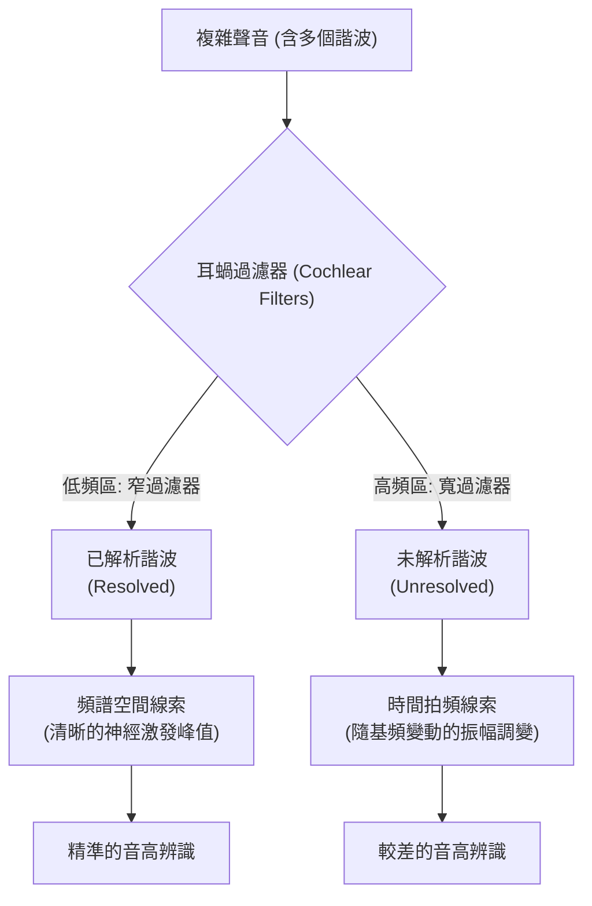

# 第四章：音高知覺與聽覺場景分析

## 1. 導讀

在日常生活中，我們無時無刻不沉浸在充滿多種聲音的環境裡。走在街道上，你能同時聽見汽車引擎聲、行人的交談聲以及遠處的鳥鳴。令人驚訝的是，進入我們耳朵的其實只有一條單一的聲波——這條聲波是世界上所有發聲物體振動的總和。大腦是如何從這段複雜的、混合的單一波形中，拆解並推論出各個獨立的聲音來源？

本章將從聽覺感知的三大基石——音高（Pitch）、音色（Timbre）與響度（Loudness）談起，探討大腦如何利用聲音的物理特性來提取資訊。接著，我們將進入聽覺科學中最具挑戰性的問題之一：**聽覺場景分析（Auditory Scene Analysis）**。我們將了解大腦如何運用「貝氏推論（Bayesian Inference）」與物理世界的規則，將這個數學上的「不適定問題（Ill-posed problem）」轉化為我們清晰的聽覺體驗。讀完本章，你將理解大腦不僅是被動的聲音接收器，更是一個主動利用過往經驗來解碼世界的高階推論引擎。

---

## 2. 核心概念

### 基頻與諧波結構
自然界中多數具有「音高」的聲音（例如人聲、鳥鳴、樂器聲）都不是單一頻率的純音，而是包含多個頻率成分的複雜聲波。這些頻率成分通常具有高度規律性，被稱為**諧波（Harmonics）**。諧波的頻率是某個最低頻率的整數倍，這個最低頻率就稱為**基頻（Fundamental Frequency, F0）**。

在線性頻率尺度上，諧波彼此之間的間距是等距的，距離等於基頻。當我們感知到一個聲音的「音高」時，我們感知到的其實就是這個基頻的對應物。如果我們改變弦樂器的弦長來改變音符的音高，我們實際上就是在改變聲音的基頻。

### 缺失基頻現象（Missing Fundamental）
基頻不僅代表了聲音頻譜中的最低頻率成分，它更深刻地決定了整個聲波的**週期（Period）**。即便我們使用音訊技術將聲音中的基頻成分完全移除，剩下的高次諧波疊加在一起時，其總體波形的重複週期依然等於原始基頻的倒數（例如，由 500 Hz、750 Hz、1000 Hz 組成的聲音，其波形週期仍為 4 毫秒，對應於 250 Hz 的基頻）。在這種情況下，人類依然能精準地感知到 250 Hz 的音高，這被稱為**缺失基頻現象**。這說明音高是一個比單純的頻率成分更為抽象的感知概念。

### 音色與響度
- **音色（Timbre）**：古典定義上，音色是除了音高和響度之外，所有讓兩個聲音聽起來不同的屬性。它是區分鋼琴和小提琴，或區分不同母音的關鍵。音色主要取決於聲音的頻譜包絡（各諧波的相對振幅）與時間包絡（聲音隨時間起伏的形狀）。
- **響度（Loudness）**：聲音物理強度的感知對應物。響度與物理強度的關係並非線性，而是呈現特定的冪法則。

### 不適定問題與貝氏推論
聽覺場景分析本質上是一個**不適定問題**。想像一個方程式 `x + y = 混合聲波`，其中 x 和 y 是未知的聲源，混合聲波是耳朵接收到的訊號。數學上，這有無限多組解。大腦為了解決這個問題，依賴了**貝氏推論（Bayesian Inference）**。大腦會根據對自然界聲音的**先驗機率（Prior probabilities）**（知道自然界哪些聲音經常出現，哪些幾乎不可能出現），結合感官輸入的**概似度（Likelihood）**，推導出最可能的情境。

### Marr 的分析層次
為了理解聽覺系統的計算機制，我們可以使用認知科學家 David Marr 提出的三個分析層次：
1. **計算層次（Computational Level）**：系統要解決什麼問題？輸入與輸出的映射為何？（例如：推論出多個獨立聲源）。
2. **演算法層次（Algorithmic Level）**：系統用什麼演算法或表徵來解決問題？（例如：機率優化搜索）。
3. **實作層次（Implementation Level）**：這些演算法如何在神經硬體上實現？（例如：特定聽覺皮層神經元的迴路）。

---

## 3. 機制與現象

### 耳蝸的諧波解析機制
我們對音高的感知深受耳蝸物理特性的限制。耳蝸基底膜的作用類似於一組頻率過濾器（Filter bank）。這些過濾器在低頻區的頻寬較窄，而在高頻區的頻寬較寬：
- **已解析諧波（Resolved Harmonics）**：對於低次諧波，因為它們的間距相對於低頻過濾器的頻寬夠大，每個諧波都能獨立激發一個過濾器，在神經激發模式（Excitation pattern）上產生明顯的峰值與谷底。大腦能透過這些空間位置線索（Place cues）輕易辨識它們。
- **未解析諧波（Unresolved Harmonics）**：對於高次諧波，過濾器變得太寬，多個諧波會擠進同一個過濾器中。這會導致無法在空間上分辨出個別峰值。然而，多個頻率在同一過濾器內會產生**拍頻（Beating）**，導致神經元反應出現與基頻同頻率的振幅調變（Amplitude modulation），提供了時間線索（Timing cues）。

### 音色的雙重基石
音色是一個多維度的感知特徵。研究顯示，有兩個主要因素決定了我們感知的音色：
1. **頻譜質心與包絡（Spectral Envelope）**：聲音能量在各頻率的分布狀態。例如，高頻能量豐富聽起來較「明亮（Bright）」，低頻豐富聽起來較「沉悶（Dull）」。
2. **時間包絡（Temporal Envelope）**：聲音強度的時間發展，特別是**起音（Attack）**與**衰減（Decay）**。撥弦（迅速起音）與拉弦（緩慢起音）的時間包絡差異巨大，構成了音色識別的核心。

### 聽覺場景的分組線索（Grouping Cues）
為了解決不適定問題，聽覺系統利用了自然聲音特有的統計規律，這些規律成為了大腦將混合聲音「分組」的線索：
- **共同起音與結束（Common Onset/Offset）**：如果多個頻率成分在同一時間突然出現或消失，大腦會強烈推論它們來自同一個物理事件（例如某人開口說話）。
- **諧波性（Harmonicity）**：如果一組頻率正好符合整數倍的諧波關係，大腦會將它們歸類為同一個發聲體的產物。

---

## 4. 心理物理與證據

### 音高辨識與聽覺飲食（Auditory Diet）
心理物理實驗發現，人類對音高的**辨別閾值（Discrimination threshold）**高度依賴於是否包含低次（已解析）諧波。當聲音包含低次諧波時，我們能輕易分辨微小的音高差異（例如 2%）；但若只保留高次（未解析）諧波，辨識能力會大幅下降。

有趣的是，利用機器學習模擬聽覺系統的實驗證實了這點。如果用**自然聲音**（語音、音樂，通常具備低通特性，低頻能量較強）來訓練神經網絡，模型會表現出與人類完全相同的閾值特徵；但如果用人造的「高通聲音」重新訓練，模型會發展出截然不同的音高感知策略。這證明人類的聽覺特性是演化與發育適應地球「聽覺飲食」的結果。

### 語音與音高的名人實驗
音高在語音辨識中扮演關鍵角色。在 MIT 進行的一項實驗中，受試者聆聽前美國總統歐巴馬等名人的語音片段。當語音被人工平移了音高（例如僅偏移三個半音，即四分之一八度），受試者的辨識率便呈現斷崖式下降。這顯示我們對熟悉聲音的記憶深深綁定著特定的音高特徵。

### 音色的倒放實驗
證明時間包絡對音色極度重要的一個經典實驗是「倒放音樂」。若將一段用鋼琴演奏的巴哈聖詠錄音倒轉播放（使得每個音符變成從弱漸強，然後突然截斷），頻譜成分雖然完全沒變，但聽起來卻完全不像鋼琴，反而像某種奇特的合成風琴聲。

### 響度的冪法則與動態範圍問題
早期的心理物理學家 S.S. Stevens 透過量值估計（Magnitude estimation）實驗發現了響度的冪法則：
**感知響度 ∝ 物理強度^0.3**
根據這個公式，聲音的物理強度（Intensity）增加 10 倍（即增加 10 dB），我們感知到的響度大約會變成 2 倍。

然而，這帶出了一個著名的神經科學謎團——**動態範圍問題（Dynamic Range Problem）**。人類能在高達 100-120 dB 的範圍內精準辨別響度差異；但是，大多數聽神經纖維在刺激增加 25 到 30 dB 後就會飽和（不再增加發放率）。如果神經元都飽和了，大腦如何知道聲音還在變大？目前科學界提出的可能解法包括：
- **偏頻聆聽（Off-frequency listening）**：監聽相鄰頻率神經元的激發。
- **低自發率纖維**：部分佔比極低的神經纖維具有較高的閾值與較廣的動態範圍。

---

## 5. 常見誤解

- **誤解：樂器演奏不同音高時，聲音頻譜只是單純的左右平移。**
  - **真相**：多數樂器（如低音管、小提琴）的共鳴腔體（Filter）是固定的。因此，當樂器演奏高低不同音符（改變基頻）時，通過這個固定共鳴腔過濾後的頻譜「形狀」其實是不同的。如果我們將某個音符的頻譜強行平移來改變音高，聽起來就不再像原來的樂器了。
- **誤解：未解析的高次諧波無法提供任何音高資訊。**
  - **真相**：雖然無法在空間上分辨高次諧波的頻譜峰值，但多個諧波在同一個過濾器內產生的拍頻（Beating）能提供與基頻對應的「時間線索」。只是相較於低次諧波，這種時間線索提供的音高辨別精度較差。
- **誤解：所有的聲音都具有音色，所以我們總能輕易用語言描述它。**
  - **真相**：音色雖然豐富，但科學界缺乏精確且統一的描述語言。我們只能借用視覺或觸覺的詞彙（如明亮、沉悶、粗糙）來勉強描述，這是聽覺認知上一個有趣的語意斷層。

---

## 6. 小結

- **基頻與諧波**：自然聲音多具諧波結構，基頻決定了聲音的感知音高，即使基頻物理上缺失，大腦仍能透過整體週期算出音高。
- **耳蝸解析度限制**：耳蝸過濾器在低頻較窄、高頻較寬，導致低次諧波能被解析（清晰空間線索），高次諧波無法解析（僅有時間拍頻線索），前者提供了更好的音高辨識力。
- **演化適應性**：機器學習模型顯示，人類高度依賴低次諧波的聽覺特徵，是為了適應充滿低頻能量的自然界聲音環境。
- **音色雙重性**：音色的感知同時高度依賴頻譜包絡（頻率能量分佈）與時間包絡（起音與衰減的動態）。
- **動態範圍問題**：人類感知的響度範圍極大，但單一聽神經纖維動態範圍窄，大腦必須利用偏頻聆聽或特殊神經元來解決訊號飽和問題。
- **聽覺場景分析與貝氏推論**：面對將單一波形拆解為多個聲源的不適定問題，大腦利用對自然聲音特性（如共同起滅、諧波性）的先驗機率進行貝氏推論，主動解碼聽覺場景。

---

## 7. 跨章連結

- **回顧前章**：本章提到的耳蝸過濾器（Cochlear Filters）與神經纖維的相位鎖定（Phase locking），延續了前面章節關於聽覺周邊神經解剖與頻率編碼的基礎。
- **展望後續**：我們已介紹了聽覺系統用來分組的「線索」（Grouping cues）。在下一章，我們將探討當大腦過度依賴這些線索時，會產生哪些奇特的**聽覺錯覺（Auditory Illusions）**，並進一步探討聲音串流（Streaming）等場景分析的動態機制。

> **待補**：插入耳蝸激發模式（Excitation pattern）與未解析諧波拍頻的詳細圖解。
> **待補**：插入 fMRI 聽覺皮層音調拓撲（Tonotopy）的示意圖。
