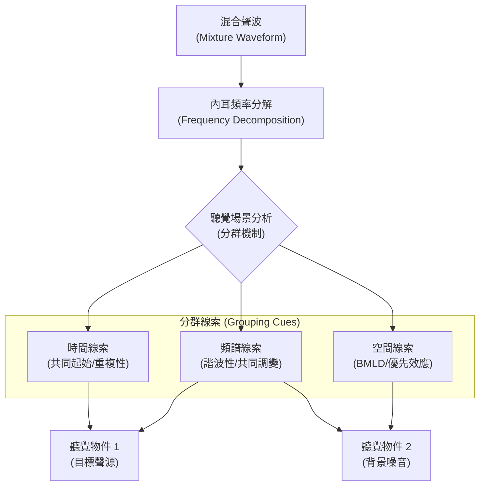

# 第五章：聽覺場景分析

## 1. 導讀

在日常生活中，我們很少只聽到單一的聲音。無論是在熱鬧的餐廳、繁忙的街道，還是充滿各種動物鳴叫的森林，環境中總是同時存在多個聲源。這些不同的聲音在空氣中傳播，最終在我們的耳膜處線性疊加成「單一」的聲波（waveform）。聽覺系統面臨的挑戰是：如何從這條單一的聲波中，還原出環境中多個獨立的聲音事件？這就是著名的**雞尾酒會問題（Cocktail Party Problem）**，也是**聽覺場景分析（Auditory Scene Analysis, ASA）**的核心探討對象。

從數學角度來看，這是一個「病態問題」（ill-posed problem），就像只給你一個方程式 $x + y = 10$，卻要求你解出 $x$ 和 $y$ 一樣，理論上有無限多種組合。然而，我們的大腦卻能輕鬆解決這個問題。大腦的解法在於：現實世界中的聲音並非隨機產生。在演化與發育的過程中，大腦內化了真實世界聲音的「統計規律」（statistical regularities）。聽覺系統利用這些作為先驗知識（priors），將聲波中的能量片段進行「分群」（grouping），推論出最合理的聲源組合。本章將探討大腦用來進行聽覺場景分析的各種線索與機制。

> [!NOTE]
> **等響度曲線（Equal Loudness Contours）**
> 在正式進入場景分析前，我們必須補充一個與頻率及響度相關的重要現象：等響度曲線（又稱 Fletcher-Munson 曲線）。這條曲線標示了在不同頻率下，聲音必須達到多大的物理強度，聽起來才會感覺「一樣大聲」。
> 在低音量時，這條曲線呈現深 U 型，意味著我們對中頻最敏感，低頻與高頻的能量必須大幅提高才能被聽見（這解釋了為什麼音量開很小的時候，音樂的低音聽起來往往不見了）。然而，當整體音量提高時，這條 U 型曲線會趨於平坦。因此，同一首音樂在低音量與高音量播放時，各頻率的相對突出程度會截然不同，這是音樂混音工程中必須考量的重要聽覺特性。

## 2. 核心概念

聽覺場景分析可以被視為一個**分群（Grouping）**的過程。大腦將內耳傳來的頻率與時間能量矩陣（類似頻譜圖），根據特定的「分群線索」組織成不同的知覺物件。這些線索主要可以分為短時間內能量特徵的同步性、空間資訊的差異、長時間的音流分離，以及當聲音被遮蔽時的主動推論與填補。

## 3. 機制與現象

大腦在解決病態問題時，依賴多種物理與聲音特性的線索來進行分群。

### 3.1 同步起始與起伏（Common Onset & Co-modulation）
聲音的振幅變化是強大的分群線索。
- **共同起始與舊加新捷思（Old-plus-new Heuristic）**：大腦將突發的能量改變解釋為「新聲源」的出現；而逐漸的能量改變則被解釋為單一聲源在空間中靠近或遠離。當背景中持續存在某個寬頻聲音，若突然加入特定頻率的能量，大腦會將舊有頻率視為持續存在，並將新加入的頻率獨立抽取出來成為一個新的聽覺事件。
- **共同調變遮蔽解除（Co-modulation Masking Release, CMR）**：在遮蔽實驗中，若我們在目標音周圍加上不同頻帶的噪音，通常會讓目標音更難被聽見。但如果這些跨頻帶的噪音都具有「相同的包絡線」（即它們的振幅起伏是同步的，稱為共同調變），大腦就能將這些噪音歸類為同一個背景聲源，進而幫助我們將目標音與背景噪音分離。這會使目標音的偵測閾值顯著下降（變得更容易聽見）。

### 3.2 諧波性（Harmonicity）
自然界的聲音（如語音的母音、樂器聲）通常具有諧波結構。大腦預設頻率呈現整數倍關係的聲音來自同一個事件。
- **諧波失調（Harmonic Mistuning）**：如果將複合音中的某一個諧波稍微偏移（例如 2%），它就不再符合諧波數列。這時，聽覺系統會將這個失調的頻率「踢出」群組，你會主觀地聽見一個複合音之外，還多出了一個獨立的純音。
- **對音高的影響**：非常微小的失調會些微改變整個複合音的音高感受；但當失調幅度大到讓你聽出它是「另一個聲音」時，大腦在計算音高時就會將它排除，此時複合音的音高反而會恢復正常。這個現象也適用於語音：若將語音的第三諧波失調，你會聽見正常的語音背後多了一個類似吹哨的聲音。

### 3.3 重複性（Repetition）
許多動物的叫聲具有重複性。當一種複雜的噪音混合了另一種隨機的干擾噪音時，單聽一次幾乎不可能將兩者分離。但如果目標聲音不斷重複出現，大腦就能利用「重複」這個結構線索，將其從背景中分離出來。

### 3.4 空間線索與優先效應（Spatial Cues & Precedence Effect）
聲音在空間中的位置，也是分離聲源的重要依據。
- **雙耳遮蔽音量差（Binaural Masking Level Difference, BMLD）**：當目標信號與噪音都在正前方（或僅在一耳）時，遮蔽效應最強。但如果我們在另一耳加入「完全相同」的噪音（這等同於將噪音定位在頭部正中央），而目標音維持在單側，目標與噪音在空間上分離了，目標音會瞬間變得非常清晰，偵測閾值可改善達 20 dB。
- **優先效應（Precedence Effect）**：在封閉空間中，我們不僅會聽到直線傳遞的「直接音」，還會聽到被牆壁反射的「殘響（Reverberation）」。殘響來自四面八方，會嚴重干擾聲音定位。大腦的解法是「優先效應」：當兩個相同的聲音在極短的時間差（例如小於 5 毫秒）內先後抵達雙耳時，大腦會將知覺位置完全鎖定在「先抵達」的聲音方向，並主動抑制（suppress）對後續反射音的位置知覺。

### 3.5 音流分離（Stream Segregation）
除了短時間的分群，大腦也處理較長時間尺度的場景分析。當我們聆聽交替出現的高低音符時：
- **聚合（Integration）**：若高低音的頻率差異小且速度慢，大腦會將其組織成單一的「音流」，聽起來像是連續的旋律（例如馬蹄般的節奏）。
- **分離（Segregation）**：若頻率差異過大或速度過快，大腦會將其拆分為兩個獨立的音流（一個只負責高音，一個只負責低音）。這種主觀感知的改變伴隨著客觀能力的喪失：一旦聲音分裂成兩個音流，我們就難以準確判斷高音與低音之間的精確時間關係。

### 3.6 連續性效應（Continuity Effect）
在真實世界中，聲源經常會短暫地被其他更響亮的聲音遮蔽。聽覺系統展現了驚人的「填補」能力：
- **純音的脈衝閾值（Pulsation Threshold）**：交替播放純音與噪音，當純音的音量降低到「可能被噪音遮蔽」的程度時，我們的主觀聽覺會認為純音從頭到尾都沒有中斷，而是連續地穿過噪音。
- **語音修復（Phonemic Restoration）**：若將一段語音切除片段並填入靜音，語音聽起來會破碎難懂（柵欄效應）。但如果將切除的部分填入巨大的噪音，我們反而會覺得語音是完整的。
- **紋理的連續性（Texture Continuity）**：如掌聲、雨聲等具備穩定統計特性的「紋理（Textures）」，由於在自然界中通常會持續很長時間，因此即使被遮蔽長達 2 秒，大腦仍能將其連續填補。反之，語音或音樂等非穩態聲音，只能填補幾百毫秒。

## 4. 心理物理與證據

- **雙耳遮蔽音量差的實驗數據**：透過改變雙耳噪音的相位差，心理物理學測量顯示 BMLD 可以讓目標音的聽覺閾值降低高達 20 dB，這是一個極度龐大的效應。
- **優先效應的類神經網路模型**：為了證明優先效應不是聽覺系統的某種缺陷，而是對抗殘響的演化適應，研究人員訓練了人工神經網路（ANN）來進行聲音定位。結果發現，在具有反射音的虛擬環境中訓練的 ANN，同樣會展現出優先效應；但如果將 ANN 放在無殘響（Anechoic）的環境中訓練，這個效應就會消失。這為大腦內化環境統計規律提供了強力的運算證據。

## 5. 常見誤解

- **「我們聽到的聲音中斷就是現實中斷」**：連續性效應告訴我們，主觀上連續的聲音在物理上可能早已中斷。我們「聽見」的其實是大腦對環境狀態的最佳推論（Unconscious Inference），而不是空氣振動的忠實反映。
- **「優先效應讓我們聽不到反射音」**：雖然優先效應抑制了對延遲聲音的「位置」判斷（Discrimination suppression），但這不代表反射音沒有進入大腦。事實上，優先效應會隨著重複刺激建立（Buildup），表示聽覺系統一直在處理這些反射訊號，以此建構環境的聲學模型。

## 6. 小結

- **聽覺場景分析**是大腦解決多重聲源線性疊加這個病態問題的過程。
- 大腦依賴**先驗知識**，即對自然聲音統計規律的內化，來進行潛意識推論。
- **時間與頻率的變化**：共同起始、共同調變（CMR）、諧波性與重複性，都是將能量歸屬於單一聲源的重要線索。
- **空間線索的運用**：空間位置的差異能大幅降低遮蔽效應（BMLD）。
- **對抗殘響的機制**：優先效應透過抑制延遲聲音的位置資訊，確保了在室內環境中的準確定位。
- **音流分離**：頻率差與速度決定了聲音事件是融合成單一旋律，還是分裂為平行的多條音流。
- **連續性填補**：大腦會主動推論被遮蔽的聲音並進行主觀填補，特別是對具有穩定統計特性的聲音（如掌聲）。

## 7. 跨章連結

- **與前章的關聯**：
  - 本章的 CMR 效應挑戰了在前面的遮蔽效應與臨界頻帶理論。
  - 本章提到的 BMLD 與優先效應，是雙耳時間差（ITD）與音量差（ILD）等空間定位機制的實際應用與延伸。
  - 諧波失調如何影響音高感知，印證了音高取決於可解析諧波（Resolved harmonics）的觀念。
- **與後章的關聯**：
  - 語音修復效應為後續討論**高階語音知覺（Speech Perception）**提供了基礎，顯示大腦如何利用語言環境結構來填補底層聲學訊號的不足。
