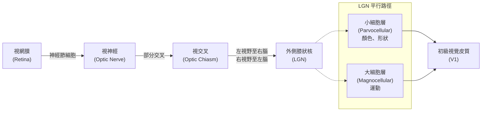
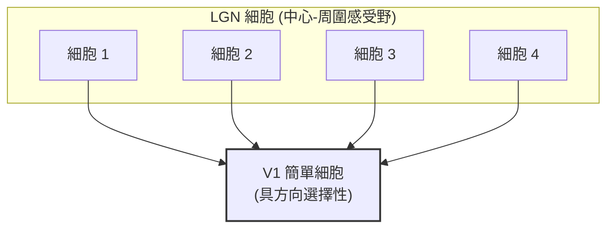

# 第八章：眼睛與視網膜（續）

## 1. 導讀

在上一章中，我們探討了光學成像與感光細胞的基本特性，了解到視網膜的硬體結構其實是「反向連接」的，並觀察了視桿與視錐細胞在暗適應中的接力賽。本章將接續這趟視覺訊號的旅程，重點探討視覺系統如何對影像進行「空間取樣」與「編碼」。

讀完本章後，你將了解：
1. 為什麼我們的眼睛在中央具有極高的解析度，而周邊卻非常模糊？這在運算上有何優勢？
2. 視網膜神經節細胞如何透過「中心-周圍感受野」來偵測影像對比度，大腦又是如何利用「卷積（Convolution）」的數學原理來處理整張影像的？
3. 視覺訊號離開眼睛後，如何在外側膝狀核（LGN）兵分兩路，分別處理顏色/形狀與運動資訊？
4. 進入大腦的初級視覺皮質（V1）後，神經元如何產生對線條方向的選擇性？這又如何引發著名的「傾斜後效」視錯覺？

---

## 2. 核心概念

### 視網膜空間取樣的最佳化
當我們注視世界時，往往不會意識到周邊視野的解析度其實極低。我們的視網膜中央（中央窩，fovea）佈滿了高密度的感光細胞與神經節細胞，擁有極小的感受野；而隨著偏心率（eccentricity，即距離中央窩的距離）增加，感光細胞密度急遽下降，感受野變大，空間解析度也隨之變差。

為什麼大腦不把整個視網膜都佈滿高密度的感光細胞呢？原因在於**頻寬限制**。視神經（optic nerve）的粗細決定了大腦能夠接收的取樣數量上限。如果要在有限的頻寬下獲取高解析度的細節，一個演化上的最佳解就是將高密度的感光細胞集中在一個極小的區域，並賦予眼球「自由轉動（平移）」的能力。

在一項利用機器學習模擬人工視網膜的研究中，研究人員限制了傳輸頻寬，並訓練系統執行視覺搜尋任務（例如在雜亂背景中尋找數字）。結果發現，如果系統只能「平移」感測器陣列，最佳化過後的感測器配置會自動演化出類似人類「中央窩」的結構：中心密集、周邊稀疏。然而，如果允許系統「縮放（Zoom）」（像手機相機的變焦），感測器就會傾向於均勻分佈。這證明了中央窩加上眼動機制，是生物在頻寬限制下達成高解析度視覺的最佳化策略。

### 中心-周圍感受野與卷積
視網膜的輸出是由神經節細胞（Ganglion cells）負責傳遞的。1950 年代，神經科學家 Stephen Kuffler 記錄了神經節細胞的反應，發現了**中心-周圍感受野（Center-Surround Receptive Field）**的存在。

神經節細胞並不只對單一光點有反應，而是對空間中的光線分佈模式有特定偏好。它們可以分為兩類：
- **ON-center / OFF-surround（中心興奮/周圍抑制）**：當光線只照射在感受野中心時，細胞反應最劇烈；若光線照射在周圍區域，則會抑制細胞反應；若整個感受野都被均勻照亮，興奮與抑制會相互抵消，細胞反應微弱。這種細胞專門偵測局部的亮度「增加」。
- **OFF-center / ON-surround（中心抑制/周圍興奮）**：性質完全相反，專門偵測局部的亮度「減少」。

在數學上，神經節細胞的運作等同於對影像進行**線性濾波（Linear Filtering）**。影像是一組空間中的像素強度陣列，而感受野是一組具有正值（興奮）與負值（抑制）的權重濾波器。神經元的反應，本質上就是將濾波器與其覆蓋的影像區域計算**內積（Dot Product）**。

視網膜上佈滿了無數個具有相同感受野結構、但位置不同的神經節細胞。當我們將這個濾波器在影像的每一個位置都計算一次內積，這個數學操作就稱為**卷積（Convolution）**。卷積是影像處理的核心，也是我們理解整個神經元族群如何處理畫面的基礎。

### 平行處理與 LGN 的分離路徑
視覺訊號離開視網膜後，會經由視神經交叉（Optic Chiasm），將左視野的資訊送往右腦，右視野的資訊送往左腦。抵達大腦皮質之前，訊號會先經過視丘的**外側膝狀核（Lateral Geniculate Nucleus, LGN）**。

LGN 具有高度結構化的六層組織，並且嚴格保持雙眼訊號的分離，直到訊號進入皮質才會混合。更重要的是，視網膜中的兩種不同神經節細胞，在此投射到了不同的層級，形成兩條功能獨立的平行路徑：
- **小細胞層（Parvocellular layers，外側四層）**：接收來自 Midget 細胞的輸入。具有色彩對立性（Color-opponent），感受野較小，反應時間較長（持續性反應）。負責處理顏色、紋理與精細形狀。
- **大細胞層（Magnocellular layers，內側兩層）**：接收來自 Parasol 細胞的輸入。對色彩不敏感，感受野較大，對瞬態變化敏感（短暫性反應）。專門負責處理運動與閃爍資訊。

### 初級視覺皮質（V1）的計算原則
視覺訊號從 LGN 傳遞至大腦後方的**初級視覺皮質（Primary Visual Cortex, V1）**。在 V1 中，我們觀察到三個極為重要的組織原則：

1. **皮質放大（Cortical Magnification）**：
   在 V1 中，神經元的密度是均勻的。但由於視網膜中央窩的神經節細胞密度極高，當這些細胞均勻投射到 V1 時，會導致視野中心在皮質上佔據了極大比例的面積（即被「放大」了），而廣大的周邊視野卻只佔據皮質的邊緣小部分。
2. **方向選擇性（Orientation Selectivity）**：
   相較於視網膜和 LGN 細胞只對圓點狀的光線對比有反應，諾貝爾獎得主 Hubel 與 Wiesel 發現，V1 的「簡單細胞（Simple cells）」對特定**方向的線條或邊緣**（如垂直、水平或特定傾斜角）有最強烈的反應。
3. **柱狀組織與平滑映射（Columnar Organization & Maps）**：
   大腦皮質的組織呈現垂直的「柱狀（Columns）」。如果將電極垂直插入皮質，記錄到的神經元幾乎都會偏好相同的線條方向；如果以斜角插入，偏好方向則會平滑且連續地改變。這表明大腦表面存在著高度規則的方向偏好地圖。

---

## 3. 機制與現象

### Hubel & Wiesel 的方向選擇性前饋模型
V1 細胞的方向選擇性是如何無中生有產生的？Hubel 與 Wiesel 提出了一個優雅的模型：只要將數個感受野排成一直線的 LGN 細胞（具有中心-周圍結構），共同匯聚並將訊號輸出給同一個 V1 簡單細胞，這個 V1 細胞的感受野就會自然呈現出狹長、具方向性的結構。

### 族群編碼與傾斜後效（Tilt Aftereffect）
單一個 V1 神經元的發放頻率充滿了「模糊性」。例如，一個偏好垂直線條的細胞，在面對一條完美垂直但對比度很低的線，以及一條稍微傾斜但對比度極高的線時，可能會給出完全相同的發放率。大腦無法僅憑單一神經元就知道線條的真實方向。

為了突破這個限制，視覺系統採用了**族群編碼（Population Coding）**。大腦會同時評估數百個偏好不同方向的神經元反應，並找出這群神經元反應分佈的「峰值」，以該峰值所對應的方向作為最終的知覺解碼結果。

這完美解釋了著名的**傾斜後效（Tilt Aftereffect）**錯覺：
- 當你長時間注視稍微向左傾斜的線條時，偏好左傾的神經元會因為持續發放而產生「適應（Adaptation）」，導致其敏感度下降（反應變弱）。
- 當你立刻轉移視線去看一組完美的垂直線條時，雖然刺激是垂直的，但因為左傾神經元的反應已經衰減，導致整個神經元族群的反應峰值發生偏移，大腦會將其錯誤解碼為「稍微向右傾斜」。

---

## 4. 心理物理與證據

1. **神經突觸連結的跨神經元相關圖（Cross-correlogram）**：
   為了證明 Hubel & Wiesel 的模型，Clay Reid 等人進行了極度困難的雙電極實驗。他們同時記錄猴子的 LGN 與 V1 神經元，並計算兩者的發放時間差（Cross-correlogram）。結果發現 LGN 細胞發放後 1~2 毫秒，V1 細胞就會跟著發放，證明了單突觸連結。進一步的空間分析證實，LGN 感受野的圓形中心，確實精準落在 V1 感受野的狹長興奮區內。
2. **放射性同位素皮質造影**：
   在早期的經典實驗中，猴子被注射放射性葡萄糖並注視帶有同心圓與放射線的螢幕（像蜘蛛網圖案）。犧牲後將皮質攤平沖洗底片，皮質上顯現出的放射性條紋完美證實了「皮質放大現象」——在螢幕上距離極近的中心圓環，在皮質上佔據了極寬闊的面積；而周邊遙遠的圓環，在皮質上反而被壓縮。
3. **LGN 破壞實驗（Lesion Study）**：
   Peter Schiller 與 Nikos Logothetis 利用化學藥物（ibotenic acid）選擇性破壞猴子 LGN 的小細胞層或大細胞層。結果發現：破壞小細胞層會導致猴子喪失顏色與形狀辨識能力，但對運動偵測無影響；破壞大細胞層則會嚴重削弱運動偵測能力，但顏色與形狀辨識完好如初。這為平行處理提供了鐵證。

---

## 5. 常見誤解

> [!WARNING]
> **誤解：馬赫帶（Mach bands）和赫曼方格（Hermann Grid）等視錯覺，可以完全用神經節細胞的「中心-周圍感受野」來解釋。**

在許多傳統教科書中，赫曼方格（白色交叉點出現黑色幻影）常被解釋為：當 ON-center 感受野位於交叉點時，其周圍落在白色區域的面積多於位於走道上時，導致受到更多抑制，因此神經元反應變弱，大腦便將其解讀為「變暗」。

**事實上，這是一個充滿破綻的解釋。**
這個理論隱含了一個前提：下游的大腦皮質在接收到較弱的濾波器訊號後，「忘記」了這個訊號是來自一個交叉點的感受野，從而進行了次優解碼（Suboptimal decoding）。以大腦的運算能力而言，如果它知道輸入來自中心-周圍濾波器，理論上完全可以透過反解碼得出精確的影像，而不應該產生這種幼稚的錯覺。講者指出，這類錯覺更可能是因為這些影像含有極不自然的高對比度與銳角，將視覺系統推入了一個極端且異常的運算操作點（Operating point）。我們至今尚未完全理解這些錯覺背後真正深層的理論基礎。

---

## 6. 小結

- **最佳化取樣**：視網膜的「中央窩」加上眼動能力，是在頻寬限制下達成高解析度視覺的最佳運算策略。
- **感受野濾波**：神經節細胞以中心-周圍結構作為空間濾波器，大腦利用這些濾波器進行卷積運算，以偵測局部對比度。
- **平行處理**：視覺訊號在 LGN 被拆分為處理顏色/形狀的小細胞路徑（Parvocellular），與處理運動的大細胞路徑（Magnocellular）。
- **V1 組織原則**：訊號抵達初級視覺皮質後，呈現出皮質放大、柱狀組織以及平滑的視網膜拓樸地圖。
- **方向選擇性**：V1 神經元透過整合多個 LGN 細胞的輸入，產生了對邊緣與線條方向的特異性反應。
- **族群編碼與適應**：面對單一神經元訊號的模糊性，大腦依靠分析神經元族群的整體反應來決定看見了什麼；神經適應則是導致傾斜後效錯覺的主因。

---

## 7. 跨章連結

- **與前章的連結**：本章延續[第七章](07-eye-and-retina.md)對於眼球硬體限制的探討，進一步解釋了視網膜感光細胞分佈不均的運算意義。
- **與次章的連結**：神經元對於方向選擇性的偏好，為後續章節探討雙流假說（背側與腹側路徑）、形狀知覺與物件辨識奠定了邊界偵測的基礎。同時，平行路徑的概念也將在未來的「色彩視覺」和「運動視覺」章節中進一步展開。
- **詞彙表參考**：感受野 (Receptive Field)、卷積 (Convolution)、外側膝狀核 (LGN)、初級視覺皮質 (V1)、皮質放大 (Cortical Magnification)、族群編碼 (Population Code)。
