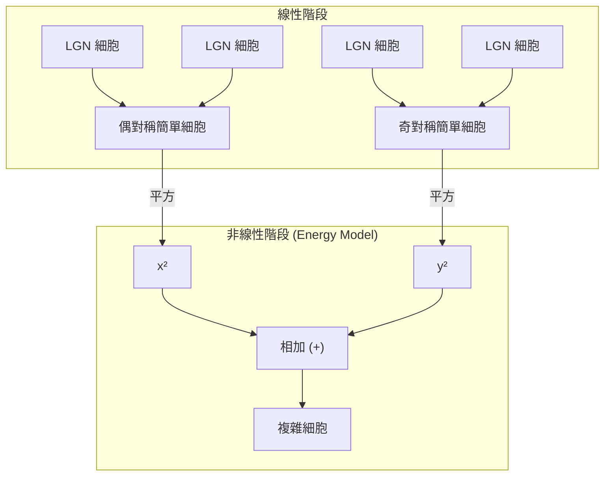

# 第九章：外側膝狀體（LGN）與初級視覺皮質（V1）

## 1. 導讀

大腦如何從視網膜傳來的光點陣列中，萃取出有意義的視覺特徵？本章將帶領讀者進入視覺處理的第一個皮質重鎮——初級視覺皮質（Primary Visual Cortex，簡稱 V1）。

當視覺訊號從視網膜神經節細胞出發，經過視神經到達視丘的外側膝狀體（Lateral Geniculate Nucleus, LGN）後，LGN 會將這些訊號進一步投射至 V1。在這個階段，視覺系統不再只關心「哪裡有光點」，而是開始偵測「線條的方向」、「運動的軌跡」以及「雙眼的視差」。

閱讀完本章後，你將能夠理解：
- V1 的神經元如何產生如方向選擇性等全新特徵。
- 從簡單細胞（Simple Cells）到複雜細胞（Complex Cells），視覺運算如何從線性濾波跨越到非線性處理。
- 大腦如何運用「群體編碼（Population Code）」來推論視覺屬性，以及這如何解釋著名的「傾斜後效（Tilt Aftereffect）」。
- 視覺系統如何像聽覺系統一樣，將影像分解為不同的「空間頻率（Spatial Frequency）」通道。

## 2. 核心概念：初級視覺皮質的新興特徵

在視網膜與 LGN 階段，神經元的感受野主要呈現同心圓結構（Center-Surround Receptive Fields）。然而，當訊號進入 V1 後，出現了許多前所未見的新興特徵（Emergent Properties）：

- **方向選擇性（Orientation Selectivity）**：V1 神經元對特定傾斜角度的線條或邊緣有強烈反應。解剖學上，這些細胞以「方向柱（Orientation Columns）」的形式排列。若將電極垂直插入皮質，記錄到的神經元都會偏好相同的方向；若斜向插入，則偏好的方向會規律地漸變。
- **雙眼視覺與眼優勢（Binocularity & Ocular Dominance）**：LGN 的各層細胞嚴格區分左眼與右眼來源。但在 V1 中，出現了能同時接收雙眼訊號的「雙眼神經元」。儘管如此，多數神經元仍會偏好其中一隻眼睛，形成所謂的「眼優勢柱（Ocular Dominance Columns）」。
- **方向選擇與端點終止（Direction Selectivity & End Stopping）**：部分 V1 神經元不僅偏好特定方向的線條，還要求線條必須朝特定方向移動（與 LGN 巨細胞層的投射有關）。此外，有些神經元展現出「端點終止」特性——當線條過長超出感受野核心區時，反應反而會受到抑制。

## 3. 機制與現象：從簡單細胞到複雜細胞

Hubel 和 Wiesel 在 V1 發現了兩種截然不同的方向選擇性細胞，這兩種細胞的運算邏輯反映了視覺特徵萃取的進程。

### 簡單細胞（Simple Cells）與線性濾波
簡單細胞的感受野由空間上明確分離的興奮區與抑制區組成。這表示一條光帶必須落在極度精確的位置和角度，才能引發最大反應。稍有平移，反應便會急遽下降。
數學上，簡單細胞的行為非常接近**線性濾波器（Linear Filter）**。我們可以用 Gabor 函數（由正弦波與高斯函數相乘所得）來精確描述它們：
- **偶對稱（Even-symmetric）**：中心為亮帶，兩側為暗帶（基於餘弦函數）。
- **奇對稱（Odd-symmetric）**：一側亮、一側暗的邊緣偵測器（基於正弦函數）。

### 複雜細胞（Complex Cells）與能量模型
複雜細胞雖然同樣具有方向選擇性，但它們**不受嚴格的位置限制**。只要刺激維持在偏好的方向上，無論在感受野內的哪個位置，都會引發強烈反應（平移不變性）。
複雜細胞無法用單一線性濾波器來描述。目前廣泛接受的解釋是**能量模型（Energy Model）**：複雜細胞匯聚了一對具有相同偏好方向、但相位互差 90 度（即一個偶對稱、一個奇對稱）的簡單細胞輸出。透過將這兩個簡單細胞的反應「平方後相加」，正弦與餘弦的相位變異會被消除（基於 $\sin^2\theta + \cos^2\theta = 1$），從而產生對特徵存在與否敏感，但對精確位置不敏感的非線性反應。

## 4. 群體編碼與傾斜後效 (Population Code & Tilt Aftereffect)

單一神經元的反應是模糊的。例如，一個偏好垂直方向的細胞，其反應量可能因為「高對比度的稍微傾斜線條」和「低對比度的完美垂直線條」而相同。因此，大腦不能只依賴單一細胞，而是依賴**群體編碼（Population Code）**。

群體編碼的原理是：大腦會同時監測一群具有不同偏好方向的神經元，並找出整體反應分佈的**峰值（Peak）**來推論實際特徵。這種機制完美解釋了著名的**傾斜後效（Tilt Aftereffect）**。

### 傾斜後效實驗
- **現象**：當你盯著一個向右傾斜 15 度的條紋圖案長達一分鐘後，立刻轉頭看一幅完美的垂直條紋，你會短暫地覺得垂直條紋「向左傾斜」了。
- **機制**：
  1. **適應前**：觀看垂直線條時，偏好垂直（0 度）的神經元反應最強，群體峰值在 0 度。
  2. **適應中**：長時間注視向右傾斜（例如 +15 度）的線條，使偏好該角度的神經元群因為長時間放電而產生疲勞（代謝資源暫時耗盡），反應度下降。
  3. **適應後**：再次觀看垂直線條（0 度）時，原本應該是峰值的 0 度神經元與右側神經元都處於疲勞狀態，導致整體反應分佈的峰值被「推」向了反方向（例如 -5 度）。大腦偵測到新的峰值，便產生了向左傾斜的錯覺。

*(註：實驗時，必須讓目光在圖案中心微微游移，以免在視網膜光感受器層級產生一般的殘影，確保適應發生在皮質的方向選擇細胞上。)*

## 5. 心理物理與證據：空間頻率通道

正如聽覺系統利用耳蝸將聲音分解為不同頻率，視覺系統也利用皮質神經元將影像分解為不同的**空間頻率（Spatial Frequency）**。
- **低空間頻率**：影像中變化緩慢的區域，代表整體的輪廓與形狀。
- **高空間頻率**：影像中變化劇烈的區域，代表細節與銳利的邊緣。

### 對比敏感度函數 (Contrast Sensitivity Function, CSF)
如果我們測量人眼對不同空間頻率圖案的最低可見對比度，會得到一條倒 U 型的曲線。人類視覺對中等空間頻率（約 3-4 cycles/degree）最敏感，而對極低與極高的頻率較不敏感。這就是對比敏感度函數。

### 適應實驗與通道的獨立性
如果視覺系統真的有多個獨立的空間頻率濾波器（通道），那麼適應某一個特定頻率，應該只會讓該頻率附近的敏感度下降。
- **實驗結果**：在適應特定空間頻率的條紋一分鐘後，受試者的 CSF 曲線會在該適應頻率附近出現一個明顯的「缺口（Notch）」，而非整條曲線均勻下降。
- **皮質機制的證據**：如果你用水平方向的頻率圖案去適應，然後測量垂直方向的 CSF，敏感度並不會下降！這證明了空間頻率的適應具有「方向特異性」。由於方向選擇性在 V1 才出現，這表示空間頻率通道的機制發生在大腦皮質，而非視網膜或 LGN。

### 林肯錯覺（Lincoln Illusion）
儘管 V1 將影像分解為不同空間頻率通道，這些通道在後續的物件辨識階段必須重新合作。著名的「像素化林肯像」實驗顯示，像素化造成的銳利邊緣（不正確的高空間頻率雜訊）會干擾我們讀取正確的低頻輪廓。當我們「瞇著眼睛」看時（相當於物理上的低通濾波，去除了高頻雜訊），林肯的臉龐反而變得清晰可辨。

## 6. 常見誤解

- **「簡單細胞就是邊緣偵測器」**：早期人們直觀地認為奇對稱簡單細胞就是專門找邊緣、偶對稱就是找線條。但實際上，單靠這些線性濾波器無法完美偵測自然影像中的邊緣（如 Canny 邊緣偵測演算法的侷限）。神經元的反應是複雜連續的，不能簡化為二元判定。
- **「適應是眼睛累了」**：很多人以為殘影或後效是視網膜疲勞。事實上，具有方向選擇性的傾斜後效與空間頻率適應，主要發生在 V1 皮質層級。

## 7. 小結

- **皮質放大與柱狀結構**：V1 保留了視網膜的空間映射，給予中央小凹不成比例的龐大皮質資源。功能上以方向柱和眼優勢柱的形式組織。
- **特徵的誕生**：方向選擇性、雙眼視覺等特徵首度在 V1 現身，LGN 的訊號主要投射至 V1 的第 4C 層。
- **線性與非線性運算**：視覺處理經歷了從簡單細胞（線性 Gabor 濾波）到複雜細胞（非線性平移不變性、能量模型）的演進。
- **群體編碼**：大腦透過評估整個神經元族群的反應峰值來推論視覺特徵，這可以完美解釋傾斜後效。
- **空間頻率分析**：大腦將視覺世界拆解為多個獨立的空間頻率通道，並在後續階段重新組裝以進行特徵與物件辨識。

## 8. 跨章連結

- **前章連結**：本章的簡單細胞模型，建立在[前一章](08-eye-and-retina-cont.md)討論的視網膜與 LGN 同心圓感受野（Center-Surround）的收斂基礎上。同時，小細胞（Parvocellular）與巨細胞（Magnocellular）的分流在 V1 4C 層依然保持清晰。
- **後章連結**：複雜細胞的能量模型（Energy Model）是理解後續章節「運動視覺」中 Motion Energy Model 的核心基礎。此外，不同空間頻率的重組與過濾，將在後續的「物件辨識」章節中扮演關鍵角色。
