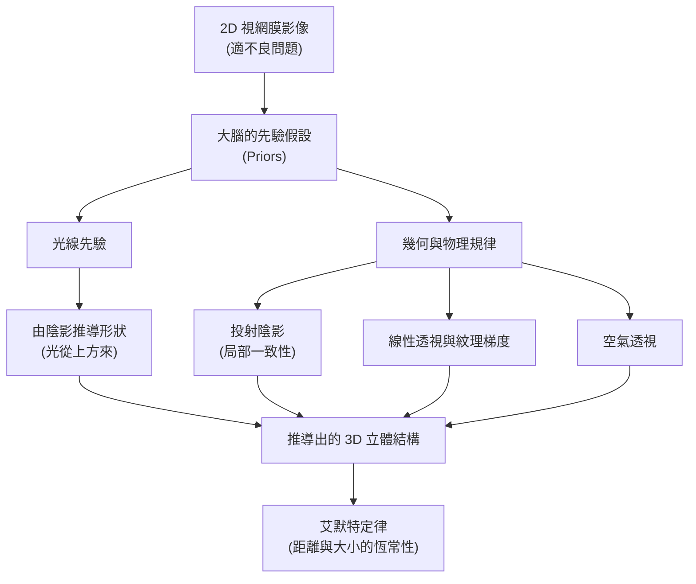

# 第十五章：深度知覺

## 導讀

我們生活在一個三維的世界中，我們能夠輕易地伸手拿取眼前的咖啡杯，也能判斷遠處駛來的汽車還有多遠。然而，我們用來感知這個三維世界的輸入來源——視網膜上的投影，卻是徹頭徹尾的二維影像。從平面的二維影像還原出三維結構，在數學上是一個「適不良問題」（ill-posed problem），因為同一張二維投影可能對應著無數種不同的三維空間排列。

視覺系統之所以能夠極其精準地估算三維結構與深度，關鍵在於我們擁有一雙眼睛（雙眼視覺），以及大腦在漫長的演化與個體發育過程中，內化了對真實世界的強烈「先驗假設」（priors）。大腦隱含著對物理學與光線幾何學的知識，能夠從各種視覺特徵中提取「深度線索」（depth cues）。本章將專注於探討不需要依賴雙眼的**單眼深度線索（monocular depth cues）**，揭示大腦是如何巧妙地透過光影、透視與幾何關係，為我們建構出立體的視覺體驗。

## 核心概念

要理解大腦如何從平面影像建構立體知覺，我們需要掌握以下幾個核心概念：

- **深度線索（Depth Cues）**：環境刺激中能夠提供距離或深度資訊的特徵。視覺是人類判斷三維結構最可靠的資訊來源。
- **由陰影推導形狀（Shape from Shading）**：大腦根據影像的亮度漸層變化，推論出物體表面的三維凹凸形狀。這仰賴於大腦強烈預設「光線來自上方」。
- **艾默特定律（Emmert's Law）**：描述知覺大小、知覺距離與物體在視網膜上張角（視角）之間的幾何關係。當視角固定時，知覺距離越遠，物體看起來就越大。
- **雙穩態知覺（Bistable Perception）**：當單一的二維影像能夠合理對應到兩種截然不同的三維結構，且機率相當時，我們的知覺會在兩種解釋之間來回切換，而無法同時看見兩者。

## 機制與現象

大腦利用了多種單眼深度線索來建構立體感，這些線索都建立在現實世界的物理與幾何規律之上。

### 形狀來自陰影（Shape from Shading）

在現實世界中，許多物體的表面近似於**朗伯表面（Lambertian surface）**。這種表面的特色是，反射光量取決於入射光與表面法向量之間的夾角，而光線會均勻地向四面八方散射。當光源方向固定時，物體表面的朝向改變（例如曲面），就會導致反射亮度的變化。

大腦將這種亮度的漸層變化詮釋為形狀。為了在數學上求解，大腦使用了一個強大的先驗假設：**光線來自上方**。如果我們觀察一個由亮漸變為暗的圓形，我們通常會將其看作凸起的半球；若是從暗漸變為亮，則會看作凹陷的隕石坑。如果把月球或火星表面的隕石坑照片上下顛倒，隕石坑瞬間就會看起來像凸起的丘陵。同樣地，沙丘的照片倒轉後，也會看起來像是一堆坑洞。這些錯覺證明了，我們對形狀的感知是認知不可穿透的（cognitively impenetrable），深受光線先驗的支配。

### 投射陰影（Drop Shadows）

投射陰影是物體遮擋光源所產生的影子。它能為物體在空間中「錨定」相對位置。通常陰影在影像中是暗色的，如果透過電腦繪圖把影子做成亮色，看起來只會像是在地上噴漆，完全無法產生深度感。

視覺系統對物體與陰影之間的相對關係極度敏感。只要稍微改變陰影的軌跡或位置，就能讓一顆貼地滾動的球看起來像是在空中彈跳。在日常照片中，如果某個深色污點剛好出現在垃圾桶旁邊，垃圾桶看起來就會像是懸浮在空中。有趣的是，大腦對陰影的處理是基於「局部一致性」的：在一組畫面中，即使左半部的陰影暗示光源在左上，右半部的陰影暗示光源在左下，我們依然能感受到每個物體的立體感，這顯示大腦並沒有為整個場景建立一個完美的全域光源模型。

### 透視與紋理線索

- **視野高度與紋理梯度（Height in field & Texture gradient）**：我們通常站在地面上觀察世界，因此距離我們越遠的東西，在視野中的位置就越高，且在視網膜上的投影越小。如果地面上鋪滿了一致的紋理（例如磁磚），距離越遠，紋理就越密集。大腦會將這種密度的漸層解釋為深度的退行。
- **空氣透視（Aerial perspective）**：光線在穿透大氣層時會發生散射。因此，遠處的風景（如山脈）對比度較低、較模糊，且顏色會偏藍。
- **線性透視（Linear perspective）**：在三維世界中平行的線條（如鐵軌），除非剛好平行於我們的視平面，否則在二維影像中一定會向遠處匯聚於一點。因為人類建築與自然界受重力影響，存在大量平行的幾何結構，視覺系統大量依賴線條的匯聚來推斷深度。

## 心理物理與證據

### 艾默特定律（Emmert's Law）與大小恆常性

我們如何判斷物體的實際大小？這牽涉到**視角（Visual angle）**與**距離（Distance）**的關係。一個近處的小物體與一個遠處的大物體，可以在視網膜上投射出完全相同大小的影像（視角相同）。

課堂上的一個經典實驗證明了這一點：
1. 盯著天花板的燈光看三十秒，讓眼睛產生視覺後像（afterimage）。這個後像在視網膜上佔據了固定的視角。
2. 將視線移到自己的手掌上，你會覺得那個後像很小。
3. 接著把視線移到遠處的牆壁上，你會發現後像變得極其巨大！

這個實驗展示了**艾默特定律**：當視網膜上的刺激大小固定時，大腦會假設這個刺激來自你正在注視的表面。當表面距離近，大腦推斷該物體很小；當表面距離遠，大腦推斷該物體十分龐大。在日常生活中，如果我們熟悉物體的大小（如手掌與臉蛋的比例），我們會以此推斷距離；反之，若深度線索強烈暗示了距離，我們就會依此改變對物體大小的感知。

### Shepard 平行四邊形與透視錯覺

認知心理學家 Roger Shepard 提出了著名的桌面錯覺：兩張在紙上畫出的桌面，一張細長、一張寬扁。令人難以置信的是，這兩個平行四邊形在二維影像上的形狀與大小**完全一模一樣**。
然而，因為桌腳的角度與線性透視的暗示，大腦強烈地逆向推導了投影過程，建構出兩個三維空間中截然不同的桌面。這個錯覺證明了一個重要結論：**我們所看見的，是大腦推論出的三維世界，而非視網膜接收到的二維影像**。我們極難強迫自己去直視影像本身的二維形狀。

### 雙穩態知覺（Bistability）

既然從 2D 推導 3D 是多解的，有時候大腦會遇到兩種解釋機率相等的情況。例如用線條畫出的**奈克方塊（Necker Cube）**，既可以看成是左下方朝前，也可以看成是右上方朝前。當你注視它時，你的知覺大約每 5 到 10 秒就會在兩種立體結構之間翻轉。

這種「雙穩態知覺」在其他錯覺（如鴨兔圖、老少婦女圖）中也常出現。這顯示大腦在處理多模態（multimodal）的機率分佈時，並不會卡在中間的模糊地帶，而是可能透過神經適應（adaptation）或後驗機率取樣（sampling from posterior）的機制，在多個合理的三維解釋間切換。

## 常見誤解

1. **以為大腦會建立全域的 3D 場景模型**
   在陰影錯覺的討論中，我們發現只要局部範圍內的陰影與物體關係合理，就能產生深度感。即使整個畫面的光影邏輯互相矛盾（例如左邊和右邊的影子暗示了兩個不可能共存的光源），也不會破壞局部物體的立體感。這說明深度推論更多是局部的中階視覺運作，而非完美的全局場景重建。
2. **陰影與反射率的混淆**
   當我們看著一顆雞蛋時，它的亮度變化主要是因為形狀（陰影），而不是因為蛋殼本身有些地方塗了灰漆。我們在先前的章節提過 Retinex 演算法，該演算法常會把因為形狀導致的亮度漸層，錯誤地歸因於光源或塗料。但人類視覺系統非常擅長將亮度變化拆解，精準區分哪些來自形狀的陰影、哪些來自物體本身的反射率。

## 小結

- 二維視網膜影像對應的三維世界是多解的，大腦必須依賴深度線索與先驗假設來推導立體結構。
- 透過預設「光從上方來」，視覺系統能從亮度的漸層變化推論出凹凸形狀。
- 投射陰影能將物體與環境表面錨定，並產生強烈的深度感，大腦在此依賴的是局部一致性。
- 視野高度、空氣透視、紋理梯度與線性透視，都是基於物理世界與幾何投影規律的單眼深度線索。
- 艾默特定律說明了視角、知覺距離與知覺大小之間的數學關係：相同的視角下，知覺距離越遠則知覺大小越大。
- Shepard 的桌面錯覺證明，我們感知到的是大腦推論出的三維空間，而非視網膜上的原始二維影像。
- 當二維影像有兩個合理且機率相近的三維解釋時，會產生雙穩態知覺，大腦在兩者間不斷切換。

## 跨章連結

- **上一章（亮度知覺）**：本章提到的「由陰影推導形狀」與上一章中關於物體表面反射率（Reflectance）的討論密切相關。大腦必須在亮度變化中，精準區分哪些是光源造成的陰影、哪些是物體自身的顏色，而這正是早期如 Retinex 模型難以完美解決的問題。
- **下一章（立體視覺）**：本章介紹了只需單眼即可運作的深度線索。下一章將進一步探討另一項強大的深度感知機制——雙眼視差（Stereopsis），解析大腦如何利用兩隻眼睛視角的微小差異來計算精確的深度。

