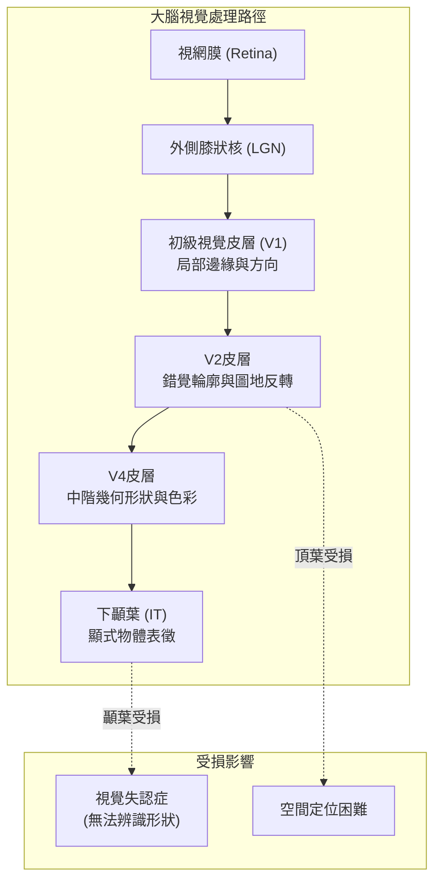

# 第十七章：通用視角假設與物體辨識

## 1. 導讀

當我們張開眼睛，大腦立刻就能認出眼前的桌子、杯子或朋友的臉，這個過程對我們來說是如此毫不費力，以至於早期的電腦科學家曾樂觀地以為「物體辨識」只是個可以在一個暑假內解決的問題。然而，同一物體在不同視角、光源或遮擋下，在視網膜上留下的影像千變萬化。大腦如何從這些混亂的像素中萃取出穩定的物體身份？

本章將從兩個層次探討大腦的運作策略。首先，面對模稜兩可的視覺輸入時，大腦為何總是傾向選擇「通用視角（Generic Viewpoint）」的解釋，而非巧妙對齊的「偶然視角（Accidental Viewpoint）」？我們將透過貝氏推論的角度，解釋大腦如何藉由過濾掉不關心的變數來做出最穩定的猜測。接著，我們將深入探討視覺系統的「腹側路徑（Ventral Stream）」，了解大腦是如何一步步解開視網膜影像的死結，將隱含的特徵轉換為神經元可以輕易讀取的「顯式表徵（Explicit Representation）」，最終達成物體辨識的奇蹟。

閱讀本章後，你將理解為什麼有些錯覺會發生、視覺系統如何解決「不變性」難題，以及下顳葉（IT）皮層在辨識物體中扮演的核心角色。

---

## 2. 核心概念

### 通用視角與偶然視角
在現實世界中，有些特定的視角或光源配置，會讓3D結構在2D視網膜上產生極為特殊的投影。例如，從某個精確的角度看過去，三個不同深度的平面可能剛好在視覺上完美對齊，形成一個毫無破綻的方塊。這被稱為**偶然視角（Accidental Viewpoint）**。然而，只要你的頭稍微偏離一毫米，這個完美的影像就會破滅。

相對地，**通用視角（Generic Viewpoint）**所產生的影像對視角或參數的微小變化非常「強健（Robust）」。當大腦在解讀影像時，它強烈傾向於通用視角的解釋。這就是為什麼當我們看到一個Necker Cube的2D線條時，我們幾乎不會把它看成是幾條剛好在同一平面上巧妙排列的鋼絲，而是理所當然地把它看成一個3D方塊。

### 物體辨識的難題：不變性（Invariance）
物體辨識之所以困難，核心在於**不變性（Invariance）**的挑戰。同一雙鞋子，從上方看、從側面看、在強光下、在陰影中，或者被其他物品遮擋一半時，它們在視網膜上產生的「像素矩陣」是截然不同的。如果我們把一張影像想像成高維度空間中的一個點（例如100萬個像素就是100萬維度），那麼「同一雙鞋子」的所有可能影像，在這個空間裡會是一條極度糾結、扭曲，甚至與其他物體交纏在一起的複雜形狀（Manifold）。大腦的任務，就是把這團亂麻解開。

### 腹側視覺路徑與顯式表徵
解開這團亂麻的工作，交由大腦的**腹側路徑（Ventral Stream）**負責。這條路徑從視網膜出發，經過外側膝狀核（LGN）、初級視覺皮層（V1）、V2、V4，最終抵達下顳葉皮層（Inferotemporal Cortex, IT）。

沿著這條路徑，神經元的感受野（Receptive Field）變得越來越大，對形狀的選擇性也越來越複雜。V1只在乎局部的邊緣和方向，V4開始對彎曲或尖銳的幾何形狀有反應，到了IT皮層，神經元甚至會對特定的臉孔或手掌形狀產生強烈反應。這個過程的計算目標，是將原本糾結不清的**隱式表徵（Implicit Representation）**，轉換成**顯式表徵（Explicit Representation）**——也就是讓同一類物體的點，在高維的神經反應空間中乖乖聚在一起，而且能被一個簡單的「平面」一分為二（即線性可分）。

---

## 3. 機制與現象

### 貝氏推論中的「積分」機制
為什麼大腦會偏好通用視角？Bill Freeman 在1990年代提出了一個優美的數學解釋。回顧貝氏推論：我們想找出在給定影像下，最可能的場景參數（後驗機率）。場景通常由多個變數組成，例如「形狀」與「光源方向」。如果我們只在乎推論「形狀」，光源方向就是我們不關心的「次要變數（Nuisance variable）」。

在數學上，為了得出單一變數（形狀）的機率，我們必須將另一個變數（光源方向）**積分（Integrate/Marginalize）**掉。
這意味著，我們要加總該形狀在「所有可能光源方向」下所產生的概似度（Likelihood）。
- 對於一個「通用」形狀（如真實的凸起物），在各種不同的光源方向下，它看起來都跟目標影像差不多，因此每次加總的概似度都很高，總分極高。
- 對於一個「偶然」形狀（如一個形狀怪異但配上特定光源剛好能產生目標影像的物體），它只有在那個極端特定的光源下概似度很高；光源稍微一偏，產生的影像就截然不同，概似度暴跌。因此積分後的總分極低。

這個機制完美解釋了許多錯覺輪廓（Illusory Contours）。當我們看到Kanizsa正方形時，大腦假設「前方有一個白色的正方形遮擋住後方的圓餅」。因為如果不這麼假設，你就必須接受那四個缺角圓餅剛好完美對齊的「偶然」；大腦在積分掉視角變數後，判定「前方有正方形」的通用解釋機率高得多。

### 視覺失認症（Visual Agnosia）
大腦負責物體辨識的腹側路徑一旦受損，會引發視覺失認症。著名的神經心理學案例顯示，這類顳葉受損的患者擁有正常的視力與色彩感知，但當你給他們看一個蘋果的線條圖時，他們無法認出那是蘋果，甚至無法臨摹畫出那個形狀。
然而，令人驚訝的是，如果你要求患者「憑記憶畫出一個蘋果」，他們卻能畫得出來。這證明了他們的形狀記憶是完好的，受損的是「從視覺輸入中萃取出形狀表徵」的辨識機制。

---

## 4. 心理物理與證據

### 150毫秒的快速前饋處理
物體辨識的速度有多快？Simon Thorpe 團隊進行了一項經典的 ERP（事件相關電位）研究。他們以每張 20 毫秒的極快速度連續閃爍圖片，要求受試者看到「動物」就按下按鈕。
雖然受試者按下按鈕的反應時間大約需要 400 毫秒（包含運動皮層傳導到手指的時間），但透過分析頭皮上的腦波（ERP），研究者發現在影像呈現後的 **150毫秒** 處，大腦對「動物」與「非動物」的腦波反應出現了顯著的分歧。
考慮到視覺訊號從視網膜傳遞到 V1 大約需要 70 毫秒，這個結果強烈暗示：大腦只需透過一次「前饋（Feed-forward）」的傳遞，在訊息抵達 IT 皮層的瞬間（約 150 毫秒），就已經完成了初步的物體分類。

### IT皮層的神經解碼與線性分類
Jim DiCarlo 實驗室透過猴子的單細胞記錄，證明了 IT 皮層確實完成了「顯式表徵」的任務。他們給猴子觀看 78 種不同的物體（包含不同大小、位置），同時記錄 IT 皮層中數百個神經元的反應。
研究人員嘗試用最簡單的「線性分類器（Linear Classifier）」（相當於畫一條直線或超平面）來分類這些神經元的反應向量。結果發現：
1. 僅需幾百個 IT 神經元，線性分類器就能完美分辨出物體的身分。
2. 這個機器的分類表現，與人類受試者在辨識這些物體時的準確率與錯誤模式高度一致。
3. 如果拿 V4 皮層的神經元做同樣的線性分類，表現則極差，無法有效分開這些物體。

這明確證明了：腹側路徑的終極目標，就是將輸入端高度糾結的視覺資訊，展開成在 IT 皮層中能被簡單讀取（線性可分）的格式。一旦資訊被「顯式」化，下游的神經元只需透過簡單的突觸權重相加與閾值判斷，就能知道眼前的物體是什麼。

---

## 5. 常見誤解

- **誤解：我們需要內建一個「偏好通用視角」的獨立規則（Prior）。**
  - **澄清**：許多錯覺現象（如慢速先驗）確實高度依賴先驗機率。但在通用視角的現象中，我們其實不需要預設任何特殊的先驗（甚至可以假設先驗是均勻分佈的）。偏好通用視角的結果，純粹是機率論中「為了估計目標變數，必須對次要變數（如視角或光源）進行積分」的數學必然結果，主要由概似度（Likelihood）的穩定性所驅動。
- **誤解：物體辨識很簡單，因為我們做起來毫不費力。**
  - **澄清**：這種直覺在早期 AI 發展中導致了巨大的誤判（如1966年的夏季視覺計畫）。毫不費力的背後，是大腦經過數百萬年演化，動用了整個腹側路徑、數以億計的神經元，將非線性糾結的影像空間一層層解開的結果。

---

## 6. 小結

- 大腦在解讀模糊的視覺輸入時，會自然避開需要精確對齊的「偶然視角」，傾向選擇在各種變數微調下依然穩定的「通用視角」。
- 從貝氏推論的角度看，這種偏好來自於大腦對「不關心的變數（如光源、視角）」進行積分邊緣化，通用場景因為概似度穩定，總機率會遠勝偶然場景。
- 物體辨識的最大挑戰是「不變性」：如何將受視角、光源劇烈改變的像素影像，歸類為同一物體。
- 大腦的腹側視覺路徑（Ventral Stream）負責物體辨識，若此處（如顳葉）受損，會導致視覺失認症，失去從視覺萃取形狀的能力。
- ERP研究顯示，大腦在短短 150 毫秒內就能區分複雜的物體類別（如動物與非動物），顯示部分辨識機制是高度依賴快速的前饋處理。
- 下顳葉（IT）皮層完成了物體辨識的計算目標：將糾結的隱式影像資訊，轉換為能被線性分類器輕易讀取的「顯式表徵」。

---

## 7. 跨章連結

- **回顧**：本章在探討通用視角時使用的貝氏推論與概似度概念，延續了在「運動感知」章節中探討慢速先驗的機率框架；對錯覺輪廓的討論，則深化了「形狀與輪廓」中提到的邊緣整合。
- **預告**：腹側路徑在抵達顳葉後，是否會針對特定類別的物體發展出專屬的處理區域？在下一章「臉部與特定物體辨識」中，我們將探討大腦中的模組化現象，例如專司臉部的 FFA 與場景的 PPA。
