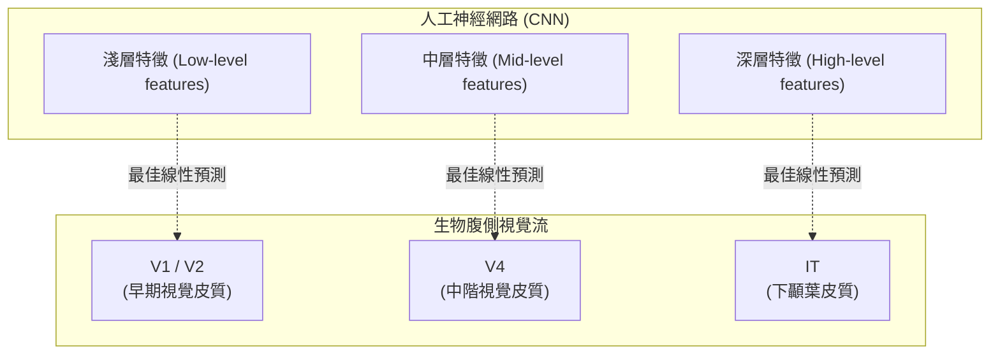
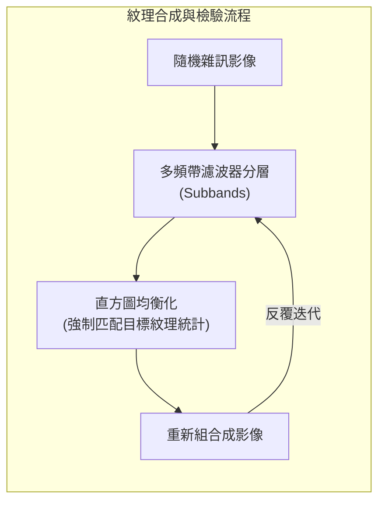

# 第十八章：物體辨識（續）與紋理知覺

## 導讀

本章分為兩個部分。前半部接續前一章的物體辨識，探討大腦是否對特定類別（如臉孔）有專門的處理機制，並介紹如何利用「表徵相異性矩陣」（Representational Dissimilarity Matrix, RDM）以及人工卷積神經網路（CNN）來建立視覺系統的量化模型。後半部則進入全新的主題：紋理知覺（Texture Perception），說明大腦如何透過計算影像區域的平均統計特徵（如能量或濾波器響應的分佈）來區分不同的紋理，並介紹「紋理合成」（Texture synthesis）這項科學檢驗方法。讀完本章，讀者將能理解臉孔辨識的特殊性、神經網路模型與大腦的對應關係，以及大腦如何計算並感知自然界中的紋理。

---

## 核心概念

### 面孔辨識的特殊性

雖然大部分的物體辨識依賴腹側視覺流（Ventral visual stream）的一般性前饋處理，但大腦對某些具有特殊意義或演化重要性的類別——特別是「面孔」——似乎發展出了高度專門化的機制。支持面孔辨識具有特殊性的證據主要來自四個方面：

1. **大腦的專門區域**：透過功能性磁振造影（fMRI）研究，科學家發現人類大腦中存在對面孔反應遠高於其他物體的區域，如梭狀回面孔區（Fusiform Face Area, FFA）。在猴子實驗中，結合 fMRI 與單細胞記錄，也證實這些被稱為「面孔斑塊」（Face patches）的區域中，多數神經元對面孔有極高的選擇性。
2. **倒置效應（Inversion Effect）**：面孔辨識對「倒置」非常敏感。當面孔正立時，我們能輕易辨識；但倒置時，辨識能力與速度會大幅下降。這種效應在多數其他日常物體上並不明顯，暗示面孔辨識依賴特定方向的整體配置訓練。
3. **面孔失認症（Prosopagnosia）**：某些患者在腦部特定區域受損（如中風）後，會喪失辨識面孔的能力，但他們對其他物體的辨識能力仍然完好。嚴重的患者甚至無法在鏡子中認出自己。這種選擇性的功能喪失（selective impairment），強烈支持大腦中存在專門負責面孔辨識的模組。
4. **個體差異的連續光譜**：面孔辨識能力在人群中呈連續分佈。有些人是「超級辨識者」，而有些人則患有具遺傳傾向的發展性面孔失認症，這也暗示面孔辨識有其獨立的生理基礎。

### 比較不同大腦與模型：表徵相異性矩陣（RDM）

要如何量化並比較整個大腦對不同物體的表徵？研究者開發了「表徵相異性矩陣」（Representational Dissimilarity Matrix, RDM）。
其運作方式是測量大腦（通常用 fMRI 記錄大量體素）對一大群影像（例如數百張包含生物、非生物、人臉、動物臉等類別的照片）的反應。將每張影像引發的空間反應模式視為一個向量，計算影像兩兩之間的相關性，並將其轉換為「相異度」（1 減去相關係數）。

RDM 提供了一項極具威力的應用：**跨物種比較**。人類和猴子的大腦解剖結構不完全相同（例如人類的視覺區被語言區擠壓至後腦勺，而猴子則延伸入顳葉），難以進行逐一區域的比對。但透過 RDM，我們可以在抽象的「表徵幾何空間」中進行比較。實驗結果發現，人類和猴子大腦的物體表徵相異性矩陣驚人地相似，證實了猴子是極佳的視覺研究模型。

### 人工神經網路作為大腦編碼模型

近年來，計算機視覺中的「卷積神經網路」（CNN）在物體辨識任務上取得巨大成功。由於這些模型同樣透過一系列的簡單運算（濾波、閾值、池化）來處理視覺資訊，神經科學家開始將它們作為大腦視覺系統的計算模型。

研究者使用**線性編碼模型（Linear Encoding Models）**，嘗試用 CNN 中特定層級的特徵來預測大腦反應。結果顯示出一種優雅的「階層對應」：
- CNN 的淺層特徵最能預測 V1、V2 等早期視覺皮質的反應。
- CNN 的中層特徵最能預測 V4（中階視覺皮質）的反應。
- CNN 的深層特徵最能預測 IT（下顳葉皮質，負責高階辨識）的反應。

這表明，人工系統在為了解決物體辨識任務進行最佳化後，演化出了與生物視覺系統極為相似的表徵階層。

### 紋理知覺（Texture Perception）

視覺不僅僅是辨識單一物體。自然場景中充滿了「紋理」（Texture）——例如一片草地、一堆碎石或滿牆的常春藤。紋理對於推斷材質、提供 3D 形狀的深度線索（紋理梯度），以及場景分割至關重要。

要區分不同的紋理，大腦計算的不是個別元素的精確位置，而是區域的**「平均統計特徵」**。一個強而有力的假說是**能量模型（Energy Models）**：大腦透過類似複雜細胞（Complex cells）的機制，將濾波器（如 Gabor filters）的響應平方（取得能量），然後在空間上進行局部平均。當相鄰區域的平均能量出現顯著差異時，我們就會知覺到「紋理邊界」。

為了檢驗特定的統計特徵（如濾波器響應的分佈）是否真正捕捉了我們對紋理的知覺，研究人員發展出了**紋理合成（Texture Synthesis）**技術。透過直方圖均衡化，強制將隨機雜訊影像在各個空間頻率與方向（子頻帶，Subbands）的能量分佈，匹配成目標紋理的分佈。如果這組統計特徵充分代表了紋理，合成出來的結果在人眼看來，就應該具有與原圖完全相同的「質地感」。

---

## 機制與現象

- **現象：柴契爾錯覺（Thatcher Illusion）**
  - 將一張人臉照片的眼睛和嘴巴局部倒置，但整張照片維持倒立。此時，觀看者會覺得這張臉看起來很「正常」；但一旦把整張照片轉正，就會立刻發現臉部特徵極度怪異扭曲。
  - **基礎**：面孔辨識的倒置效應。大腦的面孔處理機制高度依賴整體的空間配置。當整張臉倒置時，專門的面孔處理機制無法啟動，只能依賴一般的物體辨識機制，因此難以察覺局部特徵被倒置的異常。
- **機制：表徵相異性（Representational Dissimilarity）**
  - 透過計算多體素群體對大量刺激的反應相關性，並將其轉換為距離（1 - correlation），用以捕捉不同物體在神經表徵空間中的聚類與幾何結構。
- **現象：紋理邊界偵測**
  - 某些紋理邊界一眼就能看出（高度顯著），有些則需要仔細比對。
  - **基礎**：當兩個區域在基本特徵（如特定方向的空間頻率）的局部平均能量有顯著差異時，大腦能輕易算出並突顯該邊界。

---

## 心理物理與證據

- **神經造影（fMRI）**：用於定位人類大腦中的梭狀回面孔區（FFA），以及測量人類與猴子大腦對數百張圖片的反應，藉此建構 RDM。
- **線性編碼模型驗證**：藉由測量大腦真實反應與 CNN 模型預測反應之間的「解釋變異量（Variance Explained）」，量化了人工特徵與生物神經元的相似程度。
- **心理物理學行為實驗**：測量受試者對直立與倒置面孔的辨識正確率與反應時間，提供了面孔辨識具方向專一性的量化證據。

---

## 常見誤解

- **誤解**：大腦只能用單一的通用機制來辨識所有物體。
  - **澄清**：雖然腹側流提供了通用的處理管道，但大腦對於具備高度演化與社會意義的類別（如面孔、身體），獨立演化出了專門的處理模組。
- **誤解**：比較人類與猴子的大腦功能，必須建立在精確的實體解剖結構對應上。
  - **澄清**：兩者解剖上難以直接精確對應。但透過 RDM，可以在抽象的「反應模式相異性」層面進行跨物種比較，成功證明兩者在對物體類別的分類表徵上極為相似。
- **誤解**：認出紋理是因為我們看清楚了裡面每一個微小物件的形狀。
  - **澄清**：對於紋理知覺而言，大腦丟棄了特徵的精確空間位置資訊，轉而計算區域的「平均統計特性」（如各方向能量的直方圖分佈）。

---

## 小結

- 物體辨識機制對於特定類別（如面孔）有高度的專門化（Modularity），證據包含 fMRI 觀察到的專屬腦區（FFA）、強烈的面孔倒置效應，以及由腦傷引起的面孔失認症。
- 表徵相異性矩陣（RDM）是一種強大的分析工具，它不僅揭示了大腦對生物/非生物、面孔的強烈分群現象，更證實了獼猴與人類視覺表徵的高度相似性。
- 經過物體辨識訓練的卷積神經網路（CNN），其特徵層級可以有效預測生物視覺系統的階層反應（淺層對應 V1，中層對應 V4，深層對應 IT）。
- 視覺系統不只辨識物體，還負責處理「紋理」。紋理提供了材質、形狀線索及場景分割的基礎。
- 紋理的特徵是由局部區域的平均統計量（如濾波器響應的平方再平均）所決定。
- 紋理合成（Texture synthesis）透過直方圖匹配技術，可將隨機雜訊轉化為具備特定統計特徵的影像，這是檢驗我們是否真正理解人類紋理知覺機制的嚴格科學標準。

---

## 跨章連結

- **前一章（第十七章：物體辨識）**：接續探討物體辨識的腹側流、不變性與線性可分性，本章加入了面孔專門化與 CNN 編碼模型的討論。
- **下一章（第十九章：待續）**：將揭曉本章最後留下的懸念：僅靠直方圖匹配合成出來的影像，到底像不像原始的紋理？並將繼續深入其他高階視覺與知覺主題。
