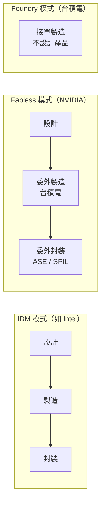
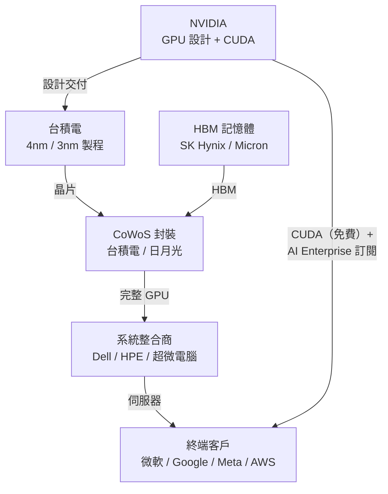

# 商業模式：Fabless 設計公司

## 什麼是 Fabless？

Fabless（無廠）指的是公司只負責 IC 設計，不自建晶圓廠。相對地，台積電是 **Foundry（晶圓代工廠）**，只負責製造，不設計自己的晶片。

## NVIDIA 的價值鏈位置

NVIDIA 掌握最高附加價值的兩端：**設計**（IP、架構）與**軟體生態**（CUDA）。製造這個資本密集環節完全外包。

## 定價權與毛利率

Fabless 模式加上接近壟斷的市場地位，讓 NVIDIA 享有極高的定價權。H100 GPU 在 AI 需求最旺盛時，黑市價格一度超過 $40,000 美元，而 B200 的售價也在 $30,000–$40,000 美元區間。

這帶來驚人的毛利率：NVIDIA 資料中心 GPU 的毛利率長期維持在 **70–80%** 以上。

## 與台積電的相互依賴

| 面向 | NVIDIA 視角 | 台積電視角 |
|------|------------|----------|
| 關係性質 | 最大客戶之一，依賴 CoWoS 產能 | NVIDIA 是最重要的先進製程客戶之一 |
| 風險 | 台積電產能不足、地緣政治 | NVIDIA 若轉單（理論上），影響巨大 |
| 議價能力 | 需求遠大於供給時，NVIDIA 優先取得產能 | 台積電對先進製程具有近乎壟斷地位 |

## 客戶集中度風險

FY2026 美國客戶佔 NVIDIA 總營收約 **69%**。前幾大客戶（微軟、Google、Meta、亞馬遜）的採購決策對 NVIDIA 財務有重大影響。這種集中度在景氣反轉時是系統性風險。
