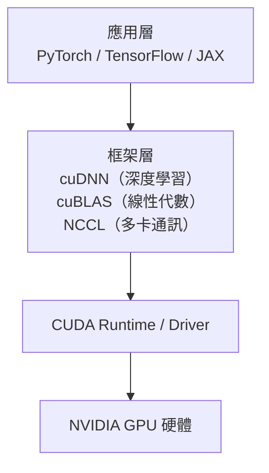
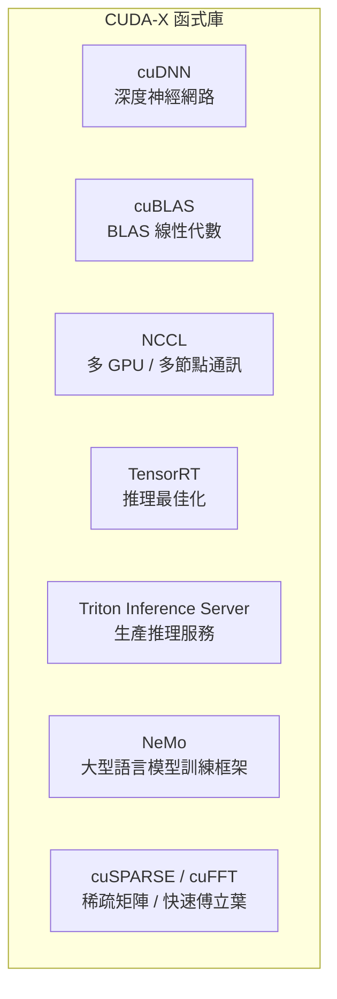

# CUDA 軟體護城河

硬體可以被複製，軟體生態很難。NVIDIA 最深的護城河不是 GPU 晶片本身，而是圍繞 **CUDA（Compute Unified Device Architecture）** 建立的軟體生態系。

## CUDA 是什麼？

CUDA 是 NVIDIA 在 2006 年發布的平行運算平台與程式設計模型，讓開發者可以用類似 C/C++ 的語法，直接對 GPU 的數千個核心進行程式設計。

## 護城河的深度

CUDA 生態擁有 **近 20 年的先發優勢**（2006 年發布至今）。競爭者（AMD ROCm、Intel oneAPI）雖然技術上可行，但要讓現有的 CUDA 程式碼庫遷移，一家大型 AI 公司估計需要 **6–12 個月的工程師人力**，且有潛在的效能迴歸風險。

| 生態要素 | 規模 |
|----------|------|
| CUDA 版本歷史 | 2006 至今，持續向下相容 |
| CUDA-X 函式庫數量 | 300+ |
| 已訓練的 AI 模型（依賴 CUDA） | 幾乎全部主流開源模型 |
| 工程師的 CUDA 知識 | 難以在短期內培養替代品 |

## CUDA-X：垂直整合的軟體棧

NVIDIA 不只提供底層 CUDA，還提供整個軟體棧：

**TensorRT** 尤其重要：它將訓練好的模型（PyTorch、ONNX）最佳化成高效率的推理引擎，專門針對 NVIDIA GPU 微架構進行算子融合與量化，可將推理速度提升 2–5×。

## 軟硬體協同設計

NVIDIA 的根本競爭優勢在於**硬體和軟體是同一家公司設計的**。當新的 GPU 架構引入 FP8、FP4 等新精度時，CUDA 和 cuDNN 立刻針對這些精度最佳化。競爭者往往需要等待第三方框架支援。

## AI 框架的依賴

| 框架 | CUDA 依賴程度 |
|------|--------------|
| PyTorch | 高度依賴；CUDA 是預設後端 |
| TensorFlow | 高度依賴 |
| JAX | 支援 CUDA，也支援 TPU |
| Hugging Face Transformers | 透過 PyTorch / TF 間接依賴 |

> 幾乎所有主流 AI 研究都在 CUDA 上完成。這意味著每一篇論文、每一個開源模型，都在間接強化 CUDA 的生態護城河。
