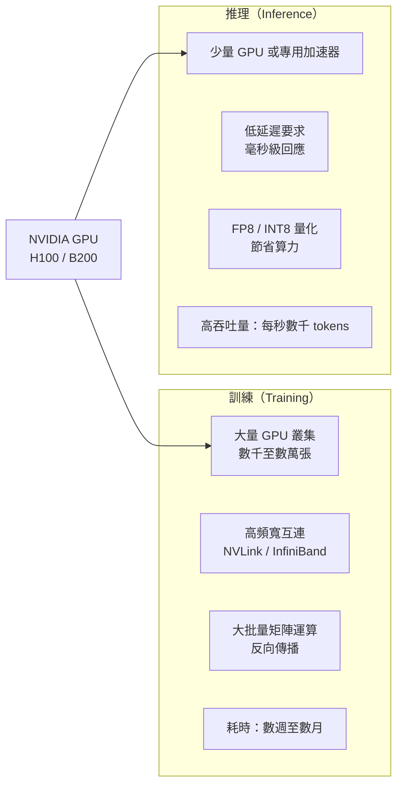
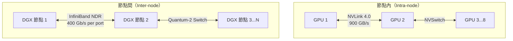
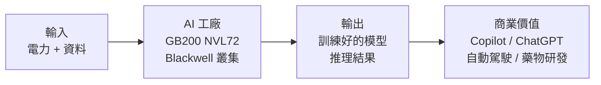

# 資料中心與 AI 應用

資料中心是 NVIDIA FY2026 年約 90% 營收的來源，也是理解這家公司最重要的視角。

## 資料中心 GPU 的兩大用途

訓練需要最強的 GPU（H100、B200），推理則有更多選擇（L40S、A10、H100 NVL 等較低規格產品）。各代 GPU 的規格演進見[架構演進](architecture-roadmap.md)。

## 超大規模雲端（Hyperscaler）客戶

NVIDIA 最大的幾個客戶都是雲端巨頭，他們既是消費者也是轉售者（透過雲端服務）：

| 客戶 | 主要用途 | 產品 |
|------|----------|------|
| Microsoft（Azure） | Copilot、Azure AI、OpenAI 訓練 | H100、B200 叢集 |
| Google（GCP） | Gemini 模型訓練、Vertex AI | H100（同時自研 TPU） |
| Amazon（AWS） | Bedrock、Trainium 旁邊仍大買 | H100、B200 |
| Meta | LLaMA 系列訓練 | 全球最大 H100 叢集之一 |

## NVLink 與 InfiniBand：連接 GPU 的網路

單顆 GPU 的算力有限，AI 訓練需要**數千顆 GPU 協同工作**。連接這些 GPU 的網路同樣關鍵。

NVIDIA 在 2020 年以 $69 億美元收購 Mellanox，獲得 InfiniBand 技術，讓它能提供從 GPU 到網路的完整 AI 基礎設施解決方案。FY2026 Q4 網路業務年增達 **263%**。

## AI 工廠概念

Jensen Huang 將新一代資料中心稱為「AI 工廠」：輸入電力和資料，輸出智慧（Intelligence）。這個框架解釋為什麼 NVIDIA 不只賣 GPU，還賣整套系統（DGX、HGX）和軟體（NeMo、Triton）。

## 推理市場的成長

目前大多數 AI 算力用於**訓練**，但未來幾年**推理**的比重將快速上升——因為每一次用戶呼叫 ChatGPT、GitHub Copilot、Gemini，都需要推理算力。這意味著 GPU 需求不是「一次性建置」而是「持續消耗」。
