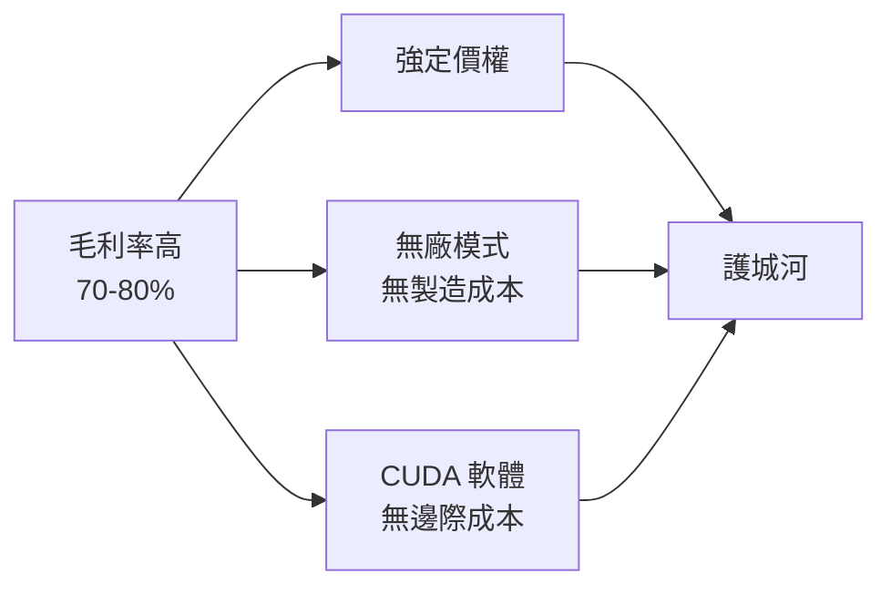
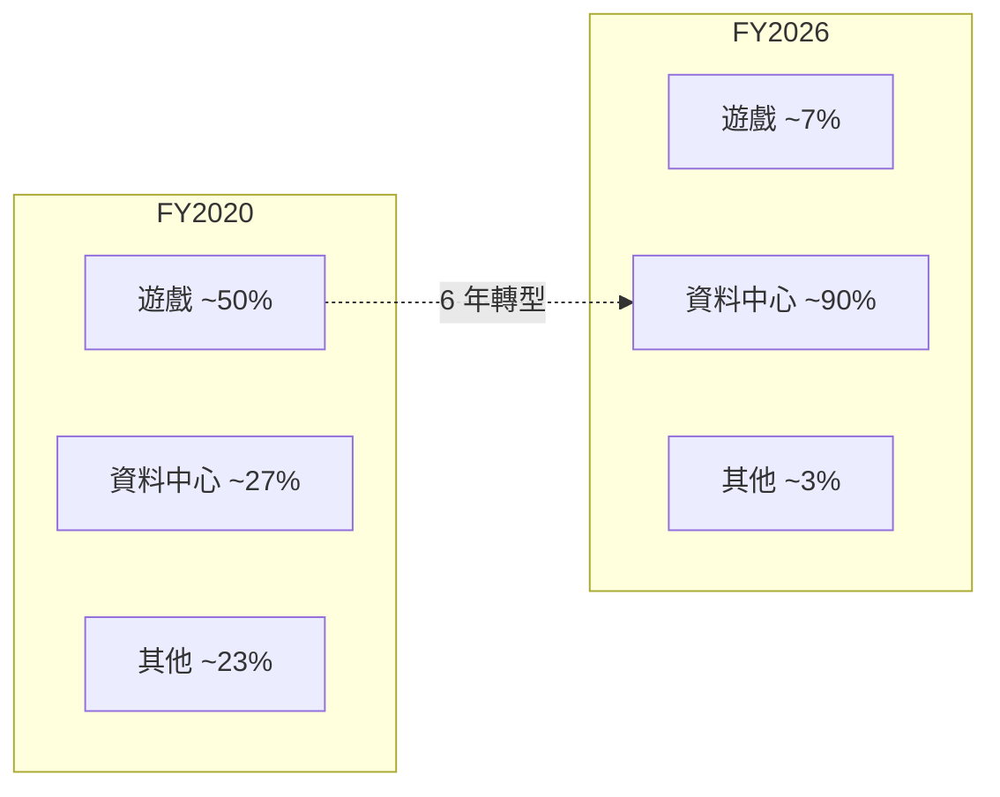

# 財務分析

## FY2026 年度財務概覽

NVIDIA 的財年（Fiscal Year）結束於每年 1 月底。FY2026 = 2025 年 2 月至 2026 年 1 月。

| 指標 | FY2026 | FY2025 | 年增率 |
|------|--------|--------|--------|
| 總營收 | $2,159 億美元 | $1,305 億美元 | +65% |
| 資料中心營收 | $1,937 億美元 | — | +68% |
| 遊戲 | $160 億美元 | — | +41% |
| 專業視覺化 | $32 億美元 | — | +70% |
| 汽車與機器人 | $23 億美元 | — | +39% |
| Q4 FY2026 單季營收 | $681 億美元 | — | 史上最高單季 |

## 毛利率的意義

NVIDIA 的毛利率長期維持在 **70–80%**（FY2026 GAAP 毛利率 71.1%），遠高於一般半導體公司（通常 40–60%）。這反映兩件事（背後的結構性原因見[商業模式](business-model.md)）：
1. **定價權**：市場需求遠大於供給，客戶沒有替代選項
2. **軟體價值**：CUDA 生態系的價值內嵌在 GPU 售價中

## 營收結構轉變

這個轉變揭示了 NVIDIA 本質上已不再是遊戲 GPU 公司，而是 AI 基礎設施公司。

## 資本支出與 R&D

Fabless 商業模式的關鍵優勢之一是**低資本支出**：NVIDIA 不需要蓋晶圓廠，因此大部分現金流可以投入研發（R&D）和股票回購，而非資本投資。

相比之下，台積電每年需投入數百億美元的 CapEx 維持先進製程競爭力。

## 如何看待 NVIDIA 的估值

高成長公司常用的指標：

| 指標 | 說明 |
|------|------|
| P/E（本益比） | 股價 / 每股盈餘；高成長公司通常 P/E 偏高 |
| P/S（股價營收比） | 股價 / 每股營收；適合高毛利科技公司 |
| PEG（本益成長比） | P/E / 盈餘成長率；<1 通常被視為合理 |
| 自由現金流（FCF） | 更難造假的盈利指標 |

> 注意：高估值反映市場對未來成長的預期。若 AI 資本支出增速放緩，或出現強力競爭對手，估值修正風險顯著。

## 客戶集中度風險

FY2026 單一客戶超過 10% 營收的情況需要在 10-K 中揭露（實際數字為機密，但前幾大客戶的體量可從公開財報推算）。微軟、Google、Amazon、Meta 這四家合計估計佔 NVIDIA 資料中心營收相當大比例。
