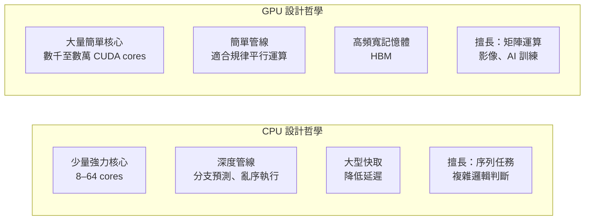
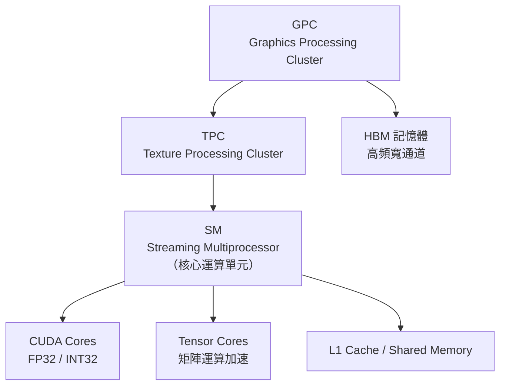

# GPU 技術基礎

## CPU vs GPU：設計哲學的根本差異

CPU（Central Processing Unit）與 GPU（Graphics Processing Unit）代表兩種截然不同的運算哲學：

## 為什麼 AI 訓練需要 GPU？

深度學習的核心運算是**矩陣乘法（GEMM）**。訓練一個大型語言模型需要對數百億個參數反覆執行矩陣乘加運算——這正是 GPU 大量平行核心的強項。

以 GPT-3（1,750 億參數）為例，在 CPU 上訓練估計需要數百年，在 A100 GPU 叢集上則約需數週。

## NVIDIA GPU 內部架構

現代 NVIDIA GPU 由以下層次組成：

**Streaming Multiprocessor（SM）** 是 GPU 最基本的運算單元。每個 SM 包含：
- **CUDA Cores**：執行 FP32 / INT32 基本運算
- **Tensor Cores**：專為矩陣乘法設計，是 AI 效能的關鍵
- **Shared Memory**：SM 內部的高速暫存區

## Tensor Core：AI 效能的關鍵

Tensor Core 是 NVIDIA 從 Volta 架構（2017）開始引入的專用硬體，能在一個時脈週期內完成 4×4 矩陣乘法，比 CUDA Core 快上數倍至數十倍。

| 世代 | 架構 | Tensor Core 精度支援 |
|------|------|---------------------|
| Volta | V100 | FP16 |
| Ampere | A100 | FP16, BF16, TF32, INT8 |
| Hopper | H100 | FP8 新增（E4M3 / E5M2） |
| Blackwell | B200 | FP4 新增 |

精度越低（FP32 → FP16 → FP8 → FP4），運算速度越快，但準確度要求更嚴謹的量化策略。

## HBM（High Bandwidth Memory）

AI 訓練的瓶頸不只是算力，也是**記憶體頻寬**——模型參數必須快速在記憶體和運算單元之間移動。HBM 透過 3D 堆疊 DRAM 晶片，用矽中介板（Interposer）連接 GPU，實現極高的頻寬。

| 規格 | HBM2e（A100） | HBM3（H100） | HBM3e（H200） |
|------|---------------|--------------|----------------|
| 頻寬 | 2 TB/s | 3.35 TB/s | 4.8 TB/s |
| 容量 | 80 GB | 80 GB | 141 GB |
