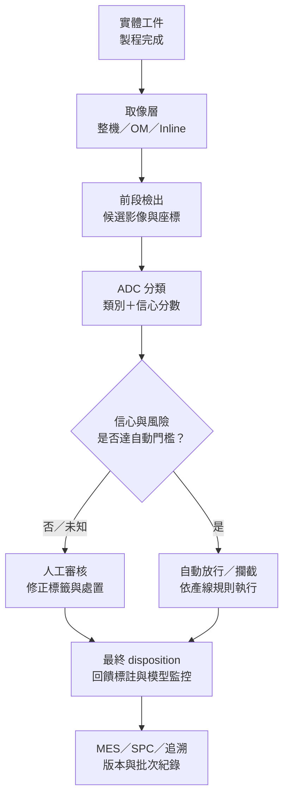

# 第 5 章：整機、嵌入式、改造與 AI，誰替代誰？

## 1. 開場問題

如果 AI 把人工複判減少 80%，是否代表產線漏檢也減少 80%，甚至可以移除 AOI？不行。AI 可能只處理 AOI 已經拍到、已經送出的候選影像；前段沒有取到的缺陷，不會進入它的分母。

先讀[表面檢測候選](03-inspection-alternatives.md)與[2D／3D 量測邊界](04-metrology-boundaries.md)，並以[良率、產能與 OEE](../../gpm/html/14-yield-capacity-capex.html)理解複判如何消耗產能。本章把整機、brownfield 改造、嵌入式檢測與 ADC 分成四層，不讓「都叫智慧 AOI」掩蓋責任。

## 2. 工件與結構：四層共享資料，不共享邊界

| 層級 | 主要輸入 | 核心責任 | 典型輸出 | 不能自動取代 |
|---|---|---|---|---|
| 獨立整機 | 實體晶圓／載具 | 搬送、對位、照明、取像、檢測／量測 | map、影像、缺陷座標 | 前後製程設備 |
| OM 改造 | 既有顯微鏡與既有工件流 | 自動拍照、搬送／通訊整合、離線 review | 數位化影像與結果 | 新整機的全部能力 |
| Inline 嵌入式 | 製程設備中的工件 | 在製程節拍內取像與初判 | 即時訊號、影像、站內判定 | 獨立複判與全廠資料平台 |
| ADC／AI 軟體 | 前段已產生的影像與標註 | 分類、低信心分流、模型與結果管理 | 類別、信心、SINF／KLARF | 相機、照明、搬送與未拍到的缺陷 |

真正的比較單位不是「AI 有沒有」，而是責任邊界：誰保證影像覆蓋率、誰維護 defect taxonomy、誰處理 unknown、誰按最終規則放行。

## 3. 操作流程：資料從工件走到放行

**圖表 5-1｜本書自建的檢測資料流，非特定廠商架構；人工審核與自動放行刻意分流。**

流程的第一個控制點是取像：必檢區是否全部被拍到？第二個控制點是前段檢出：規則有沒有把真實缺陷送成候選？第三個才是 ADC 分類。最後還有 disposition：同一分類結果，可能因產品風險、客戶規格或低信心規則而採不同放行。

模型更新也屬流程的一部分。若標註人員、類別定義或上游照明版本改變，歷史 accuracy 不能直接沿用；需要版本鎖定、漂移監控與回退機制。

此外，人工審核的決定應回寫到哪一層要先約定。若只回寫分類標籤，能改善 ADC；若問題其實是漏拍或失焦，則要回到取像 recipe，而不是用更多標註掩蓋硬體缺口。

## 4. 缺陷：ADC 的分母為何不能只看收到的影像

假設一批工件經獨立真值確認共有 **1,000 個真實缺陷**。以下純為教學算例，不是任何公司的實測：

| 階段 | 假設結果 | 對原始 1,000 個缺陷的累積保留 |
|---|---:|---:|
| 取像覆蓋 | 98% 被有效拍到 | 980 |
| 前段 AOI 檢出 | 對已拍到缺陷檢出 95% | 931 |
| ADC 正確保留 | 對候選真缺陷保留 99% | 約 922 |

整條鏈的真缺陷檢出率約為 `0.98 × 0.95 × 0.99＝92.17%`，亦即約 78 個真實缺陷在不同階段流失。ADC 若只用收到的 931 個真缺陷作分母，可以報 99%；但它不能把前面未拍到或未檢出的 69 個缺陷算成自己的成功。

還要另算誤報鏈。假設前段送出 9,310 張候選影像，其中 931 張是真缺陷、8,379 張是 nuisance；ADC 若排除 90% nuisance，仍留下約 838 張誤報供人工或規則處理。這會影響複判人力，卻不等於漏檢率。

因此至少分列四個指標：取像有效覆蓋率、前段檢出率、ADC 對候選的 recall、ADC 對 nuisance 的減量。把它們混成一個 accuracy，無法定位缺陷在哪一層逃逸。

## 5. 控制與驗收：按層驗，不用一個百分比包辦

| 驗收層 | 分母與測試 | 必看失敗 |
|---|---|---|
| 取像 | 全部必檢位置／面積 | 漏拍、失焦、遮蔽、座標錯位 |
| AOI 檢出 | 經獨立確認的全部真缺陷 | escape、類別別捕獲率 |
| ADC 分類 | AOI 輸出的候選影像，另保留端到端集合 | underkill、overkill、unknown |
| 人工審核 | 每小時候選量與每張處理時間 | 積壓、疲勞、一致性 |
| 自動放行 | 風險分級與可回溯規則 | 高信心但錯判、規則版本錯誤 |
| 整線 | 從工件進站到 disposition 完成 | 延遲、重送、接口與復歸失敗 |

若要允許自動放行，驗收集必須獨立於訓練與調參集，並覆蓋罕見但高風險缺陷。低信心項目進人工審核不是模型失敗的唯一證據；它可能是安全設計，但其比例與人力成本必須入帳。

切換整機、OM 或 Inline 還要重驗影像分布。ADC 對舊照明與舊相機表現良好，不代表接到新成像鏈仍然有效。

驗收報告還應分開「建議攔截」與「實際攔截」。前者是模型輸出，後者經過人工、規則與設備執行；兩者不一致時，才能追到是模型、接口還是操作流程失效。

## 6. 方案比較及公司證據

| 方案 | 公開角色 | 能回答的採購問題 | 公開證據上限 |
|---|---|---|---|
| V5 V5300 PRO | 晶圓級獨立光學檢量測整機 | 新增檢量測站 | 型號與檢出條件見簡報；通用設備頁的接口需另核型號配置；絕對 WPH、共同漏檢分母未公開 [I1；I6 p.17–18] |
| V5 OM Upgrade | Nikon／Olympus 指定既有設備的自動化升級 | 保留原機做 brownfield 數位化 | 不支持原機由 V5 製造，也不證明等同新購整機 [I2「方案能力」1–8] |
| V5 Inline AOI | 搭載製程設備的嵌入式檢測 | 在製程內縮短回饋距離 | 工件、相機、缺陷、節拍與搭載對象未公開 [I3「系統能力」1–5] |
| V5 ADC | 影像輸入、訓練／部署、推論、標記與資料管理 | 減少複判、統一分類與追溯 | 公司稱節省 70–90% 人力並列整合實績；缺共同資料集與品質分母 [I4 五模組；I6 p.20–21] |
| Onto TrueADC | 與 Onto AOI／Discover 整合的分類軟體 | nuisance reduction、unknown 分流 | 官網稱人工 review 減少逾 70%；缺與 V5 相同資料集 [I20 Overview] |

**已確認：** V5 四類方案處在不同層；ADC 本身未公開成像硬體。V5 ADC 的 70–90% 與 TrueADC 的逾 70% 都是各自公司敘述的人工作業減量，不是 accuracy、漏檢率或共同基準排名。

**推論：** OM 適合原機仍可用、主要缺口是自動化與資料化的場景；Inline 適合需短回饋迴路且製程機允許整合的場景；獨立整機適合需要完整搬送與檢量測責任的站點。ADC 多半與前三者互補。

**待查：** 四類方案的接口責任、停機改造時間、影像所有權、模型更新、unknown 比例、端到端 escape／overkill、推論延遲及自動放行資格。沒有這些資料，不把人力百分比換成產品排名。

若供應商只提供 ADC 接收後的測試結果，採購端應再要求一份從原始工件開始的端到端盲測；兩份報告分別回答分類器能力與整線放行風險。

## 7. 理解檢查

1. ADC 對收到影像的 recall 為 99%，為何整線仍可能只有約 92%？
2. OM Upgrade 與新購整機比較時，除了檢出力還要計入什麼？
3. 低信心影像送人工審核，應算成漏檢、誤報，還是另一欄？
4. V5「節省 70–90%」是否優於 TrueADC「逾 70%」？

??? note "參考答案"
    1. 因為取像覆蓋與前段 AOI 已先流失缺陷；端到端率是各階段條件率的乘積。
    2. 原機狀態、改造停機、接口、影像品質、重新驗證、壽命與後續維護。
    3. 先列 unknown／人工分流；最終是否成為漏檢或誤報，要看人工與 disposition 結果。
    4. 不能。兩者基準人力、資料量、缺陷分布、工作流程與統計期間不同。

## 8. 來源與待查

原文定位見[檢測來源](appendix-sources.md#inspection) I2–I6、I20。假設算例與資料流為本書自建，不代表 V5、Onto 或任何客戶的實測結果。

最重要的未結事項是取得端到端分母與自動放行規則。公司產品角色的完整整理見[V5 產品地圖](09-v5-product-map.md)。
