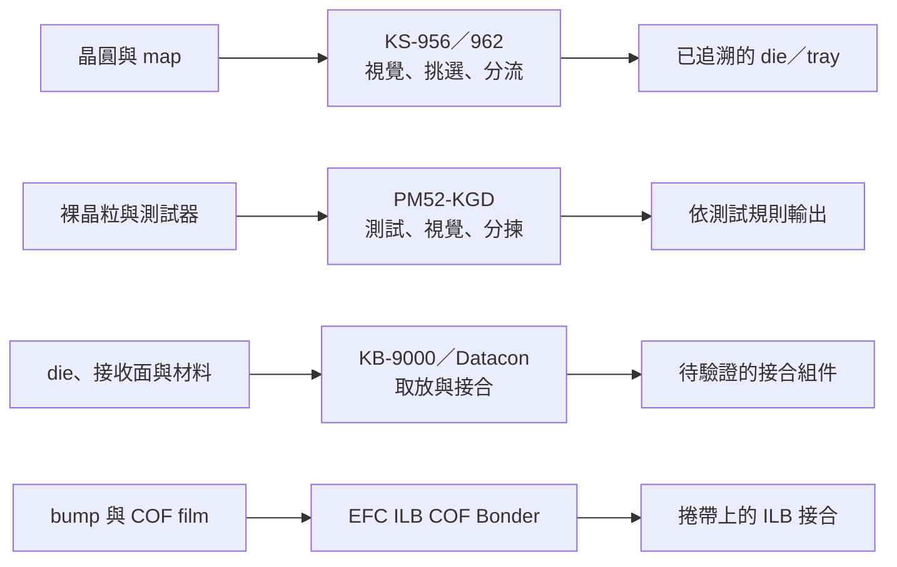

# 第 6 章：Sorter、Bonder 與 COF 接合能直接比較嗎？

## 1. 開場問題

一台設備能挑出 NG 晶粒，另一台能把晶粒放到載板上，第三台能把晶粒接到 COF 的 film；它們都帶有視覺與取放動作，是否就是同一張採購表上的替代品？

不是。比較前先讀[工件流](../../gmm/html/02-sorter-traceability.html)與[接合責任邊界](../../gmm/html/05-bonder-process-boundaries.html)。本章只把公開產品放回「工件—動作—交付結果」：分選要交出身分正確的晶粒，黏晶要交出可接受的放置／接合結果，COF ILB 則要交出 bump 與 film 內引腳的接合。名稱相近不是共同驗收。

## 2. 工件／結構：先分清晶圓、裸晶粒與 film

| 候選 | 公開工件與接收面 | 站點核心 | 不能省略的結構差異 |
|---|---|---|---|
| GMM KS-956／962 | 12 吋標準、8 吋選配晶圓上的 die；NG die 至 tray | 晶粒挑選、AOI、mapping | 晶圓座標、bin 與 tray pocket 的追溯 |
| EFC PM52-KGD | 裸晶粒；waffle pack、wafer ring 或 de-taper 進料 | 測試、視覺與分揀整合 | AC／DC／UIS 判定與探針測試接口 |
| GMM KB-9000 | die 與 12 吋 wafer／glass carrier | 翻面、die AOI、黏晶 | flux、DAF 等材料與接合後結果 |
| Besi Datacon 2200 evo | wafer die、waffle／gel pack 等至 carrier、substrate、leadframe 等 | die attach／flip chip | 膠、flux 或特定工具造成的製程責任 |
| EFC Flip Chip Bonder | IC bump 與 COF film 內引腳 | ILB、reel-to-reel | film 寬度、共晶界面與捲帶供料 |

COF 的 ILB 是**bump-to-film 的共晶接合**；它不能因為有熱、力與對位就改稱 hybrid bonding。hybrid bonding 要另有相符的表面準備、介面及驗收證據，本章的 E3 產品頁未提供這些證據。

<figure class="external-image">
  
  <figcaption>圖 6-A｜有凸塊的覆晶安放示意：看清楚晶粒、凸塊與接收面，才知道要驗收的是位置、接點還是界面。這不是 COF film、無凸塊混合鍵合或指定機型的製程；圖中也未證明接點已通過電性與可靠度。作者：Twisp；點圖開啟 Wikimedia Commons 原始頁；<a href="https://commons.wikimedia.org/wiki/Template:PD-self">公有領域（PD-self）</a>；原圖未修改。</figcaption>
</figure>

## 3. 操作流程：每次「搬動」交出什麼？

**圖 6-1｜自建的功能交付圖，不是任何廠商產線。** 箭頭指出下游需要接收的狀態，不表示圖中設備可直接串接。

KS-956／962 先讀條碼與 mapping file、確認位置，再以正背面／側壁 AOI 協助挑選及輸出 NG die；SECS mapping transfer 是選配。[G1] PM52-KGD 的公開描述則包含頂／底面視覺、探頭定位與 AC、DC、UIS／高溫測試，最多可配四個測試器。[E6] 因此兩者都可「分流」，但判定來源與資料契約不同。

KB-9000 與 Datacon 的共同問題是先把 die 正確拿取、對位並放到接收面；後者另公開 epoxy writing／stamping、flux dipping，以及 epoxy、soldering、thermo-compression 等流程。[G2、B1] 這支持功能重疊候選，不會自動讓兩者的材料、工具、良率或節拍相同。

比較時還要把「動作完成」與「製程完成」分開。Sorter 成功吸取晶粒，不代表其測試分類正確；Bonder 成功放下晶粒，不代表界面已通過電性或可靠度；ILB 壓合完成，也不代表 film 引腳全部形成可接受接點。每個站的輸出狀態不同，故不能用同一個「成功率」合併。

## 4. 缺陷：外觀、身分與界面各會失敗

| 失敗現象 | 可能發生的站點 | 不能用來代替的檢查 |
|---|---|---|
| 晶粒拿對但分到錯 bin | sorter／測試分揀 | 總數相符不證明座標與 pocket 正確 |
| 外觀正常但電性不合格 | PM52-KGD 類測試分揀 | 頂面 AOI 不能取代 AC／DC／UIS |
| 放置位置正確但界面空隙或開路 | die attach／flip | 放置精度不能代替接合後電性與可靠度 |
| film 皺褶、引腳失配或共晶不完整 | COF ILB | 晶粒黏著的驗收不能直接套用 |
| 高功率界面在壽命後失效 | 功率接合 | 初始導通或最大力宣稱不足以放行 |

KS-956／962 公開的缺陷尺寸、正背面／側壁條件，是該 sorter 的 AOI 描述；它不是 PM52-KGD 的 KGD 覆蓋率。[G1] 同理，KB-9000 的 `>300 N` 高接合力文字不是界面壓力、材料窗口或客戶良率。[G2]

## 5. 控制與驗收：把功能候選變成可測問題

| 比較問題 | 必須凍結的條件 | 交付證據 |
|---|---|---|
| KS-956／962 是否可替 PM52-KGD 的任務？ | die、map／bin 字典、電測範圍、輸出載具與復原規則 | 每顆來源座標、測試／視覺結果、分流結果與錯分率 |
| KB-9000 與 Datacon 是否可替代？ | die／接收面、材料、接合法、工具、對位量測時點與產能分母 | 接合後位置、空隙、電性、可靠度及含換料的有效產出 |
| COF ILB 是否合格？ | bump、film、引腳幾何、共晶材料、熱力時間與 reel 條件 | 引腳對應、界面、電性、捲帶收放與失效分析 |

測試時可讓各設備使用適合的 recipe，卻必須在同一任務卡下交出完整分母。只列 cycle time、dry cycle 或單一對位數字，無法涵蓋漏分、重工、複判與接合失效；未公開的 WPH 定義不引用來排名。

一份可稽核的紀錄至少要保存工件 ID、map／bin 或材料版本、recipe、站點時間、異常復原以及驗收結果。若測試、分選與接合分屬不同供應商，這份交接資料比「都支援自動化」更能決定能否整合。

## 6. 方案比較及公司證據

**已確認：** GMM 將 KS-956／962 公開為含 AOI、NG 導出與 mapping 的晶片挑選機；EFC 網站展示 PM52-KGD 的測試、視覺和分揀功能，但未公開產品主體。[G1、E6] GMM KB-9000 與 Besi Datacon 2200 evo 都公開 die attach／取放相關功能，後者的 `±10 µm @3σ`、UPH 都有其模組與流程條件。[G2、B1] EFC 的 Flip Chip Bonder 明列 COF ILB、reel-to-reel 與 eutectic bonding。[E3]

**推論：** KS-956／962 與 PM52-KGD 只有部分分流功能可研究；前者的 wafer mapping 與後者的 AC／DC／UIS 使兩者不能互填能力。KB-9000 與 Datacon 2200 evo 可列功能重疊候選，不能因 `＜3 µm` 與 `±10 µm @3σ` 就做性能排名。COF ILB 與這兩台 die attach／flip 候選是不同工件的接合類別，不代表同一產線的相鄰步驟，也不是同一接合法。

**待查：** PM52-KGD 的法人、bin／map 協定、die 尺寸與測試覆蓋；KB-9000 的完整接合法與 `>300 N` 邊界；兩台共同樣品的品質與有效節拍。還需取得 E3 的共晶材料、熱歷程與良率，才可比較 ILB 結果。

### 功率接合的短對照

Besi Esec 2100 SSI 針對 die 至 leadframe，公開 soft solder、high-force diffusion 與 direct sintering，以及多加熱與氣流區。[B2] 它是功率接合的獨立候選，不能與 E3 的 COF ILB 混成，也不能用其選配 300 N 推回 KB-9000 或任何 hybrid bonding 能力。

## 7. 理解檢查

1. KS-956／962 有 AOI 與 mapping，能否宣稱它完成了 PM52-KGD 的 KGD 測試？
2. KB-9000 與 Datacon 都能取放 die，為何還不能排名？
3. EFC 的 COF Bonder 為何不是 hybrid bonding 證據？
4. Esec 2100 SSI 的高功率接合資訊能否補足 COF ILB 的材料窗口？

??? note "參考答案"
    1. 不能。前者公開的是晶圓晶粒挑選與視覺／mapping；後者另含 AC、DC、UIS 等測試。共同判定規則與接口尚未公開。
    2. 必須先對齊材料、接收面、接合法、統計口徑、品質與含重工的節拍；公開數字的條件不同。
    3. 公開頁支持的是 bump 對 film 內引腳的 COF ILB 共晶接合，未支持 hybrid 所需的特定介面與驗收。
    4. 不能。leadframe 的軟焊、擴散或燒結，與 COF film 的工件、界面及驗收不同。

## 8. 來源與待查

產品、主體與條件定位見[來源索引：接合](appendix-sources.md#bonding) E3、E6、G1–G2、B1–B2；全部為公開資料，並非共同測試。接合的通用控制可回讀[均華的接合邊界](../../gmm/html/05-bonder-process-boundaries.html)，本章不重述其原理。

未公開型號的性能、WPH 單位或模糊溫度範圍均不作數字比較；它們是向供應商詢證的欄位。

特別是 E3 的溫度欄原文符號與上下限不完整，本章不將它重寫為可操作的溫度窗口。

下一章轉向材料處理，檢查熱處理、電漿、撕膜與清洗何時是候選、何時只是相鄰站。
