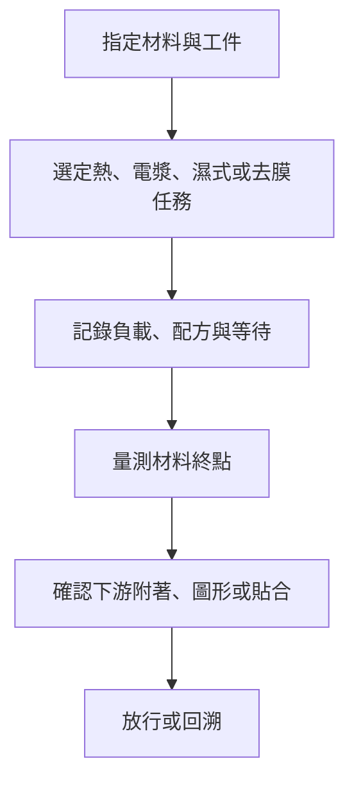

# 第 7 章：光熱與表面處理的替代方案如何選？

## 1. 開場問題

兩家都公開「先進封裝烘烤」設備，一家還列出溫度均勻性，能否立刻選出較好方案？又或者，Lead Frame 電漿清洗與晶圓濕製程都在處理表面，是否可串成同一條已證實產線？

先備可回讀[熱均勻性](../../csun/html/02-thermal-uniformity.html)與[表面處理](../../csun/html/05-surface-treatment.html)。本章只問公開產品能支持的邊界：HQMOL 與 Vertabake 是烘烤功能重疊候選；其餘操作依工件、材料與終點分開，不能用相似效果硬補成替代。

## 2. 工件／結構：材料狀態不是一個泛稱

| 產品／系列 | 公開工件 | 主要改變的對象 | 不可代填的欄位 |
|---|---|---|---|
| CSUN HQMOL-AP51-B20-2D | 6／8／10／12 吋、最大 510 × 510 mm；WLP／PLP／Cassette | 熱歷程與氣氛 | 實際膜材、滿載、工件測點與固化終點 |
| Scientech Vertabake | 每批 25 片晶圓；尺寸未公開 | 批次預成型／預底填烘烤 | 溫度、氣氛、熱曲線與材料 |
| CSUN PRCM-SC10LU | 多尺寸 Lead Frame | 電漿表面清洗 | 氣體、功率、殘留與損傷 |
| Scientech WS／Polar | 批次或單晶圓 | 濕式清洗／蝕刻 | 化學品、尺寸、終點與批量 |
| CSUN MP-A12W | 晶圓膜／膠帶 | 撕膜 | 膜材、殘膠與接口 |
| Scientech Pyxis | 剝離後玻璃與晶圓 | 清洗 | 殘留、保留層與清洗條件 |

同樣叫「乾淨」可能是去除顆粒、有機殘留、膠膜或改變表面狀態；同樣叫「烘烤」也可能對應不同材料反應。工件與下游要求未對齊前，不存在通用的最佳設備。

<figure class="external-image">
  
  <figcaption>圖 7-A｜以實驗室氧電漿清潔器辨認腔體與樣品位置。原始用途是清除火星隕石表面的有機物，不是封裝 Lead Frame 量產清洗，更不是 PRCM 的設備照片；只能幫助理解「樣品在指定環境中接受處理」，不能據此推定產能或配方。來源：NASA/JPL-Caltech；點圖開啟 Wikimedia Commons 原始頁；<a href="https://commons.wikimedia.org/wiki/Template:PD-USGov-NASA">公有領域（PD-USGov-NASA）</a>；原圖未修改。</figcaption>
</figure>

## 3. 操作流程：先從材料終點倒推站點

**圖 7-1｜自建的材料驗收鏈。** 它不是將所有候選設備串成一條實機線。

烘烤比較先固定材料、載具、批次負載、工件實際熱歷程與固化／乾燥終點；再比較升降溫、冷卻、換批與結果。PRCM 的連續式 Lead Frame 電漿處理、WS／Polar 的晶圓濕式清洗／蝕刻則先固定要移除與要保留的材料，不能把兩種操作縮寫成「清洗」後直接比較。

撕膜與清洗也不是同一個動作。MP-A12W 的公開功能是晶圓膜／膠帶撕除，並列 UV 或熱解膠選項；Pyxis 公開的是剝離後的玻璃與晶圓清洗。[M3、M6] 前者留下什麼殘膠、後者可以移除什麼、清洗會不會傷到保留層，均需由同一膜材與接口測試回答。

## 4. 缺陷：症狀不會指出唯一站點

| 現象 | 可疑條件 | 不能立即歸責的說法 |
|---|---|---|
| 殘留、起泡或附著不良 | 熱歷程、材料、排氣或前處理 | 「設定溫度到了，所以不是烘烤」 |
| 表面變乾淨但下游失效 | 處理選擇性、等待、再污染或材料不相容 | 「接觸角變小就必然附著較佳」 |
| 撕膜後殘膠或破片 | 膜／膠、解黏方式、接觸與速度 | 「任何剝離後清洗都能補救」 |
| 中央與邊緣結果不同 | 負載、遮蔽、熱／化學分布 | 「空載規格可代表量產」 |

<figure class="external-image">
  
  <figcaption>圖 7-B｜由 A → B → C → S，液滴越來越鋪展；這可以幫助理解潤濕差異，卻不是「越平就越乾淨」或「附著一定越好」的排名。液體、基材、粗糙度與量測時間必須固定，還要另驗下游附著與保留層損傷；四種外形不是同一試片的處理前後實測。作者：MesserWoland；點圖開啟 Wikimedia Commons 原始頁；<a href="https://creativecommons.org/licenses/by-sa/3.0/">CC BY-SA 3.0</a>；原圖未修改。</figcaption>
</figure>

## 5. 控制與驗收：數字要連回同一終點

HQMOL 公開的 **280 °C 時 ±3 °C** 必須保留原文溫度與均勻性條件；它不是未指明負載下的材料溫度或品質結論。[M1] Vertabake 公開的 **25 片／批** 是裝載尺度；沒有公開溫度、均勻性、時間或材料終點。[M4] 一者不能拿來除另一者，因而不硬比性能。

這不表示數字沒有用：280 °C 時的均勻性可用來詢問 HQMOL 在指定條件下的熱分布；25 片／批可用來詢問 Vertabake 的裝載與換批方式。但在補到相同材料、相同負載與同一終點之前，兩筆資料只能形成詢證表，不能形成名次。

| 驗收面 | 需要的共同資料 | 缺少時的結論 |
|---|---|---|
| 熱處理 | 材料、負載、測點、熱曲線、氣氛與終點 | 僅為功能重疊候選 |
| 表面處理 | 工件、污染／保留層、處理條件與損傷量測 | 不可跨機理排名 |
| 去膜／清洗 | 膜材、殘膠限值、玻璃／晶圓接口與破片率 | 僅能研究是否互補 |
| 整合 | 站間等待、追溯、下游附著／電性結果 | 不宣稱已可串線 |

## 6. 方案比較及公司證據

**已確認：** CSUN 公開 HQMOL-AP51-B20-2D 的先進封裝熱處理用途與上述條件；Scientech 公開 Vertabake 的預成型／預底填烘烤用途、垂直／水平選項及 25 片／批。[M1、M4] CSUN PRCM-SC10LU 是多尺寸 Lead Frame 的連續式電漿清洗，WS／Polar 是晶圓濕製程系列。[M2、M5] MP-A12W 處理晶圓膜／膠帶；Pyxis 是剝離後玻璃與晶圓清洗系列。[M3、M6]

**推論：** HQMOL 與 Vertabake 可列主站的烘烤功能重疊候選，尚非技術替代。MP-A12W 去膜後，Pyxis 清洗**可能**成為互補候選，但只有在膜材、殘膠、工件接口與驗收相容時才成立。PRCM 與 WS／Polar 的工件及機理不同，不能寫成相鄰可直接串線。

**待查：** 兩款烘烤方案的共同材料窗口、滿載熱曲線、終點及有效產出；PRCM 的氣體、功率、表面損傷；WS／Polar 的化學品與終點；MP-A12W 與 Pyxis 的殘膠和接口資料。Pyxis TB 的「辛耘與 3M 合作開發」僅為辛耘公司自述，合作分工、客戶、型號與商用階段仍待查。[M7]

若未來取得共同材料實驗，最小設計應保留未處理對照、固定的工件批次與下游配方，並把中央、邊角及不同負載分開記錄。只用一片成功試片或單一控制器曲線，仍不足以將候選升級為技術替代。

東捷本輪確認的是 **FAN OUT PLP 半導體雷射修整設備**，工件頁列 compound／polymer 載板，處理修邊、溢膠清除、re-notch 與 marking。[C1] 這是另一種材料加工，不是本章烘烤的替代，也不是僅憑「雷射」就能推導光學檢測。頁面同時出現 PLP 名稱與 Ø300 mm 規格，更應保留原始工件條件，不自行改填矩形面板尺寸；型號、量產、客戶與合作分工仍未公開。

## 7. 理解檢查

1. 280 °C ±3 °C 與 25 片／批，為何不能做成性能排名？
2. PRCM 與 WS／Polar 都能影響表面，為何不能直接寫成可串線？
3. MP-A12W 去膜後何時才可把 Pyxis 列為互補候選？
4. Pyxis TB 與 3M 的合作能證明什麼？

??? note "參考答案"
    1. 前者是指定溫度下的均勻性，後者是批次裝載尺度；兩者未量同一件事。
    2. Lead Frame 電漿與晶圓濕製程的工件、機理、化學與接口均未對齊。
    3. 要有相容的膜材、殘膠限值、玻璃／晶圓接口及下游驗收，現階段只可研究。
    4. 僅支持辛耘自述有合作開發；不支持客戶採用、量產、完整分工或其他 Pyxis 系列的合作。

## 8. 來源與待查

原始頁面、日期與可支持範圍見[來源索引：材料](appendix-sources.md#materials) M1–M8，以及[相鄰設備 C1](appendix-sources.md#bonding)。熱與表面機理請回讀[志聖熱均勻性](../../csun/html/02-thermal-uniformity.html)及[表面處理](../../csun/html/05-surface-treatment.html)；本章未把公開產品頁當成材料配方或共同驗收。

本章保留的未結不是「資料缺少」的泛稱，而是指定材料、終點、負載與接口的待測清單。

在取得資料前，採購端可先問四件事：

1. 工件是否為相同尺寸、載具與材料堆疊？
2. 終點是殘溶劑、附著、殘膠還是其他可量測結果？
3. 數字是在空載、代表負載或最大負載下取得？
4. 結果能否連到指定的下游站與驗收批次？

四項只要有一項未知，就應保留相應的候選或相鄰站標籤，而不是用公司名稱補足。
