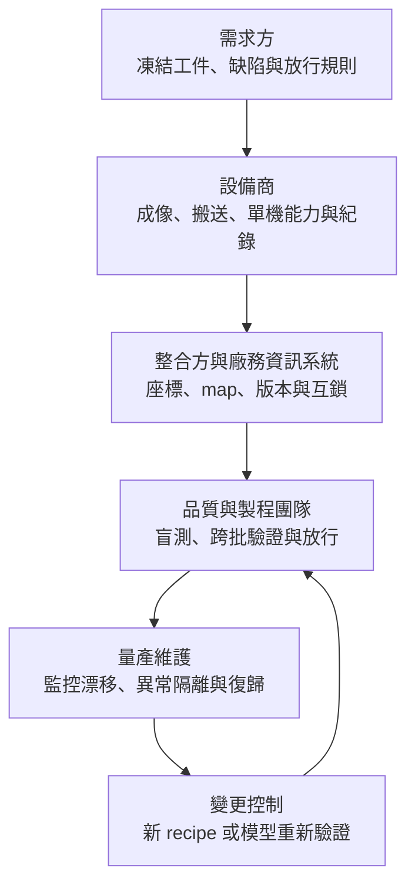

# 第 8 章：單機合格，為何客戶未必願意換？

## 1. 開場問題

新機在樣品上達到檢出要求，報價又低，客戶卻沒有更換。這不必然是保守，也可能是比較漏掉了搬運、資料、放行、異常處置和重新驗證。

先讀[表面檢測示範](03-inspection-alternatives.md)至[材料處理](07-material-process.md)。設備生命週期原理見[既有教材](../../smt-bonding/html/11-equipment-lifecycle.html)；本章新增跨廠切換的責任表與可重算成本。

## 2. 工件與結構：交接的不只有實體

每一次交接至少有三份東西：**工件本體、狀態紀錄、下一步允許做的動作**。機器能收到晶圓，不代表正反面座標、缺陷類別和良品 map 都能正確讀取。

| 接口 | 需共同定義 | 典型失敗 |
|---|---|---|
| 機械 | 尺寸、載具、翹曲、取放面與夾持限制 | 可進料但刮傷或無法復歸 |
| 座標 | 原點、旋轉、鏡射、die index、正背面轉換 | 缺陷回寫到錯誤晶粒 |
| 資料 | wafer／lot ID、bin 定義、版本、時間戳 | 合格 map 配到另一片工件 |
| 控制 | recipe 選取、互鎖、錯誤碼、復歸狀態 | 重啟後重複加工或誤放行 |
| 責任 | 誰判定、誰複判、誰批准模型更新 | 供應商互指對方而無人處理 |

支援 SECS/GEM 或 KLARF 是接口入口，不等於客戶的事件、欄位與例外規則已完成。原理可回讀[均華分選與追溯](../../gmm/html/02-sorter-traceability.html)。

## 3. 操作流程：驗收責任隨交付移動

**圖 8-1｜自建驗收責任圖。** 角色可能由同一法人承擔，實際分工以合約為準；箭頭不是任何廠商的合作公告。

先在離線環境重播資料與錯誤情境，再用工程批、平行比對及受控量產觀察逐步放行。舊機是否留作回退、何時解除隔離、哪個版本允許上線，都要在切換前約定，不能等故障後臨時猜測。

## 4. 缺陷：換機後才出現的隱性成本

新機把所有可疑影像都送複判，可能使單機 throughput 很好看，卻讓放行隊列塞住。分類軟體把「unknown」變少，也可能只是閾值改了，不是缺陷辨識真的進步。

此外，跨日照明衰退、重新上片定位變動、材料批次反射差異，都可能讓一次樣品驗證失效。損失不只重測費，還包括工程師時間、在製品等待與客訴風險；但沒有合理機率及金額資料時，應列風險情境，不能捏造一筆「預期良率損失」。

## 5. 控制與驗收：一張可重算的成本表

以下全部是**教學假設**，單位新臺幣百萬元，不是任何廠商報價。比較「既有設備繼續使用」與「換入新機」的增量現金支出；同一觀察期三年、不折現、不含稅與殘值。既有設備取得成本是沉沒成本，故不再列入。

| 成本項目 | 保留既有機 | 換入新機 | 假設說明 |
|---|---:|---:|---|
| 新機購置 | 0 | 6.0 | 假設一次支付 |
| 資料／機械整合 | 0 | 0.8 | 非每年費用 |
| 重新驗證 | 0 | 0.6 | 樣本、量測與工程投入 |
| 切換期間產能損失 | 0 | 0.4 | 一次性，且未另重複計人工 |
| 年維護 | 0.8 | 0.5 | 每年 |
| 年複判人工 | 1.8 | 0.6 | 同工作量與品質門檻才可用 |
| 三年總額 | **7.8** | **11.1** | 既有 3×2.6；新機 7.8＋3×1.1 |

新機每年節省 2.6−1.1＝1.5；初始增量為 7.8，所以簡單回收期為 7.8÷1.5＝**5.2 年**。在三年視窗，新機仍多花 3.3；不能只看每年人工節省就說應立即換機。

**敏感度：** 若新機年複判費其實是 1.2，年節省降為 0.9，回收期約 8.67 年。若舊機已無法滿足新缺陷要求，「保留舊機」便不是合格選項；此時要比較其他可達標方案，而不是以便宜但不合格的機台作基準。

此模型也未估算新機新增產能價值。只有真有需求、下游也有容量、且該機確為瓶頸時，才可納入；不能把額定 WPH 全部當可出售產出。

## 6. 方案比較及公司證據

**已確認：** V5 通用整機與改造方案公開 OHT＋SECS/GEM、KLARF／SINF；均華 KS-956／962 列 mapping 與選配 SECS mapping transfer；易發 OM 描述與上下站交接晶粒資料。[I1–I2、G1、E2]

**推論：** 這些能力可形成整合的起點，但跨廠驗收仍要核對版本、bin、座標和異常復歸。V5 ADC 與 AOI 是分類／成像互補候選；均華分選機與前段檢測可研究資料銜接，不能直接宣稱已互通。

**待查：** 支援的訊息清單、範例 map、服務與保固邊界、離線時允許動作、備援和回退責任。關於易發與 Pentamaster 的合作，只能按公開稿描述，不能補上獨家代理或全球統一保固。

## 7. 理解檢查

1. 為何成本表不再加上舊機原始購價？
2. 新機人工較少，為何三年總額仍較高？
3. 支援相同檔案格式為何還可能分錯晶粒？
4. 舊機不符合新缺陷門檻時，成本比較要怎麼改？

??? note "參考答案"
    1. 在是否現在更換的增量決策中，已支付且不可回收的購價是沉沒成本；殘值、稅與處分費若重要須另加。
    2. 節省需累積，購置、整合、驗證和切換是前期成本。
    3. 原點、鏡射、索引和 bin 語意可能不同，格式相同不等於語意相同。
    4. 先把不合格方案排除，改比達標候選或可使舊機達標的升級方案。

## 8. 來源與待查

接口資料見[來源索引](appendix-sources.md) I1、I2、G1、E2。成本表、責任圖與切換次序是教學模型，非公司成本或客戶作業程序。

公司邊界分別見[V5](09-v5-product-map.md)、[易發](10-efc-product-map.md)；新聞中的導入、替換與合作用[第 11 章](11-reading-competitive-claims.md)分析。
