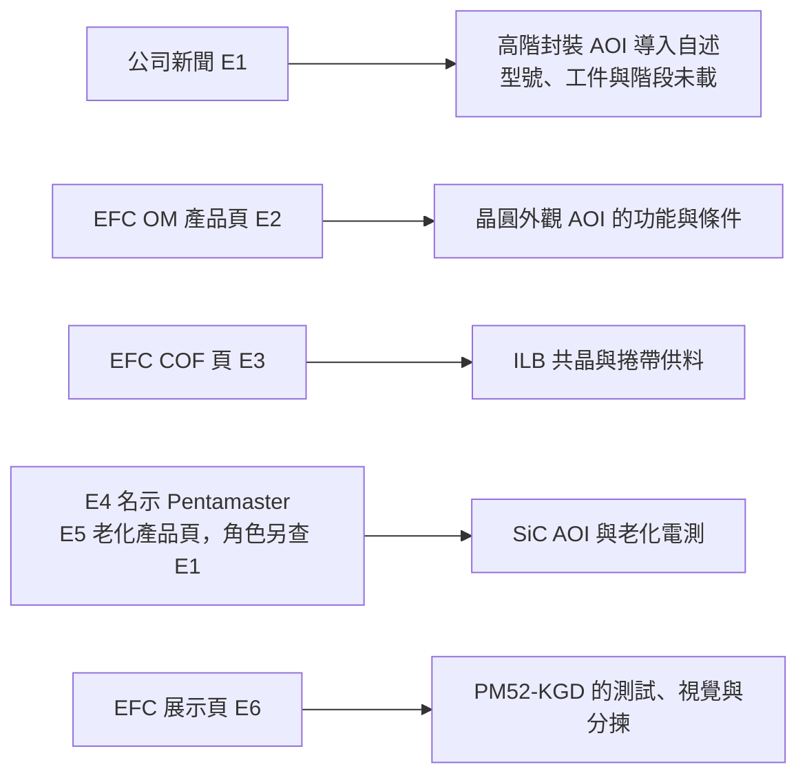

# 第 10 章：易發哪些能力必須分開看？

## 1. 開場問題

一則新聞提到高階封裝 AOI、COF Bonder 與 SiC 測試合作；網站又展示 Trooper、BI 與 PM52-KGD。能否把它們都畫成「易發先進封裝設備」？

不能。本章主體是**易發精機股份有限公司（EFC）**，以 `efctw.com` 公開資料辨識。先讀[檢測替代方案](03-inspection-alternatives.md)與[分選、接合邊界](06-sorting-bonding.md)。本章的任務不是重講 AOI 或接合原理，而是分開法人、產品主體、工件、公開角色與商用證據，避免展示頁、新聞與合作關係相互補洞。

## 2. 工件／結構：同名設備先拆回任務

| 項目 | 公開工件／任務 | 產品或角色主體 | 與其他項目的邊界 |
|---|---|---|---|
| Wafer Auto Inspection Machine（OM） | 8–12 吋晶圓外觀檢查 | EFC 產品頁；自研／合作未明 | 不等於 SiC AOI 或 KGD 電測 |
| Flip Chip Bonder | IC bump 對 COF film 內引腳的 ILB | EFC 產品頁；角色未明 | COF ILB，不是 hybrid bonding |
| Trooper-V | SiC 晶圓 AOI | Pentamaster 明示為產品主體；EFC 展示 | 不應改為 EFC 自研 AOI |
| Trooper-BI1／BI2 | SiC／功率晶圓老化與電測 | Pentamaster 角色見合作脈絡；機型分工待查 | 不是封裝 AOI 或 bonder |
| PM52-KGD | 裸晶粒測試、視覺與分揀 | EFC 展示；產品主體未公開 | 不應補成 Pentamaster 或 EFC 自研 |

這張表先處理「誰在說哪一台」。產品頁已公開，不代表它曾在展會展示、已出貨或量產；本輪資料的商用階段多數未公開，不能以網站上架替代。

## 3. 操作流程：把主張送到正確的證據層

**圖 10-1｜自建的證據分流圖。** 箭頭只表示來源支持的主張，沒有把 E1 的 AOI 導入接到 E2 的具體型號，也沒有把任何展示項目升級成量產。

實務查核先記錄法人、品牌與型號，再記工件、站點與數字條件；接著才找客戶、驗證、出貨或量產的具名且帶日期證據。若該鏈在任一格斷掉，該格寫「未公開」，不以相鄰產品補上。

例如 E1 所稱「導入」可保留為公司新聞的原文層級，卻不能自行改寫為「量產導入」。後續若有客戶共同公告、型號、工件與驗收範圍，才可更新這一格；若證實是 PoC、展示或非封裝工件，原先較強的推論則必須撤回。

## 4. 缺陷：最常見的是證據對錯位

| 錯誤寫法 | 為何不成立 | 正確保留方式 |
|---|---|---|
| 「E1 導入的 AOI 就是 OM」 | E1 未給型號、工件與規格 | E1 為未具名導入自述；E2 為 OM 公開產品 |
| 「Trooper-V 是易發自研」 | E4 明示 Pentamaster | 寫 Pentamaster 產品、EFC 展示；製造／保固待查 |
| 「BI1／BI2 是封裝檢測」 | 公開任務是 SiC／功率晶圓老化電測 | 分列為可靠度電測，不混入 AOI |
| 「PM52-KGD 是 Pentamaster 機台」 | E6 未公開產品主體 | 只寫 EFC 展示 PM52-KGD，主體待查 |
| 「COF Bonder 是 hybrid 接合」 | E3 支持 ILB 共晶與 film | 保持 COF ILB 的工件與接合名稱 |

另一種錯位是把「≥100 WPH」與「≥30 WPH」相減比較。OM 的前者是 8 吋、36 點抽檢，後者是 8 吋、以 30 µm 為條件的全檢；它們不是同一工作量。[E2] 溫度、WPH 等定義模糊時，本章寧可列待查，不把數字延伸到其他產品。

## 5. 控制與驗收：公司地圖也需要版本管理

| 要確認的問題 | 最低證據 | 現有資料的處理 |
|---|---|---|
| E1 的導入是否為特定型號與量產？ | 客戶共同公告或有日期的型號、工件、驗收結果 | 不可由 E2 補型號；階段待查 |
| Trooper 由誰製造、整合及服務？ | EFC／Pentamaster 的共同分工文件 | 保留 Pentamaster 主體與 EFC 展示角色 |
| PM52-KGD 可否接既有 sorter？ | 主體、die 規格、bin／map 協定與共同測試 | 不以「KGD」名稱推定互通 |
| COF ILB 是否可導入目標產品？ | bump／film、材料、熱力歷程、界面與可靠度 | 公開產品功能，不宣稱量產 |

驗收的輸出必須可回溯到工件與站點：AOI 需要缺陷、覆蓋率、漏檢／誤報與節拍；老化測試需要 DUT、通道、壓力與判定規則；分揀需要來源到輸出的履歷。公司新聞只有較高層主張時，不能跳過這些分母。

這也限制了跨產品的公司比較。Trooper-V 的約 70,000 die、2 分鐘描述未同時公開晶圓直徑、缺陷、覆蓋面或誤報率，不能換算成可與 OM 比較的 UPH。[E4] BI1／BI2 的通道數同樣是測試配置線索，不是 AOI 節拍或 COF 產能。

## 6. 方案比較及公司證據

**已確認：** EFC 在 2025-03-26 新聞自述高階封裝 AOI 獲未具名國內半導體大廠導入，亦自述與 Pentamaster 合作提供 SiC 製程測試方案。[E1] OM 頁公開晶圓外觀檢查及附條件的抽檢／全檢節拍。[E2] EFC 的 COF 頁公開 ILB、reel-to-reel 與 eutectic bonding。[E3] Trooper-V 頁明示 Pentamaster，BI1／BI2 是 SiC／功率晶圓老化電測；PM52-KGD 頁則公開測試、視覺與分揀功能而未明示主體。[E4–E6]

**推論：** 易發的公開地圖至少包含晶圓外觀 AOI、COF ILB、展示的 SiC AOI／老化測試，以及裸晶粒測試分揀等不同任務；它們不應匯總成單一「先進封裝能力」。E1 的導入可作公司自述商業線索，卻不能指定為 E2，也不能證明 Trooper、BI 或 PM52-KGD 已獲同一客戶採用。Pentamaster 的角色只適用有明示的產品／合作脈絡。

**待查：** E1 導入的型號、工件、客戶階段與驗收；OM 的光學架構、缺陷分母與 WPH 定義；Trooper 系列的製造、代理、保固及服務分工；BI1／BI2 各自的產品主體與量產資料；PM52-KGD 的法人、協定與測試覆蓋。亦待查 COF ILB 的材料、良率與可靠度，不能以展會或上架頁替代。

| 更新觸發 | 可以改變的結論 | 仍不能自動得到的結論 |
|---|---|---|
| EFC 與客戶共同列出 AOI 型號、工件與階段 | E1 是否對應某一型號 | 與其他 AOI 曾直接競標 |
| Pentamaster 共同說明 Trooper 分工 | 製造、代理或服務角色 | 每一款 EFC 展示設備都由 Pentamaster 製造 |
| PM52-KGD 公開主體與 bin／map 協定 | 能否評估特定分選接口 | 與 KS-956／962 已可互換 |
| COF 的材料與可靠度報告 | ILB 的適用窗口 | 已是 hybrid bonding 或量產供應 |

## 7. 理解檢查

1. E1 能否證明 OM 已在該未具名客戶量產？
2. Trooper-V 出現在 EFC 網站，能否寫為 EFC 製造？
3. 為何 BI1／BI2 不列入封裝 AOI 的性能表？
4. PM52-KGD 的名稱有 KGD，能否直接和 KS-956／962 宣稱互換？
5. COF ILB 有熱與力，為何仍不能寫成 hybrid bonding？

??? note "參考答案"
    1. 不能。E1 沒有型號、工件、驗收與量產階段；E2 是另一份產品頁。
    2. 不能。公開頁明示 Pentamaster；EFC 的製造、保固與服務角色未公開。
    3. 它們公開的是 SiC／功率晶圓的老化與電測，工件、目標與分母不同。
    4. 不能。PM52-KGD 的主體、die 規格、bin／map 接口及共同測試尚未公開。
    5. E3 支持的是 COF film 的 ILB 共晶接合；hybrid 需要不同且未公開的界面證據。

## 8. 來源與待查

來源 ID、網址、日期與原文範圍見[來源索引：接合](appendix-sources.md#bonding) E1–E6；公司新聞與產品頁均為公開資料，非客戶共同驗收。分選與接合的技術邊界已在[第 6 章](06-sorting-bonding.md)建立，本章只處理易發的角色與證據地圖。

因此，產品公開、展示、合作與量產必須各自留在已被來源支持的證據層級。

本章未使用任何未具名客戶來推定採購方，也未將公司展示頁寫成展會現場或客戶產線的證明。
