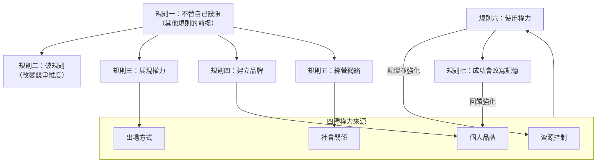

# 第二章：七條規則的底層邏輯

七條權力規則不是一套漂亮口號，而是一套組織行為的操作手冊。S004 把七條規則放在職涯推進與現場問答裡討論；S005 則把它們放回更底層的社會心理學：階層仍然存在，人們偏好地位，人們會自我美化，也會靠近成功者。

這一章先不逐條寫成技巧清單，而是回答一個更基本的問題：為什麼這些規則會有效？

## 權力的來源不只一種

S007 是一段短訪談，最有用的地方是它把權力來源講得很清楚。Pfeffer 至少列出四種來源：資源控制、社會關係、你如何出場，以及個人品牌。

資源控制很直觀：誰掌握預算、資產、人力、職位或關鍵流程，誰就有較多權力。社會關係則是第二種來源，因為管理常被定義為透過他人完成事情；你認識誰、誰信任你、誰願意回應你，會直接限制你能動員多少力量。

第三種來源是呈現方式，也就是你是否能 act and speak with power。第四種是品牌：如果你被認為有效、有能力、會成功，這個名聲本身會讓人才、資源與機會更容易流向你。這四種來源互相增強，不是彼此替代。

四種來源和七條規則的關係，可以整理成一張圖：規則一是所有行動的前提，規則二改變競爭維度，規則三、四、五分別累積「出場方式」「個人品牌」「社會關係」三種來源，規則六把累積的來源轉成結果，規則七的成功再回頭強化品牌。

## 權力是潛能，影響力是使用中的權力

S004 一開始區分 power 和 influence。Pfeffer 把 power 看成潛能，就像電池裡儲存的電；當你把這個潛能釋放出來，讓他人改變判斷、行動或資源配置，它就成了 influence。

這個區分很實用。很多人說自己不喜歡 power，偏好 influence，實際上只是想換一個不那麼刺耳的詞。但如果影響力是權力的使用，那麼拒絕談權力，只會讓人失去理解影響力來源的能力。

## 階層沒有消失

S005 的第一個現實前提是：hierarchy still exists。Pfeffer 特別針對科技業與矽谷式平等語言提出反駁：大家可以談 empowerment、文化、合作與扁平，但公司仍然有 CEO，政府仍然有總統，學校仍然有院長，團隊仍然需要決策者。

階層不只是老派制度的殘留。Pfeffer 指出，人們在完成任務時也常主動選擇階層，因為階層能降低協調成本，讓誰有最後決定權變得清楚。問題不是階層是否存在，而是你是否知道自己在階層中的位置，以及如何移動。

## 地位有實際報酬

如果階層存在，多數人就會偏好在階層上方，而不是下方。這不是單純的虛榮。高地位通常帶來更高薪資、更多自主權、更大選擇空間，也可能影響健康與壽命。

這裡的重點不是鼓勵每個人都追逐頭銜，而是提醒讀者：權力與地位不是抽象符號，它們會改變一個人的生活條件。你可以選擇不追求，但那應該是清醒的取捨，而不是因為誤以為階層已經消失。

## 溫暖與能力常被錯誤地對立

S005 提到，人們評估他人時常看兩個維度：warmth 和 competence。問題是，人們往往把這兩者看成負相關：太好相處的人容易被看成不夠強，太有能力的人又容易被看成不夠溫暖。

這也是「被喜歡」陷阱的底層。若你過度追求親和與無害，可能換到好感，卻失去能力與權威的訊號。Pfeffer 不是說人必須粗魯，而是提醒你：如果情境要求你展現能力、決斷與控制，單靠溫暖不夠。

這點對女性與少數群體尤其尖銳。S004 的現場問答反覆回到一個問題：女性若不符合「nice」的期待，是否會付出代價？Pfeffer 承認期待存在，但他反問：如果完全符合期待，你交出了多少權力？

## 第一條規則：不要替自己設限

`Get out of your own way` 是第一條規則，因為其他規則都建立在它之上。你若相信自己不該突出、不該要求、不該建立品牌、不該被討厭，就不會真的使用後面六條規則。

S004 中，Pfeffer 把這件事放在女性、少數族群與其他非主流背景的人身上談。社會會把人放進盒子裡，告訴你什麼行為「適合你」。但如果這個盒子本身就是權力較少的位置，你越符合期待，就越難移動。

這裡不是否認偏見，而是把問題改寫成行動問題：偏見存在時，你要不要再用自己的內在聲音替偏見加一道鎖？

## 第二條規則：破規則

`Break the rules` 的底層邏輯是：規則通常有受益者。既有強者常能定義什麼叫「正常打法」，弱者若照這套打法競爭，等於用對方擅長的方式比賽。

S004 和 S005 都提到 David 和 Goliath 的例子。David 沒有穿上重甲、拿重劍去打 Goliath 的遊戲，而是用自己的優勢改變競爭方式。Pfeffer 把這個邏輯延伸到公司策略、社會運動與個人職涯：如果規則讓你輸，先問規則能不能改。

破規則不必總是戲劇化。S004 的 Christina Troitino 案例顯示，有時只是敢要求、敢延遲回覆、敢讓自己看起來不是那麼急切，這些小動作就能改變權力訊號。這個案例的完整版本見[第七章](07-ask-for-power.md)。

## 第三條規則：展現權力

`Show up in a powerful fashion` 不是假裝自己有能力，而是讓別人有機會看見你已經具備承擔角色的姿態。S004 的討論包括衣著、聲音、發言頻率、身體空間與自我呈現。

Pfeffer 對「fake it till you make it」做了修正：更準確地說，是 fake it until you become it。人不是一出生就會做高階角色；人是在扮演、練習、回饋與修正中長成那個角色。

這也回到 S005 的「成功者被靠近」邏輯。人們喜歡和贏家站在一起。如果你看起來不相信自己會贏，別人更不會替你相信。

## 第四條規則：建立品牌

品牌不是履歷摘要，而是讓別人知道你代表什麼、要去哪裡、為什麼你適合那個方向。S004 中，Pfeffer 建議學生寫 brand statement：短、清楚、有方向，不是把學歷和經歷堆在一起。

有效品牌會讓別人能幫你。若同事不知道你的背景、能力與志向，即使願意幫忙，也不知道該把哪個機會交給你。品牌把你從「某個努力的人」變成「某類問題的答案」。

這也是為什麼只做事不夠。成果若沒有被看見，對組織來說幾乎等於不存在。

## 第五條規則：持續經營網絡

S004 對 networking 的處理很務實：如果領導是透過他人完成事情，那麼認識更多人、理解更多人的需要、能把人連在一起，就是工作的一部分。

Pfeffer 特別強調 weak ties。強連結通常和你知道相似的人、相似的資訊；弱連結反而能帶來非重複資訊。這不代表淺薄關係比深交更珍貴，而是說，對職涯與機會流動而言，「知道你一點點」和「完全不知道你」差距很大。

經營網絡也可以是一種慷慨。你介紹人、提供資訊、分享機會，不只是拿取，也是在建立自己作為連接者的價值。

## 第六條規則：使用權力

權力若不用，就不會產生結果。S004 把這點放在領導者組隊上討論：新領導者上任後，必須判斷現有團隊是否有能力、是否認同方向、是否忠於要完成的任務。

這裡最容易讓人不舒服，因為它涉及移除不適合的人。Pfeffer 用運動隊比喻：如果隊員不認同打法或沒有能力執行，教練不會只靠善意取勝。公司也一樣，只是公司常用更委婉的語言掩蓋同一件事。

使用權力不是濫用權力，而是承認角色本身要求你做取捨。你可以用尊重的方式做，但不能假裝不需要做。

## 第七條規則：成功會改寫記憶

S005 和 S004 都處理第七條規則：一旦你成功，人們常會原諒、忘記，或重新解釋你取得成功的方式。這不是 Pfeffer 說它道德上正確，而是說它經常發生。

原因之一是人們喜歡與成功者相連。S005 用「basking in reflected glory」說明：球隊贏球後，更多人穿上隊伍標誌；成功人物出現爭議時，旁人也更願意替他找理由。成功本身會成為一種解釋框架。

這條規則最容易被誤讀成「結果正義」。更精確的讀法是：如果社會確實會寬待成功者，那麼讀者更需要看清楚這個偏誤，而不是假裝評價總是公平。

## 為什麼領導訓練常失敗

S004 後段回到 Pfeffer 對領導力訓練的批評：組織知道高潛力人才常因 career derailment 出局，也知道原因常是無法處理 organizational dynamics，但卻很少正式訓練 power and politics。

這造成一個荒謬結果：人被升上需要透過他人完成事情的位置，卻沒有學過如何取得支持、處理反對、建立聯盟、保護自己、配置權力。然後組織再驚訝他失敗。

Pfeffer 的結論很簡單：多數組織不是政治技巧太多，而是能讓事情發生的人太少。

## 讀者自查

- 用四種來源盤點自己：你控制哪些資源？誰信任你、會回應你？你出場時傳遞什麼訊號？別人在你不在場時怎麼描述你？哪一項最弱？
- 你上一次說「我不喜歡權力，我偏好影響力」是什麼時候？換了詞之後，你對影響力的來源有變得更清楚嗎？
- 在你所在組織的實際階層裡（不是組織圖上的），你知道自己現在的位置，以及下一步要移動到哪裡嗎？
- 最近一次重要場合，你是為了溫暖訊號犧牲了能力訊號，還是相反？那是清醒的選擇，還是預設反應？
- 你的品牌陳述能不能在兩句話內說清楚：你代表什麼、你要服務哪一類問題？現在試著說一次。
- 過去三個月，你新增了幾個弱連結？你又替別人做了幾次介紹或資訊分享？
- 如果明天要你組隊推動一件重要的事，你會保留誰、換掉誰？這個判斷你已經迴避多久了？
- 你所在組織實際測量與獎勵的行為，和它聲稱想要的行為，差距在哪裡？

## 小結

- Power 是潛能；influence 是使用中的 power。
- 權力來源包括資源、網絡、出場方式與品牌。
- 階層仍然存在，否認階層只會讓你看不見自己所處的位置。
- 人們常把溫暖和能力錯誤地對立；過度追求被喜歡會犧牲權威訊號。
- 七條規則有效，是因為它們順著人類對地位、成功、相似性與能見度的反應。
- 品牌和網絡不是虛榮，而是讓機會知道去哪裡找你。
- 使用權力包括組隊、取捨、移除阻力與保護執行。
- 成功會改寫他人的評價，因此更要清楚權力偏誤如何運作。

## 相關章節

- [第一章：權力不是選修課](01-why-power-matters.md)——本章框架的前提：為什麼好人需要理解這套規則。
- [第三章：權力是一種演出能力](03-acting-with-power.md)——規則三「展現權力」的身體與聲音層面展開。
- [第七章：敢開口，才有權力](07-ask-for-power.md)——「敢要求」作為權力訊號的完整案例，包括 Christina Troitino 的後續故事。
- [第八章：別擋自己的路](08-get-out-of-your-own-way.md)——規則一的專章，處理自我設限與社會期待的盒子。

## 來源

- S004：`7 Rules of Power： Surprising Advice on How to Advance Your Career [F3OEf0cJ7NU].txt`
- S005：`9.26.13 Power in Organizations [1pYUQQ_HeBk].txt`
- S007：`Author Talks： Rules of power from Jeffrey Pfeffer to help you get your way [j-FOpdvuxFU].txt`
