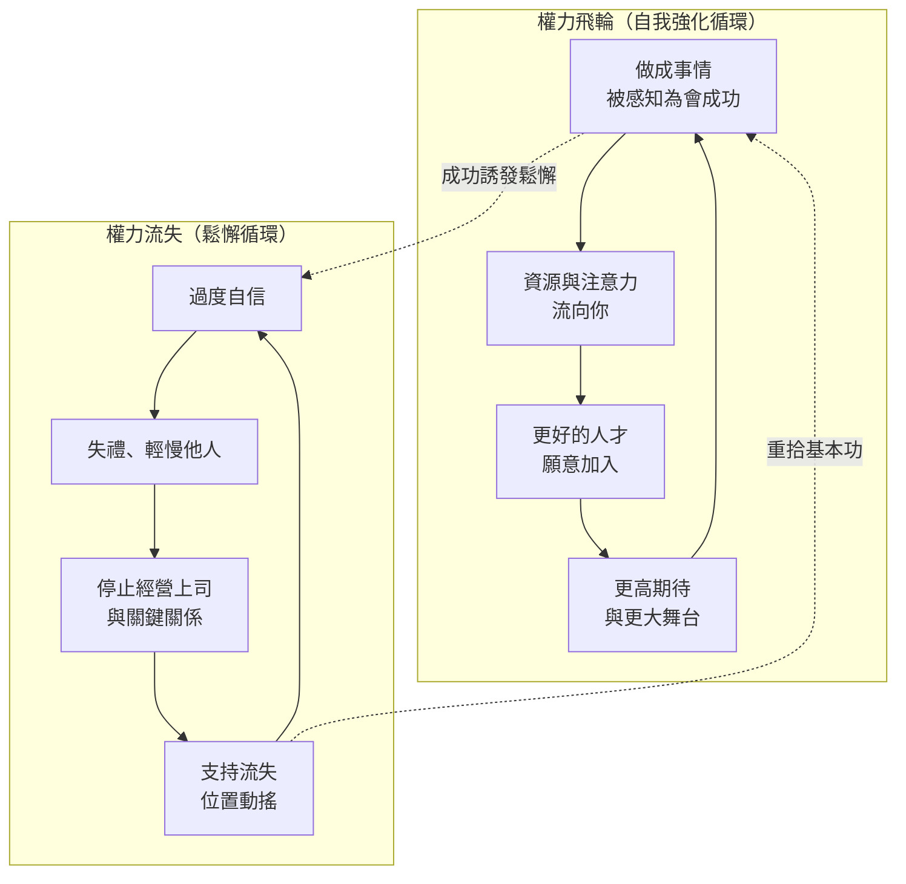

# 第十六章：權力要練習，也要維持

S039 到 S043，加上 S047、S051、S054、S055、S056，都在回答同一個問題：知道權力規則之後，怎麼把它變成行為？Pfeffer 的答案很樸素：像練網球、鋼琴、演講或高爾夫一樣練。閱讀會讓你知道概念，練習、回饋、教練和行動才會改變結果。

這一章不再重列[七條規則](02-rules-of-power.md)，而是把幾個反覆出現的實作原則整理出來：不要把自己讓出去、不要期待公平自動發生、不要把喜歡誤認為權力、不要把一次成功誤認為永久安全。

## 世界不是公平評分系統

Pfeffer 在 S039 用多個案例拆解 just world hypothesis。曾領導 Miami-Dade 學區的教育行政者 Rudy Crew 在學區做出成績，仍被學校董事會推向出局；Jamie Dimon 曾被 Sandy Weill 擠出 Citigroup（兩人當時在 Citigroup 的具體職務：待查）；破產公司的 CEO 也不一定丟掉工作。

結論不是績效不重要，而是績效不保證安全。Performance 有正向係數，但不是保命符。若你相信好成果會自動被看見、被感謝、被獎勵，你會忽略關係、上司、敘事、政治與權力維持。

組織通常不會長期記得你的舊功勞。更常見的問題是：你下一步能替誰解決什麼？你現在是否仍有用？新主管、新合夥人、新董事會是否信任你？

S051 把這個錯覺講得更短：很多人不是沒有能力，而是相信世界會自動把能力換成回報。他們走最擁擠、最被認可的路徑，害怕冒險、害怕失敗，也害怕承認階層與競爭存在。Pfeffer 的建議不是變得犬儒，而是停止把公平當成作業系統。

## 喜歡不是目標，關鍵關係能運作才是目標

多份逐字稿都引用 Gary Loveman（Pfeffer 課堂常引用的企業高階主管，詳細背景：待查）的觀點：critical relationships have to work。你不需要喜歡每個關鍵人物，也不能要求每個關鍵人物都符合你的價值偏好。若某人位在你的 critical path 上，你要讓關係能運作。

這不是放棄價值，而是停止把情緒評判放在策略之前。你可以不欣賞一個人，但仍要理解他要什麼、怕什麼、如何做決策、誰能影響他，以及你如何讓合作對他有利。

若你把「我不喜歡他」當成不經營關係的理由，你其實是在把自己的選項交給對方。

## 被怕還是被愛：過度想被喜歡是權力障礙

S054 的標題刻意用了「被怕優於被愛」這種刺耳的說法。Pfeffer 並不是要人故意殘酷，而是要打斷一個從小被訓練出來的迴路：學校、宗教和文化把人教成順從與合群，但權力需要的是差異化、提出要求和承受衝突的能力。若你把「所有人都喜歡我」設成目標，你會不敢要求、不敢差異化、不敢進入衝突，也不敢讓別人知道你要什麼。

支撐這個提醒的是一個樸素的觀察：多數人其實沒有你想像中那麼關注你。他們更關注自己的問題、風險和利益。你花大量精力管理別人對你的喜歡程度，但對方多半根本沒有在替你計分。

S054 也指出 just world belief 的另一種傷害：它讓人拒絕向政治上成功的人學習。Pfeffer 在這份訪談中用 Trump 作為權力規則的案例：不自我設限、直接從頂層開始要資源、善用媒體、讓自己持續出現在新聞中。這種分析常讓聽眾不舒服，但 Pfeffer 的立場一貫：理解機制不等於讚成行為；拒絕分析一個有效的機制，只會讓機制留給你不認同的人使用。

同一份訪談還提出兩個實作建議。第一，confidence 比 authenticity 更能動員資源；如果你要在社群媒體上建立品牌，應該圍繞明確的想法和主題，而不是圍繞情緒表達。第二，職涯可以像 prototype 一樣經營：早一點失敗、用低成本失敗，把每次實驗的結果拿來修正方向。這比「每一步都要被所有人喜歡」的策略可靠得多。

## 不要預先道歉

S041 和 S042 對 preemptory apology 的批判非常實用。很多人在發言前先說：「不好意思打斷」、「我不確定這有沒有用」、「我可能說錯」。這種語言等於先替自己的觀點降價。這是[第八章](08-get-out-of-your-own-way.md)「不要擋自己的路」在日常語言中最常見的破口。

Pfeffer 的建議很直接：讓聽眾判斷你的話是否有價值，不要先幫他們做負面判斷。

這不代表粗魯。S042 裡主持人提出一個好替代：當你遲到或造成不便時，可以感謝對方的耐心與包容，而不是把整個互動開成道歉模式。感謝讓對方感覺被尊重，也讓你不必把自己放進低位。

S042 還有一個相關提醒：不要讀著評論演出。行動時若過度關心外界的即時評價，你會失能——就像演員一邊演出一邊讀劇評。先把該做的事做完，再回頭吸收回饋。

## 要被記住，才可能被選中

S039、S040、S041、S042 都回到同一點：沒有人會提拔一個他想不起來的人。這一點與[第十一章](11-readable-signals.md)談的可讀訊號直接相連：品牌不是自戀，而是讓他人有方法理解你。

幾個案例各自說明一條路徑。以關係經營方法著稱的 Keith Ferrazzi（詳細身分：待查）說明被記住比被每個人喜歡更重要。創投領域的 Laura Chau 用 podcast 和外貌記憶點建立品牌，讓 deal flow 主動找上她——品牌在這裡不是虛榮指標，而是案源機制。Marcelo Miranda（藉早期媒體策略取得 CEO 機會，背景：待查）說明媒體策略可以在職涯早期就創造高階機會。創業者 Benjamin Fernandes 說明品牌與 networking 如何支撐 fundraising。Deborah Liu（Pfeffer 舉為兼顧價值與權力的領導例子，職務背景：待查）的案例則說明同樣的成果，會因敘事不同而得到完全不同的信用。

S042 還補了一個心理機制：surprise。一位喜劇俱樂部老闆躺在沙發上的例子說明，非預期的行為會讓人注意你、記住你，甚至把你感知為更有權力。Pfeffer 自己也用需求訊號管理課程價值：當課程有 waiting list，課程的感知價值就上升。同樣的邏輯適用於你的工作——被排隊等待的東西，看起來更值得排隊。

品牌可以透過媒體、podcast、文章、演講、外貌記憶點、LinkedIn、課堂互動、活動主持、榜單、研究、recruiting、speaker series 建立。重點不是到處喊自己很棒，而是讓一組能力和問題穩定地與你連在一起。

若你做的是有價值的工作，你甚至有責任讓人知道。否則，不只你沒有得到信用，幫你做事的團隊也不會得到信用。

## 選一個稀缺技能，成為那件事的 fixer

S056 的開場提供了一份具體的 career blueprint。節目主持人 Jason Calacanis 的主張是：在組織裡選一個具體、稀缺、別人不想做但很有價值的技能；迅速學會它；把最佳實務整理成可以傳授的形式；訓練別人；最後成為那件事的 fixer——組織遇到那類問題時第一個想到的人。

這個方法把品牌從形容詞變成名詞。「我很積極、很可靠」是形容詞，人人都能說；「這類問題找他」是名詞，只有少數人擔得起。注意 blueprint 的最後一步不是守住知識，而是訓練別人：教學本身就是品牌動作，也是網絡動作——每個被你訓練過的人，都成為你能力的見證者和轉介者。

Pfeffer 在同一集訪談中的回應與這份 blueprint 互相支撐。品牌需要長期一致；所謂一夕成名，其實是長年累積後才被看見的那一刻。多數人低估社交關係，把幾乎全部力氣投資在技術或產品本身，結果是能力很強卻沒有人知道該把什麼問題交給他。而權力要被使用：不使用的權力不會帶來資源與結果，就像不出手的 fixer 不會累積案例。

把這一節和上一節放在一起讀：被記住是結果，稀缺技能是內容。沒有內容的品牌是噪音，沒有品牌的內容是浪費。

## 要列名單，不要只說想 networking

Networking 很容易變成空話。Pfeffer 和 Keith Ferrazzi 的做法比較具體：列出 10 到 20 個人，這些人如果認識你，可能教你東西、給你社會支持、提供機會、連結新圈子或改變你的職涯。

然後問三個問題：你為什麼需要認識他？你如何接近他？你什麼時候行動？

弱連結特別重要，因為親近朋友通常知道你已經知道的事，認識你已經認識的人。新的資訊、工作、資源與機會，常常來自不同圈層。這是[第六章](06-visibility-to-resources.md)從能見度走向資源的具體操作。

S054 對名單方法加了兩個修正。第一，名單不是索取清單：你要思考能為對方提供什麼價值、如何創造互惠。第二，名單會強迫你離開舒適圈：多數人的預設是只和讓自己舒服的人來往，而那正是網絡停止成長的原因。S055 則把 networking 講成 generosity：它不只是往上連結，也包括幫部屬和後進找到機會——慷慨本身會回流成聲譽和支持。

S054 裡 Omid Kordestani 的例子把這件事變得很具體：在 Google 早期，他停止把全部時間放在既有職務，改把自己放到重要關係和重要資訊流旁邊，最後成為公司最關鍵的商業人物之一。這不是抽象的 networking，而是讓自己成為別人想到商業化、合作和資源時的 top of mind。

## Coaching 與 power project：把知識變成行為

S041 的 coach-facing 討論很重要。好的教練不只是同理客戶受到的不公，也要問：你能做什麼？你要停止什麼習慣？你要練哪個技能？你要找誰？你要如何讓關鍵關係可運作？你要如何描述自己的品牌？同理讓客戶被接住，行動要求讓客戶前進；只有前者的 coaching 是安慰，不是改變。

S041 也澄清一個常見誤會：權力教練不是為強者服務的工具。Pfeffer 提到他的 coaching 對象大量來自女性與弱勢群體——正因為這些人面對更高的結構摩擦，把權力技能變成可練習的行為，對他們的邊際價值反而最大。同一份訪談還提醒教練：authenticity 和 vulnerability 在工作權力關係中可能反效果，教練要幫客戶分辨場合，而不是套用[領導力產業](15-workplace-leadership-bs.md)的萬用語言。

有些練習題非常具體。S041 裡一位 Nike 學員的例子：她直接說出自己想要的職位，而不是等 HR 讀心——這正是[第七章](07-ask-for-power.md)「開口要」的課堂版本。Benjamin Fernandes 的例子則展示品牌、networking 和 fundraising 如何在真實創業裡串成一條線，而不是三個分開的待辦事項。

Pfeffer 在課程中使用 executive coaches，目的就是讓學生把規則變成行動。Power project、brand exercise、networking exercise、speaking exercise、relationship planning 都需要有人看見、挑戰、回饋與追蹤。

S047 把這件事稱為 doing power project。你不能只知道七條規則，要拿一個具體情境實驗：建立品牌、擴大網絡、移除敵人、取得資源、改變你在某個場域中的位置。權力知識若沒有任務，就會變成筆記。S047 還補了一句關於學習曲線的話：wisdom 多半來自 setbacks 和 scars——你會從失敗的 power project 學到比成功更多的東西，前提是你真的動手做了一個。

一個有效的 personal board of directors 也可以做類似工作。重點是有人提醒你：你說要見的那十個人，真的去見了嗎？你又在預先道歉嗎？你是否又把工作藏起來，等別人自動發現？

S054 把 coaching 說成職涯複利的一部分。若運動員、音樂家和高階主管都願意為回饋與練習付費，職涯中的權力技能也不該只靠閱讀和意志力。社會支持、練習題、回饋迴路和問責，比單次頓悟可靠。

S055 的軍事訪談讓這個原則更清楚。Pfeffer 在軍事領導語境中把 power 比喻成 potential energy：權力是儲備的位能，influence 是它被使用時的樣子——你要先累積位能，才有東西可以釋放。軍隊也有評鑑、金字塔和競爭；很多好人不願意承認金字塔存在，於是在評鑑、能見度和關係上掉隊。品牌工具在軍中同樣存在，例如經營軍事部落格。Pfeffer 的提醒是：若你選擇不玩權力遊戲，就不能期待權力自動落到好人手上。

## 權力會自我強化，也會讓人鬆懈

Pfeffer 一方面說成功會產生 flywheel：人們想和成功者合作，資源會流向已經看起來會成功的人，confidence 會被誤認為 competence，而這種誤認又可能透過更好人才、更好資源、更高期待變成真實能力。

另一方面，他也警告 power loss。人得到權力後會過度自信、失禮、停止經營上司和關係、以為自己不再需要做那些讓自己上來的事。維持權力很累，疲乏本身會讓人失去位置。

S055 補上維持權力的另一面成本：能見度、持續的努力、他人的嫉妒，以及成為攻擊目標。位置越高，越需要 personal board 和敢說真話的 truth-tellers，因為願意對你說實話的人會隨權力上升而減少。

因此，權力不是拿到後就可以收工。你仍然要管理上司、董事會、合夥人、重要盟友與繼任政治；你也要知道何時自己已經沒有能量，因為沒有能量時，常常是被推出去之前的訊號。權力流失在創辦人身上有一組特別完整的案例，見[第十七章](17-founders-and-power-loss.md)。

## 讀者自查

- 你是否仍在等「好成果自動被看見」？最近一次把工作藏起來等人發現，是什麼時候？
- 你的 critical path 上，有沒有你因為不喜歡而停止經營的關鍵人物？你知道他要什麼、怕什麼嗎？
- 過去一週，你有幾次用預先道歉或自我貶低開場？下次可以用什麼感謝句替代？
- 別人遇到哪一類問題時，會第一個想到你？如果答不出來，你要選哪個稀缺技能開始練成 fixer？
- 你的 10 到 20 人名單寫了嗎？每個人的「為什麼、怎麼接近、何時行動」填了嗎？你能為他們提供什麼價值？
- 誰在替你的權力練習做問責？教練、personal board，還是沒有人？
- 你現在在飛輪的哪一段？有沒有鬆懈循環的早期訊號——失禮、停止經營上司、對維持權力感到疲乏？

## 小結

- 績效重要，但不會自動保護你；公平不是組織的預設機制。
- 關鍵關係要能運作，喜歡與否是次要問題；過度追求被喜歡會削弱要求、差異化和衝突承受力。
- 多數人更關注自己；把精力花在管理別人對你的喜歡，是投資在沒人計分的項目上。
- 不要用預先道歉替自己的觀點降價，也不要讀著評論演出。
- 品牌是讓有價值的工作被理解、記住與選中的方法；選一個稀缺技能成為 fixer，讓品牌從形容詞變成名詞。
- Networking 要列名單、設路徑、提供價值、追蹤行動；慷慨會回流成聲譽。
- Coaching 或 personal board of directors 能把權力知識變成練習；wisdom 來自動手後的 setbacks。
- 權力有 flywheel，也有鬆懈循環；取得權力後仍要維持，並準備支付能見度與嫉妒的成本。

## 相關章節

- [第二章：權力的規則](02-rules-of-power.md)——本章練習的七條規則原型。
- [第八章：不要擋自己的路](08-get-out-of-your-own-way.md)——預先道歉與自我設限的完整討論。
- [第十一章：可讀的訊號](11-readable-signals.md)——品牌與被記住的訊號設計。
- [第十七章：創辦人也會失去權力](17-founders-and-power-loss.md)——權力流失循環的創辦人案例。

## 來源

- S039：`Jeffery Pfeffer： Power： How to Get It, Use It, and Keep It [jk4m-S73Ijc].txt`
- S040：`Jeffrey Pfeffer - How To Gain Power, Break The Rules, & Advance Your Career [qKe54C2C0II].txt`
- S041：`Jeffrey Pfeffer： Coaching the Seven Rules of Power [ENaH2DZdGWA].txt`
- S042：`Jeffrey Pfeffer： The Rules of Getting and Keeping Power [gJwsTL2V5sw].txt`
- S043：`Jeffrey Pfeffer： Why Cultivating Power is the Secret to Success [AozJ4AkgAMw].txt`
- S047：`Path To Power and Influence - With Professor Jeffrey Pfeffer [1rtIQiNugZ8].txt`
- S051：`Power： Why Some People Have It and Others Don't [0eFln_mdXGY].txt`
- S054：`Stanford's Power Expert： Why You Should Be Feared Over Loved (The 7 Rules of Power) -Jeffrey Pfeffer [Rb4fKodARRs].txt`
- S055：`The 7 Rules of Power with Dr. Jeffrey Pfeffer (Video) [diYk7qNM5Uk].txt`
- S056：`The Blueprint E1： Branding yourself, + Jeffrey Pfeffer on the 7 Rules of Power ｜ E1507 [7BHdaE9sDtA].txt`
