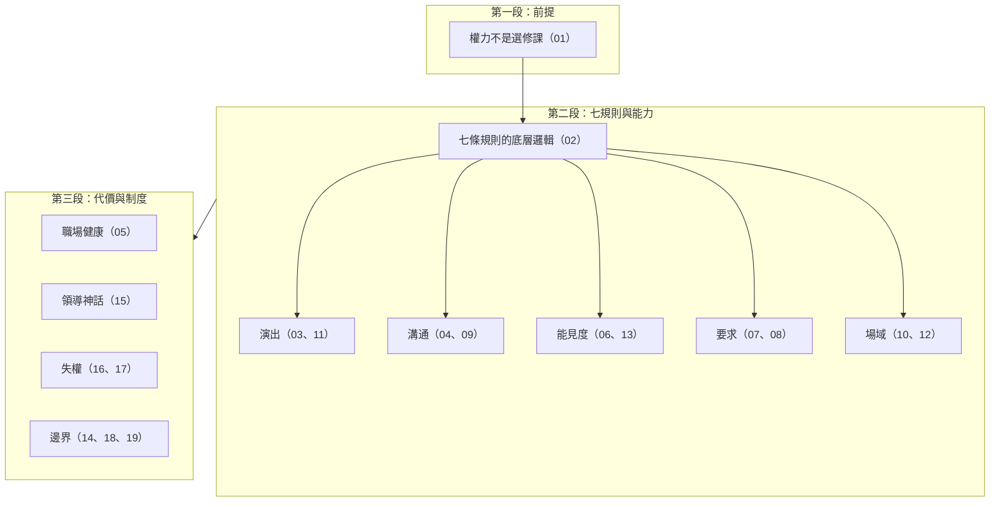

# 導讀：Pfeffer on Power

這本書整理 `data/PfefferOnPower/transcripts/` 內 Jeffrey Pfeffer 相關訪談、演講與 Podcast 逐字稿。目標不是美化權力，也不是把權力說成道德上的好東西；目標是把組織裡實際運作的影響力、能見度、網絡、品牌、規則與代價說清楚。

本書採用 transcript-first 寫法：每一章必須能追溯到完整讀完的逐字稿。外部資料、書籍版本、官方連結與發布日期會在逐字稿初稿完成後補入；在那之前，不用外部資料取代本地材料。

`Pfeffer on Power` Podcast 本身是一個案例庫：Pfeffer 以 Stanford power course 與 `Seven Rules of Power` 為基礎，訪問創業者、CEO、投資人、社群建造者和不同背景的職涯案例，說明人們如何 get out of their own way、建立關係、創造資源、經營品牌並讓事情發生。

## 目前進度

| 章節 | 狀態 | 來源 |
|---|---|---|
| 第一章：權力不是選修課 | 初稿 | S001、S002、S003 |
| 第二章：七條規則的底層邏輯 | 初稿 | S004、S005、S007 |
| 第三章：權力是一種演出能力 | 初稿 | S006 |
| 第四章：溝通是權力的傳輸方式 | 初稿 | S008 |
| 第五章：職場也是公共健康問題 | 初稿 | S009 |
| 第六章：把能見度變成資源 | 初稿 | S010、S011、S012 |
| 第七章：敢開口，才有權力 | 初稿 | S013、S014、S015 |
| 第八章：別擋自己的路 | 初稿 | S016、S017、S018 |
| 第九章：領導者就是訊息 | 初稿 | S019、S020、S021 |
| 第十章：把位置變成槓桿 | 初稿 | S022、S023、S024 |
| 第十一章：權力是一組可讀的訊號 | 初稿 | S025、S026、S027 |
| 第十二章：自己創造場域 | 初稿 | S028、S029、S030 |
| 第十三章：把職涯做成投資組合 | 初稿 | S031、S032、S033 |
| 第十四章：想改變世界，就需要權力 | 初稿 | S034、S037、S038 |
| 第十五章：職場問題不能靠領導神話修好 | 初稿 | S035、S036、S044、S053 |
| 第十六章：權力要練習，也要維持 | 初稿 | S039、S040、S041、S042、S043、S047、S051、S054、S055、S056 |
| 第十七章：創辦人也會失去權力 | 初稿 | S045、S046 |
| 第十八章：把權力帶到公共場域與新創生態 | 初稿 | S050、S052 |
| 第十九章：權力的操作系統、代價與邊界 | 初稿 | S057、S058、S059、S060、S061、S062 |
| 導讀節目來源說明 | 初稿 | S048、S049 |

## 閱讀路線

1. 先理解 Pfeffer 的基本前提：想改變組織或世界，只有價值觀不夠，還需要權力與影響力。
2. 再讀七條權力規則：先把自己從自我限制中移開，再學會破規則、展現力量、建立品牌、經營網絡、使用權力。
3. 最後處理代價與制度：權力可以服務好事，也可能傷害人；組織若不測量真正重要的結果，就會獎勵錯誤行為。

## 材料限制

- 本地目前只有 `.txt` 逐字稿。
- 官方 URL 與發布日期已整理於[附錄 B](appendix-references.md)；書籍頁碼與節目 show notes 尚未逐條回填。
- 同一主題有多份重複訪談，會先保留來源筆記，再整合成章。
- S001-S062 已完成 transcript-first 初稿；下一輪可補外部資料與校訂。
