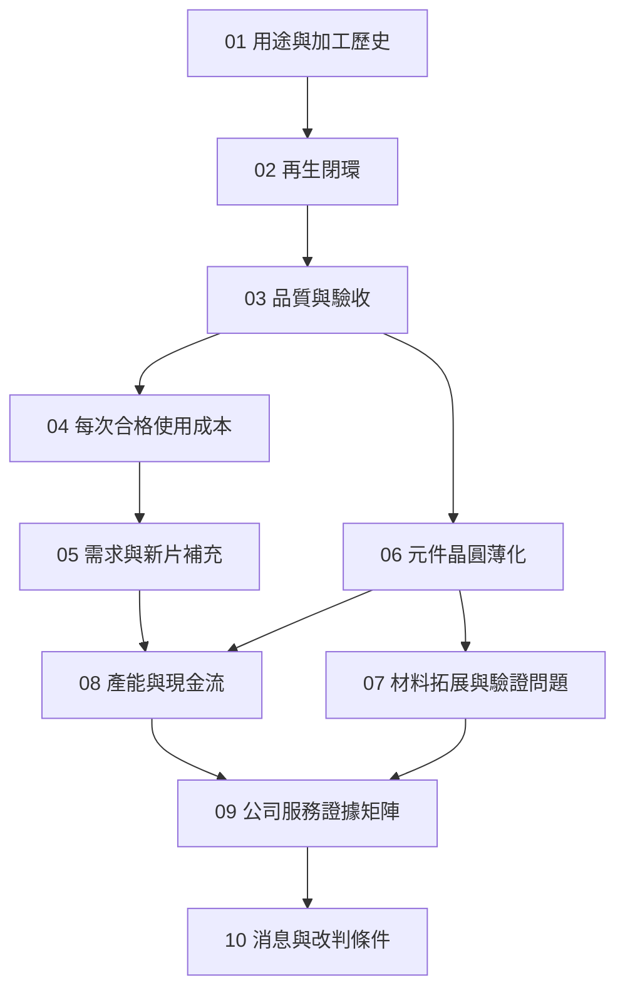

# 全書地圖：把一片工件追到一筆可解釋的收入

全書先沿再生路線建立工件、品質與成本，再轉到薄化及材料，最後回到公司公開證據。中間不要跳過「合格」：加工完成、客戶接受與可計費，可能是不同時間點。

*圖 00-1：實線是閱讀與推理依賴，不表示產線必須按章節順序加工。07 是拓展閱讀，08 的算例不依賴材料業務成功。*

| 章 | 讀完要能交出的東西 | 下一步用在哪裡 |
|---|---|---|
| [01](01-wafer-roles.md) | 一張同時寫用途與歷史的工件卡 | 避免混用 test、reclaim 和 CP |
| [02](02-reclaim-loop.md) | 有拒收、重工與退出的流程 | 決定何時花成本、何時停止 |
| [03](03-quality-and-qualification.md) | 帶方法與條件的允收清單 | 定義合格率與認證範圍 |
| [04](04-reuse-economics.md) | 可重算的成本與合格使用次數 | 比較回用方案 |
| [05](05-demand-and-new-test-wafers.md) | 不重複計算的存量與片次模型 | 把需求和服務量分開 |
| [06](06-thinning-services.md) | 薄化工件的保護與交接邊界 | 區分能力與量產交付 |
| [07](07-advanced-materials.md) | 按功能與驗證階段分欄的材料問題 | 防止把展示當訂單 |
| [08](08-capacity-and-cashflow.md) | 名目產能到現金的轉換鏈 | 閱讀擴產與財務 |
| [09](09-psi-evidence-map.md) | 服務、法人與證據階段矩陣 | 限定公司主張強度 |
| [10](10-reading-news.md) | 事實、推論、未知與改判條件 | 獨立更新未來消息 |

## 和既有書系接在哪裡

均豪書的設備原理能幫你理解如何磨、洗、量；本書把問題移到服務商：收什麼料、用什麼條件交付、重工誰承擔、何時能認列收入。矽格書則補 CP／FT 的電測脈絡，避免把「監控用測試晶圓」當作電測產能。

跨書連結指向同一書庫的建置輸出；本書本身已提供必要概念，未建置其他書也可以依序閱讀。
