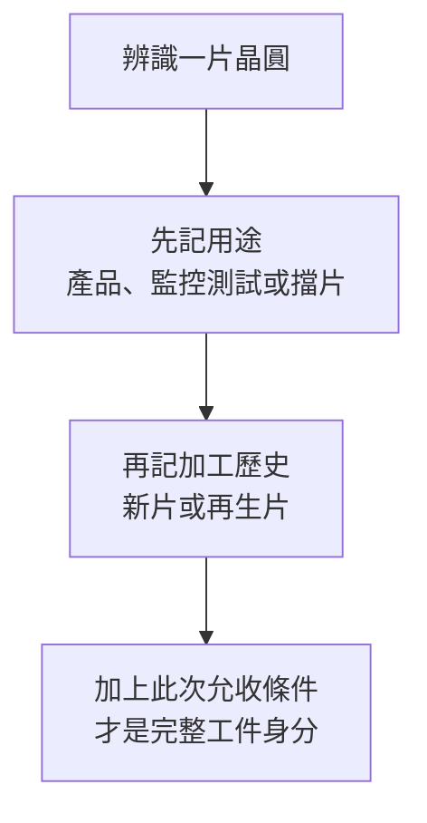

# 01 工廠裡每一片晶圓都拿來做晶片嗎？

## 開場問題：三片外觀相近的圓片

同一座晶圓廠裡，一片晶圓準備做成可出售的元件，一片用來量沉積膜厚，另一片用來占據設備中的特定位置。它們看起來都是圓片，但失敗的後果不同：第一片可能損失產品，第二片可能讓工程師誤判製程，第三片可能改變設備運轉條件。辨識昇陽的業務，應先問「這片工件替客戶做什麼」。

**晶圓是加工載體，晶粒是晶圓上切分出的單元，封裝體則把晶粒與連接、保護等結構組合起來。** 本書的再生主線，關注供製程使用與監控的晶圓；薄化主線則可能接到正面已有元件的晶圓。不是把賣不出去的晶片洗一洗再賣。

{ width="500" }

*照片 01-A：整片圓形工件是晶圓，重複的小區塊是尚未切割分離的晶粒。照片可幫助辨認兩者，卻不能從外觀判定一片晶圓此次是產品片、監控片或再生片；此圖不是昇陽或其客戶產品的證據。* [來源與署名](99-image-credits.md#photo-01)

## 工件分類有兩個軸

| 分類軸 | 用語 | 本書如何使用 |
|---|---|---|
| 用途 | product wafer，產品晶圓 | 目標是形成可用元件；其價值包含已完成製程 |
| 用途 | monitor／test wafer，監控／測試晶圓 | 用來確認設備或製程的某項狀態，例如薄膜厚度或表面缺陷 |
| 用途 | dummy wafer，擋片／陪片 | 依設備與站點擔任填位、負載或其他輔助用途；不能假定完全不量測 |
| 加工歷史 | new，新的晶圓 | 尚未經本書所說的使用後再生；「新」不代表任何用途都適合 |
| 加工歷史 | reclaimed，再生晶圓 | 經回收加工後重新符合某一使用條件；用途仍須另說明 |

monitor、test、dummy 的命名會隨供應商與工廠改變。採購規格、使用站點和允收條件，比單一英文名稱可靠。例如一片再生晶圓可被指定作監控片，也可能只適合要求較寬的用途；不能把「再生」當成與「監控」互斥的品種。可對照 [SEMI 對 monitor／dummy 等術語的定義草案](https://downloads.semi.org/web/wstdsbal.nsf/0/ca03ccbf4225ad42882580c700369d87/$FILE/6091.pdf) 與 [Philtech 的 test wafer 說明](https://www.philtech.co.jp/en/testwafer/)；前者是公開草案，不能代替客戶規格。

*圖 01-1：兩個分類軸的記錄順序，不是加工流程；用途與歷史要一起記錄，不表示所有組合都可行。*

## 用過、失效與待再生是不同狀態

用途之外，還要記錄「目前為何被停下」。下表是本書的處置用語，不是昇陽的收料分級。

| 用途與目前狀態 | 可以得出的判斷 | 還不能做的決定 |
|---|---|---|
| 監控片完成一次使用 | 原任務已完成，可能帶有製程膜層 | 不能只因用過就判為損壞或准予再生 |
| 監控片待再生、履歷未核對 | 正等待可加工性判定 | 不能直接排入既有批次 |
| 再生後未達本次允收 | 此次交付尚未成立 | 不等於已證明不可恢復，也不等於必須重工 |
| 產品晶圓電性失敗 | 元件未達測試條件，須隔離原因 | 不能推導去膜後能恢復原元件功能 |
| 原用途退出、另有候選用途 | 可能進行新的適用性評估 | 不能僅改標籤便當成合格擋片 |

「待再生」是等待處置的狀態；「再生合格」才是針對指定用途完成驗收的結果。工件卡應同時寫用途、履歷、異常與目前放行狀態。[第 11 章](11-disposition-cases.md)會用三個合成案例練習如何補齊這張卡。

## 輸入、操作與輸出：監控片為何有價值

以膜厚監控為教學例：輸入是表面與幾何條件已知的晶圓；操作是讓它經過指定沉積條件；輸出是量測結果，協助判斷設備是否偏離目標。這片晶圓不必出售成晶片，卻可能影響後續產品能否放心投入。

用過之後，它可能帶有薄膜、污染或其他表面變化。若能經加工恢復到下次用途需要的條件，便能進入[再生閉環](02-reclaim-loop.md)。如果去除殘留後已太薄，或污染風險無法接受，便不能僅因外觀完整而回用。公開再生流程可參考 [Pure Wafer 的流程說明](https://purewafer.com/wafer-reclaim/)；該頁不能直接當成昇陽的實際配方。

## 缺陷與失敗：便宜的片也可能造成昂貴誤判

假設監控片原本已有微粒，工程師卻把使用後量到的全部微粒歸因於設備，就可能停機清潔一台其實沒有異常的機器。反過來，若監控方式不適合要看的缺陷，測得「沒問題」也可能漏掉真實風險。兩者都說明：片子的取得成本，不等於它對製程判斷的重要性。

這是一般工程推論，不代表昇陽或任何客戶曾發生這些事件。監控設計要處理基線、抽樣與量測方法，不能只靠供應商在出貨單上寫「乾淨」。

## 量測與控制：先問用途，再訂規格

應記錄使用站點、要監控的物理量、尺寸、表面狀態、厚度與形貌要求，以及使用前後如何量測。不同用途可能接受不同表面條件，但「較寬」不等於可以任意混片。尤其不同來料履歷是否可以共用加工路徑，必須經過風險與製程評估。

## 昇陽連結：測試晶圓不等於晶片電測

昇陽把晶圓再生與全新測試晶圓列在晶圓加工服務；另在薄化服務頁列出相關加工與測試項目。這些名詞處於不同分類層次：**全新測試晶圓是交付工件，CP 是對晶圓上元件進行電性測試的操作**。[公司晶圓加工頁](https://www.psi.com.tw/wafer.asp)、[薄化頁](https://www.psi.com.tw/wafer2.asp?set=a)是辨識公開服務的入口，不是特定客戶訂單證明。

讀過矽格書的讀者，可由<a href="../../sigurd/html/01-test-in-the-flow.html">測試在製造流程中的位置</a>對照 CP 的概念；此連結指向建置後書庫，需該書已建置。

## 推理檢查

1. 供應商只寫「12 吋再生片」，還缺什麼才能判斷能否投入你的製程？
2. 為何量測用晶圓的成本較低，仍可能影響大量產品？
3. 「測試晶圓出貨增加」能否直接解讀成 CP 測試機台使用率上升？

??? note "參考推理"
    第一題至少缺用途、表面／污染及幾何允收條件。第二題的關鍵是它產生的資訊會引導製程決策。第三題不能直接成立，因為一個是監控用工件，另一個是元件電測服務；兩者的需求量與計價基礎不同。

## 來源與待查

公司服務依 [C1、C2](appendix-sources.md#c1)；技術用語與用途對照見[技術來源](appendix-sources.md#technical)。分類圖與失敗案例為教學整理。個別工廠命名、客戶允收規格與來料履歷均未公開到能逐案判定的程度。下一章將把「可以再生」拆成有拒收出口的加工流程。
