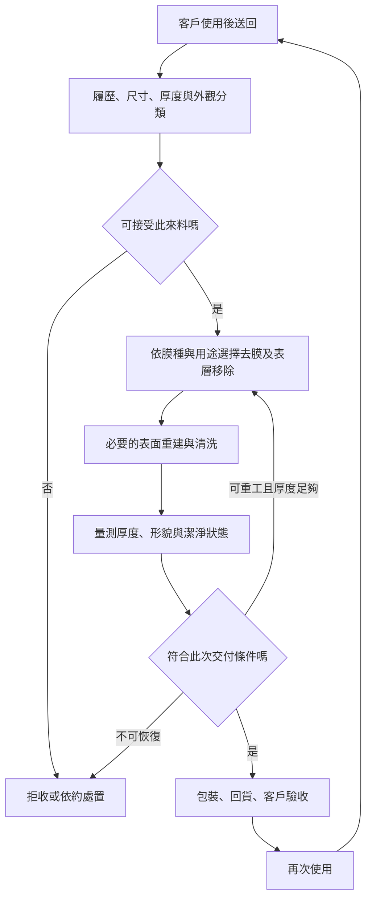

# 02 一片用過的晶圓如何回到可用狀態？

## 開場問題：表面洗亮，就算再生嗎？

一片監控晶圓使用後附著薄膜。清洗或許可以去除某些污染，卻未必能去掉目標薄膜；即使膜去掉了，表面形貌或剩餘厚度也可能不符合下一次用途。**再生交付的是符合約定用途的晶圓，清洗只是可能需要的操作之一。**

## 工件：來料是一段製程歷史

來料資料至少要回答尺寸、材質、膜種、污染風險、過去加工與目前厚度。不能知道每一項時，供應商需要可執行的辨識或拒收規則，不能讓未知履歷自動視為低風險。

同樣叫「氧化膜晶圓」也不代表可以把完整配方搬到另一批；膜厚、下層結構與用途都可能改變加工結果。本章整理功能步驟，不提供化學藥液操作配方，也不主張每一片都要依固定順序跑完所有設備。公開再生流程可參考 [Pure Wafer 的 wafer reclaim 說明](https://purewafer.com/wafer-reclaim/) 與 [SVM 的 polishing and reclaim 說明](https://svmi.com/service/polishing-and-reclaim/)；這些資料只支持常見步驟範圍，不是昇陽的公開配方。

## 輸入、操作與輸出：閉環有不回來的出口

*圖 02-1：一般再生服務功能圖。去膜與表面重建可能消耗厚度；重工不是免費繞回，同樣占設備時間並可能消耗材料。不是昇陽的公開製程配方。*

| 功能步驟 | 輸入與操作 | 應產生的輸出 |
|---|---|---|
| 接收與分流 | 核對來料資料、可加工性與風險 | 可追溯的批次與加工路徑；或拒收結果 |
| 去除不需要的層 | 依材料選擇相容的去除方式 | 殘膜受控、基材沒有超出容許的損失 |
| 恢復表面 | 視需求進行拋光等處理 | 符合用途的表面與幾何狀態 |
| 清洗與乾燥 | 移除加工殘留，避免再污染 | 可進入後續量測及包裝的表面 |
| 判定與交付 | 依約定方法量測、記錄及包裝 | 可追溯的合格回貨，而不是只有片數 |

{ width="640" }

*照片 02-B：Danchip 潔淨室的濕式蝕刻工作台，讓「去除膜層」對應到實際設備環境。它不是完整再生產線；不同膜種與來料仍須選擇相容程序，不能照照片推定配方或昇陽設備。* [來源與署名](99-image-credits.md#photo-02-bench)

設備原廠對去膜、清洗與殘留移除的功能說明，可參考 [Lam Research 的 Strip/Clean](https://www.lamresearch.com/products/our-processes/strip-clean/?highlight=electro+etch+machine) 與 [Entegris 的 Wet Etch & Clean](https://www.entegris.com/en/home/our-science/by-industry/microelectronics/semiconductor/wet-etch-clean.html)；此處只用來支持功能類型，不代表特定服務商的配方。

## 缺陷與失敗：去得掉，不等於值得去

去除薄膜可能牽涉對基材的選擇性。若為了去乾淨而失去太多厚度，這片雖通過本輪，卻可能沒有足夠的下一輪餘裕。若去除不足，殘膜又可能影響下一次使用。表面處理則要兼顧形貌、粗糙度與加工造成的缺陷，不能用單一「移除量」代表全部品質。

再污染是另一條失敗路線：加工完成後的搬運、量測接觸或包裝若不合適，前段成果可能無法維持。因此服務邊界要追到交付與驗收，不能只看清洗槽出口。

{ width="420" }

*照片 02-A：前開式運輸盒（FOSB）將晶圓分隔在槽位中。交付還要考慮包裝與搬運能否維持加工後狀態；照片本身不能證明盒內潔淨度，也不代表昇陽使用的載具。* [來源與署名](99-image-credits.md#photo-02)

## 量測與控制：每一輪都會改變可用餘裕

用一個教學帳本記錄厚度：第 r 輪開始的厚度，減去本輪加工與必要重工消耗，才是回貨厚度。若低於該用途的最低厚度，便不能再放回同一循環。厚度仍足夠時，污染、破片、用途切換等條件也可能提前終止回用。

因此「初始厚度減最低厚度，再除每輪移除量」只是在固定移除假設下的幾何上限。它不是保證次數，更不是各家服務商共同適用的規格。下一章將補上厚度之外的合格判準，[第 04 章](04-reuse-economics.md)再把提前終止放進成本。

## 昇陽連結：所有權與收入不能靠流程圖猜

[昇陽晶圓加工頁](https://www.psi.com.tw/wafer.asp)可支持公司公開提供再生加工。但客戶自有晶圓送回加工，與服務商取得材料後出售合格再生片，是不同商業安排。本書流程圖不指定所有權移轉點；未取得逐合約資訊時，也不把「每片加工收入」與「出售材料收入」合併當成一種價格。

同理，客戶可能在自己的製程裡重新確認回貨片。供應商出貨合格率與客戶實際接受率的分母、抽驗方法及時間不一定相同；看到「良率」要先查定義。

## 推理檢查

1. 為什麼去膜能力越強，不必然使可回用次數越多？
2. 供應商出貨前合格，客戶卻拒收，應先對照哪些條件？
3. 回貨片數相同的兩家廠商，若一家重工較多，成本結構可能怎樣不同？

??? note "參考推理"
    去膜同時可能消耗基材；須看選擇性與厚度。拒收要比對量測方法、抽樣、規格與運輸包裝狀態。重工占設備、材料與時間，也可能降低未來回用機會；不能只用出貨片數評估效率。

## 來源與待查

公司服務範圍依 [C1](appendix-sources.md#c1)；一般再生操作依[技術來源](appendix-sources.md#technical)。流程、厚度帳本及所有權情境為教學整理。各膜種配方、拒收條件、客戶自有材料比重與允許重工次數未有足夠公開資料，不能據此重建昇陽的實際產線。
