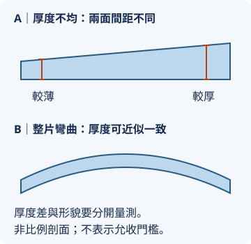

# 03 表面看起來乾淨，為何還可能不能回廠？

## 開場問題：兩份「零缺陷」報告

甲報告寫零顆粒，乙報告也寫零顆粒，但甲只計入較大的散射訊號，乙使用另一個門檻；兩份報告還可能掃描不同面積。它們都可能忠實反映儀器結果，卻不能直接證明兩片晶圓同樣乾淨。**任何允收數字，都必須帶著量測方法、條件與使用目的閱讀。**

{ width="305" }

*照片 03-A：鏡面反射能幫助觀察外觀，但照片無法提供 TTV、金屬殘留或顆粒檢出限；看起來明亮不能代替允收報告。此為 NASA 圖片，並非昇陽產品。* [來源與署名](99-image-credits.md#photo-03)

## 結構：厚度均勻與整片彎曲是不同問題

想像一張厚度均勻卻彎曲的薄片。它可以每個位置都一樣厚，卻不平。相反地，一片看起來放得平的工件，也可能存在厚薄差。前者提醒我們形貌與厚度要分開，後者提醒目視不能代替量測。

{ width="360" }

*圖 03-B：兩面間距與整片形貌是兩種資訊。下圖只表示彎曲概念，沒有畫出 bow／warp 的參考面、支撐及邊緣排除條件，不能據此讀取量測值。* [來源與署名](99-image-credits.md#svg-03)

| 指標 | 要回答的問題 | 不能混成什麼 |
|---|---|---|
| 厚度 | 工件剩多少材料？ | 不等於表面粗糙度 |
| TTV，總厚度變化 | 指定量測範圍內最大與最小厚度差多少？ | 不等於整片彎曲量 |
| bow | 在指定參考面及支撐條件下，中面中心的偏移如何？ | 不能只憑正負值判斷全部翹曲 |
| warp | 中面相對參考面的整體高低差如何？ | 不等於 TTV；方法必須查明 |
| 粗糙度 | 在指定空間尺度下，局部表面起伏多大？ | 不等於整片平坦度 |

bow、warp 的具體定義與計算須依採用標準或設備方法。夾持、自由狀態、邊緣排除區及正反面，都可能改變數字的可比性。本書不將概念簡介當成標準全文。公開定義與量測輸出示例可參考 [KOBELCO LEO 的 bow／warp／GBIR（TTV）說明](https://www.kobelcokaken.co.jp/leo/en/item/sbw/) 與 [KLA wafer metrology](https://www.kla.com/products/wafer-manufacturing/wafer-metrology)；數字仍須按採用方法比較。

## 輸入、操作與輸出：從風險選量測

| 失敗風險 | 可能使用的量測類型 | 報告還需寫什麼 | 漏掉的後果 |
|---|---|---|---|
| 過薄、厚薄不均 | 厚度與幾何量測 | 掃描位置、邊緣排除、支撐條件 | 搬運或下站加工不適配 |
| 顆粒或散射異常 | 表面光學缺陷檢測 | 檢出門檻、校準、表面條件、掃描面積 | 基線不明，誤判設備污染 |
| 金屬殘留 | 適用的表面元素分析，例如 TXRF（[Rigaku 說明](https://rigaku.com/products/semiconductor-metrology/txrf)） | 元素、檢出限、取樣位置與方法 | 光學外觀正常仍有污染風險 |
| 局部粗糙或刮傷 | 適用的表面／形貌分析 | 尺度、解析度、位置及判定方法 | 後續薄膜或量測表現不穩定 |
| 運輸再污染 | 包裝與收貨抽驗 | 開箱條件、時間、批次追溯 | 廠內出貨結果無法代表收貨 |

*圖表 03-1：缺陷→量測→判定→後果矩陣。列的是一般方法選擇，不宣稱昇陽在每批出貨使用全部方法。*

光學檢測得到的訊號可能以標準粒子等效尺寸表示，不能一概當成缺陷真實幾何直徑；也不能從未檢出光學缺陷推導金屬污染為零。量測方法各有能看與不能看的東西。

## 缺陷與失敗：把「未檢出」讀成零

假設某元素分析結果低於檢出限。合理表述是「在此方法與條件下未檢出」，不是「表面完全沒有該元素」。若客戶要求低於方法可辨識範圍的門檻，報告本身便不足以完成判定，需要更適合的方法或經驗證的替代程序。

再例如只把顆粒數相除，得到較低的每片顆粒數，卻忽略晶圓尺寸與掃描排除區，就可能把面積差當成潔淨度差。比較之前要先讓分母一致。

## 量測與控制：合格是一份共同規則

一份能實際交付的允收規則，需要定義工件用途、測什麼、怎麼測、測多少片、門檻、邊界結果如何處理，以及退貨與複驗程序。供應商內部製程控制數字可以比交付規格更細，但兩者的目的不同：前者早期發現漂移，後者判定這批是否符合約定。

客戶認證也通常具有產品、尺寸、流程或站點範圍。某一路線通過，不會讓另一個新廠或新材料自動獲得相同資格。這點會在[產能章](08-capacity-and-cashflow.md)決定設備是否真的可接單。

## 供應商通過、客戶退回：先讓報告可以比較

「一邊通過、一邊不合格」先表示兩次判定不一致，還不能唯一指認加工失誤。以下為排查框架，不是實際客訴紀錄；量測差異的技術背景見上述幾何與表面檢測來源。

| 比對項目 | 具體要對照什麼 | 若不一致，先做什麼 |
|---|---|---|
| 工件與時間 | 同片或同批？加工後、運輸後還是使用後？ | 核對片號與交接紀錄，避免把不同狀態相減 |
| 方法與門檻 | 儀器、校準、配方、檢出限、規格版本 | 依共同約定的方法複驗，不能任選較鬆結果 |
| 掃描與抽樣 | 正反面、位置、排除區、掃描面積與抽樣片數 | 對齊比較範圍；批次判定另按抽樣規則 |
| 幾何量測狀態 | 自由或吸附、支撐與參考面 | 確認是否在比較相同物理量 |
| 包裝與搬運 | 出貨、開箱、載具、保存及使用前操作 | 保留追溯資料，再檢驗再污染假設 |
| 使用目的 | 原約定站點是否改變？是否新增條件？ | 先釐清適用範圍與驗證責任 |

複驗可以確認結果是否可重現，卻不會自己證明異常發生在哪一站。若可能需要失效分析，先保存原狀與量測資料，再決定清洗或拋光，避免移除辨識原因所需的表面證據。完整情境見[第 11 章案例三](11-disposition-cases.md#case-3)。

## 昇陽連結：能力清單不是全客戶通用規格

公司資料列出品質管理或檢測能力時，可用來認識其公開能力範圍；不能補出每位客戶的允收門檻、所有出貨的測量結果或退貨率。法說中的品質介紹與獎項，仍須按原文對象解讀，不能擴張為全部產品線零失敗。[昇陽法說入口](https://www.psi.com.tw/share_news2.asp)

讀者若想補共通檢測概念，可回看均豪書<a href="../../gpm/html/11-defect-aoi-metrology.html">缺陷、AOI 與量測</a>；本章進一步關心的是量測報告能否支持回貨驗收。

## 推理檢查

1. TTV 很小，但 warp 很大，是否矛盾？
2. 報告顆粒數較少，為何可能只是量測門檻不同？
3. 既有工廠已通過客戶驗證，新廠相同設備是否就能立刻計費？

??? note "參考推理"
    不矛盾，厚度差與整片形貌是不同量。顆粒數須比門檻、掃描範圍及方法，才有可比性。新廠還須確認客戶認證涵蓋範圍及實際放行，設備相同不能代替這段證據。

## 來源與待查

一般量測定義與方法依[技術來源](appendix-sources.md#technical)，公司品質陳述依 [I1](appendix-sources.md#i1)。例子為教學假設，不使用未取得全文的付費標準來宣稱符合認證。客戶允收數字、量測條件、抽樣方案與實際退貨率列入[待查附錄](appendix-open-questions.md)。
