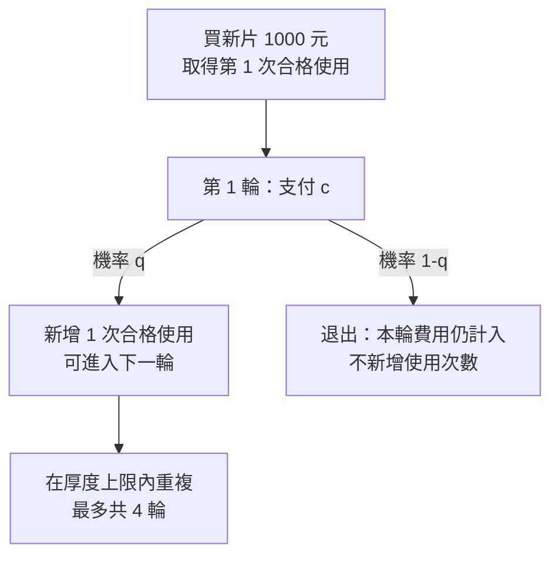

# 04 再生幾次才划算，何時應該換新？

## 開場問題：每輪便宜，整段生命週期也便宜嗎？

有兩個加工方案：A 每輪 95 元，B 每輪 175 元。只看報價應該選 A，但如果 A 較常回貨不合格，它會更早失去後續使用機會。本章用有限輪次模型，將最後一次失敗已花掉的費用也算進去。

**以下所有金額、厚度與機率都是教學假設，不是昇陽的價格、客戶規格或實際良率。** 比較目標是大量同條件晶圓的「總成本／合格使用次數」，不是替任何產品提出實際採購建議。

## 工件與邊界：先有可用條件，才談次數

一開始購入一片已通過驗收的新片，花 1,000 元，確定提供第一次合格使用。假設它還有 100 μm 可耗用厚度，每次再生固定移除 24 μm；即使原先計畫最多做八輪，厚度也只允許四輪。

```text
可再生輪數 R = min(計畫上限, 向下取整(可耗用厚度 / 每輪移除量))
本例 R = min(8, floor(100 / 24)) = 4
```

這裡的 100 μm 是「距離最低允許厚度的預算」，不是初始晶圓總厚度。四輪再生最多帶來四次追加使用，加上首片原有的一次，共五次。不要把四輪加工當成四次總使用，也不要把厚度上限當成必定可成功四輪。[第 02 章](02-reclaim-loop.md)的污染、破片與用途限制仍可能讓循環提前終止。

| 完成加工輪數 | 累積移除量（μm） | 剩餘厚度預算（μm） | 若一路成功的合格使用次數 |
|---|---:|---:|---:|
| 0 | 0 | 100 | 1 |
| 1 | 24 | 76 | 2 |
| 2 | 48 | 52 | 3 |
| 3 | 72 | 28 | 4 |
| 4 | 96 | 4 | 5 |

*圖表 04-1：厚度預算逐輪消耗。第五輪需要再移除 24 μm，超過餘額，因此即使看起來很乾淨也不進入第五輪。*

<span id="photo-04"></span>

{ width="480" }

*照片 04-A：化學機械拋光機台的拋光墊整修器。表中每輪 24 μm 是教學假設，而移除量來自這類實際研磨／拋光加工；耗材與機台時間在送出當輪就已支付，與該輪是否合格無關。照片不是昇陽設備，也不能據此推定去除率。* [來源與署名](99-image-credits.md#photo-04)

## 輸入、操作與輸出：費用在嘗試時發生

用 q 表示每次送再生後，回貨能提供下一次合格使用的條件機率。假設每輪 q 相同；失敗就退出，不再重工或降級使用。只要送出本輪，就支付加工、運輸和驗收費，即使最後失敗也不退回。



*圖 04-2：成本與合格使用在不同時刻產生。失敗路徑不能從分子消失。*

| 參數 | A：便宜、較低回貨率 | B：較貴、較高回貨率 |
|---|---:|---:|
| 新片取得成本 C0（元） | 1,000 | 1,000 |
| 加工費（元／輪） | 55 | 95 |
| 運輸費（元／輪） | 25 | 40 |
| 驗收費（元／輪） | 15 | 40 |
| 每次嘗試總費 c（元／輪） | **95** | **175** |
| 回貨合格機率 q | **0.72** | **0.92** |
| 再生輪數上限 R | 4 | 4 |

第 1 輪一定嘗試；第 2 輪只有第一輪成功才發生，到達機率是 q；第 3 輪是 q²。相對地，第 1 輪新增一次合格使用的機率是 q，第 2 輪是 q²。費用與新增使用的權重因此相差一個 q。

```text
E[總成本] = C0 + c × (1 + q + q² + q³)
E[合格使用次數] = 1 + q + q² + q³ + q⁴
K = E[總成本] / E[合格使用次數]
```

K 是大量同條件初始晶圓的平均每次合格使用成本，使用的是「期望值的比」。不要改成各條路徑成本除以各自使用次數後再平均；那是在回答另一個問題。

## 缺陷與失敗：把提前報廢逐條對帳

以下完整列出 A 的五個終端結果。P 表示回貨合格，F 表示失敗；首購已提供的一次使用始終包含在內。

| 結果 | 機率 | 總成本（元） | 合格使用次數 |
|---|---:|---:|---:|
| F | 0.28000000 | 1,095 | 1 |
| PF | 0.20160000 | 1,190 | 2 |
| PPF | 0.14515200 | 1,285 | 3 |
| PPPF | 0.10450944 | 1,380 | 4 |
| PPPP | 0.26873856 | 1,380 | 5 |

機率合計為 1。把各列「機率 × 總成本」加總，得到 1,248.10656 元；「機率 × 合格使用次數」加總是 2.88038656 次。第四輪失敗與成功的成本相同，使用次數卻不同，正是只看成功案例會漏掉的部分。

| 結果 | A | B |
|---|---:|---:|
| 期望總成本（元／初始片） | 1,248.11 | 1,620.39 |
| 期望合格使用（次／初始片） | 2.88039 | 4.26148 |
| 每次合格使用成本 K（元／次） | **433.31** | **380.24** |

在本例，B 花得更多，卻保住更多合格使用，因而每次成本較低。與每次購買同價新片、各提供一次合格使用的 1,000 元基準相比，兩方案都較低；這僅成立於本例功能相同、無其他損失且價格固定的邊界。

## 量測與控制：多少品質溢價會讓排序翻轉？

固定 A，固定 B 的 q=0.92 和四輪上限，只提高 B 的加工費。運輸加驗收仍為 80 元／輪。

| B 每輪總費（元） | B 的 K（元／次） | A 的 K（元／次） | 較低者 |
|---:|---:|---:|---|
| 175 | 380.24 | 433.31 | B |
| 230 | 426.00 | 433.31 | B |
| 240 | 434.31 | 433.31 | A |
| 250 | 442.63 | 433.31 | A |

臨界總輪費約為 **238.80 元**。高良率有價值，但不是任何價格都划算。若價格與良率同時改變，需把兩者一起重算，不能沿用本表的翻轉點。

若 q 隨輪次變動，第 i 輪到達機率改成先前各輪條件機率的乘積；若失敗會造成停機、重驗或其他損失，分子要加入對應機率加權成本。這些擴充需要真實資料，本例沒有假裝已建模。

## 處置資格在成本比較之前

[第 11 章](11-disposition-cases.md)先排除沒有可接受加工路徑的工件，本章才比較符合相同用途的方案。即使追加拋光的報價很低，若剩餘厚度、污染相容性或客戶放行不成立，也不能靠低成本把該路徑變成可用選項。

本例已納入每輪失敗造成的提前退出，**沒有納入失敗後再次重工的決策**。因此不能用現有的 q、c 與固定 24 μm 移除量，直接回答「這次失敗還要不要再修」。若要擴充，至少需另外取得各失效類型的重工成功條件、額外費用、材料消耗、複驗與等待成本；它們可能隨履歷改變，不能只把 q 調高而漏算投入。

原用途退出後改作其他用途，也會改變合格使用的功能單位。除非先建立可比較的用途與計價邊界，不把兩種用途的使用次數直接相加。本輪保留原算例，讓它繼續回答「同用途、失敗即退出」的有限生命週期成本問題。

## 昇陽連結：這個算例告訴你該查什麼

公司提供再生服務，並不足以讓讀者知道 q、c 或各用途的可回用輪數。應查客戶規格、收貨接受率、每輪費用、重工處理與物流週期。供應商宣稱的最大回用次數，也不能直接帶入所有客戶。本例的物理邊界參照[再生服務的一般流程](https://svmi.com/service/polishing-and-reclaim/)，數字完全由作者設定。

環境效益另外計算。成本變低可能來自報價策略，不能直接推導用水或碳排降低；比較環境衝擊要使用相同功能單位，納入材料、加工、運輸與報廢邊界。

## 推理檢查

1. q=0 且允許至少一輪，總成本是否仍只有 1,000 元？
2. q=1、四輪都成功，使用次數為什麼是 5？
3. 把 B 的總輪費改成 240 元，是否仍應因高良率選 B？
4. 為何 1,000 片初始晶圓的終身加工片次，不能當成月出貨？

??? note "參考推理"
    q=0 時仍嘗試第一輪並付費，因此成本為 1,000+c，只得到首片一次使用。q=1 時首購一次加四輪追加使用為五次。240 元時 B 的每次成本約 434.31 元，已高於 A。終身事件沒有指定發生月份，還缺週轉時間與投入節奏。

## 來源、重算與待查

完整 Python 模型保存在儲存庫 `plan/psi/reuse_model.py`，執行 `uv run python plan/psi/reuse_model.py` 可重現事件樹、排序與邊界測試。公式與遞迴事件樹已獨立核對，並驗證 q=0、q=1、零可再生輪數。程式不需要額外套件。

可在程式中改兩方案參數，或直接使用以下核心計算重算：

```python
def cost_per_use(new_cost, fee, q, rounds):
    attempts = sum(q ** i for i in range(rounds))
    uses = 1 + sum(q ** i for i in range(1, rounds + 1))
    return (new_cost + fee * attempts) / uses

print(cost_per_use(1000, 95, 0.72, 4))   # 433.312173...
print(cost_per_use(1000, 175, 0.92, 4))  # 380.241145...
```

本模型沒有納入資金時間價值、回貨等待、殘值、失敗賠償或新片自身不合格情況。這些不是零，只是在此次教學邊界之外。下一章會把「一片的一生」換成「一座工廠每月的流量」。
