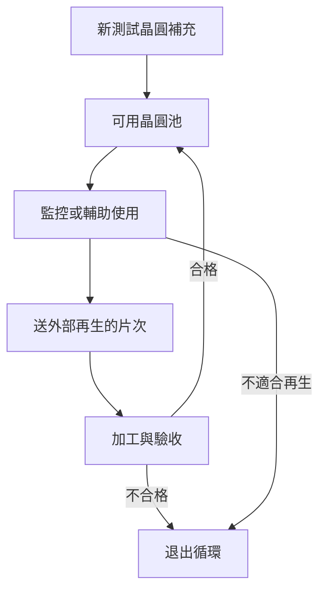
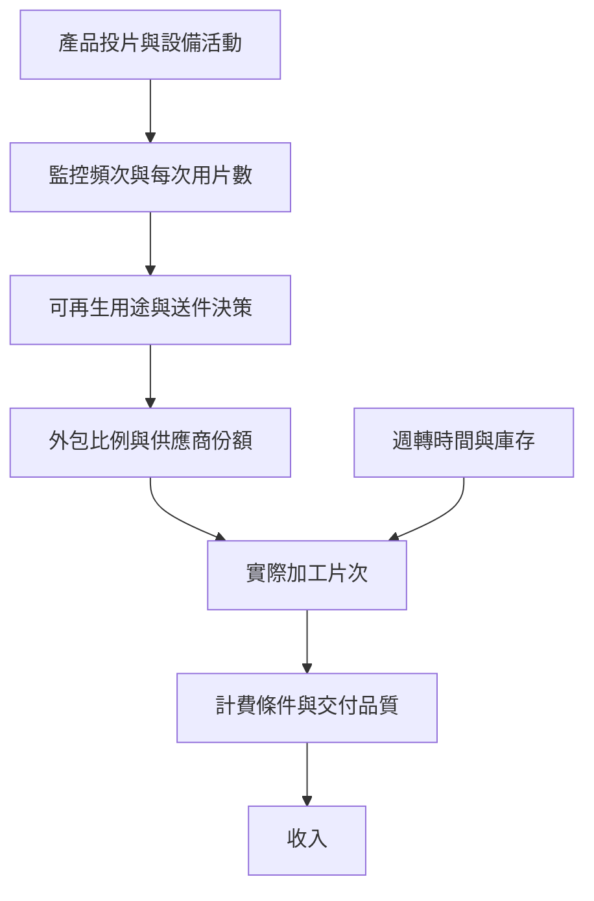

# 05 先進製程需求如何變成再生服務量？

## 開場問題：產品多投一片，再生就多一片嗎？

新聞說先進製程需求增加，另一則說再生晶圓需求成長。兩者可能存在因果路徑，但不是一比一換算。產品投片之後，還要經過監控策略、可回用性、外包決策與服務價格，才可能形成昇陽的收入。

## 工件與流量：新片補充，回用延長服役

把工廠想成維持一批可用監控晶圓的系統。晶圓使用後，有些送再生並回來，有些因污染、厚度或破片退出，也有些在庫存、運輸或待驗收。全新測試晶圓可補充退出量、支援新增需求，或服務不能使用再生片的特定用途。測試晶圓的用途可對照 [Philtech 的 test wafer 說明](https://www.philtech.co.jp/en/testwafer/) 與 [Pure Wafer 的術語表](https://purewafer.com/glossary/)；這些資料支持工件用途分類，不能用來估算昇陽需求量。



*圖 05-1：存量與流量示意。池裡有幾片是存量，本月送加工幾次是流量；同一片可以在不同月份反覆貢獻加工片次。圖中省略在途與等待庫存，實際盤點需另記。*

<span id="photo-05"></span>

{ width="360" }

*照片 05-A：單晶矽晶棒。圖中「新測試晶圓補充」這條線最終要回到長晶與切片，與再生回流是兩個不同來源；新片與再生片可以同時增加，不必互相替代。此為博物館展示品，不代表昇陽的材料來源或供應商。* [來源與署名](99-image-credits.md#photo-05)

所以新片與再生不是單純的替代關係：更長回用壽命可能降低穩定需求下的新片補充量，但產線擴張或用途改變也可能讓兩者同時增加。判斷方向要把條件說出來。

## 輸入、操作與輸出：需求模型先定分母

以下是教學模型，不是昇陽營收預測。定義一個月有 P 片產品投片，平均每片產品投片對應 m 次監控使用事件，監控使用後適合送再生的比例為 a，該月外包比例為 o。若先忽略時差，且每次合適使用事件只對應一次加工送件，可寫：

```text
外包加工片次 S = P × m × a × o
服務收入 R = 各類別「可計費數量 × 該類別價格」加總
```

m 必須是已定義的「監控使用事件／產品投片」，不能把公司簡報中未清楚定義的「再生使用量」指數直接代入。新節點可能增加監控需求，但具體增加多少，需要製程與監控方法資料。若監控依機台時間、批次或維修事件觸發，P × m 只是彙總近似，不能當成逐片機制。



*圖 05-2：從終端需求走到服務收入的中介條件。每一個框都可能使直線外推失效。*

## 缺陷與失敗：把次數再乘一次

假設某批 100 片晶圓各完成三次加工，已統計為 300 加工片次，就不能再乘「回用三次」變成 900。反之，若手上的 100 是月末可用庫存，也不能直接當成月送件量；週轉時間不同，相同庫存可以支援不同流量。

在上述 P × m 模型中，監控使用事件已是流量。回用壽命主要影響新片補充與退出，不應無條件再乘進 S。若換用從新片投入追蹤終身送件的世代模型，才會在另一個位置計入回用次數；兩種模型可以對帳，不能混搭。

## 量測與控制：把服務組合拆開

至少分開尺寸、用途、新片銷售與再生服務。收入增加可能來自量、價或組合；出貨片數若混合不同尺寸，也未必能說明相同設備負荷。實體片數、處理片次、面積等效與金額是四種不同單位。

若只知道總收入，就不能唯一解出某類加工的價格或數量。可以提出多個一致情境，但應標成作者分析，而非公司實績。

## 昇陽連結：服務同時存在，不代表占比已知

[公司晶圓加工頁](https://www.psi.com.tw/wafer.asp)同時介紹再生與全新測試晶圓，支持「兩種交付都在公開服務範圍」這一層。法說的需求趨勢與市場圖須按其日期及引用機構閱讀；未取得原始統計方法時，不把趨勢圖當成可以直接乘出公司收入的係數。

公司受益還取決於供應商份額、客戶認證和可交付產能。下一步看[第 08 章](08-capacity-and-cashflow.md)，先想理解另一條服務路線則讀[薄化章](06-thinning-services.md)。

## 推理檢查

1. 回用次數上升，新測試晶圓需求一定下降嗎？
2. 監控使用量已是片次，為何不再乘回用次數？
3. 產品投片上升而外包再生量下降，提出兩個可能解釋。

??? note "參考推理"
    新增產線、庫存或用途需求可能抵銷壽命延長的影響。片次已計入重複使用，重乘會雙重計算。外包比例下降、可再生用途占比下降、週轉時差或監控策略調整，都可能使外包量下降；須查資料分辨。

## 來源與待查

公司服務依 [C1](appendix-sources.md#c1)，需求陳述依 [I1](appendix-sources.md#i1)。兩張圖與流量公式為作者教學模型。監控頻次、外包比例、供應商份額、各類價格與未定義指數均不使用臆測值。
