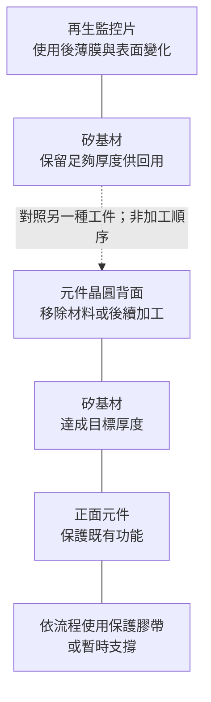
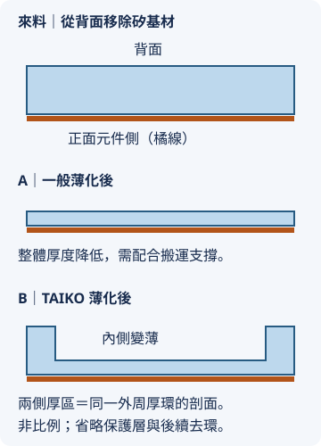
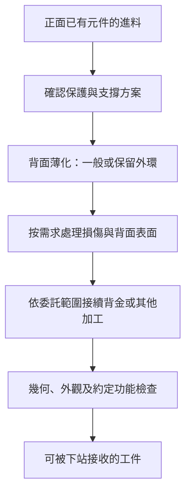

# 06 再生與薄化都移除材料，客戶買的結果有何不同？

## 開場問題：同樣磨掉矽，責任卻不同

一片監控晶圓送來，是要恢復下一次使用條件；另一片正面已有元件的晶圓送來，是要改變基材厚度，同時保存前面累積的產品價值。前者關心能否繼續監控製程，後者還關心元件是否受損、後續搬運接合能否完成。兩者不能只用「磨一片」比較價格或難度。

## 工件結構：加工面與保護面

*圖 06-1：工件各層的責任示意，非比例剖面；虛線分開兩種工件的比較，不是把再生片變成元件片；不表示所有再生只加工單面，也不表示所有薄化都使用同一支撐材料。*

薄化可能為了封裝高度、後段製程或特定元件性能。對某些垂直導電功率元件，減少基材厚度可以減少相關的電阻貢獻，但效果取決於結構、材料與電流路徑。不能推成所有元件越薄越好，更不能只憑終厚度判斷完整電性。

## 輸入、操作與輸出：一般背磨與 TAIKO

一般背磨在保護正面與固定工件後，從背面移除材料；後續是否細磨、拋光或蝕刻，以及如何處理損傷，取決於目標品質與流程。粗磨的效率與薄片的強度之間有取捨，不能只驗厚度就宣告完成。DISCO 的[超薄晶圓研磨說明](https://www.disco.co.jp/eg/solution/library/grinder/thin.html)也把薄化後的搬運、崩裂與後續表面處理列為流程考量；這只支持一般風險說明，不代表所有產品使用相同配方。

TAIKO 是 DISCO 的加工方法，保留外周較厚的環、薄化內側區域，藉外環支撐改善薄晶圓處理。它改變的是工件幾何與支撐方式，並非材料從此不會翹曲或破裂。後段如何處理外環，以及如何銜接金屬化、切割等站點，仍須依完整流程確認。[DISCO TAIKO 官方流程說明](https://www.disco.co.jp/eg/solution/library/grinder/taiko_process.html)

{ width="360" }

*圖 06-C：A、B 是兩種加工結果的比較，並非先做 A 再做 B。TAIKO 兩端較厚的部分是同一外環在剖面上的交點；外環寬度與厚度未按比例，保護／暫時支撐和後續去環步驟亦省略。TAIKO 為 DISCO 註冊商標。* [來源與署名](99-image-credits.md#svg-06)

*圖 06-2：薄化服務的接口圖。箭頭表示需確認的交接，不是所有產品共同使用的固定配方；電測是否在委託內須另看合約。*

## 缺陷與失敗：合格厚度下的潛在損傷

材料去除可能留下磨痕與次表面損傷；薄片也更容易受搬運與應力影響。正面保護若有殘留、黏著問題或解離損傷，背面厚度合格仍不能保證可交付。局部裂紋也可能在後續站點才擴展。

因此薄化的責任不只在研磨機上。來料外觀與電性基線、保護材料相容性、搬運方式、去保護與交付包裝，都會影響是否能區分原有缺陷與加工新增問題。

## 量測與控制：功能性驗收比尺寸多一層

| 邊界 | 要核對的內容 |
|---|---|
| 來料 | 材質、正面結構、厚度、既有缺陷與允許的加工條件 |
| 加工後 | 終厚度、TTV、形貌、表面與邊緣缺陷；量測條件見[第 03 章](03-quality-and-qualification.md) |
| 後段接口 | 支撐是否保留、背金表面條件、可使用的搬運與接合方式 |
| 功能與責任 | 是否包含 CP、測試項目與判定、良率分母以及異常歸屬 |

不能因服務商列有 CP，就假定每片薄化晶圓都已通過全部電性測試。也不能把晶圓層級測試當成封裝後所有可靠度條件的替代。

## 昇陽連結：從公開服務到實際訂單

[昇陽薄化服務頁](https://www.psi.com.tw/wafer2.asp?set=a)提供薄化及相關加工的能力入口；[法說資料](https://www.psi.com.tw/share_news2.asp)可補公司對應用的陳述。這些證據可支持「公司對外提供或介紹哪些服務」，但沒有具名客戶與出貨資料，就不能推出特定功率元件廠訂單、HBM 訂單或 AI 營收占比。

讀均豪書<a href="../../gpm/html/12-grinding-thinning.html">研磨與薄化</a>可補設備機制；本章著重服務商如何接收、保護與交付工件。設備能做某種加工，與服務商已有客戶量產，是兩種不同證據。

## 推理檢查

1. 為何再生加工報廢與元件晶圓薄化報廢，不宜直接用相同單片損失比較？
2. TAIKO 保留外環，還有哪些後段問題需要處理？
3. 公司寫有 CP 服務，能否證明所有薄化產品都經相同電測？

??? note "參考推理"
    元件晶圓可能包含大量前段累積價值，賠償與責任也依合約。外環與下站設備、後續移除及搬運需相容。CP 是否執行及測什麼取決於具體產品與委託範圍，不能由服務清單直接推定。

## 來源與待查

公司範圍依 [C2、I1](appendix-sources.md#c2)，一般薄化與 TAIKO 依[技術來源](appendix-sources.md#technical)。剖面、流程與責任分析為教學整理。特定材質、客戶、終厚度、損傷上限、量產階段與賠償安排未揭露者維持未知。
