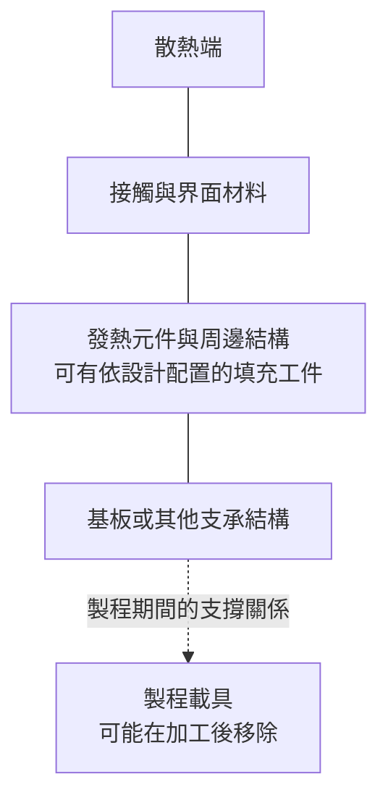

# 07 先進材料：從用途圖走到可驗證的交付

## 開場問題：寫著散熱，就能知道會讓晶片降幾度嗎？

公司簡報展示材料用途，是一個研究起點。讀者還要知道交付的是一片載具、一塊填充用工件，還是一種熱傳材料；它放在哪裡、留不留在成品，以及如何驗證效果。**材料名稱與應用想像，尚不足以建立模組性能或收入結論。**

本章依計畫收斂為「公開拓展方向與待查」。沒有足夠客戶驗證資料的部分，不延伸成昇陽已量產的技術規格。

## 工件與結構：先分功能，再看材料

| 功能位置 | 工件在做什麼 | 必須問的問題 |
|---|---|---|
| 加工支撐 | 讓薄工件可固定、搬運或經歷後續站點 | 加工後拆除嗎？表面、厚度、熱條件如何相容？ |
| 結構填充 | 占據某個空間、調整幾何或組合結構 | 是固體填充工件還是膠材中的填料？是否有電性功能？ |
| 熱傳路徑 | 協助熱從發熱處往散熱端移動 | 厚度、接觸、界面與測試條件是什麼？ |
| 熱機械控制 | 配合結構減少不利變形 | 材料搭配、溫度歷程、厚度與黏著條件是什麼？ |

這是一份一般功能分類，不是昇陽完整產品清單。同樣使用 dummy 一字，封裝裡的填充晶粒與[第 01 章](01-wafer-roles.md)的 dummy wafer 也未必是同一工件。

*圖 07-1：功能位置圖，非特定封裝平台或昇陽產品剖面。實線僅表示結構鄰接，虛線表示製程支撐關係；填充工件的實際位置依設計改變。*

## 輸入、操作與輸出：物性不等於系統表現

熱傳導率 k 描述材料的傳熱性質；熱阻則描述特定路徑傳遞熱時的溫差與熱流關係。最簡化的一維均勻導熱模型中，材料本體熱阻為 t／(kA)，其中 t 是厚度、A 是截面積。真實組合還有界面接觸與其他串並聯路徑，不能只看 k。

[Nordson 的熱介面材料選用說明](https://www.nordson.com/en/divisions/efd/resources/thermal-compound-selection-guide)指出接合層厚度和接觸表現會影響選材；[Dow 的材料頁](https://www.dow.com/en-us/pdp.dowsil-tc-5960-thermally-conductive-compound.523942z.html)則把熱傳導率與指定間隙下的熱阻分別列示。這兩個來源用來說明要帶條件讀性能，不證明昇陽使用或供應這些產品。

一個教學反例：材料 k 提高，但裝配後間隙更厚或接觸更差，總熱阻不一定降低。要支持「晶片降溫」，還需要相同功耗、散熱邊界、裝配條件與量測位置下的比較。

## 缺陷與失敗：局部改善可能換來另一個問題

支撐、填充與散熱的目標可能互相牽動。更改材料會改變熱膨脹匹配、機械約束與界面；提升某一項物性，不保證組裝後的翹曲、黏著或可靠度同步改善。這裡把 CTE、結構厚度與溫度歷程列為應查變數，不在缺乏具體材料與結構時預測翹曲方向。

如果新聞沒有交代「填充」究竟指固體工件、封膠中的顆粒，還是熱介面層，就應先停止套用性能公式。這些物件的製造方式、驗收與計價基礎可能完全不同。

## 量測與控制：每一階段需要不同證據

| 階段 | 可支持的結論 | 還不能支持的結論 |
|---|---|---|
| 材料／工件展示 | 有明確提出的方向或樣品 | 客戶已採用 |
| 實驗室結果 | 在該樣品與條件下有某結果 | 量產分布與長期可靠度 |
| 客戶評估 | 指定客戶與範圍正在評估 | 已通過、全面採用 |
| 認證或小量交付 | 已達到揭露的放行或交付階段 | 穩定大規模收入與毛利 |
| 量產與財務揭露 | 可在揭露範圍內討論出貨與金額 | 未揭露的其他客戶或產品也成功 |

## 昇陽連結：保留拓展方向，先不補訂單

昇陽的 2026 年第二季法說簡報印刷頁 23–24，具體列出 **Si Dummy Die／Si Dummy Filler、SiC Carrier／散熱，以及 Al₂O₃ 陶瓷基座／翹曲控制**。這三項分別對應填充、熱管理和結構變形問題；年報印刷頁 63、95 另將 12 吋 Si／SiC carrier 列為開發方向。材料頁的背景物性不是公司交付實測，方案圖中的位置也不能當作具名客戶採用證據。

{ width="460" }

*照片 07-A：兩片六吋碳化矽（SiC）晶圓。它讓「SiC carrier」對應到一種實體交付形式：一片有尺寸、厚度與表面規格的基板。照片中的晶圓用於磊晶成長，並非昇陽的 carrier 產品；散熱效果仍要看厚度、接觸與測試條件，不能從材料名稱推得。* [來源與署名](99-image-credits.md#photo-07)

本書將其放在[公司矩陣](09-psi-evidence-map.md)的拓展列，與既有再生及薄化服務分開。原始版本與頁碼見 [I1](appendix-sources.md#i1)。材料的客戶、驗證方法、量產份額和收入沒有逐項公開者，不由用途圖或總公司營收倒推出來。

這種限制不等於判斷它沒有商業價值，而是把下一個需要的證據說清楚。若後續正式揭露具體產品規格、客戶放行與持續出貨，可以按列更新，不必一次將整個「先進材料」升級為成熟事業。

## 推理檢查

1. 為什麼 k 增加一倍，不代表元件溫度降一半？
2. 載具與成品內填充工件，交付驗收有哪些可能不同？
3. 公司總營收上升，能否證明新材料開始大量貢獻？

??? note "參考推理"
    溫度還受功耗、界面、幾何與散熱邊界影響。載具可能要拆除或回用，成品內工件則須符合產品服役條件。總營收混合不同業務，沒有分類或產品出貨資料就不能歸因。

## 來源與待查

公司方向依 [I1](appendix-sources.md#i1)；熱傳條件依 [T5](appendix-sources.md#t5)。功能圖、熱阻簡化與驗證階段為教學整理。詳細材料規格、熱機械測試、具名客戶、量產與營收證據仍依[待查附錄](appendix-open-questions.md)逐項追蹤。
