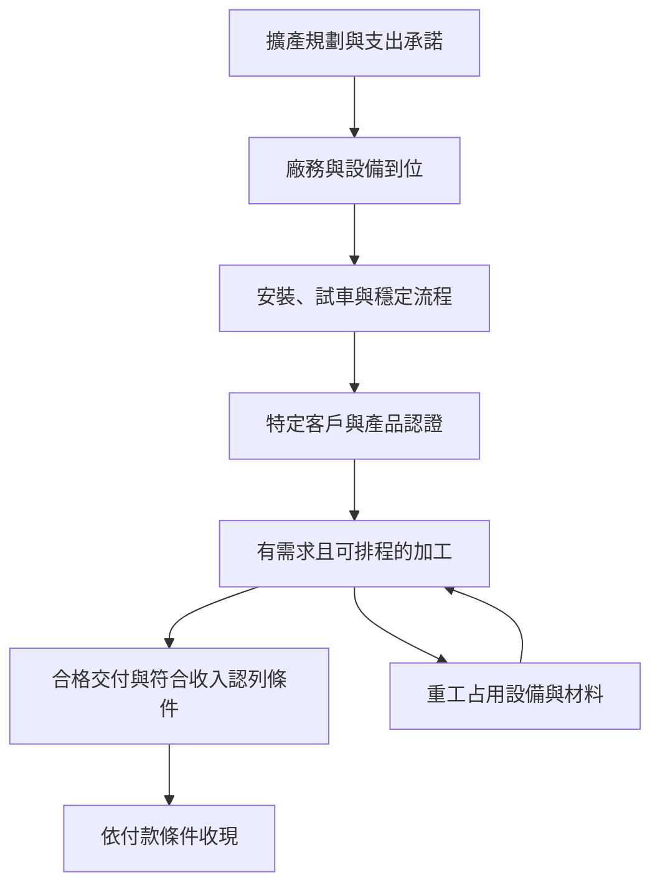

# 08 新廠與自動化如何轉成合格出貨與現金流？

## 開場問題：設備進廠，收入為何還沒跟上？

一座新廠有空間、有機台，不代表當月已能接下所有客戶工件。設備要裝妥並穩定運轉，流程要符合產品要求，客戶也要放行適用範圍。即使出貨完成，收款仍可能在之後發生。**擴產首先增加的是資源與承諾，可計費交付還有一段轉換過程。**

## 結構：四種產能不要共用一個分母

| 名稱 | 本章定義 | 閱讀時要補的條件 |
|---|---|---|
| 名目產能 | 理想或設定條件下的處理能力 | 尺寸、產品組合、班次、瓶頸與時間單位 |
| 可用產能 | 扣除本模型所定義不可排程因素後的能力 | 維護、停機或其他排程扣除是否已含在原數字 |
| 認證適用產能 | 可用能力中已被放行於指定客戶／產品的部分 | 認證適用的是哪個廠、哪條流程與哪種工件 |
| 合格交付量 | 實際完成並符合約定的回貨 | 需求、進料、在製品時差、重工與驗收 |

這些是分析用語，不是各公司財報一定採用的統一欄位。若公司「產能」已包含某些折減，就不能再乘一次相同損失。



*圖 08-1：從擴產到收現的階段圖，不指定各階段天數。採購公告只位於鏈條前段，無法自行證明後段全部完成。*

<span id="photo-08"></span>

{ width="560" }

*照片 08-A：200 mm 晶圓生產線廠房。照片能證明空間與機台存在，也就是階段圖的前段；它無法證明試車完成、客戶認證通過或當月已有合格交付。此為 austriamicrosystems 廠房，不是昇陽廠區。* [來源與署名](99-image-credits.md#photo-08)

## 輸入、操作與輸出：可重算的月度例子

全部為教學假設。假設同一月、同尺寸及同服務口徑，有 12,000 個名目加工起點；80% 可排程，其中 60% 適用於已認證需求，實際投入後 85% 合格回貨。再假設需求充足、月內完工、重工影響已反映在起點能力，沒有重複扣除。

| 階段 | 比例的分母 | 比例 | 月量 |
|---|---|---:|---:|
| 名目起點 | 同服務的基準 | — | 12,000 |
| 可排程 | 12,000 名目起點 | 80% | 9,600 |
| 認證適用 | 9,600 可排程起點 | 60% | 5,760 |
| 合格回貨 | 5,760 認證適用起點 | 85% | **4,896** |

```text
合格回貨服務量 = 12,000 × 0.80 × 0.60 × 0.85 = 4,896 片／月
```

這是逐級條件比例相乘，不要求四個獨立隨機事件；各分母必須能接得起來。若認證比例來自另一年，或回貨率混合不同尺寸，就不能如此計算。需求不足時還需另加需求限制。

| 單獨改一項，其餘固定 | 合格回貨（片／月） | 相對基準增加 |
|---|---:|---:|
| 基準 | 4,896 | — |
| 名目起點增加 10% 至 13,200 | 5,385.6 | 10% |
| 認證適用比例升至 75% | 6,120 | 25% |
| 回貨率升至 90% | 5,184 | 約 5.88% |

*圖表 08-2：產能敏感度。小數代表平均量的模型結果，不是出貨半片；實際排程與批次會取整。認證改善在此例效果較大，不表示現實中較快或較便宜。*

## 缺陷與失敗：瓶頸和尺寸換算

若清洗、拋光或終檢中的一站先滿載，增加另一站機台未必提高全線出貨。重工還會回頭占用同一瓶頸：同樣 1,000 次設備加工，不一定交付 1,000 片合格品。比較自動化前後，要看瓶頸工時、重工、品質與人力成本，而不只是操作員人數。

尺寸換算也有陷阱。以面積算，直徑 200 mm 與 300 mm 的比是 (200/300)²，約 0.444；這只是在忽略邊緣等差異下的幾何比，**不是設備吞吐量、服務價格或公司公告「12 吋等效」的必然換算規則**。搬運、批次容量、加工路徑與測量時間都可能不同。未取得公司方法就保留原單位。

## 量測與控制：利潤和現金的時間不同

擴產現金通常先用於資產取得；資產達到預定可使用狀態後，折舊會依會計政策分攤到使用期間。認證尚未形成足夠收入時，成本負擔可能先反映出來。不能把採購付款一次全當成當季營業費用，也不能因折舊當期不付現，就忽略先前投資。

出貨到收款之間有應收帳款；備料、在製品與其他營運資金也會占用現金。因此營收成長、獲利增加、營運現金流增加，三者未必同幅或同時發生。若以「營運現金流減資本支出」作簡化自由現金流，須先寫明資本支出取自哪些現金流項目，不能混用設備承諾額與實付額。

本章是閱讀框架，實際認列與折舊依[公司財務報告](https://www.psi.com.tw/report.asp)會計政策及附註。要歸因毛利變化，還需查價格、業務組合、匯率及其他成本；公司總毛利不能直接當成先進材料毛利。

## 昇陽連結：廠區進度要附日期

昇陽公開資料有中港布局及產能規劃資訊。應將每份資料中的廠區、尺寸、月產能、當期值與未來目標分列，並記錄當時版本。公司法說中的年底目標即使已接近查閱日，仍不能自行改寫成當下實績。[法說入口](https://www.psi.com.tw/share_news2.asp)

I1 印刷頁 27 的 2026Q1 欄，可作時間差的具體閱讀例：營業現金流列 263 百萬元，資本支出現金流出列 669 百萬元，自由現金流量列 -406 百萬元；依該表口徑，263−669=-406。這是第一季公司摘要，不是最新上半年現金流，也不能由此推算個別廠的投資回報。表中其他期別存在符號／四捨五入差異，未使用它們自行外推。

新廠與 ESG 主張也需不同證據。自動化可能改善效率，但節水、節能或碳排比較還要看產量、功能單位與盤查邊界；製程用水回收率不能代替整條產品生命週期碳排。未取得方法時，本書不刊出再生比新片「省碳某百分比」的結論。

## 推理檢查

1. 名目產能翻倍，認證適用比例減半，其餘條件相同，合格量如何變？
2. 為何用面積換成 12 吋片數，不能直接推算收入？
3. 營收成長而營運現金流變差，可能要查哪些科目？
4. 設備採購金額能否代替當期實際資本支出現金？

??? note "參考推理"
    在本模型其他條件固定下，兩者抵銷。尺寸不決定完整配方、加工時間與價格。應收、存貨、應付及稅款等時間差需核對。採購承諾與付款時點不同，不能直接替代。

## 來源與待查

公司依 [I1、A1、F1](appendix-sources.md#i1)。月度模型與敏感度是作者假設，基準已由 `plan/psi/reuse_model.py` 核對。實際各站稼動率、認證涵蓋、重工與各業務資本投入未有完整公開分解；[第 09 章](09-psi-evidence-map.md)將限制逐列記入公司矩陣。
