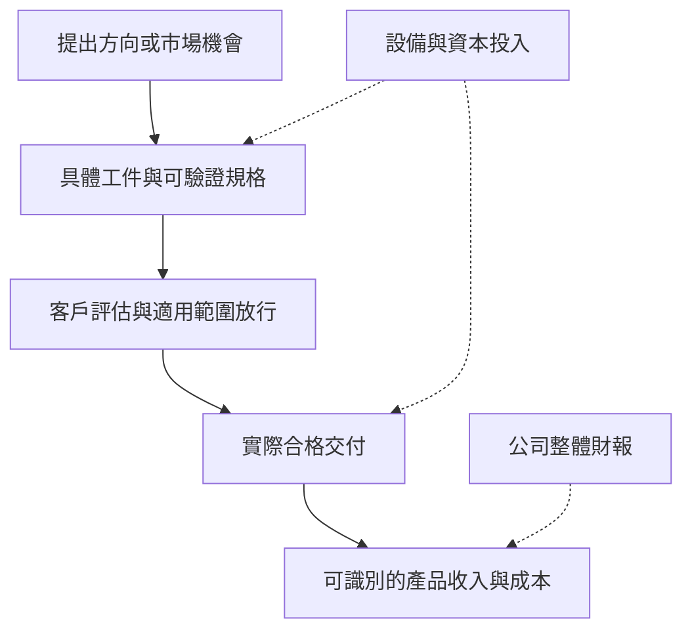

# 10 一則消息究竟能證明到哪一步？

## 開場問題：把新聞標題改寫成可核對句子

看到「AI 帶動」「擴產受惠」「先進材料佈局」，先別急著猜收入。把消息改寫成：哪個法人、何時、對什麼工件做了什麼、目前到哪個階段，以及什麼後續資料會使你改判。本章用實際文件練習，將來源明述、作者推論與未知分開。

## 結構：投資、能力與收入有不同證據

*圖 10-1：證據階梯是分析框架。虛線表示可能提供背景，不能跳過中間證據；公司整體財報也未必拆出單項產品結果。*

## 案例一：2026-05-25 法說中的再生需求與擴產

**來源明述。** [I1 印刷頁 10、14](https://www.psi.com.tw/company/2026年第二季法人說明會_20260525_中文版.pdf)展示製程演進與再生使用量的關係，以及 Fab1、Fab3A、Fab3B、TBD 的擴充規劃；圖中包含未來年度和公司／引用機構估計。這是公司發布的需求與投入敘事，不是每個未來年份已發生的出貨。

**作者推論。** 若監控使用需求確實上升、外包比例與份額不下降，且認證與產能跟上，再生服務量可能受益。此推論使用[第 05 章](05-demand-and-new-test-wafers.md)的中介條件，不能只把某個市場 CAGR 乘公司營收。

**未知。** 再生使用量指數的精確分母、各類客戶監控頻次、公司份額、尺寸換算、各廠客戶認證與實際計費量。

**改判條件。** 後續若可比口徑的合格出貨增加、認證進度到位，便支持需求傳導；若擴充延後、產能有餘但服務量不升，應降低「投片增加必然帶來本公司收入」的信心。先查需求與時差，也保留外包或供應商份額改變的替代解釋。

## 案例二：同一法說展示 SiC Carrier 與 Si Dummy Filler

**來源明述。** I1 印刷頁 23–24 列出 Si Dummy Die／Filler、SiC 散熱／Carrier、Al₂O₃ 翹曲控制方向；[A1 印刷頁 63、95](https://www.psi.com.tw/company/114年度股東會年報.pdf)將 Si／SiC carrier 列入開發項目。這兩份資料支持「公司提出具體拓展方向」。

**作者推論。** 工件若能符合尺寸、表面、熱機械與可靠度條件，可能形成既有加工能力以外的交付機會。但一般材料導熱率不是成品熱阻；圖中出現 HBM 或 SoC，也不是任何客戶的採購單。

**未知。** 交付規格、樣品數、測試方法、具名客戶、驗證放行、持續出貨與產品收入。

**改判條件。** 取得可對應到具體工件的認證與持續出貨揭露，才能向商業化前進一階；若一直只有用途圖、物性資料或不同版本的市場想像，就維持拓展方向。若實測顯示接口、可靠度或成本不符合需求，應修正原先對應用適配性的推論，而不只延後預期時間。[第 07 章](07-advanced-materials.md)

## 案例三：2026-08-13 半年度財報公告

**來源明述。** [TWSE 公司資料 PDF](https://wwwc.twse.com.tw/pdf/ch/8028_ch.pdf)的重大訊息索引列出該日第二季財報公告。[TWSE 綜合損益資料](https://openapi.twse.com.tw/v1/opendata/t187ap06_L_ci)年度 115、季別 2 的 8028 列，記錄上半年營收 2,730,311 千元、營業利益 702,488 千元、EPS 3.32。資料查核日為 2026-09-14；公告日與資料涵蓋期不同。

**作者推論。** 公司整體營運有可量化結果，可用來檢查先前成長敘事是否與總體表現相容。但「相容」只排除部分矛盾，不會唯一識別是哪種產品促成。

**未知。** 其中再生、全新測試晶圓、薄化和材料各貢獻多少量、價與利潤；也沒有這筆財務資料到某一台設備的因果對應。

**改判條件。** 若之後公布可比的產品／服務分解，便可重新估計各主張的貢獻；若只有總額，就保留多種解釋。若要檢驗現金品質，還必須補同期間現金流與營運資金資料，不能用 EPS 代替收現。[第 08 章](08-capacity-and-cashflow.md)

## 案例四：2025-08-05 設備取得，對手是均豪嗎？

**來源明述，來源層級較前例有限。** [MoneyDJ 保存的公司公告鏡錄](https://www.moneydj.com/KMDJ/news/newsviewer.aspx?a=225ccd97-7f47-49ab-864e-06c876e264f1)列出機器設備一批，總額新台幣 5.51 億元，交易對手均豪精密工業股份有限公司，公告欄位列非關係人；事實期間為 2024-10-04 至 2025-08-05，不能全部當成公告當日才新下的單。本次 MOPS 原件受安全驗證阻擋，故明確稱為鏡錄。

**作者推論。** 這筆鏡錄比「均豪是股東，因此一定供設備」更直接，支持存在該筆已公告設備交易的判斷。另有 [C3 股東表](https://www.psi.com.tw/stockholder.asp)於 2026-03-23 列均豪持股 5.02%；它是另一日期、另一性質的證據。

**未知。** 機型、交貨與驗收、裝機地點、瓶頸改善、客戶認證、產能增加，以及是否對應某個新材料或 AI 應用。鏡錄也不等於本次已直接讀到原始申報附件。

**改判條件。** 原件若更正金額、對手或事實期間，應先更新交易本身；若後續資料確認機型、站點與放行，才能把設備連到具體交付能力。若只有採購金額，維持資本投入結論，不預測新增營收。這個案例也提醒：同一資料缺口後來可能被補上，應更新證據，而不是沿用舊書的未知。

## 用語練習：再生能力能讀成「修復壞晶片」嗎？

以下是假設有人把再生服務改寫成「失效晶片回爐重造」的**教學情境，不是新聞標題或公司宣稱**。

**可核對事實。** [公司晶圓加工頁](https://www.psi.com.tw/wafer.asp)的服務對象與用途，應按再生晶圓、全新測試晶圓及製程監控閱讀。服務介紹不能自動擴張為恢復失效元件電性。

**錯誤推論發生在哪裡。** 把工件重新符合監控用途，換成晶圓上的原電路恢復功能，已經改了交付物與合格標準。即使表面膜層去除成功，也沒有證明原產品可出貨。

**還缺什麼、何時改判。** 若要主張元件修復，需有明確的產品工件、失效類型、修復方法及功能驗證證據；若只有新增再生產能或延長監控片使用的陳述，仍只支持再生服務。若討論的是報廢後材料回收，則須另查回收對象、方法與承接者，不能沿用同一個「再生」名稱就視為已證明。[第 01 章](01-wafer-roles.md)、[第 11 章](11-disposition-cases.md)

## 操作：自己完成一則未來消息

| 欄位 | 填寫要求 |
|---|---|
| 事件與日期 | 區分宣布、發生、文件發布與查閱日期 |
| 工件與角色 | 寫交付物；分開材料、設備、加工服務及客戶 |
| 直接事實 | 用來源真正明述的範圍，不擴張形容詞 |
| 推論與成立條件 | 列出需求、驗證、產能或計費之間必要環節 |
| 替代解釋 | 至少一個同樣符合目前資料的原因 |
| 未知 | 指出可查的資料欄位，不只寫「仍有風險」 |
| 改判條件 | 什麼具體觀察會支持、削弱或推翻原先判斷 |

## 缺陷、量測與公司連結

常見失敗是把日期更新誤當證據升級：同一張方案圖換一個簡報日期，並不新增驗證。另一種是把實體片、片次、等效片與金額混合；讀者應沿[第 09 章矩陣](09-psi-evidence-map.md)逐列更新，保留新舊版本與口徑。

判讀成果不是猜中一個標題，而是讓另一位讀者可以用同一來源重建你的推理，知道哪個新觀察到來時你會改變結論。

## 推理檢查

1. 公司增加資本支出預算，與設備已完成驗收，差在哪一階？
2. 為何上半年財報能檢查總體表現，卻不能確認 AMS 貢獻？
3. 設備公告鏡錄具名對手後，哪些未知已解決，哪些仍未解決？
4. 自選一則消息，寫一個真正可能讓你改判的條件。

??? note "參考推理"
    預算是投入決策，驗收仍需交付與測試。總財務沒有產品拆分。具名鏡錄增加交易對手證據，但機型、產能與客戶仍需後續材料。改判條件要能被觀察，例如指定產品認證延後或可比出貨持續未增，不能只寫「情況不如預期」。

## 來源與待查

前三個案例依 I1、A1 及 TWSE 官方資料；第四例明示公告鏡錄與原件缺口。完整定位見[來源索引](appendix-sources.md)。尚待 MOPS 原件、各產品出貨與營收、認證和量測條件，不因本書完成而視為已回答。
