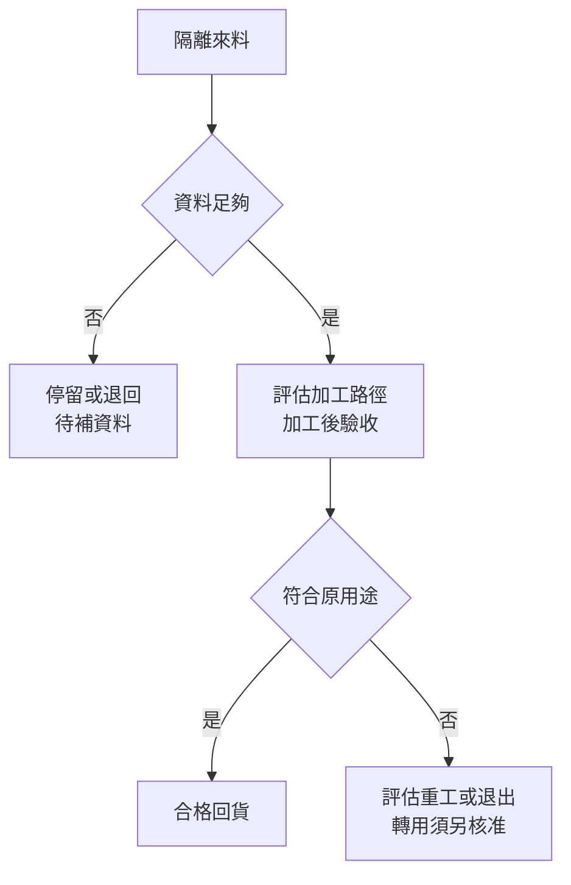
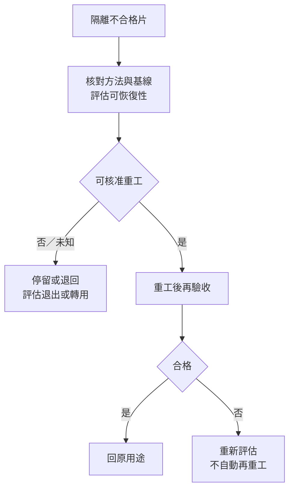
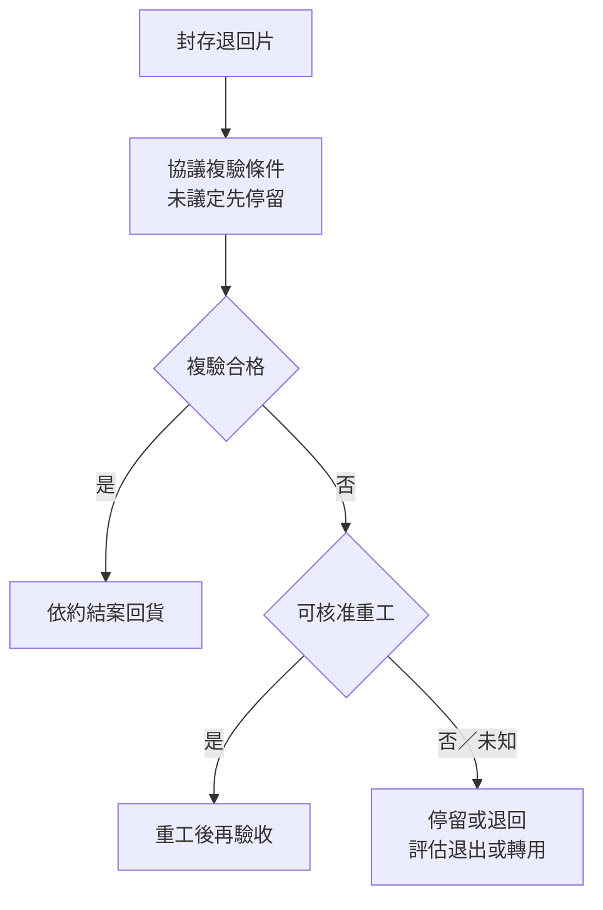

# 11 這片晶圓應該回爐、退回，還是終止？

## 先把「失效」翻成處置問題

晶圓加工後出現異常，第一個問題不是「再磨一次能不能變漂亮」，而是「這片工件現在還能否被同一個用途接收」。同一片晶圓可能走向幾種不同狀態：**停留**是先隔離，保留履歷與樣品，等待證據；**退回**是依約交還給送件方或供應方；**重工**是追加或重做相容的加工，再重新驗收；**轉用途**是改用於另一個已定義且重新確認過的用途；**終止原用途**則表示不再把它當作原目標用途的合格工件。終止之後是否作材料回收、降級出售或其他處理，仍要看所有權與合約，不能由外觀推定。

因此「回爐重造」不是一個單一按鈕。對監控、測試或擋片而言，再生可能恢復部分表面與幾何條件；它不表示把一片已失效的產品晶片洗掉，就能重新製造同一個產品。三個案例都是本章的教學合成，並非昇陽客戶事件，也不描述昇陽內部 SOP。

本章的閱讀順序接在[第 03 章的量測與資格](03-quality-and-qualification.md)之後：先判斷證據是否足以作出品質判定，再決定要不要付出重工成本；[第 04 章](04-reuse-economics.md)才把成功、失敗與提前終止放進生命週期成本。若品質條件尚未成立，便不能先用「這次重工比較便宜」替它做決定。

## 六個欄位怎麼讀

每個案例都用六個欄位，直向排列方便逐項閱讀。已知與未知描述目前的資訊狀態；「辨識檢查」選的是最能區分不同假設的下一步，不是宣稱每家工廠都使用同一台設備；「可選處置」列出仍有證據支持時的分支；「停止條件」指出何時先暫停、何時結束原用途；最後一欄只寫公開資料能支持到的公司層級。

技術上，厚度、TTV、bow、warp、顆粒、表面形貌與元素污染回答的是不同問題。報告必須帶著量測方法、條件、抽樣與用途閱讀，不能用一個「乾淨」或「合格」標籤取代。這也是三案都先停留、再辨識的原因。

## 案例一：履歷不明的來料 {#case-1}

一批用過的晶圓送到再生服務商，外觀沒有明顯破片，送件單只寫「測試片」。沒有膜種、過去站點、清洗紀錄或目標再使用站點，就算尺寸看起來相同，也不能自動跟既有批次共用路徑。先把它當作未知工件隔離，會比直接送入去膜或拋光更容易保留選項。

| 欄位 | 內容 |
|---|---|
| 已知 | 收到一批實體晶圓；送件方稱為測試片；目前外觀與片數可記錄。 |
| 未知 | 尺寸、材質、膜種、污染來源、既往加工、目前厚度與所有權；原本要回哪個站點也未知。 |
| 辨識檢查 | 先核對追溯文件與用途，再依風險確認尺寸、厚度與幾何；檢查表面缺陷，必要時用適用的元素或污染分析。每項結果都要記方法、位置與樣本。 |
| 可選處置 | 資料補齊且目標用途可驗證時，才可評估去膜、表面處理、清洗與終檢；合格便留在原用途。若要重工，還要有可恢復依據、加工餘裕與處置授權。資料不足先停留或依約退回；若原用途不成立，只有在新用途有允收規則並完成資格確認後才轉用途。 |
| 停止條件 | 無法建立身分或用途時，先停止加工、補資料或依約退回待查。確認無法取得原用途所需資格、已不相容或不再投入處理時，由權責方決定終止原用途；是否另有合格新用途再行判定。未定去向不寫成已回收。 |
| 公司公開證據 | [C1](appendix-sources.md#c1)可支持昇陽公開列出晶圓再生加工與全新測試晶圓等交付範圍；未公開逐批收料規則、客戶規格、重工次數或此批處置。一般分類與再生步驟見[技術來源](appendix-sources.md#technical)，不能移植成昇陽配方。 |

這一案的關鍵不是找到一個「最強的清洗」方法，而是先問未知是否能被辨識。若送件方補上膜種，卻仍沒有目標用途或允收方法，處置仍停在資格缺口；若只知道「以前用過」，也不足以證明可以回到同一站點。轉作較寬鬆的監控用途看似保守，仍然是換了一份規格，不能把「降級」當成免驗收。

## 案例二：加工後仍不合格 {#case-2}

另一片晶圓已完成某種去除與表面處理，終檢卻顯示表面缺陷或幾何條件不符合目標。此時「再跑一次」至少包含三種不同假設：量測方法或設備狀態造成假失敗；殘留確實存在，而且能在剩餘厚度與形貌餘裕內移除；缺陷來源未明，追加加工反而可能擴大損傷。先重建失敗證據，才知道重工是在解問題，還是在消耗證據。

| 欄位 | 內容 |
|---|---|
| 已知 | 某道加工已完成；出貨前檢查至少有一項結果不符合目標用途。 |
| 未知 | 失敗是否可重現；是殘膜、粗糙、TTV、翹曲、顆粒、元素污染或搬運造成；加工前基線、剩餘厚度與重工後能否驗收也未知。 |
| 辨識檢查 | 先隔離並重核量測方法、校準、取樣與邊緣排除；將前後資料對照，再用能對應風險的表面、幾何或元素分析定位。可恢復性與加工風險證據不足前，不增加去除量。 |
| 可選處置 | 不要求先查明唯一根因；只要已有足夠的風險界定、可恢復依據、加工餘裕與處置授權，便可重工後重新驗收。若原用途不再可行，可提出另一用途的資格評估；條件重新成立，才回原用途或轉用途。 |
| 停止條件 | 失敗無法重現時先停留校準或按共同規則複驗；證據不足時不自動重工。若追加移除會超出餘裕，或裂紋、污染等風險已確認無可接受的恢復路徑，停止該重工選項；由權責方決定原用途退出及後續去向。 |
| 公司公開證據 | [C1](appendix-sources.md#c1)只支持昇陽公開的加工服務範圍，不提供各缺陷的重工 SOP、允收門檻或次數。[技術來源](appendix-sources.md#technical)支持去除、表面重建與厚度／形貌／表面量測各有目的；表中的分支是本章推理。 |

這一案的核心問題是可恢復性。厚度足夠，並不代表表面損傷可逆；殘膜能被去除，也不代表新的粗糙度或幾何狀態能被下站接受。若選擇重工，要另記追加成本、材料消耗與結果；[第 04 章](04-reuse-economics.md)現有模型假設失敗即退出，不能直接替本案計算重工收益。

## 案例三：供應商通過，客戶卻退回 {#case-3}

供應商報告寫著合格，客戶收貨後卻退回同一批。兩份結果可能都沒有造假，因為掃描面積、檢出門檻、支撐狀態、抽樣與時間點不同；也可能是包裝與搬運讓收貨狀態改變。退回本身是事件，不是根因。先封存與對照，才能分辨量測不可比、運輸再污染、加工失敗或客戶用途不同。

{ width="520" }

*照片 11-A：晶圓表面的淡黃色條紋來自反射光，不是缺陷判定結果。同一片工件在不同照明、角度與拍攝條件下可以看起來很不一樣，這正是「辨識檢查」要求對照方法、門檻與掃描面積，而不是只重看照片的原因。此照片非昇陽工件或客訴實例。* [來源與署名](99-image-credits.md#photo-11)

| 欄位 | 內容 |
|---|---|
| 已知 | 供應商在某套條件下判為合格；客戶在收貨或使用前後提出退回。這兩個事件可以先建立批次與時間關聯。 |
| 未知 | 兩方測量方法、門檻、抽樣、掃描面積、包裝狀態、運輸歷史與客戶實際用途；退回時缺陷是否已存在及責任歸屬也未知。 |
| 辨識檢查 | 封存退回片與包裝，對照出貨報告和收貨紀錄；確認同一批、同一方法與條件，再做雙方同意的複驗。若懷疑污染或搬運，檢查表面與幾何的變化，而不是只重看照片。 |
| 可選處置 | 若共同條件複驗合格，依約結案回貨，不必全導向重工。若確認是可恢復且責任、費用與處置已獲授權的加工問題，可重工再資格確認；若原用途規格不同，完成新用途允收後才轉用途；也可依約退回。 |
| 停止條件 | 無法重建收貨狀態、方法不可比或原因未明時，先停留、協議複驗或依約退回待查。搬運污染若已確認，仍按責任與可恢復性處理。原用途資格無法恢復，或權責方決定不再投入時，記錄退出依據；是否轉用、報廢或交回另行結案。 |
| 公司公開證據 | [C1](appendix-sources.md#c1)支持昇陽公開提供晶圓加工服務，但沒有公開客戶退貨率、爭議處理、重工責任或各用途驗收條件。[技術來源](appendix-sources.md#technical)可支持量測條件與運輸／表面狀態會影響可比性；本案不是公司實績。 |

「供應商合格、客戶退回」最容易被誤讀成供應商一定做錯，或客戶一定量錯。若兩方規格本來就不是同一用途，處置甚至不應先討論誰要再拋光，而要先確認交付物到底承諾了什麼。只有在共同條件下確認為可恢復，重工才是有意義的選項；否則一次又一次重做，只會把責任與成本混在一起。

## 把處置接回成本

三案共用的順序是：**證據不足時停留，規格不合時不按合格品回貨，已有可恢復依據、餘裕與授權才談重工；轉用途須另取得資格，終止原用途則須記錄依據與權責決定。** 技術不可恢復、無法取得資格或決定不再投入，都可能導致退出，但不能把一項未知直接當成已證明物理損壞。原用途退出與新用途成立也可同時發生；報廢和材料回收仍是另外的處置。

[第 02 章](02-reclaim-loop.md)已把拒收、重工與不可恢復出口放進再生閉環；本章將出口套進具體失效情境。[第 03 章](03-quality-and-qualification.md)提供量測方法與用途資格的閱讀框架；讀完本章再回到[第 04 章](04-reuse-economics.md)，該模型目前把失敗視為退出，並未直接建模重工，因此不能把本章的重工分支直接代入既有公式。若要估算重工，還要另定重工成本、成功條件、追加消耗與停止規則；若只用「這片已經加工過」來決定繼續，會漏掉最後一次失敗已支付的成本，也會漏掉轉用途需要的新驗收。

## 推理檢查

1. 一片履歷不明但厚度充足的晶圓，為什麼不能直接送進既有再生路徑？
2. 加工後只有一項量測失敗，為什麼第一步可能是停留與重測，而不是重工？
3. 供應商與客戶的「合格」報告都是真的，哪些條件仍可能讓兩者無法比較？
4. 轉作較寬鬆用途，為什麼仍需要新的允收與資格確認？

??? note "參考推理"
    1. 厚度只回答材料餘裕，沒有回答膜種、污染、歷史與用途相容性；未知履歷可能讓加工路徑與下站風險不可判定。  
    2. 量測條件、校準或抽樣可能使判定不可靠；搬運也可能造成真實污染。先加工會改變證據並消耗厚度。  
    3. 方法、門檻、掃描面積、支撐狀態、抽樣、時間點與包裝／運輸狀態都可能不同。  
    4. 用途變了，允收的污染、幾何、表面或功能要求也可能變；原用途資格不能自動移植。

## 來源與證據邊界

本章三個情境、流程圖與處置分支都是作者設計的教學案例。公司事實只採[昇陽晶圓加工來源 C1](appendix-sources.md#c1)能支持的公開服務範圍；它沒有公開本章六欄所需的逐批收料、拒收、重工、客戶退回、轉用途或終止規則。一般工程背景依[技術來源](appendix-sources.md#technical)的分類、再生步驟與量測限制整理，不能反推昇陽使用特定設備、配方、門檻或客戶。

要把任一合成案例改成真實事件，至少還要有可追溯的工件履歷、適用用途、雙方驗收方法、處置授權與結果資料。在這些資料出現前，最穩健的結論不是猜哪一方有錯，而是指出目前應停在哪個證據缺口。成本、回用次數與材料去向的進一步未知，見[待查問題](appendix-open-questions.md)。
