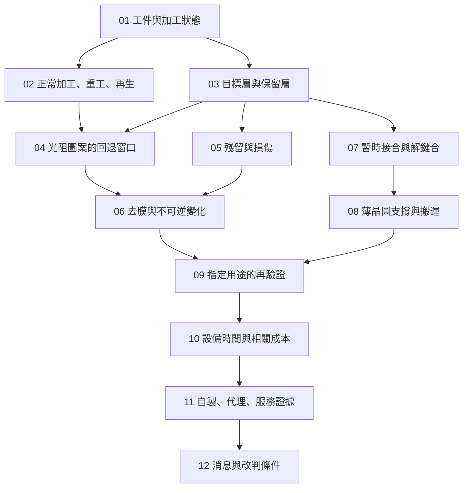

# 全書地圖：從材料帳本到公司證據

全書只有一條主線：**先知道工件的狀態，再問可做什麼，最後才問誰提供設備或服務。** 單獨看產品名稱無法決定能否重工。

*圖 00-1｜教學架構：箭頭是概念依賴，不是官方製程，也不是三家公司的商業流向。*

| 章 | 核心問題 | 先備 | 讀完應交出的東西 |
|---|---|---|---|
| [01](01-wafer-states.md) | 晶圓現在做到哪一步？ | 無 | 用途、堆疊、加工歷史的狀態卡 |
| [02](02-rework-vs-process.md) | 同一去膠動作何時才是重工？ | 01 | 三用途與交付差異 |
| [03](03-removal-selectivity.md) | 要去掉一層，如何保住其他層？ | 01 | 選擇性與損耗的材料帳本 |
| [04](04-photoresist-window.md) | 圖案做錯是否能重來？ | 02、03 | 未轉移與已轉移圖案的兩張處置單 |
| [05](05-cleaning-and-residue.md) | 洗不乾淨和洗傷怎麼分？ | 03 | 殘留／污染／損傷的證據矩陣 |
| [06](06-film-removal.md) | 去膜能恢復什麼？ | 03–05 | 移除前後的材料與結構差異 |
| [07](07-bonding-and-debonding.md) | 為什麼暫時接合可以有退出路徑？ | 01、03 | 載具、黏著層、分離方法的對照 |
| [08](08-thin-wafer-handling.md) | 化學相容，機械上是否承受得住？ | 05、07 | 支撐、加工面及損傷定位 |
| [09](09-requalification.md) | 什麼證據允許回到哪一站？ | 04–08 | 適用範圍明確的再驗證清單 |
| [10](10-equipment-economics.md) | 救回一片占用多少資源？ | 09 | 含失敗支線的片數、工時與成本算例 |
| [11](11-scientech-evidence-map.md) | 辛耘三種業務各交付什麼？ | 01–10 | 不混用自製、代理與服務的矩陣 |
| [12](12-reading-company-news.md) | 哪種事件足以改變判斷？ | 11 | 事實、缺口與改判條件 |

## 三個容易跳過的關卡

「原理上可去除」到「此片可重工」，中間缺材料履歷與核准窗口；「重新量測通過」到「可以出貨」，中間缺適用用途與驗證覆蓋；「公司有設備」到「形成收入」，中間缺客戶、履約與期間證據。

對某一章不熟時，不必先背設備名詞。回到該章的工件、目標層與輸出，再沿前一章補概念。術語在[附錄 B](appendix-glossary.md)；來源的支持範圍在[附錄 A](appendix-sources.md)，而不是藏在圖片裡。
