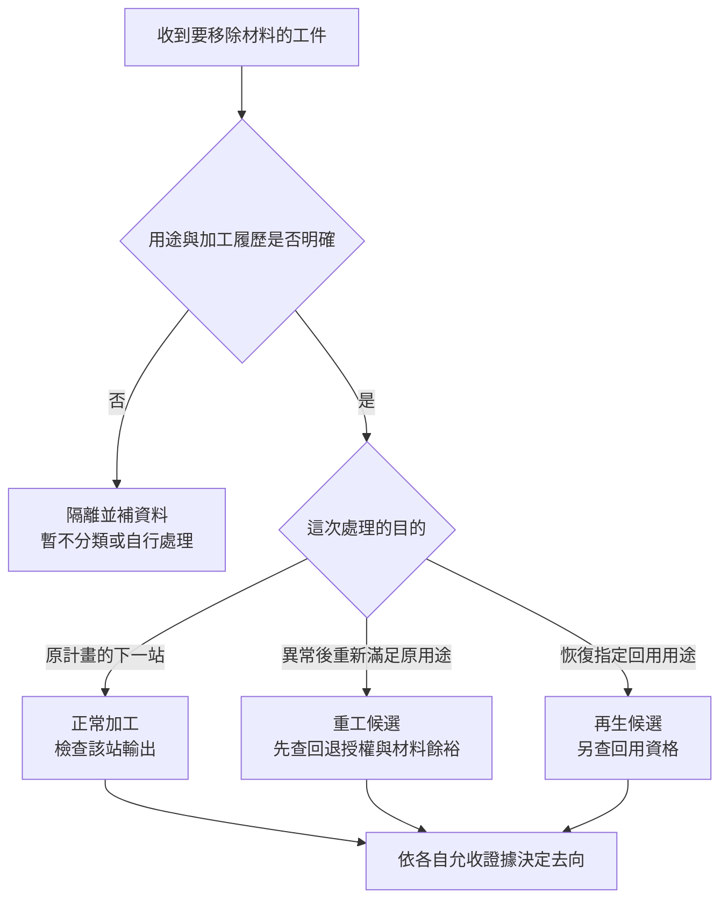

# 02 去掉同一層，為何不是同一種用途？

## 看見「剝離」，就能說是在救晶圓嗎？

一份設備介紹寫著可去除光阻，另一份寫著可清洗晶圓。讀者很容易把它們接成「晶圓做壞了，可以洗掉重做」。問題是：**動作名稱只告訴我們如何改變材料，沒有交代為什麼做，以及完成後要去哪裡。**

蝕刻完成後依原計畫去光阻，可能只是正常加工；圖案異常後評估去光阻再塗佈，才涉及重工；已結束使用的晶圓若要回到指定監控用途，則是再生問題。三者可以使用相似的移除動作，卻有不同的資格與交付物。

## 先看剖面，再加上用途

想像一片矽基材，上有介電膜，最上面是光阻。這個剖面還不足以分類：光阻是完成任務的遮罩，還是帶有錯誤圖案的遮罩？介電膜要留作產品結構，還是連同上層一起移除？沒有工作目的，同一張圖可以被讀成完全不同的流程。

[T02](appendix-sources.md#t02)把去光阻放在 lift-off 或蝕刻後的位置，支持它可以是預定製程。[T01](appendix-sources.md#t01)則要求去除時保護基材與既有材料，不能只因目標層相同，就把正常流程的條件直接搬到異常來料。

| 比較項目 | 正常加工 | 重工 | 再生 |
|---|---|---|---|
| 輸入 | 按排定路線到站的工件 | 發現異常、等待判定的工件 | 使用結束或需恢復指定用途的晶圓 |
| 操作目的 | 完成下一站需要的狀態 | 重新加工以滿足原用途要求 | 恢復材料與表面，使其符合指定回用用途 |
| 要保留什麼 | 依產品或監控流程定義 | 原用途必要結構及剩餘材料餘裕 | 依回用目的定義，不保證保留原電路 |
| 輸出 | 可進入原計畫下一站 | 通過再驗證，獲准回到指定站點 | 通過回用資格的晶圓 |
| 不能省的證據 | 站點結果與來料相容性 | 異常原因、回退授權、停止條件與再驗證 | 履歷、材料狀態與回用允收 |
| 常見誤讀 | 有去膠就是重工 | 重做一次就等於修好 | 表面恢復就等於原晶片復活 |

本表是本書工作定義與跨來源整理，不是跨廠通用的處置規範。再生不必以產品失效為起點；正常完成任務的測試或監控晶圓，也可能進入回用評估。

### 圖上看得見動作，看不見用途

[{ .wiki-image width="500" loading="lazy" }](https://commons.wikimedia.org/wiki/File:Cmp_prinzip.jpg)

*圖 02-W1｜CMP（化學機械研磨）原理：先看下半部紅色標示的 wafer 如何接觸拋光墊，再看上半部漿料供給與旋轉關係。圖示呈現材料移除的接觸配置，卻沒有來料履歷、異常起點或回用資格；不能單憑這張圖就稱它為重工或再生，也不表示所有再生流程相同。圖中的 carrier／chuck 是承載頭，不能直接等同第 07 章與晶圓暫時接合的 carrier。wisem／公有領域；[圖片出處 W03](99-image-credits.md#w03)。*

## 用下一站來辨識，不用設備名稱猜

*圖02-1｜跨來源整理：用途分類的提問順序；是閱讀框架，不是官方處置流程。兩條候選路徑都可能在資格檢查時停止。*

### 同樣去光阻的兩張工作單

工作單甲：下層圖案已按要求完成蝕刻，依原計畫移除遮罩，再檢查殘留。這是正常向前加工，無須虛構一個失效事件。

工作單乙：顯影後量到圖案偏移，工程師希望回到塗佈站。此時輸入還須包括異常位置、對位標記狀態與既有重工履歷；操作要有適用膜系的核准路線；輸出則要先證明可再加工，再證明新圖案合格。若下層其實已被錯誤蝕刻，就不能沿用這張單。[第 04 章](04-photoresist-window.md)會完整比較兩種階段。

以上為教學合成情境，不是辛耘客戶案例。「候選」二字很重要：看得出回退方向，不等於已取得回退資格。

## 異常來料不能只貼「重工」標籤

異常可能來自圖案形成，也可能來自量測座標、前站污染或保留層損傷。若問題其實是量測錯誤，重新量測是在補證據，不是材料重工；若已傷到必要結構，再做一次原流程也可能完全無效。

檢查宜先核對工件識別與履歷，再確認異常是否真實及位於何層。處置有三個分支：證據不足就保留並補查；有適用授權且保留材料足夠，才進入受控重工；無可接受路線則交工程判定停止、報廢或有證據的替代用途。**改作他用不是任意降低標準，必須重新指定要求。**

## 再驗證不是把第一次檢查重做一遍

重工可能修正了圖案，卻增加膜厚損耗、殘留或表面變化。因此，再驗證除了原始不合格項目，也要覆蓋新增風險。[T04](appendix-sources.md#t04)並列蝕刻速率、粗糙度、殘留與污染，正好說明不能只盯著「原本那一個錯誤消失了」。

正常加工同樣需要驗證，但驗證範圍由原流程與實際來料決定；不能反過來說只有重工才會損傷。再生的合格則是指定回用用途合格，與原產品電性恢復不同。循環次數、厚度預算與回用經濟性留給[昇陽書](../../psi/html/index.html)，此處不另建一套模型。

## 辛耘的公開證據能支持到哪裡

| 已確認事實 | 合理推論 | 尚待查證 |
|---|---|---|
| 官方產品研究記錄濕製程與光阻剝離用途，查核狀態見 [C04](appendix-sources.md#c04) | 同類材料移除能力可放進不同用途問題中評估，但每種用途仍須獨立證據 | 特定機型是否有異常重工應用、回退站點及驗證紀錄；不能由正常去膠反推 |

本章不以其他公司的技術文件替辛耘證明業務，也不由「有清洗設備」推導再生服務的規模或客戶。

## 推理檢查

1. 合格蝕刻後去除遮罩，為何通常不叫重工？
2. 重新量測後發現第一次座標設錯，是否已完成重工？
3. 光阻重做後圖案通過，還要檢查什麼？
4. 再生晶圓通過監控用途，能否說原產品已修好？

??? note "參考推理"
    1. 它在完成原計畫的下一站，沒有異常回退目的。
    2. 沒有。這是修正量測證據，尚未代表材料經過重新加工。
    3. 還要檢查處理引入的殘留、保留層損耗與下游所需特性，並確認回站授權。
    4. 不能。回用資格與原產品的結構、電性及可靠度是不同要求。

## 來源與待查

去光阻的正常位置見 [T02](appendix-sources.md#t02)、[T03](appendix-sources.md#t03)；相容性與控制風險見 [T01](appendix-sources.md#t01)、[T04](appendix-sources.md#t04)。本章分類與工作單為教學整理；昇陽連結是延伸閱讀，不是一手技術證據。尚缺產品專屬重工授權、允收與公司應用證據，不填入通用次數或成功率。

---

[← 01 工件與加工狀態](01-wafer-states.md) ｜ [03 目標層與保留層 →](03-removal-selectivity.md)
