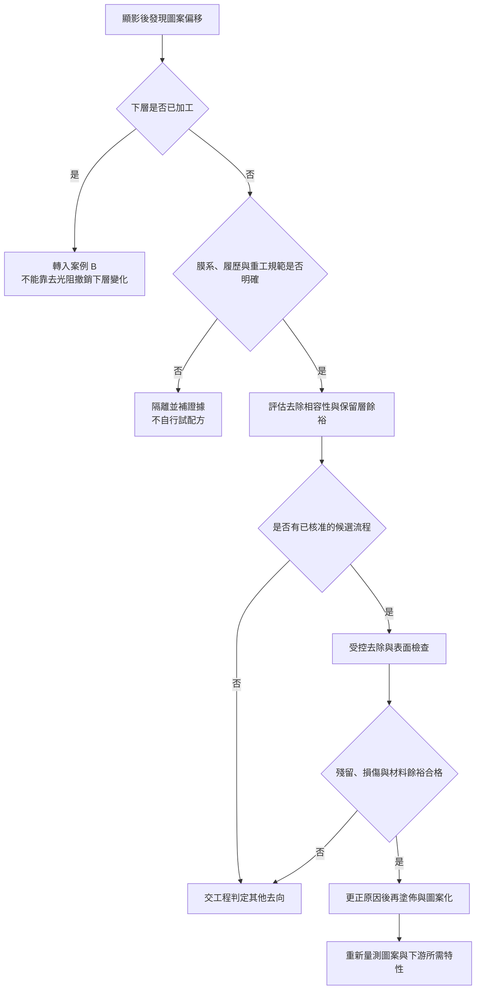
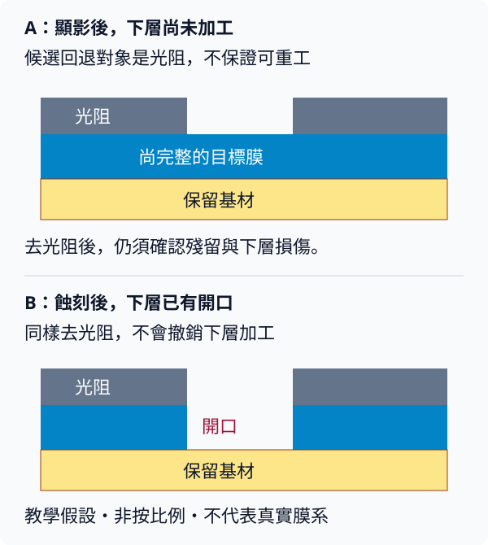

# 04 光阻圖案做錯，還能重來嗎？

## 同一個「偏掉」，兩種完全不同的工件

檢查站發現圖案偏離預定位置。工程師說：「去膠後重做。」這句話是否合理，第一個問題不是去膠機的速度，而是：**錯誤現在只存在於光阻，還是已經轉移到要留下來的材料？**

光阻是用來選擇加工位置的暫時遮罩，不是下面的金屬線或介電層本身。MicroChemicals 的去除文件說明，去光阻須同時避免傷害基材與已沉積材料；硬化、乾蝕刻再沉積與離子植入歷史也會改變去除難度（[T01](appendix-sources.md#t01)）。因此，「光阻可以移除」只是必要條件的一部分，不等於「這片晶圓可以回到上一站」。

先備是[用途分類](02-rework-vs-process.md)與[目標層／保留層](03-removal-selectivity.md)。本章用兩個**教學合成情境**走完處置分支；它們不是辛耘客戶事件，也不是工廠操作規範。

## 先看正常圖案轉移的七個步驟

[{ .wiki-image width="480" loading="lazy" }](https://commons.wikimedia.org/wiki/File:Photolithography_etching_process.svg)

*圖 04-W1｜由上往下讀：準備晶圓 → 塗光阻 → 對準光罩 → 紫外線曝光 → 顯影 → 蝕刻裸露氧化層 → 去除剩餘光阻。關鍵是第 5 格與第 6 格之間：前者形成光阻開口，後者才把開口轉移到氧化層；第 7 格去膠後，氧化層開口仍在。原圖是正光阻與乾式蝕刻的簡化示意，非按比例，不代表所有膜系或去膠方法。Cmglee／CC BY-SA 3.0；[圖片出處 W05](99-image-credits.md#w05)。*

案例 A 放在上述第 5 格之後、尚未進入第 6 格；案例 B 則已跨過第 6 格。這只是幫助辨認階段，不能取代各案例所需的材料相容性與重工授權。

## 案例 A：圖案還在光阻裡

假設晶圓上有一層待加工的介電膜。光阻曝光、顯影後，量到對位偏差；尚未用這個遮罩去蝕刻介電膜。我們暫時把「對位參數不正確」列為候選原因，但也要排除量測座標錯誤、對位標記污染與晶圓形變。

輸入不是一張「不合格」標籤，而應是一份可追溯狀態：膜系、光阻種類、烘烤歷史、已執行站點、異常分布、既有重工次數、保留層的基線。

*圖 04-1｜教學假設：案例 A 的候選回退路徑。每個合格條件由適用製程定義，不是本書代訂的放行標準。*

去膠前要先回答三個容易漏掉的問題。第一，保留層會不會被同一處理攻擊？第二，前次熱歷史是否讓光阻交聯或難以移除？第三，若根因是標記或形變，重塗一次會不會只是重做同一個錯誤？[T01](appendix-sources.md#t01)能支持前兩項材料限制；第三項是本書的候選原因推理，不是某設備商的失效案例。

去除後也有兩個關卡：先證明表面可再次加工，再證明新圖案符合要求。前者需要殘留、保留膜與表面狀態的證據；後者才是線寬（CD）、對位（overlay）、缺陷等圖案證據。若只在重做後看見「對位過了」，仍不知道去膠是否額外傷害下面的膜。

## 案例 B：下層已經照錯誤圖案被蝕刻

改變一個條件：同樣的偏移是在蝕刻後才發現。這次光阻之外，介電膜已經被挖出偏移的開口。去除剩餘光阻可以讓表面進入後續觀察，但**不會把挖掉的介電材料填回，也不會移動已形成的側壁**。

| 材料帳本 | A：顯影後、下層尚未加工 | B：下層已蝕刻 |
|---|---|---|
| 異常主要位於哪裡 | 光阻圖案；仍須確認其他層 | 光阻與已形成的下層結構 |
| 去膠直接改變什麼 | 移除暫時遮罩與可去除殘留 | 移除剩餘遮罩與可去除殘留 |
| 去膠沒有恢復什麼 | 不保證原始表面狀態與厚度餘裕 | 不補回已移除材料、不復原側壁 |
| 候選處置 | 有授權與相容性證據才評估再塗佈 | 另立工程處置；不能沿用 A 的結論 |
| 停止條件 | 保留層受損、履歷不明或無核准窗口 | 結構無法滿足原用途，且無經核准的替代流程 |

這個差別也解釋為何「蝕刻後去光阻」本身不代表重工。正常流程本來就會在遮罩完成任務後去除它；UCSB 的製程整理與 Lam 的 strip／clean 分類支持這個位置（[T02](appendix-sources.md#t02)、[T03](appendix-sources.md#t03)）。若下層圖案原本合格，這是往前走的一站；若下層圖案錯了，同一站也不會自動變成修復站。

同理，去光阻不會撤銷已植入的摻雜分布。沉積情境則須另外區分 blanket film、lift-off 與其他圖案轉移路線，不能把所有「沉積後」都視為同一種重工。本章不宣稱任何材料重建絕對不可能，只說：**若要重建下層，就需要另一套獨立證據，不再是去膠這個動作已經證明的事。**

*圖 04-2｜教學假設：目標膜是否已被改變，是兩種工件的關鍵差別。非按比例，不代表實際膜系或蝕刻輪廓；圖中未模擬側向侵蝕。原創示意，見[圖表來源](99-image-credits.md)。*

## 為什麼不寫「蝕刻前都能修」

「尚未轉移圖案」描述的是階段，不是材料保證。下列反例即使在蝕刻前也成立：

| 可能障礙 | 為什麼再塗一次不足以處理 | 下一個證據 |
|---|---|---|
| 保留層對去除路線敏感 | 光阻去掉了，下面也可能變薄或腐蝕 | 實際膜系的前後對照與相容性 |
| 已有刮傷或受損對位標記 | 移除光阻不會修好基材幾何 | 缺陷定位與標記可用性 |
| 光阻的熱／加工歷史不同 | 名稱相同不代表去除行為相同 | 履歷與適用去除條件 |
| 先前重工已消耗材料餘裕 | 每輪小損耗可能累積成失格 | 次數、厚度、形貌與批准紀錄 |

這些是評估項，不是建議在生產片上逐項試錯。工程處置應由有權責的人依核准流程決定。具體藥液、濃度、溫度、時間與可重工次數都不在本書給定。

## 處置後如何寫結論

對 A，若再圖案化後 CD 與 overlay 均符合指定條件，可寫「此片在此次圖案檢查範圍內通過」。只有再加上保留層、殘留與下游所需驗證，才能逐步擴大結論。不能跳成「可靠度沒問題」或「已可出貨」。

對 B，若去膠後影像更清楚，可以寫「完成殘留遮罩去除，取得下層結構證據」。不要寫「清洗後修好了」；若原結構仍不符要求，仍須隔離與工程判定。

這裡交給[第 05 章](05-cleaning-and-residue.md)的問題是：看起來乾淨，到底排除了哪種殘留？交給[第 09 章](09-requalification.md)的問題則是：哪些證據足以允許回到哪個流程站點？

## 辛耘的公開證據能支持到哪裡

| 已確認事實 | 合理推論 | 尚待查證 |
|---|---|---|
| 既有官方產品研究記錄了濕製程與光阻剝離用途；本輪查核狀態與原文定位見 [C04](appendix-sources.md#c04) | 這類設備的需求可用目標層、保留層、殘留與產能條件分析 | 辛耘某機型是否被用於本章重工情境、實際膜系、核准窗口、客戶與成功率 |

MicroChemicals、UCSB 與 Lam 是通用技術來源，不替辛耘證明任何重工案件。辛耘的光阻剝離文章另談浸泡／噴淋及殘渣控制（[C11-b](appendix-sources.md#c11)），仍沒有本章所需的異常起點與回站條件。第 11 章才把各項公司能力按自製、代理與服務分列。

## 推理檢查

1. 同樣是對位偏差，為什麼 A 與 B 不能開同一張處置單？
2. 去膠後看不到光阻，還少哪兩類證據？
3. 再曝光後對位正常，能否證明原先偏移的根因已確立？
4. 設備型錄寫「光阻剝離」，距離「客戶用它重工」還缺什麼？

??? note "參考推理"
    1. A 的候選回退主要針對暫時遮罩；B 已改變保留結構，去除遮罩不會撤銷下層加工。兩者須各自對應膜系與授權。
    2. 至少還缺不易被目前方法看見的殘留／污染，以及保留層的厚度、形貌與功能證據；後續用途另決定驗證範圍。
    3. 不能。重做同時改變了多個條件，須以履歷、對照及可重現性分辨量測、標記、形變與參數等原因。
    4. 缺少具體機型、加工膜系、異常起點、回退站點、驗證條件與可追溯應用證據；產品用途不是客戶採用證明。

## 來源與待查

材料相容性與去除難度見 [T01](appendix-sources.md#t01)；正常 strip 位置見 [T02](appendix-sources.md#t02)、[T03](appendix-sources.md#t03)。兩個案例與決策圖為本書教學設計。尚缺特定產品的正式重工次數、允收標準及公司應用證據，統一列於[待查問題](appendix-open-questions.md)，不以通用文件補造。

---

[← 03 目標層與保留層](03-removal-selectivity.md) ｜ [05 殘留、污染與清洗損傷 →](05-cleaning-and-residue.md)
