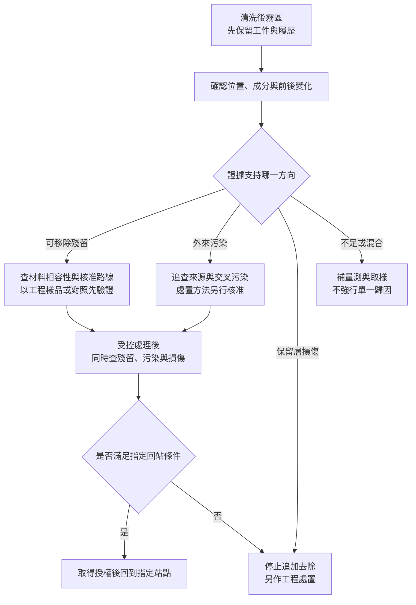

# 05 清洗後仍有殘留，下一步是再洗一次嗎？

## 一個「看起來不乾淨」的合成案例

晶圓在正常蝕刻、去光阻與清洗後，邊緣出現淡淡霧狀區。有人提議延長清洗，因為「中央已經很亮，邊緣再洗一下就好」。但霧狀外觀可能是殘留，也可能是微粒、粗糙化或局部膜厚差。**外觀只提供異常位置，不會自動給出物質身分。**

本章案例、觀察結果與處置分支均為**教學合成情境**，不是辛耘或任何客戶實績。假設工件是矽基材上的介電膜，介電膜已有蝕刻開口，光阻本應移除；必須保留膜厚、開口輪廓與表面狀態，不能用「全洗掉」解決。

## 先分清三種問題

[T03](appendix-sources.md#t03)區分光阻、殘留與粒子等去除對象；[T04](appendix-sources.md#t04)並列粗糙度、殘留及污染控制。以下分類用來安排證據，並非互斥：前站殘留也可能成為污染來源。

| 類別 | 本例候選情況 | 可用的檢查方向 | 量測盲點 |
|---|---|---|---|
| 殘留 | 未去盡光阻、蝕刻再沉積物 | 缺陷定位後，選適用表面化學或局部成分分析 | 影像形狀不等於化學身分；局部成分不代表整片 |
| 污染 | 再附著粒子、外來有機物、金屬污染 | 粒子檢查與適用元素／有機分析分列 | 粒子少不等於無離子或分子污染；元素結果不直接給出粒子位置 |
| 損傷 | 保留膜變薄、粗糙化、開口邊緣受侵蝕 | 膜厚、形貌、局部剖面及必要功能量測 | 平均厚度可能掩蓋局部缺損；幾何合格不證明電性正常 |

表中方法是選測方向，不是要求每片都做所有分析。還須問方法是否適用該膜系、取樣是否具代表性、會不會消耗樣品，以及偵測下限能否回答允收問題。[T09](appendix-sources.md#t09)支持幾何量測項目應分開，不替本表指定污染分析規範。

[{ .wiki-image width="600" loading="lazy" }](https://commons.wikimedia.org/wiki/File:Clean_room.jpg)

*圖 05-W1｜無塵室照片提供「工件在受控環境中被處理」的實物背景，但環境、人員與設備外觀都不能證明晶圓表面零污染。圖中看不見本章要分辨的薄層殘留、離子污染與局部膜損傷；也不能由照片推定潔淨等級。來源為 NASA Glenn，非辛耘工廠；公有領域，[圖片出處 W06](99-image-credits.md#w06)。*

## 輸入與第一輪操作：保留證據

輸入除了工件與膜系，還要有清洗前後缺陷圖、熱與蝕刻履歷、處理批次、保留層基線及量測設定。先將異常片留在受控狀態，避免直接重洗抹掉線索；再用一致座標比較霧區、正常區與適用對照樣品。

第一輪操作不是「加強清洗」，而是建立可比較證據：確認霧區能否重複觀察，排除照明或量測設定差異，再選有辨識力的方法。輸出是一張候選原因表，不是立即開出藥液條件。

| 候選原因 | 要找的差異 | 不能直接作的推論 |
|---|---|---|
| 光阻硬化或被再沉積物覆蓋 | 加工履歷、霧區成分與正常區不同 | 有有機訊號就一定全是原光阻 |
| 清洗或搬運後重新附著 | 前後位置圖、對照樣品與批次關聯 | 同批發生就一定是設備單一原因 |
| 原膜厚差或清洗造成損傷 | 處理前後厚度與形貌變化 | 看見粗糙就一定由最後一次清洗造成 |

[T01](appendix-sources.md#t01)支持熱歷史與乾蝕刻再沉積可能改變去除行為；其他候選原因是本例調查方向，不是原廠公布的失效案例。

## 檢查結果如何改變處置？

假設第一輪得到三項結果：選定霧區測點有與光阻來源相容的有機訊號；同座標膜厚與形貌在現有方法的解析能力內未見顯著改變；粒子檢查沒有對應的明顯增加。這組證據**支持優先調查有機殘留**，但尚未證明其唯一來源，更沒有排除金屬污染或低於偵測能力的損傷。

*圖05-1｜教學假設：合成案例的處置分支。多種問題可同時存在；箭頭不代表每條路徑必定能救回晶圓。*

本例下一步是查找已核准、適用該膜系與履歷的補充去除路線，先在適當工程樣品或對照上確認。若沒有相容性與授權，就停在工程評估，不能把產品片當配方試驗材料。

## 第二輪輸出與再驗證

再假設受控處理後，霧區減少，有機訊號低於該方法的檢出限，保留膜與開口檢查也通過事先指定條件。應記為：「本次取樣與方法範圍內，目標殘留及指定結構檢查通過。」不能寫成「零殘留、零污染、可靠度無虞」。

回站前仍須核對污染項目是否被覆蓋、未取樣區如何處理，以及後續加工需要的表面或功能要求。若新增金屬污染證據，或發現局部侵蝕，即使外觀變亮也不能放行。若確定損傷在原始基線就已存在，則須重新判定原用途資格，不將責任全歸給清洗，也不因它是舊傷就忽略。

這個案例的終點不是「洗到看不見」，而是有範圍、有方法、有停止條件的結論；完整放行層次見[第 09 章](09-requalification.md)。

## 辛耘的公開證據能支持到哪裡

| 已確認事實 | 合理推論 | 尚待查證 |
|---|---|---|
| 官方產品研究記錄濕製程與光阻剝離用途，查核狀態見 [C04](appendix-sources.md#c04) | 評估此類設備應將去除效果、污染與保留層損傷分列 | 本例異常的特定機型適用性、重工核准、量測界限與客戶案例；不能由用途介紹推出 |

辛耘光阻剝離文章談到殘渣與過濾控制（[C11-b](appendix-sources.md#c11)），可補充公司公開關注的控制對象；但不能據此判定本例霧區原因、量測下限或重工路線。

## 推理檢查

1. 霧區變亮，為什麼不能證明已經乾淨？
2. 粒子檢查通過，還有哪些問題可能沒被看見？
3. 有機訊號低於檢出限，與完全沒有有機物差在哪裡？
4. 若殘留少了，但保留膜超出損失限制，應如何處置？

??? note "參考推理"
    1. 外觀可能受膜厚或粗糙度影響，且部分污染沒有明顯影像。
    2. 分子或離子污染、薄層殘留、局部材料損傷與功能變化，可能需要不同方法。
    3. 前者限定方法、位置與能力；不能排除更低含量或未取樣區。
    4. 停止追加去除並交工程判定；目標物減少不能抵銷保留結構失格。

## 來源與待查

去除難度見 [T01](appendix-sources.md#t01)，對象與控制項目見 [T03](appendix-sources.md#t03)、[T04](appendix-sources.md#t04)，幾何量測邊界見 [T09](appendix-sources.md#t09)。本例未使用真實失效資料；污染分析的具體方法、取樣規範、允收與公司重工證據仍待查，不以清潔外觀補足。

---

[← 04 光阻圖案的重做窗口](04-photoresist-window.md) ｜ [06 去膜與材料帳本 →](06-film-removal.md)
