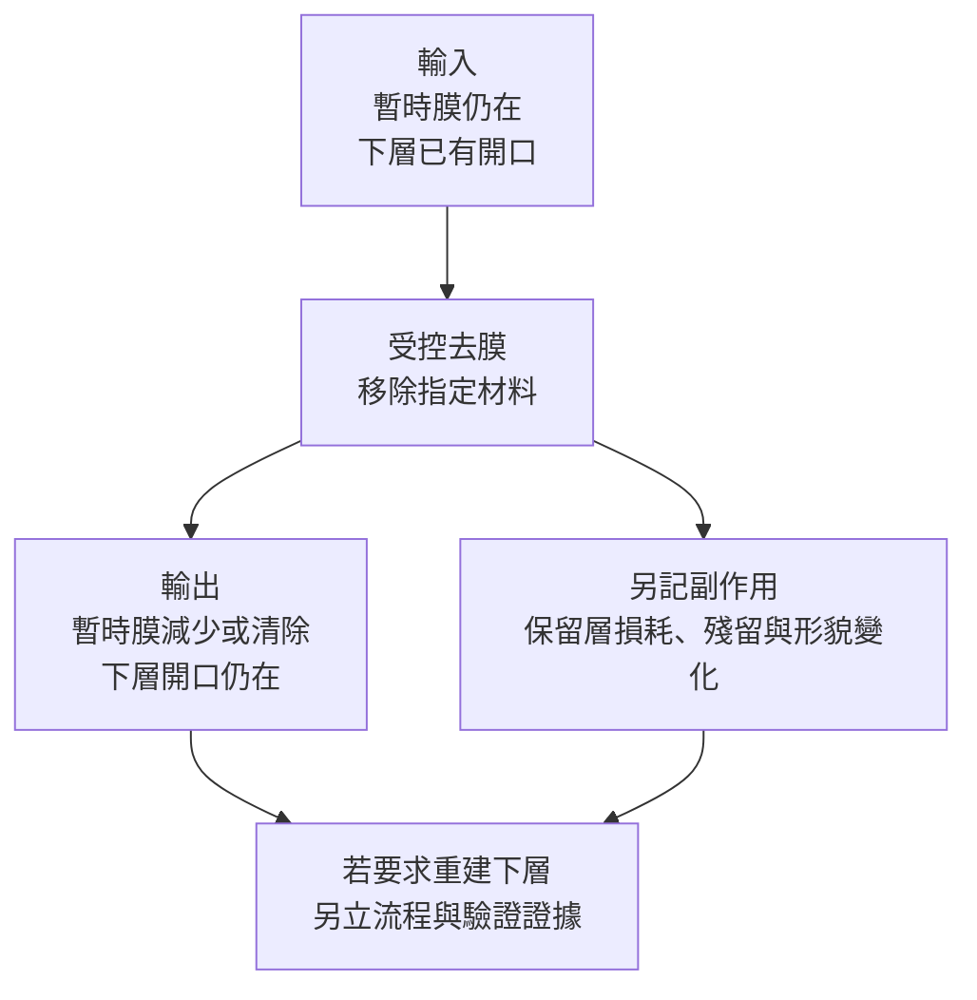

# 06 去膜可以清掉什麼，不能還原什麼？

## 表面少了一層，就是回到上一站嗎？

光阻去掉了、金屬膜不見了、介電層露出來了，這些都只說明某些材料被移除。若先前蝕刻已挖出錯誤開口，去膜並不會填回它；若保留金屬已腐蝕，洗掉腐蝕產物也不等於恢復金屬連續性。**移除是一筆材料支出，不是把加工歷史倒帶。**

[第 04 章](04-photoresist-window.md)已比較光阻圖案與下層圖案。本章進一步建立去膜前後的材料帳本，並用凸塊下金屬化（UBM，under-bump metallization）說明：多層材料中的「留哪裡」與「去什麼」同樣重要。

## 先替每一層記帳

假設工件由矽基材、已有開口的介電膜與待移除的暫時膜構成。暫時膜可能是光阻，但不能把光阻的去除資料直接套給所有硬遮罩或金屬膜。[T01](appendix-sources.md#t01)談的是光阻及相關相容性；[T03](appendix-sources.md#t03)亦將不同移除對象與流程分列。

| 材料帳本 | 輸入狀態 | 本次預定變化 | 必須核對的輸出 |
|---|---|---|---|
| 暫時目標膜 | 有厚度、圖案及加工履歷 | 依核准範圍移除 | 局部殘膜、再沉積與清除終點 |
| 介電保留膜 | 已有開口與指定輪廓 | 不得超出允許損失 | 厚度、開口、側壁與粗糙度 |
| 既有金屬或接點 | 若存在，須標出暴露位置 | 保留必要厚度與連續性 | 腐蝕、下切、殘留與電性 |
| 矽基材 | 提供結構支撐 | 不因去膜而視為可任意消耗 | 適用的表面、損傷與幾何證據 |

帳本應分位置記錄；平均值不能把一處過度移除與另一處殘膜互相抵銷。先前已失去的材料也要保留在紀錄裡，不能因這次不再看見遮罩，就把既有缺口改記為「原始表面」。

*圖06-1｜教學假設：去膜前後材料帳本的變化，非官方流程。箭頭只代表本次處理，不表示重建一定可行，也不表示去膜會自動補回已蝕刻材料。*

## UBM 為什麼特別需要「留層邊界」？

UBM 是位於凸塊下方、連接接點與凸塊的金屬結構概念，常涉及附著、阻障與導電等功能；不同設計可能合併功能或採不同層數，不能把示意名稱當成固定材料堆疊。

在本章的**簡化教學情境**，假設某導電薄層原先跨越凸塊區與間隙區，製程要求移除間隙中的部分，同時保住凸塊下方需要的部分。這裡同一材料的不同位置，分別是目標與保留對象，僅有材料間的高選擇比仍不夠。

| 空間位置／界面 | 這次想達到的結果 | 過度簡化會漏掉什麼 |
|---|---|---|
| 凸塊間暴露區 | 指定導電薄層清除，避免非預期連接 | 局部殘膜可能不由外觀辨識 |
| 凸塊覆蓋區 | 必要金屬與接觸保持完整 | 上方有遮蔽，不代表側邊完全不受影響 |
| 凸塊邊緣 | 維持允許輪廓與有效接觸範圍 | 側向侵蝕可能縮小保留區 |
| 鄰近保護膜與接點 | 表面、膜厚與功能仍符合要求 | 移除金屬的條件未必對其他材料安全 |

這只是留層邊界的教學，不指定金屬種類、層序、厚度或化學路線。[T04](appendix-sources.md#t04)可支持速率、粗糙度、殘留與污染應一起看，但**沒有提供上述堆疊的驗證結果**。本章也不替任何實際 UBM 結構宣布可重工。

## 從異常到處置分支

假設去膜後仍測到不該存在的導通。候選原因可能是間隙殘膜、其他導電污染或原結構問題；不能只憑電性便判定延長去膜。反之，接觸電阻上升可能涉及保留區受侵蝕、界面殘留或接點損傷，不能一律歸為「沒洗乾淨」。

輸入先附上材料帳本、版圖位置、加工履歷與前後量測；操作前對準異常位置，以適用的形貌、成分及電性證據交叉檢查，再分三條路：

1. **證實目標區殘膜：** 僅在保留層仍有餘裕且有核准窗口時，評估補充移除；較長時間可能加劇邊緣下切。
2. **證實保留區缺損：** 停止追加去膜。若要補材料或重新圖案化，屬另一個工程方案，須獨立證明界面與功能。
3. **殘留、污染與損傷尚未分清：** 補證據並保留樣品，不以反覆清洗代替診斷。

## 再驗證：帳本要和功能一起結清

輸出至少包括目標區清除證據、保留區厚度與輪廓、殘留／污染，以及用途要求的連續性、接觸或絕緣檢查。取樣要涵蓋容易較早暴露的區域，不是只選外觀最好看的位置。[第 03 章](03-removal-selectivity.md)的速率模型只能提醒暴露差異，不能直接計算本章省略的側向侵蝕。

通過上述項目仍只是指定範圍的再驗證；後續接合與可靠度條件要另查。若沒有處理前基線，也應明寫無法區分既有損傷與本次新增變化，不能把缺資料包裝成「沒有損失」。

## 辛耘的公開證據能支持到哪裡

| 已確認事實 | 合理推論 | 尚待查證 |
|---|---|---|
| 官方產品研究記錄濕製程與光阻剝離用途，定位與查核狀態見 [C04](appendix-sources.md#c04) | 去膜需求可用材料、位置、保留結構與驗證條件分析 | 特定 UBM 堆疊是否適用某機型、能否重工、側向損耗及客戶資格；本章情境不能替公司證明 |

辛耘另有 UBM 蝕刻方案與 UBM 功能概述（[C11-c／C11-d](appendix-sources.md#c11)），可確認公司公開談論相關製程站點；沒有同時提供本章特定堆疊的前後損耗及回站資格，因此仍不能把設備方案升級成重建或重工實績。

## 推理檢查

1. 去膜後露出介電層，為什麼不代表回到蝕刻前？
2. 同一種金屬能同時是目標材料與保留材料嗎？
3. 材料間選擇比很高，為什麼仍可能傷到凸塊下方？
4. 若要重新沉積補回缺損，還缺哪些證據？

??? note "參考推理"
    1. 已形成的開口與側壁仍在，移除上層不會填回缺失材料。
    2. 能。角色由任務及位置決定；間隙區要去除，接點下方可能必須保留。
    3. 同一保留材料若從側邊暴露仍可能被移除，且實際多材料界面不能由簡單速率比保證。
    4. 缺少重建流程授權、界面與形貌、污染、尺寸、電性及後續可靠度證據；不是原去膜流程的自然延伸。

## 來源與待查

光阻相容性見 [T01](appendix-sources.md#t01)，正常去除位置與對象見 [T02](appendix-sources.md#t02)、[T03](appendix-sources.md#t03)，控制目標見 [T04](appendix-sources.md#t04)。UBM 表為概念性教學假設，不是經驗證堆疊；材料專屬速率、下切、殘留、電性與可靠度允收仍缺一手證據，不提供堆疊專屬配方。

---

[← 05 殘留、污染與清洗損傷](05-cleaning-and-residue.md) ｜ [07 暫時接合與解鍵合 →](07-bonding-and-debonding.md)
