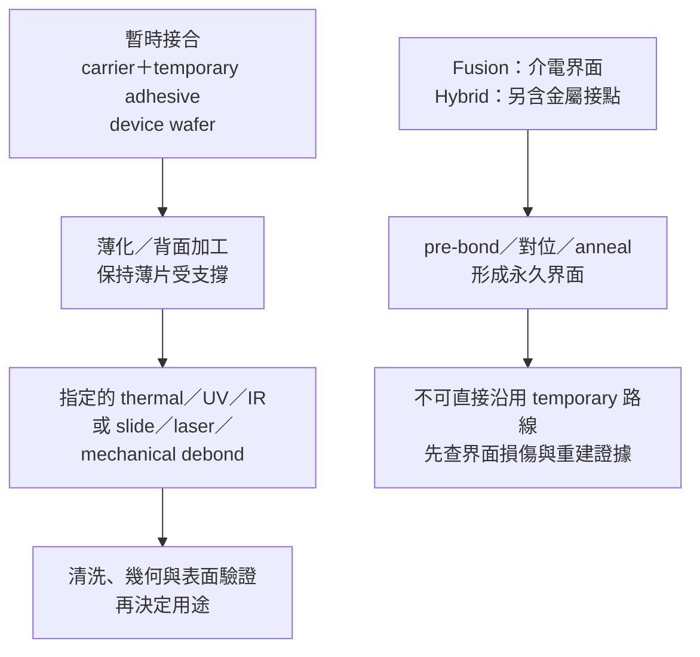

# 07 暫時接合為什麼能解開，永久接合不能照搬？

## 先問：解開的是哪一個界面？

看到兩片晶圓被分開，很容易把它寫成「解鍵合成功」。但真正要問的是：**原本的接合是為了暫時支撐，還是已經形成產品的一部分？分離後要保留的是哪一片、哪一面，以及什麼功能？**

暫時接合通常把載具、黏著層與 device wafer 組成一個可加工的結構；永久或混合接合則把兩個表面形成的界面當成長期結構。兩者都可能使用「bonding」這個字，卻不能共用同一張 debond 工作單。本章承接[第 06 章](06-film-removal.md)的材料不可逆變化，先不討論特定機型，也不把原廠產品頁當成重工證據。

## 工件不是只有「兩片晶圓」

處理前先把工件拆成層次。暫時接合至少要記錄 carrier 的支撐面、temporary adhesive、device wafer 的厚度與加工面，還要記錄黏著材料、熱歷史、已完成的背面製程與預定分離方法。若是永久接合，則記錄實際界面材料、對位與熱歷史；fusion bonding 可由介電界面形成，hybrid bonding 才在此基礎上加入金屬接點，不能將兩者畫成相同堆疊。

| 層次／角色 | 輸入時要知道什麼 | 操作時要避免什麼 | 輸出要證明什麼 |
|---|---|---|---|
| 載具 carrier | 材料、平坦度、支撐面與夾持方式 | 薄片在移交時失去支撐 | 分離前後是否有翹曲、破片或搬運痕跡 |
| 暫時黏著層 | 黏著系統、厚度、熱／光歷史與相容性 | 把 thermal、UV、IR、slide、laser、mechanical 路線互換 | 指定路線是否完成，殘留是否仍需清洗 |
| device wafer | 薄化後厚度、圖案、邊緣與背面加工履歷 | 以「可解」推論零損傷 | 保留晶圓的表面、幾何與功能證據 |
| 永久／混合界面 | 依機制記介電層、金屬接點（若有）、pre-bond 與 anneal | 套用 temporary debond 的力、熱或光路線 | 界面是否仍符合原用途；不能只看是否分開 |

EVG 將 temporary bonding 放在薄化與 thin-wafer transfer 的支撐脈絡，並分列 thermal slide-off、UV 與 IR laser 等 debond 路線（[T05](appendix-sources.md#t05)）。Brewer Science 也把 device wafer 可逆安裝到 carrier、薄化期間的機械支撐，以及 slide、laser、mechanical 分離放在同一流程中（[T06](appendix-sources.md#t06)）。這些資料支持的是「預先設計的退出路徑」，不是「任何接合都能拆」。

相反地，EVG 對 fusion／direct bonding 說明 permanent connection，對 hybrid bonding 則說明介電界面中嵌入金屬 pad，並把後續 anneal 與共價鍵形成放在界面形成的脈絡（[T08](appendix-sources.md#t08)）。因此，永久或混合接合若出現異常，第一步不是尋找一個看似相同的 debond 按鈕，而是確認界面機制、破壞代價與是否存在獨立的重建路線。

*圖 07-1｜跨來源整理：暫時接合的退出路徑與永久／混合接合的界面形成不同；不是任何廠商的完整製程圖。*

## 異常不只有「解不開」

假設一片薄化後晶圓在 debond 後出現局部殘留。候選原因可能是黏著層沒有依指定機制軟化或分解，也可能是 carrier 與晶圓的翹曲讓局部受力不均；若殘留集中在金屬特徵附近，還要把 peel、清洗與金屬損傷分開。SUSS 將 clean debond、carrier compatibility 及解鍵合前的 warpage／alignment 檢查放在產品說明中（[T07](appendix-sources.md#t07)），但 `residue-free` 仍是供應商 claim，不能直接當作某片晶圓的允收結果。

處置可分四條路：

1. **暫時接合且履歷完整：** 核對黏著材料、載具、熱歷史與指定 debond 方法；依核准路線分離，再把殘留、邊緣、翹曲與表面檢查列為輸出。
2. **暫時接合但方法或材料不明：** 隔離工件，不以加熱、拉力或光照試錯。先補 carrier、黏著層與薄化履歷，再判斷是否有適用窗口。
3. **已知為永久／混合接合：** 不把 temporary debond 當候選標準流程。若要分離，須另有界面工程、結構保留與後續重建證據；否則交由停止、報廢或其他用途判定。
4. **已分離但表面或幾何異常：** 不因晶圓已經分開就放回流程。將殘留／粒子、厚度、TTV、bow／warp、edge roll-off 與必要功能檢查分列。

## 分離後要驗證什麼？

分離的輸出不是一句「carrier 已移除」，而是能否把保留晶圓送到**指定的下一站**。KLA 將 thickness、flatness、bow／warp、dual-sided nanotopography、stress 與 edge roll-off 分列為不同幾何／表面量測項目（[T09](appendix-sources.md#t09)）。SEMI 3D4 公開摘要也把 bonded stack 的 thickness、TTV、bow、warp、sori、flatness 與量測方法分開，並區分 temporary adhesive 與 adhesive／oxide／metal-metal 的 permanent bonding（[T10](appendix-sources.md#t10)）。

因此，至少要留下四層證據：一是分離後的殘留、粒子、刮傷與金屬特徵；二是厚度、TTV、平坦度、翹曲與邊緣狀態；三是該用途所需的圖案、接觸或電性；四是若要回到產品用途，另行指定的可靠度資格。SEMI 公開頁是摘要，不是付費標準全文；本章不給通用允收數字，也不把幾何通過寫成可靠度通過。

## 辛耘的公開證據能支持到哪裡

| 已確認事實 | 合理推論 | 尚待查證 |
|---|---|---|
| [C06](appendix-sources.md#c06) 涉及暫時貼合；[C05](appendix-sources.md#c05) 涉及剝離後清洗，實際讀取範圍見來源附錄 | 若某工件需要載具支撐或分離後清洗，這些是需求分析可用的功能類別 | 尚未證實辛耘特定機型、材料窗口、失效重工案件、重工次數或回貨資格；不得把正常加工寫成重工服務 |

C05 的清洗用途不能代替分離機制的證據；C06 的暫時貼合也不代表同一台機器包辦解鍵合與清洗。具體設備分工回到[第 11 章](11-scientech-evidence-map.md)核對。

## 推理檢查

1. 為什麼 EVG 列出 thermal、UV、IR debond，不能解讀成三者可以互換？
2. 一片晶圓已和 carrier 分開，為什麼仍不能說「解鍵合成功」？
3. 永久／混合接合若真的可以被某種方式分離，為什麼仍不能沿用 temporary 的回退結論？
4. 解鍵合前看到 warpage，為什麼它不是單純的外觀問題？

??? note "參考推理"
    1. 各路線依賴不同黏著材料、界面與設備能量；原廠列出多種方法，正表示要按材料與流程配對，而非提供通用替換。
    2. 分離只描述界面是否失去連接，沒有回答殘留、金屬特徵、邊緣、厚度、翹曲與後續功能是否仍合格。
    3. 須依實際接合機制分別考慮介電、金屬接點與熱歷史；即使物理上能分開，也要另外證明保留面可用、界面可重建或用途已改變。
    4. 翹曲會改變薄片受力、搬送與局部 debond 條件；若不先量測，後續破片或表面損傷無法分辨是在界面、載具還是移交時發生。

## 來源與待查

暫時接合與分離路線見 [T05](appendix-sources.md#t05)、[T06](appendix-sources.md#t06)；產品頁的 clean debond 與分類見 [T07](appendix-sources.md#t07)；永久／混合界面見 [T08](appendix-sources.md#t08)。幾何量測覆蓋見 [T09](appendix-sources.md#t09)、[T10](appendix-sources.md#t10)。上述原廠資料不是通用 rework SOP；SEMI 只讀公開摘要，未取得全文公式或允收值。仍缺特定接合堆疊、分離後可靠度與公司重工應用證據。

---

[← 06 去膜與不可逆變化](06-film-removal.md) ｜ [08 薄晶圓支撐與搬運 →](08-thin-wafer-handling.md)
