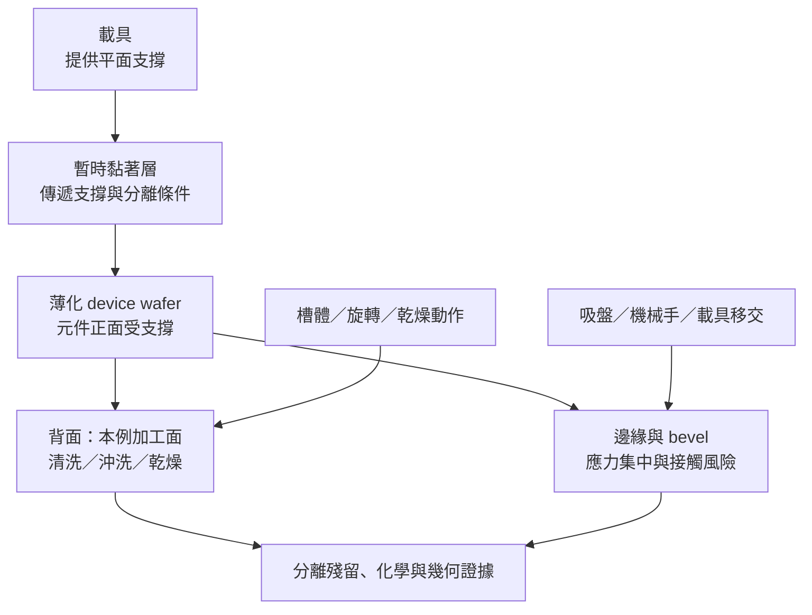

# 08 薄晶圓清洗後邊緣破損，真的是藥液造成的嗎？

## 先把「發現時間」和「損傷時間」分開

薄化後的晶圓在清洗、乾燥完成時被發現邊緣缺口。最直覺的說法是：「清洗藥液把邊緣咬壞了。」但這句話把化學、支撐、搬運與乾燥的證據都提前結案。真正的問題是：**破損是在入站前已存在、在載具移交時擴大、在液體處理中形成，還是在沖洗／乾燥的最後階段才被看見？**

以下是一個**完整教學合成案例**，不是公司實例。工件是一片已薄化並暫時接合於 carrier 的 device wafer；清洗後看到 edge chip，卻沒有直接證據能把原因歸給藥液。本章把加工面、支撐面與邊緣拆開，承接[第 07 章](07-bonding-and-debonding.md)的接合路徑，並把殘留與清洗損傷接回[第 05 章](05-cleaning-and-residue.md)。

## 工件層次、輸入、操作與輸出

薄晶圓不是「縮小版普通晶圓」。厚度降低後，邊緣、carrier 平坦度與移交動作都可能改變受力。**本例明定元件正面透過暫時黏著層接到 carrier，已薄化的背面是清洗加工面**；不是把正背面名稱當成所有設備固定的上下方向。清洗液接觸的是有支撐條件的薄片，而不是自由懸空的平面。

| 流程欄位 | 本案例要記錄的內容 |
|---|---|
| 輸入 | 薄化後厚度、正背面、carrier／黏著層、edge／bevel 基線、已有裂紋與前站履歷 |
| 操作 | 上下片、搬運、液體接觸、沖洗、旋轉或其他乾燥、下片與解鍵合順序 |
| 輸出 | 邊緣缺陷位置與形貌、殘留／粒子、幾何變化、表面粗糙或金屬損傷、可否進入指定下一站 |

EVG 將暫時接合描述為薄化與 thin-wafer transfer 的支撐機制（[T05](appendix-sources.md#t05)）；Brewer Science 也提醒薄化後 device wafer 不應處於無支撐狀態，並把背面加工、分離與清洗放在連續流程中（[T06](appendix-sources.md#t06)）。所以清洗案例不能只問化學配方，還要問晶圓在進槽、出槽、乾燥與移交時由什麼支撐。

*圖 08-1｜教學假設：支撐、加工面與邊緣風險的關係；非特定設備剖面，也不表示每一清洗流程都包含相同動作。*

## 合成案例：清洗後看到 edge chip

假設入站時只做了低倍率外觀檢查，沒有留下完整 edge map。整組 carrier 與薄晶圓的接合堆疊移交到清洗模組，**本輪沒有先解鍵合**。完成液體處理與乾燥後，出站才在三點鐘方向看見缺口。此時至少有四組候選原因：

1. **既有微裂紋在後續被放大：** 薄化、前站搬運或早期接合已留下裂紋；清洗只是最後一次移交後才讓缺口可見。
2. **支撐或搬運造成的機械事件：** carrier 平坦度、黏著層空洞、夾持不均或機械手邊緣接觸使局部應力集中；須分清接觸的是 carrier 還是薄晶圓。
3. **化學或表面變化：** 液體處理造成局部粗糙、腐蝕、膜損失或殘留；Entegris 將 etch rate、roughness、residue、particle 與 contaminant 分開列為控制對象（[T04](appendix-sources.md#t04)），但該頁沒有替本案例指定原因。
4. **沖洗／乾燥事件：** 液體滯留、乾燥時的毛細力、溫度差、旋轉或局部支撐改變，使原有缺陷擴大；「最後被看到」不等於「最後才形成」。

查核順序要沿實際履歷建立時間線：接合基線、薄化後檢查、各次搬運、入站與清洗前後、沖洗後、乾燥後及下片。若後續另有解鍵合，才另外記錄分離前後，不把本輪未發生的動作補成原因。若入站已有同方向裂紋，化學原因不能獨占解釋；若只有乾燥後才出現，且在方法能力內未見化學成分與粗糙度變化，可優先調查乾燥與支撐，但不能因此完全排除化學影響。若缺口伴隨局部膜厚減少或腐蝕形貌，則增加追查材料移除條件的理由；金屬污染本身也不能單獨證明破損原因。

## 處置分支：先保全證據，再決定是否繼續

- **邊緣缺陷入站已存在：** 先隔離，建立裂紋長度、方向、位置與擴展前後影像；不得只因它在清洗後被發現，就重跑同一清洗。
- **支撐／搬運時間點吻合：** 檢查 carrier、黏著層、吸盤與移交接觸紀錄，必要時保留未再處理的對照片。沒有支撐條件，就不能把化學相容性當成充分理由。
- **乾燥後才出現：** 將沖洗、滯留、旋轉、溫度與乾燥方式列為獨立變因；不以「液體已排出」推論機械應力為零。
- **化學證據明確：** 另行比對暴露位置、膜厚、粗糙度、殘留與污染；清洗得更久不是自動補救，可能擴大保留層損失。
- **證據互相矛盾：** 停止回站，保存工件與紀錄，交由工程判定是否可改作他用、報廢或建立受控試驗片。不能把產品片當成未知機制的試片。

### 本例的結案不是「再洗一次」

延續教學假設，補查後發現缺口方位與一個移交接觸位置相符，但缺少足以辨識微裂紋的入站影像。這提高了搬運因素的調查優先度，**尚不能證明裂紋一定由該次接觸產生**。本例決定保留異常片、不追加清洗、不回到原產品流程；另用工程對照工件分離支撐與搬運變因，並補齊各交接點影像。

即使對照試驗改變支撐後不再觀察到同類缺口，結論也只是支持改善方案在該條件下的效果，不表示原異常片已被修復。停止處理、保存證據同樣是完整的工程處置結果，不必每個案例都以救回晶圓收尾。

## 處置後的驗證

驗證要按層次分開。先看邊緣是否繼續擴展，再看加工面殘留、粒子、粗糙度、膜厚與金屬特徵；若薄化或支撐狀態改變，還要量測 thickness、TTV、flatness、bow／warp 與 edge roll-off。KLA 的公開量測頁列出這些是不同輸出（[T09](appendix-sources.md#t09)）；SEMI 3D4 公開摘要也提醒 bonded stack 的量測方法需配對工件狀態（[T10](appendix-sources.md#t10)）。這些資料不能替本案例給出裂紋允收值，更不能以「沒有再看到缺口」直接推論可靠度合格。

## 辛耘的公開證據能支持到哪裡

| 已確認事實 | 合理推論 | 尚待查證 |
|---|---|---|
| [C05](appendix-sources.md#c05) 涉及剝離後清洗；[C06](appendix-sources.md#c06) 涉及暫時貼合，實際讀取範圍見來源附錄 | 薄晶圓案例需要同時分析清洗、支撐與搬運；流程若包含分離，還須另查分離功能 | 未證實辛耘特定設備處理本案例、邊緣破損責任、重工應用或可靠度資格 |

本章只使用 C05／C06 作為功能分類線索，不把剝離後清洗產品直接套入本例尚未解鍵合的加工順序，也不把「可處理薄晶圓」改寫成「可修復破損晶圓」。

公司另公開 Wafer-on-Frame 清洗方案，工件是**解貼合後固定於框架的薄晶圓**（[C11-a](appendix-sources.md#c11)）。它和本例保留 carrier 的狀態不同，反而說明讀型錄時必須先問支撐方式，不能只看「薄晶圓清洗」六個字。

[{ .wiki-image width="600" loading="lazy" }](https://commons.wikimedia.org/wiki/File:A_semiconductor_wafer_on_a_dicing_(blue)_tape._Few_chips_(dies)_from_the_wafer_have_already_been_picked_up_(removed)_for_further_manufacturing.png)

*圖 08-W1｜另一種支撐狀態的實物：晶粒由切割藍膜承接，空缺是已有晶粒被取走，不是本章案例的 edge chip。這張一般照片不展示案例中尚未解鍵合的 carrier 堆疊，也不能用來證明辛耘 Wafer-on-Frame 機型適用性、工件厚度或搬運允收。Khpsoi／CC BY-SA 4.0；[圖片出處 W07](99-image-credits.md#w07)。*

## 推理檢查

1. 為什麼清洗後才看到 edge chip，不能直接證明藥液造成破損？
2. 若入站影像已有同方向微裂紋，哪一類證據最先要補？
3. 乾燥階段需要獨立列出，難道沖洗已完成就沒有機械風險嗎？
4. 化學分析顯示有殘留，能否因此排除搬運或支撐造成的裂紋？

??? note "參考推理"
    1. 發現時間只界定最後一次看到缺陷的時點；裂紋可能在前站形成，清洗、移交或乾燥只負責放大或揭露。
    2. 應補入站與各交接點的 edge map、裂紋方向、長度及支撐／搬運履歷，先建立缺陷是否已存在的時間界線。
    3. 液體排出、旋轉、毛細力、溫度差與支撐改變都可能在乾燥或下片時作用；流程結束不等於受力消失。
    4. 不能。殘留可同時存在於一片已被機械損傷的晶圓；要把化學、機械與乾燥證據按位置和時間配對。

## 來源與待查

支撐與暫時接合見 [T05](appendix-sources.md#t05)、[T06](appendix-sources.md#t06)；清洗控制目標見 [T04](appendix-sources.md#t04)；幾何量測見 [T09](appendix-sources.md#t09)、[T10](appendix-sources.md#t10)。原廠頁面支持的是流程角色與量測項目，不是本案例的因果判定或裂紋允收。仍缺特定薄度、carrier／黏著系統、乾燥條件、edge defect baseline 與公司重工應用證據。

---

[← 07 暫時接合與解鍵合](07-bonding-and-debonding.md) ｜ [09 重做後的再驗證 →](09-requalification.md)
