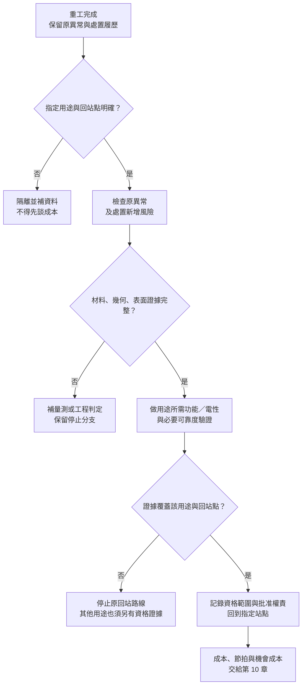

# 09 重做後，什麼證據允許回到哪一站？

## 「量到通過」不等於「可以回線」

重工後最容易出現的錯誤，是把第一次不合格的量測重做一次，看到數字落在範圍內，就把晶圓送回原流程。真正要問的是：**這次處理修正了哪個問題，又新增了哪些風險；證據允許它回到哪一個指定站點，而不是籠統地說「恢復正常」？**

本章的再驗證不是一個通用 checklist，也不是可靠度規範。它是一個把工件用途、處置履歷、量測覆蓋與回站權限接起來的框架。成本、瓶頸時間與「值得不值得」留給[第 10 章](10-equipment-economics.md)；本章先回答資格問題。

## 先定義工件、用途與輸出

同一片晶圓可以有產品用途、測試用途或監控用途；每種用途需要保留的層、功能與可靠度證據不同。再驗證的輸入必須包括原始異常、實際處置、重工次數、材料與熱歷史、處理前後量測，以及預定回站。若只保存「重工完成」，後續無法判斷哪些結果可歸因於處置。

| 流程欄位 | 必須交出的資訊 |
|---|---|
| 輸入 | 工件識別、原始異常、目標層／保留層、處置履歷、指定用途與回站點 |
| 驗證操作 | 原異常重測，加上處置可能引入的材料、幾何、表面、功能與可靠度檢查 |
| 輸出 | 有範圍的資格結論、停止條件、批准權責、完整履歷，以及下一站或替代用途 |

這也區分三個常被混用的詞。**Retest** 是重新取得證據，未必改變材料；**rework** 是重新加工以滿足指定用途；**requalification** 是證明處理後的工件或流程仍符合某個用途所需資格。三者可能連續發生，但不能用其中一個詞代替另外兩個。

## 從原異常到新增風險

若光阻圖案在下層加工前被移除並重做，除了 CD／overlay，還要查去除對保留層、表面與附著的影響；[T01](appendix-sources.md#t01)提醒硬化、乾蝕刻再沉積、植入歷史與材料相容性會改變去除行為。若是清洗或去膜，則要把目標層、保留層、粗糙度、殘留、粒子與污染分開；[T04](appendix-sources.md#t04)支持這些控制項目不能壓成單一「乾淨」結果。

若工件曾經薄化、暫時接合、解鍵合或經過支撐搬運，驗證範圍再加入 thickness、TTV、flatness、bow／warp、edge roll-off、表面形貌與邊緣狀態。[T09](appendix-sources.md#t09)列出不同 wafer geometry 輸出；[T10](appendix-sources.md#t10)的公開摘要則把 bonded stack 的 thickness、TTV、bow、warp、sori、flatness 與方法選擇分開。這些是量測覆蓋的來源，不是重工晶圓的通用允收數字。

[{ .wiki-image width="600" loading="lazy" }](https://commons.wikimedia.org/wiki/File:B-ad-semphotoofsu8.png)

*圖 09-W1｜SEM（掃描式電子顯微鏡）讓局部截面可被看見；這張 SU-8 接合晶圓影像只覆蓋圖中的取樣區，不是全片厚度圖、接合強度試驗或可靠度結果。也不是第 07–08 章暫時接合材料系統的實測，更不是辛耘驗證資料。Fraunhofer ENAS、D. Neumann／CC BY-SA 3.0 de；[圖片出處 W08](99-image-credits.md#w08)。*

因此，交付影像還要交付取樣位置、方法能力與判定問題。能看見某個界面，不等於已證明所有界面都合格；圖像解析度也不能替代沒有執行的功能或可靠度試驗。

*圖 09-1｜跨來源整理：先判定用途資格，再把合格候選交給成本模型；不是公司放行流程，也不是 SEMI 標準流程。*

## 處置分支要寫出「能回哪裡」

**回到原流程：** 原異常已被修正，新增風險有適用量測或功能證據，且權責者批准的是某個明確站點。這不代表整片晶圓已經取得最終出貨資格；後續站點仍有自己的驗證。

**只回到較窄用途：** 幾何或表面結果足以支持測試、監控或其他明確用途，但不足以支持原產品。這是用途改變，不是把原標準偷偷放寬；必須重新寫輸出與允收。

**補資料或暫停：** 量測方法與工件狀態不匹配、前後座標無法對齊、履歷遺失，或原異常與新增損傷互相矛盾時，先保留工件。更多處理可能破壞證據，不能把「做完再看」當成驗證策略。

**停止、報廢或另定重建：** 保留層已超過可接受損失、界面功能不明、邊緣裂紋擴展，或沒有適用的回站路線時，交由工程與品質權責判定。重建下層、永久接合界面或 UBM 的電性恢復，都是獨立工程問題，不能從一次清洗或一次幾何量測推出。

可靠度要單獨列出。SEMI 3D4 公開頁只提供 bonded stack 量測指南的摘要，不能替任何重工件補出熱、濕、機械、電性壽命或封裝界面 stress 的通用允收值。即使 geometry、residue 與功能檢查都在範圍內，是否需要 reliability qualification，仍取決於用途規格、變更程度與批准流程。

## 辛耘的公開證據能支持到哪裡

| 已確認事實 | 合理推論 | 尚待查證 |
|---|---|---|
| [C05](appendix-sources.md#c05) 涉及剝離後清洗；[C06](appendix-sources.md#c06) 涉及暫時貼合，實際讀取範圍見來源附錄 | 這些功能可提示應詢問哪些加工履歷；仍須確認工件實際做過哪些處置 | C05／C06 不足以證明特定工件使用過該設備，更不能證明重工片已通過再驗證、可靠度或放行 |

本章不把公司產品分類轉寫成 requalification protocol，也不補寫未經證實的實際事件、產能數字或回貨案例。公司設備是否參與某個回站流程，要另有型號、膜系、履歷與正式驗證證據。

## 推理檢查

1. 為什麼重做原本失敗的量測項目，仍不足以完成再驗證？
2. 幾何量測通過但功能量測未完成，能否回到原流程？
3. 若原產品資格不足但監控用途足夠，應如何寫結論？
4. 為什麼本章不先計算重工成本？

??? note "參考推理"
    1. 重工可能修正原異常，也可能新增保留層損耗、殘留、形貌、幾何或熱歷史風險；只重測原項目會漏掉新增風險。
    2. 若該回站點要求功能證據，便不能。幾何只是證據層之一；應先確定該站所需的表面、功能／電性與必要可靠度範圍，不能反過來要求所有站點都做同一套最終測試。
    3. 明確寫成「在指定監控用途與本次驗證範圍內可用」，並標出不能推論原產品恢復，不把改作他用寫成原用途合格。
    4. 成本比較的前提是資格路徑已成立；若工件根本不能回站，便宜的處置也不能成為放行理由。第 10 章只比較已通過前提的候選方案。

## 來源與待查

材料歷史與去除相容性見 [T01](appendix-sources.md#t01)；選擇性、粗糙度與污染控制見 [T04](appendix-sources.md#t04)；暫時／永久接合分類見 [T07](appendix-sources.md#t07)、[T08](appendix-sources.md#t08)；幾何量測見 [T09](appendix-sources.md#t09)、[T10](appendix-sources.md#t10)。T10 只讀公開摘要，不當作付費標準全文；本章不給通用可靠度允收值。仍缺特定產品規範、回站批准、reworked wafer reliability protocol 與公司重工應用證據。通過資格後的設備時間、量測費與機會成本，留給[第 10 章](10-equipment-economics.md)。

---

[← 08 薄晶圓支撐與搬運](08-thin-wafer-handling.md) ｜ [10 設備時間與相關成本 →](10-equipment-economics.md)
