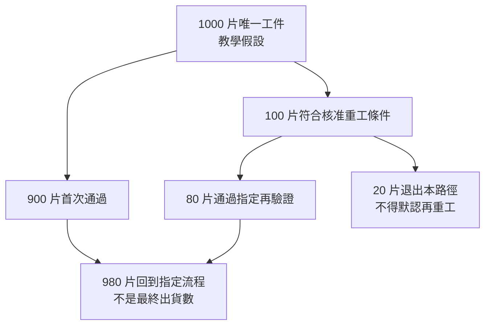

# 10 多一輪重工，設備時間和成本怎麼算？

## 先有資格，再問划不划算

「丟掉很可惜，再洗一次比較便宜」把兩個問題混在一起：這批工件是否有可核准的處置路徑，以及在那條路徑上要付出多少資源。[第 09 章](09-requalification.md)處理第一個；本章只在資格前提成立後比較第二個。低成本不能讓材料損傷消失，成功率也不是批准重工的依據。

以下是一個**教學假設模型**，所有時間、成本與比例都不是辛耘或任何客戶的實績。工件是同一膜系、同一允收目標的晶圓；經工程審查後，部分首次不合格片有一輪核准重工路徑。暫不考慮多輪重工，不把不合格片降級後混入同一產出。

## 先把人數、時間和分母固定

| 符號 | 假設 | 本章含義 |
|---|---:|---|
| N | 1,000 片 | 本期進入所比較流程的唯一晶圓數 |
| r | 10% | N 中進入一輪重工的比例；其餘 90% 首次通過 |
| s | 80% | **已進入重工的片數**中，完成指定再驗證並可回到指定流程的比例 |
| t₀ | 6 分鐘／片 | 每片首次占用本案例同一台瓶頸設備的時間 |
| tᵣ | 9 分鐘／片 | 每片重工額外占用該設備的時間，不含離線量測 |
| c₀ | 500 元／片 | 首次加工的假設相關成本，不含此前整片累積價值 |
| cᵣ | 120 元／重工片 | 重工處理成本，與量測成本分列 |
| cᵥ | 30 元／重工片 | 每片重工皆發生的再驗證成本，不只成功片才付 |

這裡的 s 是本模型對「完成指定再驗證」的假設，不是洗淨率，也不是最終出貨良率。假設首次未過的 100 片全部具備同一核准重工路徑，才可用 r 同時代表首次不合格與重工投入比例。若有不合格但不可重工片，必須另列，不能套同一公式。

[{ .wiki-image width="500" loading="lazy" }](https://commons.wikimedia.org/wiki/File:Wafermap_showing_fully_and_partially_patterned_dies.svg)

*圖 10-W1｜一片 wafer 裡有許多 die；圓周邊緣也可能出現不完整方格。此圖區分的是完整／不完整的圖案幾何，不是電性良品／不良品分布。本章的 1,000「片」數的是不同晶圓，不是圖中的方格，也不是機台加工次數；不能把晶粒數直接代入本章分母。Moxfyre／CC BY-SA 3.0；[圖片出處 W09](99-image-credits.md#w09)。*

## 一千片怎麼變成九百八十片

首次通過 `N × (1 − r) = 900` 片。進入重工 `N × r = 100` 片，其中通過指定再驗證 `N × r × s = 80` 片；剩下 20 片退出這條合格產出路徑，不再投入第二輪。

因此：

```text
合格回到指定流程的片數 Q
  = N × (1 − r) + N × r × s
  = 900 + 80
  = 980 片

對本期唯一投入片數的合格比例
  = Q / N
  = 98%
```

若把 100 次重工也算成新投入，分母會變成 1,100 次加工。`980 / 1,100` 是每次加工對應的產出比例，**不是同一批 1,000 片的合格比例**。兩者回答不同問題，不能在簡報上無標示互換。



*圖 10-1｜教學假設：分母固定為唯一工件，失敗支線也留在帳上。*

## 救回八十片，占用了多少設備？

首次加工時間 `N × t₀ = 6,000` 分鐘；追加重工時間 `N × r × tᵣ = 900` 分鐘。合計 6,900 分鐘，即 **115 小時**，比不重工的 100 小時多 15%。

這個 15% 不是平均週期時間延長 15%。若量測要排隊、批次槽有等批時間或搬送受限，日曆時間可能不同。模型只數瓶頸設備的占用時間；不拿理想節拍預測實際交期。

假設這台設備每期可用的有效加工時間只有 100 小時，穩態下平均每片投入需要 `6 + 0.1 × 9 = 6.9` 分鐘。可支持約 `6,000 / 6.9 ≈ 869.6` 片投入，對應約 `869.6 × 0.98 ≈ 852.2` 片合格回到指定流程。這是長期平均率，單一批次仍須用整片、實際排程處理。

不重工時，同樣 100 小時可投入 1,000 片，首次合格 900 片。於是出現重要的反直覺結果：**每批救回較多片，卻可能在同一瓶頸時間內交付較少合格片。** 這不代表應該直接報廢，而是要納入先前累積價值、新投片限制及其他設備是否能承接，不能只報「良率由 90% 升到 98%」。

## 成本算例：便宜也不等於可以放行

| 情境 | 本期相關成本 | 合格回到流程片數 | 每片合格產出的相關成本 |
|---|---:|---:|---:|
| 不進行重工 | `1,000 × 500 = 500,000` 元 | 900 | 約 555.56 元 |
| 一輪重工 | `500,000 + 100 × (120 + 30) = 515,000` 元 | 980 | 約 525.51 元 |

追加 15,000 元換得 80 片額外合格產出，邊際相關成本為 **187.50 元／額外救回片**。它不是每片總製造成本，也不包含已經投入的前段價值、最終封裝、庫存、報廢處理、交期與機會成本。

兩個比較必須分開：固定 1,000 片投入時，重工使本模型的單位合格成本下降；固定瓶頸時間時，重工可能排擠新的首次加工。若瓶頸時間有機會成本，需加進決策；若無足夠新片可投，產出比較的情境也要改。不能選擇對自己有利的分母而不說。

## 敏感度：不是每個成功率都值得同一句結論

維持其他假設及每片重工都需付 150 元：

| s：重工後通過比例 | 合格片數 Q | 相關成本／合格片 | 本模型可說的事 |
|---|---:|---:|---|
| 0% | 900 | 約 572.22 元 | 全部追加支出但沒有增加本路徑合格產出 |
| 50% | 950 | 約 542.11 元 | 比基準低，但仍占用 15 小時 |
| 80% | 980 | 約 525.51 元 | 本例主情境 |
| 100% | 1,000 | 515.00 元 | 僅假設所有候選片均通過指定再驗證 |

用上述同一批投入、同一成本範圍比較，當 `s > 27%` 時，重工方案的單位合格相關成本低於不重工方案；27% 時相等。這個門檻由 `515,000 / (900 + 100s) < 500,000 / 900` 得到，只在本表所有前提不變時成立。**它不是「成功率超過 27% 就批准重工」的品質標準。**

## 回到設備需求，而不是猜公司獲利

輸入是晶圓狀態與已核准處置；操作是額外加工、搬送及量測；輸出是可回到特定流程的工件與完整履歷。因此設備需求不只有 UPH，還包括換線、槽液／腔體維護、不同膜系是否能共線、追溯及瓶頸配置。

| 已確認事實 | 合理推論 | 尚待查證 |
|---|---|---|
| 公司公開業務及產品分類見 [11 證據矩陣](11-scientech-evidence-map.md)，不能用本章假設代替公司資料 | 重工若占用原產線，可能增加負荷；是否形成新增設備需求取決於可用產能及相容性 | 辛耘客戶實際 r、s、加工時間、成本、利用率；重工需求是否轉成訂單或收入 |

本章沒有從成功率估算辛耘毛利率。設備商賣機台、代理商交付原廠方案、服務商按服務範圍交付，營運分母並不相同；下一章才處理這三種業務。

## 推理檢查

1. 為什麼不能用 `980 / 1,100` 宣稱本批合格率？
2. 若再驗證費用只乘 80 片，本章成本少算了什麼？
3. 單位合格成本下降，為何仍可能不適合把全部候選片送回同一機台？
4. 重工後外觀通過率是 80%，能否直接代入 s？
5. 若 100 片不合格中只有 60 片有核准路徑，公式要改哪裡？

??? note "參考推理"
    1. 1,100 是加工次數，含同一晶圓再投入；本批唯一工件是 1,000 片。加工利用指標與工件合格率不能混用。
    2. 20 片失敗件也耗用量測資源。除非流程另有明確分流，不能只向成功件計費。
    3. 它會排擠首次加工；本例固定 100 小時下的合格流率反而下降。還要比較已投入價值、可用新片、交期與替代機台。
    4. 不能。s 的事件定義是通過適用再驗證並回到指定流程，不是只看外觀。
    5. 首次通過仍為 900 片，40 片不可重工另列；重工投入為60片，Q改為`900 + 60s`，時間與追加成本也都只對60片計算。

## 來源與待查

所有數值與公式均為本書原創教學模型，可依本章逐項重算，不是公司資料。資格與量測邊界接續[第 09 章](09-requalification.md)及 [T09](appendix-sources.md#t09)、[T10](appendix-sources.md#t10)；公司收入及事件證據留給 11–12。未納入的成本與排程因素不是零，而是本模型的適用限制。

---

[← 09 重做後的再驗證](09-requalification.md) ｜ [11 辛耘業務證據矩陣 →](11-scientech-evidence-map.md)
