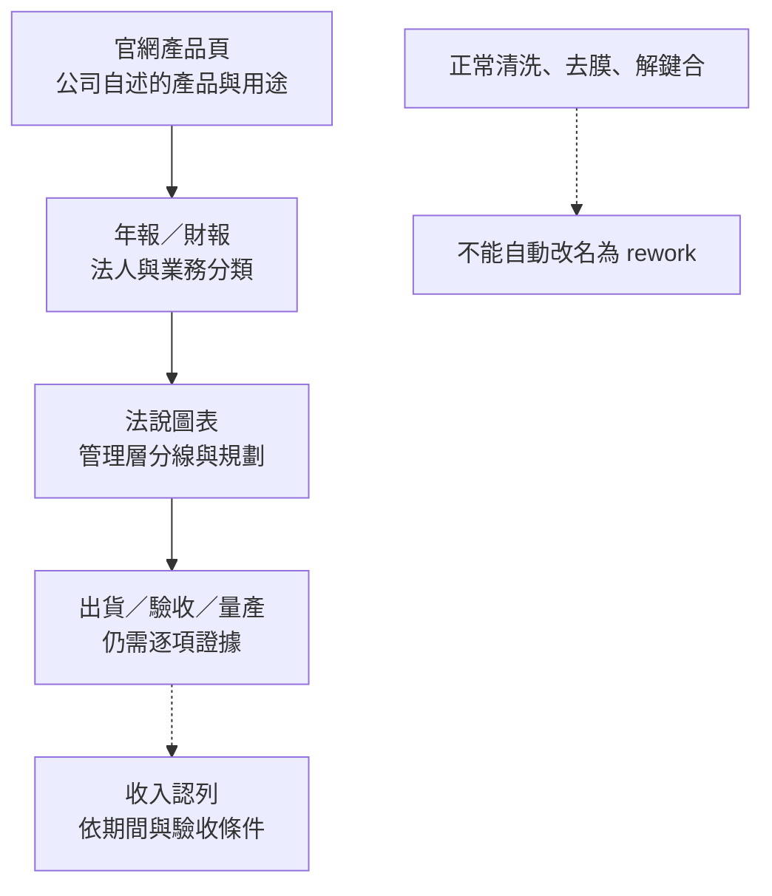

# 11 辛耘三條業務如何分開讀？

## 開場問題

同一個官網裡，既有 WS、Polar、Pyxis、Vertabake 等設備，也有代理產品與晶圓再生服務。若只看產品名稱，很容易把「公司能設計的機台」「公司替原廠銷售的方案」和「公司替客戶處理的晶圓」混成一條業務。本章不替公司補上未公開的客戶案例，而是把每一層證據放回它能支持的位置。

前十章談晶圓工程問題；本章才問辛耘公開交付什麼，以及哪些是自製、代理或再生服務。答案要同時讀產品頁、年報、財報與法說。

## 先把「公開能力」和「業務實績」分層

*圖 11-1｜跨來源整理：產品頁、業務分類、管理圖表和收入認列各自回答不同問題；箭頭是查核順序，不是必經的商業流程。虛線是不能跳過的證據缺口。*

本章的來源層級如下：

- **產品頁與技術文章：** 支持辛耘如何描述產品、用途和自製／合作方向；不能單獨證明客戶採用。
- **年報：** 支持公司在法定文件中如何分列自製設備、晶圓再生、代理，並可支持年報明示的「開始出貨」等公司陳述。
- **正式財報：** 支持特定期間的財務數字、收入認列及法定部門口徑；不能把製造部門直接當成自製設備。
- **法說：** 支持管理層的分線圖表與未來規劃；規劃不是完工、驗收或收入。

## 產品與服務證據矩陣

| 業務／產品 | 已讀官方事實 | 能支持什麼 | 不能支持什麼 |
|---|---|---|---|
| **自製濕製程：WS** | C04 寫批次最多 50 片，支援薄膜前清潔、蝕刻、蝕刻後清潔、光阻剝離；C07 p.69 把批次濕式製程列為自製設備。 | 辛耘公開的批次濕製程產品族與正常加工站點。 | 化學配方、選擇性、終點、UPH、膜系、客戶、驗收與重工用途。 |
| **自製濕製程：Polar** | C04 以單晶圓表面處理系統描述清洗／蝕刻，並自稱國產單晶圓濕製程設備；C07 p.69 有單晶圓自製設備類別。 | 辛耘公開的單晶圓清洗／蝕刻方向。 | 不支持任何節點、材料窗口、零損傷、客戶量產或特定失效補救流程。 |
| **自製烘烤：Vertabake** | C03、C04：一批 25 片，可垂直或水平烘烤，應用於預成型與預底部填充烘烤。 | 先進封裝批次熱處理設備方向。 | 溫度均勻性、熱曲線、固化終點、節拍、出貨與重工。 |
| **自製／合作開發：Pyxis TB** | C06 稱辛耘具自製機台研發能力，並與 3M 合作開發 Pyxis；用途含晶圓薄化、BGBM、SiC／GaN 薄化及先進封裝。 | 辛耘自述的暫時性貼合設備與合作開發關係。 | 3M 不是因此就成為代理原廠；合作分工、膠材、型號、客戶、驗證與量產未知。 |
| **自製剝離清洗：Pyxis** | C05 明稱以自製機台研發能力開發剝離清洗設備，提供薄化／先進封裝中剝離後的玻璃與晶圓清洗。 | 剝離後清洗站點與自製設備方案。 | 不支持修復錯誤層、恢復原結構、特定殘膠允收或失效晶圓重工。 |
| **代理業務** | C07 p.69、C10 pp.14、22–23 列 Lithography、Etch、Diffusion、Thin Film、Metrology、Robot Repair and Refurbish、Sub-Systems、Package & Material 等類別；辛耘代理導覽另列 Advanced Energy、ClassOne、KLA、WONIK IPS 等原廠／品牌頁。 | 可確認代理事業存在，也能舉出代理頁上的具體產品例：Advanced Energy 電源／RPS、ClassOne 2–8 吋電鍍與濕製程、KLA D-500／D-600／P-170 輪廓／膜厚量測、WONIK IPS 退火／PI 固化／PECVD／乾蝕刻。 | 這些是代理導覽下的原廠／品牌產品，不是辛耘自製；授權、期限、客戶、訂單、出貨與原廠規格的完整適用範圍仍未知。 |
| **晶圓再生** | C02 頁面標示 12 吋、22 萬片／月與銅／鋁製程線；C07 p.69 說明測試片／擋控片分類、清洗、研磨、拋光、潔淨乾燥後再作控／擋片；C10 p.15 另寫 210K／月。 | 可確認晶圓再生是服務線，且工件用途偏向測試片與擋控片再利用。 | 不等於 active wafer repair、恢復電路、客戶產品救回或生產線 layer rework；容量口徑也不能直接合併。 |

矩陣刻意保留空白：官網的「解決方案」語氣不會自動增加客戶、驗收或收入證據。

## 三種業務，三種財務讀法

### 1. 年報和官網先回答「公司把什麼當成自製」

C07 p.69 的分類很有用：自製設備包含批次／單晶圓濕式製程與 TBDB；晶圓再生另列測試片與擋控片的再利用；代理設備則另列半導體、光電、LCD、LED、太陽能等產業的設備、量測、化學分析儀器與材料。這比「看到一台清洗機就猜它是辛耘自製」可靠，因為年報明確提供了法人自己的分類。

年報 p.4 另稱 TBDB 系列機台已全數開發完成，並已開始出貨給客戶。這可以支持「公司在年報中自述已進入出貨階段」，但出貨不是驗收，驗收也不是客戶量產。若要把它寫成重工設備，還要有失效起點、重加工回點和再驗證資料；本輪沒有。

### 2. 法說把製造再拆一次，但不能和法定部門表硬合

C10 p.33–36 分別呈現自製設備、晶圓再生、製造業與代理的營收圖表，p.37 另以較粗的代理／製造口徑列出 2025 約 58%／42%。這足以提醒讀者：管理層會將製造線再拆看，但不能把「製造」直接改名為「自製設備」。

C08 p.9 的 2025 全年合併營收是 **11,371,368 仟元（新台幣）**；C08 p.71 的法定應報導部門列代理 **6,696,424 仟元**、製造 **4,724,963 仟元**，部門合計 11,421,387 仟元，再扣營運部門間銷貨 50,019 仟元，得到銷貨收入淨額 11,371,368 仟元。先把同一份財報的抵銷關係算清楚，比拼接不同圖表更可靠。

本次沒有取得足以將法說每張管理圖與正式部門表完整勾稽的說明，部分圖頁也未重複標示單位。因此本書不以跨頁數字自行算出「官方三線百分比」。年度相同只是第一個條件，仍須核對單位、範圍、部門間交易及抵銷，不能用一句「四捨五入」解釋所有差異。

### 3. 財報回答「何時能認列」，不是「哪一台機台被誰使用」

C08 p.5 把代理及製造機台銷貨收入列為關鍵查核事項，pp.27–28 說明機台買賣與晶圓產品再生等收入，於客戶驗收完成，或依交易條件於起運／運抵客戶指定地點時認列。**不是每筆收入都必須等同一種客戶驗收事件**；預收款在收入認列前列為合約負債。這提醒我們：

1. 產品頁上的「可處理 50 片」是能力敘述，不是收入。
2. 年報的「已開始出貨」是公司陳述的階段，不是客戶驗收日期。
3. 合約負債、存貨、在製品和已認列收入分屬不同節點。
4. 2026Q1 的 C09 是單季財務事實，不能把單季總額歸因給某個 Pyxis 或 WS。

## 公司三欄：事實、推論、待查

| 已確認事實 | 合理推論 | 尚待查證 |
|---|---|---|
| C04、C05、C06 的產品頁把 WS／Polar／Vertabake／Pyxis 放在辛耘產品脈絡；C07 p.69 也列自製設備類別。 | 辛耘具有自製濕製程、貼合／解鍵合與剝離清洗的產品化方向；這些設備可能服務正常先進封裝流程。 | 每個系列的型號、尺寸、化學窗口、客戶、驗證、出貨台數、稼動率與量產收入。 |
| C07、C10 將代理另列；官方代理導覽已確認 Advanced Energy、ClassOne、KLA、WONIK IPS 的部分產品例。 | 應按代理交易與服務責任分析收入，不能從原廠規格推導辛耘自研能力。 | 完整代理清單、授權範圍與期限、交易模式、產品毛利及各類別客戶。 |
| C02、C07、C10 都支持晶圓再生服務；C07 明示工件是測試片／擋控片，C02 與 C10 的月產能數字不同。 | 再生服務可被理解為材料／控片再利用線，與設備銷售的交付物不同。 | 22 萬與 210K 的日期／口徑差異、實際稼動、良率、循環次數、允收值與服務客戶。 |
| C01、C04、C05、C11 說到清洗、去膜、解鍵合或 UBM 蝕刻，但未出現明確 rework 案件。 | 這些能力在通用流程中可能成為某條重工路徑的站點。 | 辛耘是否實際承接失效補救、回到哪一步、保留哪一層、如何再驗證；目前不能上修。 |

## 正常製程不等於重工

| 看到的詞 | 可以說 | 不能說 |
|---|---|---|
| 光阻剝離、蝕刻後清潔 | 辛耘公開一個正常濕製程站點；C11-b 還說明微影後去除光阻。 | 「辛耘有光阻重工服務」或「一定能救回圖案」。 |
| Debonding 後清洗 | Pyxis／Wafer-on-Frame 面向薄化和先進封裝流程。 | 「剝離清洗就是失效層修復」。 |
| UBM 蝕刻、Lift-off 整合 | 有先進封裝的材料移除與製程整合方向。 | 有特定客戶 UBM 缺陷重工、可回到任一前段步驟。 |
| Wafer Reclaim | 測試片／擋控片可依公司說法經清洗、研磨、拋光與檢測後再利用。 | 原 active wafer 被修好、電路恢復、或再生片可直接當產品晶圓。 |

因此，本書目前對「辛耘是否有明確 rework 用途」的答案是：**未找到公司一手明示證據**。這不是說通用工程上永遠不可能把某站點放進重工流程，而是說本輪沒有足夠來源把可能性升級成辛耘實績。

## 推理檢查

1. 為什麼 C10 的自製設備、晶圓再生、代理三個數字不能直接和 C08 p.71 的代理／製造部門表互換？
2. C04 寫 WS 可做光阻剝離，為什麼本章仍不能寫「辛耘提供光阻重工」？
3. C06 寫與 3M 合作開發 Pyxis，能否因此把 3M 的材料或設備能力全部算成辛耘自製？
4. C02 寫 22 萬片／月、C10 p.15 寫 210K／月，應該選一個「看起來比較新」的數字嗎？
5. 年報 p.4 寫 TBDB 已開始出貨，還缺哪一層證據才能寫成客戶量產設備？

??? note "參考推理"
    1. C10 是管理圖表，拆成自製／再生／代理；C08 p.71 是法定應報導部門，並包含部門間銷貨抵銷。期間雖都涉及 2025，口徑、單位與分類仍須勾稽，不可自行調和。
    2. 光阻剝離只說明材料移除站點，沒有異常起點、再加工回點、保留層、再驗證或客戶產線。因此最多支持設備用途，不能支持重工服務。
    3. 不能。官方只說合作開發，沒有給出完整分工或所有權；辛耘機台研發能力與合作方角色要分欄。
    4. 不應任意選一個。兩個數字來自不同文件，應並列並查日期、資料期間與產線範圍；未釐清前不當成固定可用產能。
    5. 須取得可追溯的客戶量產導入證據；出貨、驗收或收入可以補充業務階段，但單獨任何一項都不足以證明客戶量產，更不等於失效重工。

## 來源與待查

產品總覽與先進封裝：[C01](appendix-sources.md#c01)。晶圓再生：[C02](appendix-sources.md#c02)。Vertabake：[C03](appendix-sources.md#c03)。WS／Polar／Vertabake：[C04](appendix-sources.md#c04)。Pyxis 剝離清洗：[C05](appendix-sources.md#c05)。Pyxis TB／3M 合作：[C06](appendix-sources.md#c06)。年報：[C07](appendix-sources.md#c07)。正式財報：[C08](appendix-sources.md#c08)、[C09](appendix-sources.md#c09)。法說：[C10](appendix-sources.md#c10)。技術文章：[C11](appendix-sources.md#c11)。

代理導覽（隸屬 C07 的補充查核）：[辛耘代理產品總覽](https://www.scientech.com.tw/zh-hant/Products/Representative/All)、[Advanced Energy](https://www.scientech.com.tw/zh-hant/Representative/AdvancedEnergy)、[ClassOne](https://www.scientech.com.tw/zh-hant/Representative/ClassOne)、[KLA](https://www.scientech.com.tw/zh-hant/Representative/KLA)、[WONIK IPS](https://www.scientech.com.tw/zh-hant/Representative/WONIKIPS)。這些頁面都在官方 `Representative` 路徑下；它們支持代理導覽與具體產品例，不支持把原廠能力改寫成辛耘自製。

尚待查證包含：完整代理原廠與型號清單及授權、每個自製系列的客戶驗證與收入、C02／C10 產能口徑、法說擴產是否完工，以及明示晶圓失效重工的公司文件。代理分類中的機器人維修是另一種交付，不是晶圓修復證據。這些缺口不能用產品標題或法說願景補上。

---

[← 10 多一輪重工，設備時間和成本怎麼算？](10-equipment-economics.md) ｜ [12 消息判讀與改判條件 →](12-reading-company-news.md)
