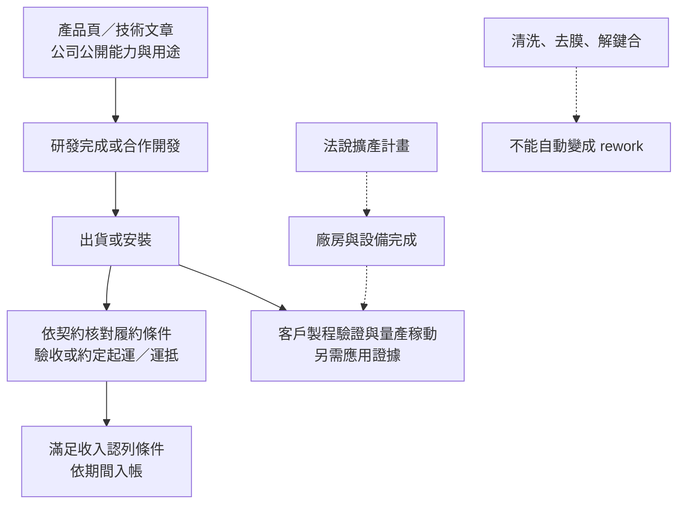

# 12 一則辛耘消息能證明到哪一步？

## 開場問題

「開始出貨」「產能增加」「營收創高」「設備已開發完成」都很容易被讀成同一句話：客戶已經把這台機器放進量產，而且可能用來救回失效晶圓。但這些詞分屬不同階段。新聞或法說能證明的，首先是法人在某一天公開了某個說法；讀者還要追問：這是產品定位、規劃、出貨、客戶驗收、量產，還是已認列的收入？

本章用三張官方消息卡練習這個拆分。C10 是 2026-05-12 法說，C09 是 2026-05-08 的第一季正式財報，C07 是 2026-05-13 上傳的 2025 年度年報。日期是揭露或文件事件的日期，不把它偷換成機台完工、客戶驗收或產線重工日期。

## 證據階梯：消息不是自動箭頭

*圖 12-1｜跨來源整理：每一節點都需要自己的證據，不是所有業務共用的固定時序。設備收入不必等客戶量產才認列；客戶量產也不能單獨證明某期間的認列金額。*

讀新聞時至少要分出四個欄位：

1. **直接事實：** 哪個法人在何日、哪份文件、哪一頁寫了什麼。
2. **合理推論：** 在不超過原文的前提下，這個事實對業務定位代表什麼。
3. **尚待查證：** 哪個環節沒有資料，什麼文件出現後才可上修。
4. **錯誤捷徑：** 哪一句看起來合理，實際上把能力、採購、驗收、收入或 rework 混在一起。

## 消息卡一｜2026-05-12 法說：管理層公開三線收入與擴產藍圖

### 來源明述

C10 是辛耘 2026Q1 法人說明會簡報，檔名和官方檔案日期對應 2026-05-12。p.14 把產品與服務分成代理事業、設備研發與製造、再生晶圓；p.15 寫 12 吋矽晶圓再生產能 210K／月，並列「2026 年底再增加月產能 40K」的產能擴充計畫。p.30 以新台幣百萬元列出 2025 營業收入 11,371、2026Q1 3,120。

p.33–36 分別呈現自製設備、晶圓再生、製造業與代理的營收管理圖表；p.37 以較粗的代理／製造口徑列 2025 約 58%／42%。p.39 的擴產藍圖寫 2026Q4 9,000 m² 新廠房／二廠，以及再生產能再增加 4 萬片／月；p.43 把代理、再生、自製設備分別描述成穩定收入、循環收入與成長引擎。

### 可以推論到哪裡？

這張卡可以支持「管理層在 2026-05-12 公開了三線業務定位與 2026Q4 擴產計畫」。它也支持讀者把再生服務的產能與設備製造的廠房規劃分開看。管理圖表與正式財報部門表尚有分類及抵銷差異，本書不自行拼接成官方三線占比；詳見[第 11 章](11-scientech-evidence-map.md)。

### 不能直接寫成什麼？

- 「2026Q4 再生月產能已增加 4 萬片」：原文是計畫。
- 「二廠已完工並開始稼動」：原文沒有完工、裝機、驗收或稼動證據。
- 「自製設備營收就是 C08 財報的製造部門」：C08 p.71 還有部門間銷貨抵銷，且法說圖表的分類不同。
- 「這些收入來自 rework 設備」：法說沒有把任何一條收入線標為失效重工。

### 改判條件

若後續官方公告、固定資產或產能文件明示二廠完工、設備驗收、可用產能與實際稼動，才能把計畫往「已完成」上修。若財報把再生或設備收入與新廠分開揭露，才能進一步談對收入的影響；在此之前，只保留規劃層級。

## 消息卡二｜2026-05-08 2026Q1 正式財報：有實績，仍沒有產品歸因

### 來源明述

C09 的合併財務報告暨會計師核閱報告在頁尾標示 2026-05-08，資料期間是 2026-01-01–2026-03-31。p.5 的資產負債表列存貨 11,982,231 仟元、合約負債 14,703,739 仟元。p.6–8 的正式損益表列：

| 指標 | 2026Q1（新台幣仟元，EPS 為元） | 頁碼 |
|---|---:|---:|
| 營業收入合計 | 3,120,325 | p.6 |
| 營業淨利 | 404,203 | p.6 |
| 稅前淨利 | 441,207 | p.7 |
| 本期淨利 | 343,045 | p.7 |
| 基本 EPS | 4.14 | p.8 |

C10 p.30 只把 2026Q1 營收四捨五入成 3,120 百萬元；這是可對照的管理簡報，不應取代 C09 的正式仟元數字。

### 可以推論到哪裡？

這張卡可以支持「2026Q1 有一組正式財務實績」，也可以提醒讀者把合約負債、存貨、出貨、驗收和收入認列分開。單季營收能說明公司在該期間完成了財報口徑的收入，但不能指出是 WS、Polar、Vertabake、Pyxis、代理，還是再生服務帶來的哪一部分。

### 不能直接寫成什麼？

- 不能把 3,120,325 仟元分配到 Pyxis 或任何一個官網產品。
- 不能因為合約負債很大，就說同額設備已驗收；合約負債是負債與履約時點的資訊。
- 不能因為 Q1 EPS 為 4.14 元，就說設備已進入客戶量產或失效重工市場。
- 不能把財報總額寫成 rework 收入；C09 沒有這樣的產品或用途拆分。

### 改判條件

要把產品與收入連起來，需要同期間的產品／部門收入拆分、客戶驗收或訂單交付文件；要把收入連到 rework，還需要公司明示工件異常、處置回點與再驗證。只有總營收時，保留多種解釋才比挑一條最吸引人的敘事可靠。

## 消息卡三｜2026-05-13 年報上傳：自述 TBDB「已開始出貨」

### 來源明述

C07 的公開資訊觀測站索引記錄 114 年度股東會年報檔案於 2026-05-13 16:16:53 上傳。這個日期是文件上傳日，不是機台出貨日。年報 p.4 回顧 2025 年營業結果，並在 2026 年營業計畫中稱：自製半導體濕製程設備包括單晶圓與批次晶圓；暫時性貼合系統 TBDB 已全數開發完成，且「已開始出貨給客戶」。同頁也說晶圓再生要往 300mm 製程能力與產能擴充前進。

p.69 把自製設備、晶圓再生和代理設備分列：自製包含批次／單晶圓濕式製程與 TBDB 的貼合、剝離、解離層塗佈、承載盤清洗；晶圓再生的工件是測試片與 Dummy／Control Wafer，經分類、清洗、研磨、拋光、潔淨乾燥後再作控／擋片；代理則只列產業與設備／量測／材料類別。p.70 另列 12 吋清洗、單片濕製程、貼合／分離和再生清洗、拋光、去膜等研發方向。

### 可以推論到哪裡？

這張卡可以支持「公司在 2025 年度年報中自述 TBDB 已從開發完成進入開始出貨階段」，也支持三條業務的法定分類。它不能把出貨日期精確指定為 2026-05-13；更不能把年報上傳日變成客戶導入日。對讀者而言，這是一個辨認「公司自述的出貨」和「外部可核對的驗收／量產」差異的好案例。

### 不能直接寫成什麼？

- 「TBDB 已被某客戶量產採用」：年報沒有具名客戶、產線、驗收日或量產數量。
- 「TBDB 用於失效晶圓重工」：年報寫的是先進封裝、功率元件與薄化相關應用，沒有明確 rework 用語。
- 「晶圓再生會修好原有 active device」：年報明示工件是測試片／擋控片，目的是再作控／擋片使用。
- 「代理設備也是辛耘自行研發」：同一頁把代理設備另列；官方代理導覽的原廠與型號例也不能移轉成辛耘自製能力。

### 改判條件

若後續出現可追溯的出貨台數／日期，可補強出貨事實；驗收文件可補驗收，量產導入資料才支持量產。訂單或收入是其他商業面向的證據，不能通通當成同一階梯的升級。若文件另明示異常晶圓、回到指定製程、保留層及再驗證，才可討論 rework。

## 三欄總結：公司事實、合理推論、尚待查證

| 已確認事實 | 合理推論 | 尚待查證 |
|---|---|---|
| C10 在 2026-05-12 公開三線收入圖與 2026Q4 擴產藍圖。 | 公司以代理、設備／製造、再生組成混合營運模式。 | 二廠是否完工、再生 40K／月是否可用、設備是否驗收與稼動。 |
| C09 在 2026-05-08 提供 2026Q1 正式收入 3,120,325 仟元與 EPS 4.14。 | 這是單季合併財務實績，不能自動歸因到任一產品。 | 產品別／客戶別收入、驗收時點、哪一線帶來變化。 |
| C07 在 2026-05-13 上傳的年報稱 TBDB 已開始出貨；p.69 把自製、再生、代理分列。 | TBDB 至少在公司年報敘事中跨過「開發完成」到「開始出貨」的階段。 | 客戶驗收、量產、出貨台數、收入認列與是否有 rework 用途。 |
| C02 與 C10 對月產能分別寫 22 萬與 210K。 | 不同文件可能有更新日或口徑差異，不能直接選一個當真實稼動產能。 | 日期、產線範圍、銅／非銅或鋁製程分母、實際稼動與良率。 |

## 看到「清洗」「去膜」時的 rework 檢查

本書特別要防止一種新聞捷徑：看到 C04 的光阻剝離、C05 的剝離清洗、C11 的 Wafer-on-Frame 或 UBM 蝕刻，就把它們寫成公司已承接重工。要升級成 rework 證據，至少要看見：

1. **異常起點：** 哪個製程階段或哪種失效被提出。
2. **目標與保留層：** 要移除哪一層、保留什麼材料或圖案。
3. **回流位置：** 去除後要回到哪一個製程站點。
4. **再驗證：** 幾何、殘留、電性、可靠度或客戶允收如何確認。
5. **公司角色：** 是辛耘設備出貨、辛耘代工服務，還是客戶自行使用原廠方案。

C01–C11 目前沒有同時滿足這五項的公司一手資料。因此，最精確的結論不是「辛耘沒有重工能力」，也不是「辛耘已經做重工」，而是：**本輪官方來源未證實明確 rework 用途。**

## 推理檢查

1. C10 p.39 寫 2026Q4 再生產能增加 4 萬片／月，為什麼不能在 2026-09-18 的書稿中寫成「已增加」？
2. C07 年報說 TBDB 已開始出貨，還缺哪一個證據才能寫「客戶量產採用」？
3. C09 2026Q1 營收 3,120,325 仟元比前一年同期高，能否直接推論 Pyxis 或重工需求增加？
4. 為什麼 C10 p.33–36 的管理圖表與 C08 p.71 的法定部門數字不應硬拼成一張百分比表？
5. C02 的 22 萬片／月和 C10 的 210K／月都來自辛耘官網，是否代表其中一個一定錯？

??? note "參考推理"
    1. 因為 p.39 是管理層藍圖，沒有完工、裝機、驗收、稼動或客戶需求證據。目標日期不能代替完成事件。
    2. 需要可追溯的客戶量產導入證據。驗收、台數或收入各補一個面向，但都不能單獨替代量產證據；年報上傳日更不是出貨日。
    3. 不能。合併總額沒有此處需要的產品或用途拆分；成長可能來自多條業務與期間差異。把總額歸因給 Pyxis 或 rework 跳過了證據。
    4. C10 是管理圖表，C08 p.71 是法定應報導部門且有部門間銷貨抵銷。年度相同仍需勾稽分類、單位與抵銷項目。
    5. 不一定。C02 有 2026-02-06 修改日，C10 是 2026-05-12 法說；可能有範圍或更新差異，但尚不能確定原因，應並列查明。

## 來源與待查

先進封裝總覽：[C01](appendix-sources.md#c01)。晶圓再生：[C02](appendix-sources.md#c02)。Vertabake：[C03](appendix-sources.md#c03)。WS／Polar／Vertabake：[C04](appendix-sources.md#c04)。Pyxis 剝離清洗：[C05](appendix-sources.md#c05)。Pyxis TB／3M 合作：[C06](appendix-sources.md#c06)。2025 年報：[C07](appendix-sources.md#c07)。2025 正式財報：[C08](appendix-sources.md#c08)。2026Q1 正式財報：[C09](appendix-sources.md#c09)。2026Q1 法說：[C10](appendix-sources.md#c10)。官方技術文章：[C11](appendix-sources.md#c11)。

待查問題包括：C10 擴產藍圖的完工與稼動證據、C02／C10 產能數字的資料期間與產線範圍、TBDB 出貨的客戶驗收與量產資料、完整代理清單與授權，以及明確將清洗／去膜／解鍵合放入失效重工流程的公司文件。這些都不能由消息標題或總營收自行補上。

---

[← 11 辛耘三條業務如何分開讀？](11-scientech-evidence-map.md) ｜ [來源索引 →](appendix-sources.md)
