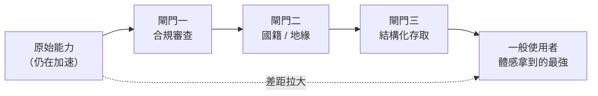
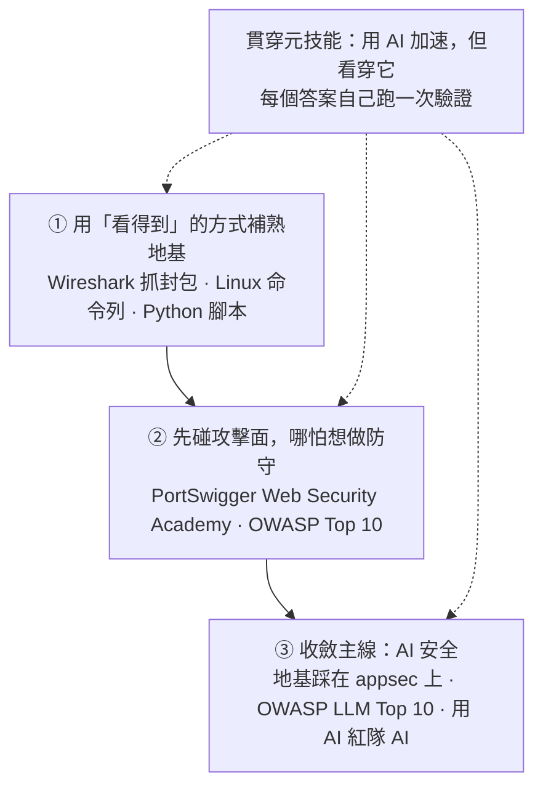

# 從「Fable 5 被管」到「該不該學資安」

> 一頁筆記，蒸餾一串對話：**當最強的 AI 開始被「分層存取」，個人該怎麼站位。**
> 內容區分「我的判斷」與「補充的事實」——事實放在資訊框裡，論點留在正文。

---

## 一、事件：被管的是「使用權」，不是「訓練強度」

!!! info "事實（新聞）"
    Claude Fable 5 與 Mythos 5 在上線約 72 小時後，被美國政府以國家安全為由出口管制：暫停**所有外國國民**（含 Anthropic 自家外籍員工）的存取。因無法即時按國籍篩請求，Anthropic 直接對所有客戶關閉這兩款模型，但 Opus 4.8、Sonnet、Haiku 不受影響。觸發點是另一家公司聲稱成功越獄了 Mythos。Anthropic 一邊遵守、一邊公開爭辯這是誤會。

關鍵在於：被砍掉的是「**誰能用**」，不是「**還能不能造更強的**」。Mythos 5 沒有消失，它還在受信任夥伴手裡跑。

所以 haves / have-nots 的那條線，不是「精英 vs 大眾」，而是 **「美國人 vs 外國人」**——一種國家層級的存取管制，不是實驗室自己鎖。

---

## 二、「降維打擊」的直覺：對一半，但結論常下反

把這次當成「核彈按鈕，握有的人對沒有的人降維打擊」——抓對了張力，誇大了形狀：

| 核武式壟斷的假設 | AI 的現實 |
|---|---|
| 門檻是物理的（裂變材料） | 演算法會擴散，開源權重收不回來 |
| 我有、你永遠拿不到 | 別人通常幾個月內追上某個能力水準 |
| 攻擊壓倒一切 | 同一能力既能攻、也能守，防禦同步變強 |

- **真正該擔心的不是技術壁壘，是權力集中**：算力、最強模型、優先存取集中在少數手上，以及「**誰來定義受信任**」。
- **「全面開放、人人拿到完整武器」不是比較公平的反面解方**：那不會是平等，而是「**最壞的那個有能力的人決定了地板**」——只要一個壞行為者就能造成災難。
- 所以「精英壟斷」和「人人皆有」兩端，沒有哪一端明顯安全。治理辯論卡住的點就在這。

---

## 三、模型強度的時代過去了嗎？沒有

這次事件是「模型**強到危險**」的結果，不是「不再追求強」的起點——用「強度時代結束」描述它，剛好把因果講反。

> **強度仍在狂奔，但強度的「可部署性」開始變貴、變難、變得要看你是誰。**

更站得住腳的改寫：**強度是必要、但不再充分**。原始能力是入場券，但決定誰贏的，從「模型多強」擴展成「強 + 能不能合規送到使用者手上 + 在哪個司法管轄區 + 給誰用」。頂端那一截被三道閘門越箍越緊：

!!! note "歷史前例：管制多是「重導」而非「終結」"
    九〇年代美國把強加密列為軍火出口管制，結果不是殺死資安產業，而是把研發推到境外、最後逼著政策鬆綁。這次很可能類似：能力沿國界裂開（非美用戶轉向中國系與開源模型），各家對政府的姿態**分化而非統一**（有人接下別人拒絕的國防合約），但底層競賽沒減速。

**可下注的預測**：不是「強度時代過去」，而是「**最強模型人人自由取用**」這個假設正在過去。體感上，「能輕鬆拿到的最強」與「實際存在的最強」之間的差距會拉大。這就是分層，不是停滯。

---

## 四、現在重新學資安會太晚嗎？不會

「我一個初學者 vs Mythos / Cloudflare，以卵擊石」——這個比喻把畫面擺反了。**你不是要去撞石頭的蛋。**

- 你學資安不是要跟防禦工具競爭，是要**會用它們**。真正的對手是另一端的攻擊者——而他手上也握著同一套 AI。
- AI 自動化掉的是**找漏洞這個動作**，沒自動化掉**判斷**：兩百個發現裡哪些是真的、哪個對你這套系統致命、修了會不會弄壞別的、攻擊者下一步怎麼繞——這是「人 + AI」最強、AI 最弱的地方。
- Cloudflare 只幫你扛掉相對標準化的那 20%（DDoS、WAF）；身分權限、設定錯誤、供應鏈、應用邏輯、事件應變、還有最難的「人」（釣魚、社交工程），買服務買不到。

!!! warning "誠實的兩個但書"
    1. **會被壓縮的是「只會跑工具」那一階**——別把目標設成「掃描器操作員」，要往判斷、架構、專精走。
    2. 正因為要監督 AI，**更需要扎實基礎**：沒底子，你連 AI 對不對都判斷不了。

接得上前面整串：**AI 安全本身正在變成新子領域**（保護 AI 系統、prompt injection、模型越獄、AI 紅隊）。前提知識堆疊比傳統資安短（因為新），需求又在爆炸，現在進場離前沿很近——不像傳統資安已站著一排二十年老兵。

---

## 五、一條起步路線（已有計概 / 網路 / DS&A 底子，但不熟）

- **地基**：網路協議回報最高，先回去；計概收斂到「Linux 熟」＋「程式在記憶體怎麼跑」；程式要能讀懂別人的碼、會寫腳本，Python 夠用。DS&A 生疏沒關係（除非走密碼學 / 底層）。
- **攻擊面**：先懂東西怎麼壞才會修。Web 安全門檻最低、需求最大、能合法練。
- **主線**：AI 安全 = 應用安全 + 一點 ML 理解 + 一類全新漏洞。前一步的 appsec 底子是它的地基，不會白費。
- **怎麼真的學起來**：別當被動看課程的人。每攻破一題就寫 write-up 公開（learn in public），早期比證照更能證明你會；證照（Security+ → OSCP）是後話。

---

## 一句話總結

- 這次的不對稱，落地形狀是「**存取的分層**」，不是「進步的停止」，也不是「實驗室壟斷」。
- 強度競賽不會停，但「最強模型人人自由取用」的假設正在過去。
- 對個人：**會被淘汰的是把全部價值押在「剛好被自動化的那個動作」上的人**；學基礎 + 學會駕馭工具的人，是現在最缺的。工具當副駕駛，你來開車。
