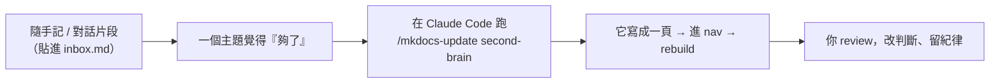

# 用 Claude Code 把對話寫成筆記

> 一頁筆記，講一件事：**為什麼蒸餾這步該交給 Claude Code，而不是繼續貼網頁版。**
> 這頁本身就是用 Claude Code 寫的——你正在讀一次示範。
> 接 [README 第四節「最省力的蒸餾工作流」](README.md) 的具體做法。

---

## 一、為什麼是 Claude Code，不是網頁版 LLM

網頁版能幫你寫出一頁，但**出口在剪貼簿**——它生成、你複製、你貼檔、你改路徑、你跑 build、你 commit。蒸餾的瓶頸從來不是「寫不出來」，是**這串搬運動作太煩，所以你不做**。

Claude Code 把「搬運」也吃掉了：它直接讀你的原料檔、寫進 `docs/<book>/`、改 nav、跑 `mkdocs build`、commit。**從原料到書頁，中間沒有手動環節。**

| | 網頁版 LLM | Claude Code |
|---|---|---|
| 讀原料 | 你貼上去 | 它自己讀檔 / 讀整個資料夾 |
| 產出落點 | 剪貼簿（你再搬） | 直接寫進 repo 正確位置 |
| 接 nav / build / git | 全手動 | 一次跑完 |
| 知道你的規則 | 每次重講 | 讀 `CLAUDE.md`，一次設定 |

!!! info "事實"
    Claude Code 是終端機裡的 agent，能讀寫檔案、執行指令、操作 git。本 repo 用 `/mkdocs-update` 這個 slash command 封裝了「寫頁 → 進 nav → rebuild」整條流程，規則寫在 repo 根目錄的 `CLAUDE.md`，所以不必每次交代繁中、Mermaid 語法、目錄結構。

---

## 二、核心循環

關鍵不在指令多炫，在**觸發點**：不是日更，是「某個主題讀完／想完了」才跑一次。書頁是**結案動作**（見 README 第四節的紀律）。

---

## 三、實際怎麼下指令

最省力的講法——把原料指給它，讓它自己讀：

> 「把 `docs/second-brain/inbox.md` 裡關於 X 的那段，整理成一頁繁體中文 MkDocs，新增到 second-brain 並進 nav。**保留我的結論和判斷，標出哪些是我說的、哪些是補充的事實。**」

它讀 `CLAUDE.md` 就知道繁中、Mermaid 規則、檔案要放哪、build 怎麼跑——**你不用講這些**。

!!! tip "讓它幫你分流『判斷 vs 事實』"
    本書的格式約定：**事實放 `!!! info` 框、論點留正文**（看本書任何一頁）。直接要求它照這格式，產出就能直接用，省掉你回頭重排。

---

## 四、一條要守的紀律：看穿它，別照單全收

Claude Code 寫得快、又直接寫進 repo，**危險也在這裡**——它能一次寫五頁，但你的書只該裝**你驗證過的判斷**。

- **它寫的「事實」要抽查**：模型會講得很篤定卻記錯。事實框裡的東西，自己跑一次驗證再留（這正是 [資安那頁](ai-access-security.md)講的元技能：每個答案自己跑一次驗證）。
- **它寫的「判斷」要奪回來**：它很會把你的半句話補成漂亮論述，但補過頭就變成「它的觀點」不是「你的」。Review 時把不是你會說的話刪掉——**書的價值是私有判斷，不是通順**（README 第三節）。
- **別讓 build 綠燈替代閱讀**：頁面成功 build ≠ 內容是對的。綠燈只證明語法沒壞。

!!! warning "最容易踩的反模式"
    「叫它把 inbox 全部整理成書」= 又變成**整理代替閱讀**，只是換 Claude Code 代勞。
    一次一個主題、你 review 得動的量。蒸餾的價值在「你回頭看」，不在「檔案變多」。

---

## 一句話總結

- 網頁版幫你**寫**，Claude Code 連**搬**一起吃掉——蒸餾的真瓶頸是搬運，不是寫作。
- 規則寫進 `CLAUDE.md`、流程包成 `/mkdocs-update`，**設定一次，之後只丟原料**。
- 它越能一次寫一堆，你越要守紀律：**留你驗證過的判斷，刪它替你說的話。**
