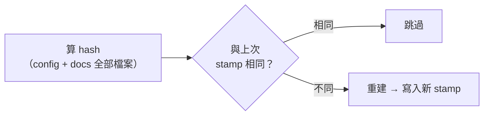

# 別叫 LLM 記狀態：狀態用算的，不用記的

> 一頁筆記，講一件事：**凡是需要「某人記得更新」的狀態都會腐爛；能從事實推導出來的狀態永遠是對的。**
> 起點是一個很小的工程問題——每次 build 全部的書太浪費——但結論可以推廣到所有「LLM 參與維護」的系統。

---

## 一、問題：增量 build 需要「上次的狀態」

這個 repo 有十幾本書，`build-books.sh` 每次全部重建。直覺的解法是記錄每本書「最後 build 的時間與狀態」：沒改過、且上次 build 在修改之後，就跳過。

第一個念頭是：反正書都是叫 LLM 改的，**那就叫 LLM 改完順便更新狀態檔**。

這個念頭是錯的，而且錯得很有代表性。

---

## 二、陷阱：靠「記得」維護的狀態必然腐爛

LLM 會忘記更新狀態檔——不是偶爾，是必然。它每次對話都是新的，「改完檔案要順手更新 manifest」這種紀律對它不存在。就算寫進 `CLAUDE.md`，也只是把失敗率從高降到中。

而狀態檔最危險的不是「沒有」，是**「有，但是舊的」**：build 腳本看到狀態說沒改，就跳過一本其實改過的書——錯誤安靜地發生，你看著舊網頁不自知。

!!! info "事實"
    這就是快取失效（cache invalidation）問題——電腦科學公認的兩大難題之一。所有手動維護的狀態檔（changelog、manifest、「最後更新日期」欄位）都是同一類東西：**宣告的狀態**，它與真實狀態之間沒有任何機制保證一致。

---

## 三、結論：狀態不該被「記錄」，該被「推導」

正確的問題不是「怎麼讓 LLM 記得更新狀態」，是「**怎麼讓狀態根本不需要人記**」。

做法：build 腳本在跑的當下，自己對每本書算一個內容 hash（config 檔＋整個 `docs/<書名>/` 的檔案路徑與內容），存在輸出目錄旁。下次 build 時重算一次，相同就跳過：

沒有任何人需要「記得」任何事：

- LLM 改了內容 → hash 必然變 → 必然重建。它想忘也忘不掉，因為**沒有它該做的步驟**。
- 刪檔、改名也會變（hash 包含路徑），不會漏。

!!! info "事實"
    hash 用**內容**而不是檔案時間（mtime），是因為 mtime 會說謊：`sync-assets.sh` 每次重新複製 assets、`git pull` / `checkout` 刷新檔案時間，內容都沒變但 mtime 全變了。用 mtime 會每次誤判要重建，用內容 hash 對這些全部免疫。跨機器也成立——stamp 跟 build 輸出放在一起、git-ignored，每台機器各自回答「我上次 build 了什麼」，這正好是對的問題。

---

## 四、推廣：設計「LLM 參與維護」的系統時的一條原則

> **能推導的狀態，就不要用宣告的。**

LLM 是一個不可靠的執行者：它能力很強，但沒有跨對話的紀律。系統裡每多一個「改完 X 要記得更新 Y」的約定，就多一個必然故障點。設計時先問：

1. 這個狀態能不能從既有事實（檔案內容、git 歷史、build 輸出）**當場算出來**？能，就算。
2. 真的算不出來（例如「為什麼這樣改」的意圖），才值得叫 LLM 寫下來——而且要接受它會漏。

這和 [用 Claude Code 把對話寫成筆記](claude-code-notes.md) 那頁的紀律是同一件事的兩面：**LLM 的產出要驗證，LLM 的「記得」不要依賴。**

---

## 一句話總結

- 「叫 LLM 順便更新狀態」是必然腐爛的設計——不是它不夠聰明，是「記得」本身不該是系統的一部分。
- 狀態用**內容 hash 當場推導**，改了必然變、沒改必然同，沒有任何需要記得的步驟。
- 通用原則：**能算的不要記；要記的，別信。**
