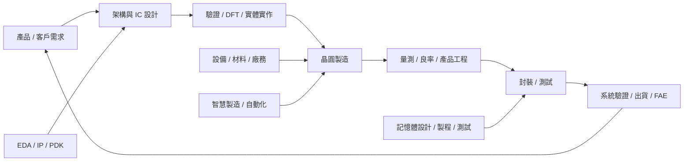

# 產業全貌與職務地圖

## 從規格到量產

這是一張責任地圖，不是公司組織圖。大型公司會把每個框拆成多個團隊，小型公司可能由同一人跨多個交付物。

## 依交付物找職務

| 你想負責的交付物 | 常見角色 | 本書章節 |
|---|---|---|
| 架構、RTL、類比／RF 電路 | IC Design | [IC 設計](01-ic-design.md) |
| Custom layout、P&R、sign-off | Layout / Physical Design | [Layout／實體設計](02-layout.md) |
| 驗證計畫、testbench、coverage、formal | Verification | [驗證工程師](03-verification.md) |
| Scan、ATPG、MBIST、測試存取 | DFT | [DFT 工程師](04-dft.md) |
| Design flow、PDK、rule deck、tool enablement | EDA / CAD / PDK | [EDA／CAD／PDK](05-eda-cad.md) |
| 製程配方與模組控制 | Process Engineer | [製程總覽](06-process-overview.md) |
| 跨模組製程、WAT 與量產導入 | Integration Engineer | [製程整合](09-integration.md) |
| 機台可用率、保養與異常排除 | Equipment Engineer | [設備工程](10-equipment.md) |
| 缺陷、良率、NPI 與產品量產 | Yield / Product Engineer | [良率與產品工程](10-yield-product.md) |
| 水、電、氣、化學品與廠務系統 | Facilities Engineer | [廠務工程](11-facilities.md) |
| 封裝結構、組裝、測試與可靠度 | Package / Test / Reliability | [封裝工程](15-packaging.md)／[測試工程](16-test.md)／[可靠度](13-reliability.md) |
| 客戶導入、應用與現場技術支援 | FAE / AE / Field Service | [FAE／AE／Field Service](17-fae.md) |
| 排程、MES、AMHS、資料與自動化 | IE / MFG / CIM / Smart Manufacturing | [智慧製造](18-smart-manufacturing.md) |
| 模型、compiler、runtime 與製造 AI | AI / Software | [AI／軟體](19-ai-software.md) |
| DRAM、NAND、HBM 的設計、製程與測試 | Memory roles | [記憶體產業與職務](22-memory-industry.md) |

## 看職稱不如看責任

Frontend、Backend、Integration、Validation、Product 等名稱沒有跨公司統一定義。讀 JD 時先找：

1. 最終要交付什麼檔案、數據、機台狀態或量產結果？
2. Scope 是 IP、subsystem、full chip、單一模組、整條產線還是客戶系統？
3. 誰做 sign-off，誰在異常時 on-call？
4. Tape-out 或量產後是否繼續負責 bring-up、良率、客訴與版本維護？

各職務如何交換規格、資料與樣品，見[職務合作關係圖](20-collaboration.md)。縮寫定義見[術語表](glossary.md)。

## 人數資料的限制

目前公開官方表可穩定取得的是較寬的產業分類，不足以把 IC 設計、晶圓代工、封測、設備商與 EDA 人數用同一口徑相加。因此本頁不提供環節人數估計；需要市場規模時，請查看[資料來源](references.md)並保留原始分類。
