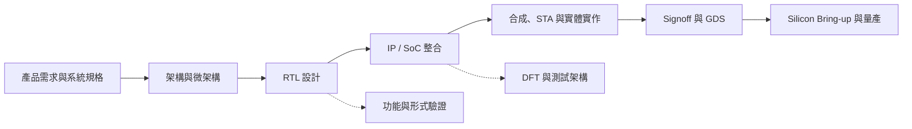
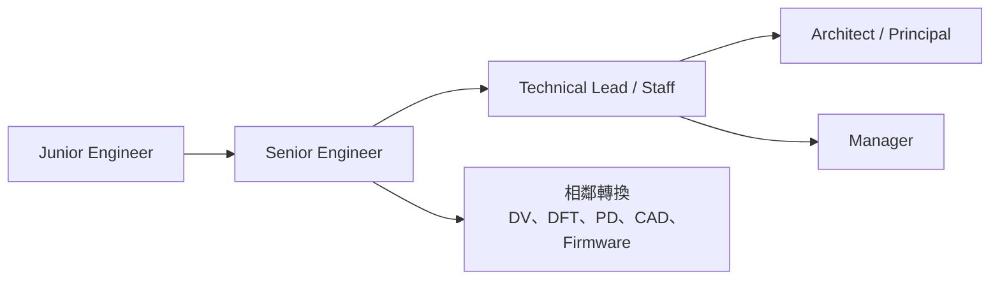

# IC 設計工程師

「IC 設計工程師」是職務家族，不是單一工作。大型 SoC 專案通常由架構、RTL、整合、驗證、DFT、實體設計與矽後驗證等團隊共同完成；小型團隊才可能由一人跨越多個階段。看職缺時，先確認要交付什麼，不要只看 `IC Design`、`Frontend` 或 `Backend` 標籤。

## 角色地圖

### 數位 IC 設計

數位設計可再分成幾種交付物：

| 角色 | 主要工作 | 典型交付物 |
|---|---|---|
| 架構／微架構 | 把產品需求拆成運算、資料流、記憶體與介面設計 | architecture spec、效能／功耗模型 |
| RTL 設計 | 用 Verilog/SystemVerilog 實作功能並做基本品質檢查 | RTL、block constraints、lint/CDC 結果 |
| SoC/IP 整合 | 接合 IP，處理 clock、reset、power、IOMUX、test mode | top-level RTL、SDC、整合檢查 |
| Design implementation | physical-aware synthesis、STA、等價檢查與 PPA 改善 | netlist、timing constraints、QC/signoff reports |

`Frontend / Backend` 的分界依公司而異。例如聯發科的職缺會把 physical-aware synthesis、STA、netlist QC 與 DFT insertion 稱為 BE；其他公司可能用 backend 專指 place-and-route。面試時應直接問工作停在 RTL、netlist 還是 GDS。

### 類比與混合訊號 IC 設計

類比設計從規格、拓樸與電晶體尺寸開始，經過 PVT、Monte Carlo、雜訊、穩定度與可靠度分析，再與版圖工程師反覆做寄生萃取後模擬。常見電路包括放大器、ADC/DAC、PLL、LDO、bandgap、I/O 與 SerDes 類比前端。

類比設計師可能親自畫部分關鍵版圖，也可能由專職 Analog Layout Engineer 執行；共同責任是確認 matching、寄生、EM/IR 與版圖相依效應沒有破壞規格。混合訊號團隊還需要建立 analog behavior、timing 與 power-aware model，讓數位環境可以驗證類比／數位介面。

### RF IC 設計

RFIC 不只設計 LNA、mixer、VCO、PLL 與 filter，還要處理 transceiver architecture、S 參數、雜訊指數、線性度、被動元件與電磁模擬，並考慮封裝、PCB、天線、校準及實驗室 characterization。現行官方職缺也把「監督版圖、協助量測與量產」列為 RF designer 的責任。

## 適合誰與工作型態

| 方向 | 適合的思考方式 | 常見工作節奏 |
|---|---|---|
| 數位架構／RTL | 喜歡離散邏輯、規格拆解、除錯與 PPA 取捨 | 以 milestone、code review、整合與 tapeout 為節點 |
| 類比／RF | 喜歡元件物理、連續訊號、數學模型與實驗量測 | 模擬—版圖—量測反覆迭代 |
| SoC 整合 | 能處理大量介面、約束與跨團隊依賴 | 越接近整合與 tapeout，協調密度越高 |

這些工作多在辦公室與實驗室進行，通常不需晶圓廠輪班；但 tapeout、bring-up 或客戶時程前可能有集中加班。實際工時取決於團隊、產品週期與責任範圍，不應由職稱推定。

## 核心技能

- **數位**：數位邏輯、計算機組織、Verilog/SystemVerilog、synthesis、STA、CDC/RDC、低功耗與腳本。
- **類比**：CMOS 元件與電路、SPICE、PVT/Monte Carlo、noise、feedback、matching、post-layout simulation。
- **RF**：通訊系統、RF/microwave circuit、S 參數、noise/linearity、EM simulation 與量測。
- **共同**：讀規格、建立可檢查的假設、debug、版本控制、技術文件與跨團隊溝通。

聯發科多個設計職缺以碩士為門檻，但 NVIDIA 等公司的部分職缺接受學士或 equivalent experience。博士不等於直接進入資深職級；職級仍由相關經驗、工作範圍與面試結果決定。

## 職涯發展與轉換

轉職難度取決於交付物是否相鄰：RTL 與 SoC integration、synthesis/STA 的連續性高；類比設計與類比版圖也高度互通。從數位轉類比／RF，或從前端直接轉先進節點 PD，通常需要補足電路或實作經驗。

## 主要雇主

- **產品型 IC 公司**：聯發科、聯詠、瑞昱、慧榮、群聯及國際晶片公司台灣團隊。
- **ASIC design service**：承接 SoC 規格、整合、實作或量產服務的公司。
- **IP 與 foundry design enablement**：CPU/interface/memory IP、standard cell、I/O、ESD 與設計平台團隊。

同一家公司也會依產品線分成手機、網通、顯示、車用、資料中心、AI 或高速介面團隊；domain knowledge 往往比公司名稱更能預測日常工作。

## 薪資怎麼看

角色、公司、職級與股票口徑差異很大，公開資料不足以支持本頁原有的精準區間。請以 [薪資與職涯比較](appendix-salary.md) 的統一口徑為準，並在談 offer 時分開比較 base、現金獎金、分紅、RSU、vesting 與保證月份。

## 面試準備

- 數位職缺：準備 blocking/non-blocking、CDC/reset、FSM、pipeline、FIFO、synthesis/STA 與一個完整 RTL 專案。
- 類比職缺：能從規格推導 topology、gain/bandwidth/noise/stability，並解釋 PVT、mismatch 與 post-layout 差異。
- RF 職缺：準備 impedance、S 參數、noise figure、linearity、PLL/transceiver block 與 EM/量測經驗。
- 所有方向都要能說明自己負責的 **deliverable、signoff criteria、最難的 bug，以及如何證明修正有效**。
- 反問團隊：職缺是 architecture、RTL、integration、implementation 還是 post-silicon？FE/BE 的邊界到哪裡？

## 資料來源

- [MediaTek：Digital IC Design Engineer（SoC BE w/ AI）](https://careers.mediatek.com/zh-tw/jobs/MTK120260529003)（2026 職缺；查證：2026-08-31）
- [MediaTek：Digital IC Design/Integration Engineer](https://careers.mediatek.com/en/jobs/MTK120260603007)（2026 職缺；查證：2026-08-31）
- [MediaTek：RF IC Design Engineer](https://careers.mediatek.com/zh-tw/jobs/MTK120250224001)（2025 職缺；查證：2026-08-31）
- [MediaTek 2024 Annual Report](https://www.mediatek.com/hubfs/728015/MediaTek%20Assets/Pdfs/Annual%20Reports/2024-English-Annual-Report.pdf)（發布：2025；查證：2026-08-31）

相關職務：[類比版圖與數位實體設計](02-layout.md)｜[驗證工程師](03-verification.md)｜[DFT 工程師](04-dft.md)｜[EDA / CAD / PDK 工程師](05-eda-cad.md)
