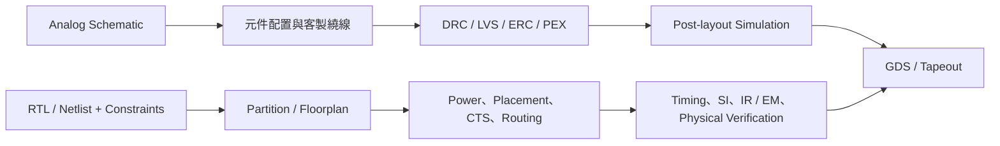
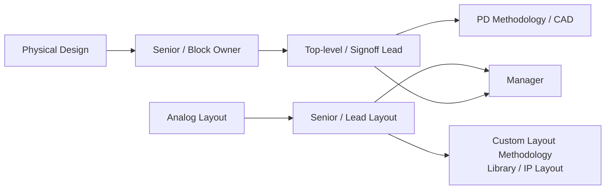

# 類比版圖與數位實體設計

Analog Layout 與 Digital Physical Design 都把電路落實成可製造的幾何資料，但輸入、方法與 signoff 責任不同：類比版圖從 schematic 與 matching 意圖出發；數位實體設計從 RTL/netlist、timing constraints 與 power intent 出發。兩者不能只用「Layout 工程師」概括。

## 兩條實作路徑

### 類比版圖工程師

核心工作是保存 schematic 的電氣意圖：

- 依 matching hierarchy 規劃 common-centroid、interdigitation、dummy 與對稱結構。
- 處理敏感訊號 shield、guard ring、substrate noise、latch-up 與 ESD 路徑。
- 控制寄生、current density、electromigration、IR drop、density/fill 與版圖相依效應。
- 執行 DRC、LVS、ERC、PEX，並與設計師反覆修正 post-layout 模擬結果。

類比版圖不是照圖描線。元件方向、鄰近關係、走線寄生與製程限制，都可能讓原本通過 schematic simulation 的電路失去規格。

### 數位實體設計工程師

Physical Design（PD）負責把 netlist 實作到 GDS，常見範圍包括：

- partition、floorplan、macro/pin placement、power grid 與 congestion planning。
- placement、clock tree synthesis、routing、optimization 與 engineering change order（ECO）。
- multi-mode multi-corner STA、RC extraction、crosstalk、signal integrity 與 timing closure。
- IR drop、electromigration、power integrity、DRC/LVS/ERC 與 physical signoff。
- 用 Tcl、Python、Perl 或 Make 自動化流程、分析 QoR，並回饋 RTL、DFT、package 與 CAD 團隊。

先進節點的難點不只是一條條 design rule，而是 PPA、congestion、power delivery、可靠度與可製造性必須一起收斂。3DIC/chiplet 專案還會增加 bump/RDL、die boundary、package、thermal 與 die-to-die link 的共同設計。

## 適合誰與工作型態

| 方向 | 適合誰 | 工作型態 |
|---|---|---|
| 類比版圖 | 對幾何、電路、細節與製程限制敏感，願意長時間檢查局部差異 | 高度互動式編輯，與 analog/RF designer 密集迭代 |
| 數位 PD | 喜歡大型系統、資料分析、腳本與多目標最佳化 | 長時間 EDA run、report/debug、跨 RTL/DFT/package/CAD 協作 |

兩者都受 tapeout milestone 影響。數位 PD 的 full-chip run 可能很久，工作重點不是等待工具，而是建立正確約束、判讀結果並選擇下一次最有效的修正。

## 核心技能

| 類型 | 電路與方法 | 常見工具 |
|---|---|---|
| 類比版圖 | matching、寄生、noise isolation、ESD/latch-up、DRC/LVS/PEX | Virtuoso、Calibre／IC Validator、Spectre／HSPICE |
| 數位 PD | floorplan、CTS、MMMC STA、SI、IR/EM、ECO、physical verification | Innovus、ICC2/Fusion Compiler、PrimeTime/Tempus、Voltus/RedHawk、StarRC/Quantus |
| 共同 | Linux、版本與資料管理、debug、製程層與 signoff 概念 | Tcl、Python、Perl、SKILL、Make |

工具只是介面；面試更重視為什麼發生 timing violation、congestion、IR drop、LVS mismatch，以及如何定位和取捨。

## 職涯發展與轉換

類比版圖可轉 custom methodology、standard-cell/I/O/ESD layout 或 analog CAD；數位 PD 可往 STA/signoff、flow methodology、SoC integration 或 package/3DIC implementation 發展。兩條路共享製程與 physical verification 知識，但不是可無痛互換的同一職務。

## 主要雇主

- Fabless、國際晶片公司與 ASIC design service 的 analog layout／PD 團隊。
- Foundry 與 IP 公司中的 standard cell、memory compiler、I/O、ESD、RF/analog IP 團隊。
- EDA 公司的 physical implementation、signoff 與 application engineering 團隊。

## 薪資怎麼看

原頁面的角色級區間沒有雙來源與統一口徑，已撤下。請參考 [薪資與職涯比較](appendix-salary.md)；比較 offer 時要確認職稱究竟是 analog layout、block PD、full-chip signoff 還是 CAD/AE，不能只比「Layout」名稱。

## 面試準備

### 類比版圖

- 解釋 common-centroid、interdigitation、dummy、guard ring 與何時使用。
- 從一個 mismatch、寄生或 LVS 問題說明 debug 流程。
- 能閱讀基本 schematic，指出敏感節點、高電流路徑與隔離需求。

### 數位實體設計

- 能畫出 floorplan → power → placement → CTS → route → signoff 流程與每階段輸入／輸出。
- 準備 setup/hold、clock uncertainty、OCV、crosstalk、congestion、IR drop 與 ECO 題目。
- 用實例說明 PPA 衝突：修 timing 時如何避免面積、功耗或 routing 惡化。

## 資料來源

- [NVIDIA：ASIC Physical Design Engineer](https://nvidia.wd5.myworkdayjobs.com/en-US/NVIDIAExternalCareerSite/job/ASIC-Physical-Design-Engineer_JR2022692)（2026 職缺；查證：2026-08-31）
- [NVIDIA：Senior Physical Design Engineer](https://nvidia.wd5.myworkdayjobs.com/en-US/NVIDIAExternalCareerSite/job/Senior-Physical-Design-Engineer_JR2017771)（查證：2026-08-31）
- [Synopsys：Physical Verification Runset Development](https://careers.synopsys.com/job/hyderabad/application-engineering-staff-engineer-physical-verification-runset-development/44408/92446615856)（發布：2026-03-04；查證：2026-08-31）
- [TSMC 2025 Annual Report：Design Enablement and 3DFabric Ecosystem](https://investor.tsmc.com/static/annualReports/2025/english/pdf/2025_tsmc_ar_e_ch5.pdf)（發布：2026；查證：2026-08-31）

相關職務：[IC 設計工程師](01-ic-design.md)｜[EDA / CAD / PDK 工程師](05-eda-cad.md)｜[先進封裝工程師](15-packaging.md)
