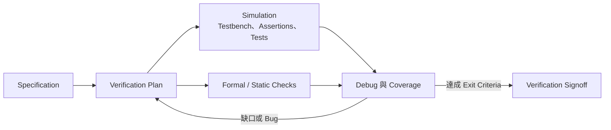
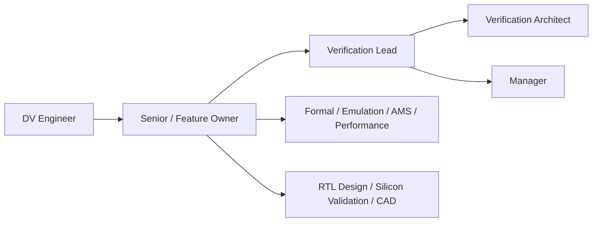

# 驗證工程師

驗證工程師（Design Verification Engineer，DV）在 tapeout 前用模擬、形式方法、靜態檢查與硬體加速平台找出設計錯誤，並留下「為何可以 sign off」的證據。DV 不是單純跑測試，也不等同 tapeout 後的 silicon validation。

## 驗證如何收斂

供應商資料常估計 verification 佔複雜 SoC 開發的大半；例如 Cadence 稱平均超過 70%。這類數字的分母可能是 project time、engineering effort 或 verification-only time，不可混用。較可靠的讀法是：驗證是主要成本中心，而且規格、debug 與 coverage closure 都需要大量工程判斷。

## 不同驗證專職

| 角色 | 核心工作 | 典型交付物 |
|---|---|---|
| Simulation DV | 建 testbench、stimulus、checker、assertion、coverage 與 regression | verification plan、UVM environment、coverage/bug closure |
| Formal Verification | 用 property/proof 驗證 corner case、protocol、security 或 control logic | properties、proof results、waiver/signoff |
| Static Verification | lint、CDC、RDC、equivalence、low-power/connectivity checks | rule setup、violation disposition、signoff report |
| Emulation / FPGA Prototyping | 把大型設計映射到硬體平台，加速系統情境與早期軟體 | compiled model、transactor、debug environment |
| AMS Verification | 建立 real-number/behavior/timing/power model，驗證類比／數位介面 | models、mixed-signal testbench、interface checks |
| Performance Verification | 驗證 latency、bandwidth、QoS、coherency 與 workload behavior | performance model/tests、bottleneck analysis |

Silicon bring-up、量產 correlation 與 lab measurement 是相鄰的 **post-silicon validation** 工作。有些 DV 會參與，但大型團隊通常另有 silicon validation、firmware、system 或 product engineer 共同負責。

## 每天在做什麼

- 從 specification 拆 verification features、risks、coverage model 與 exit criteria。
- 開發 SystemVerilog/UVM testbench、BFM、monitor、scoreboard、assertion 與 constrained-random tests。
- 維護 regression，從 log、waveform、trace 與 assertion failure 定位 root cause。
- 追蹤 code、functional、assertion coverage；判斷 uncovered 是測試缺口、dead code 還是 waiver。
- 與 architect、RTL、DFT、CAD、firmware 與 emulation 團隊釐清 spec 和整合問題。

驗證範圍可落在 IP、cluster/subsystem 或 full-chip。層級越高，越重視整合、clock/reset/power、memory、interconnect 與軟硬體互動；層級越低，越能深入 protocol 與 microarchitecture corner case。

## 適合誰與工作型態

DV 適合喜歡懷疑假設、設計反例、讀大量波形與追根因的人。工作同時需要寫程式與理解硬體：只會 UVM 語法但不懂設計，很難寫出有效 checker；只懂 RTL 但不會把規格轉成可量測 coverage，也無法完成 signoff。

日常多是開發、長時間 regression、debug 與跨團隊討論。接近 coverage closure 或 tapeout 時節奏會變快；emulation 與 full-chip DV 也常受有限硬體與 compute 資源排程影響。

## 核心技能

- **Simulation DV**：SystemVerilog、UVM、SVA、coverage、VCS/Xcelium/Questa 與 waveform debug。
- **Formal/static**：property thinking、SVA、JasperGold/VC Formal、lint/CDC/RDC、LEC 與 waiver discipline。
- **Automation**：Python、C/C++、shell、版本控制、CI/regression 與結果分析。
- **Domain**：依產品選 AXI/CHI、PCIe/CXL、DDR、USB、Ethernet、UCIe、影像、通訊或安全等協定。
- **共同**：spec review、test planning、root-cause debug、風險溝通與可追溯的 signoff criteria。

UVM 對 simulation DV 很常見，但不是 formal、static、AMS 或 post-silicon 職務的通用必備。讀職缺時要先辨認驗證方法與 scope。

## 職涯發展與轉換

DV 轉 formal、emulation 或 performance verification，通常可沿用規格與 debug 能力；轉 RTL design 需要補 synthesis/PPA 與 ownership；轉 silicon validation 則要補 lab、firmware、board 與 pre/post-silicon correlation。

## 主要雇主

所有開發複雜 SoC、IP、ASIC 或 EDA verification solution 的公司都需要驗證人才，包括台灣 IC 設計公司、國際晶片公司、ASIC design service、IP 公司與 EDA vendor。職涯可攜性主要由 scope、methodology 與 protocol 決定。

## 薪資怎麼看

原頁面的精準年薪區間與「AI DV 必然上漲」沒有足夠來源，已撤下。請參考 [薪資與職涯比較](appendix-salary.md)，並確認職缺是 simulation DV、formal、emulation、post-silicon 還是 customer application；同名 Verification 的報酬與工作內容可能差很大。

## 面試準備

- 從一份簡短 spec 寫 verification plan：features、corner cases、checker、coverage 與 exit criteria。
- 熟悉 SystemVerilog scheduling、blocking/non-blocking、interface、class、randomization、constraint 與 assertion。
- 解釋 scoreboard、reference model、functional coverage 和 code coverage 各自回答什麼問題。
- 準備一個真實 bug：症狀、縮小範圍、root cause、修正、regression 與如何避免再發。
- 依職缺複習 protocol；不要只背封包格式，要能討論 ordering、backpressure、error handling 與 corner case。
- 反問 scope 是 IP/subsystem/SoC、使用 simulation/formal/emulation 哪些方法，以及 DV 是否負責 post-silicon。

## 資料來源

- [Cadence：SoC Verification](https://www.cadence.com/en_US/home/explore/soc-verification.html)（「平均超過 70%」為供應商說法；查證：2026-08-31）
- [MediaTek：IC Design Verification Engineer](https://careers.mediatek.com/zh-tw/jobs/MTK120260223002)（2026 職缺；查證：2026-08-31）
- [MediaTek：AI Processor Design Verification Engineer](https://careers.mediatek.com/zh-tw/jobs/MTK120250704008)（2025 職缺；查證：2026-08-31）
- [NVIDIA：Padring Verification Engineer](https://nvidia.wd5.myworkdayjobs.com/en-US/NVIDIAExternalCareerSite/job/Padring-Verification-Engineer_JR2022688-1)（2026 職缺；查證：2026-08-31）
- [Siemens EDA / Wilson Research Group：2024 IC/ASIC Functional Verification Trend Report](https://verificationacademy.com/topics/planning-measurement-and-analysis/wrg-industry-data-and-trends/2024-siemens-eda-and-wilson-research-group-ic-asic-functional-verification-trend-report/)（發布：2025-02-17；查證：2026-08-31）
- [IEEE 1800.2-2020：Universal Verification Methodology](https://standards.ieee.org/ieee/62530-2/11429/1800.2/7567/)（發布：2020-09-14；查證：2026-08-31）

相關職務：[IC 設計工程師](01-ic-design.md)｜[DFT 工程師](04-dft.md)｜[AI / 軟體工程師](19-ai-software.md)
