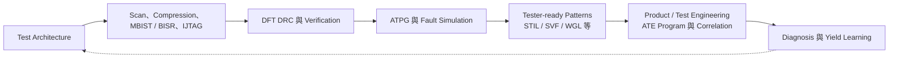
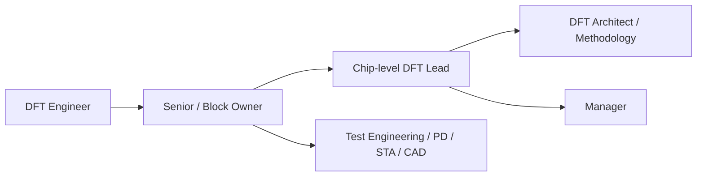

# DFT 工程師

DFT（Design for Test，可測試性設計）工程師在晶片設計階段加入 test architecture、scan、compression、memory test 與存取網路，讓 wafer sort、final test、失效診斷及部分 in-field test 可以有效執行。DFT 的核心不是「出廠後測試」，而是 **tapeout 前把可測試性設計進晶片**。

## 從設計到量產測試

DFT Engineer 與 Test Engineer 不同。前者負責 on-chip test logic、coverage、patterns 與 design signoff；後者通常負責 ATE program、test limits、hardware interface、測試時間、量產 correlation 與良率。兩者在 pattern bring-up 與 diagnosis 密切合作。

## 核心工作

- 規劃 scan channel、compression、test point、clock/reset/test mode 與 hierarchical DFT architecture。
- 插入並驗證 scan、IEEE 1500 wrapper、boundary scan、MBIST、BISR、LBIST 或 IJTAG network。
- 產生 stuck-at、transition 及依產品需求採用的其他 fault-model ATPG patterns。
- 管理 coverage、untestable faults、X source、pattern count、test time、test power 與 timing constraints 的取捨。
- 做 gate-level/DFT verification、pattern simulation、tester format handoff 與 post-silicon diagnosis。
- 與 RTL、PD、STA、memory/IP、package、product/test engineering 及 OSAT 協作。

Fault coverage 沒有所有產品通用的 `≥98%` 門檻。目標要依 fault model、產品品質與安全需求、不可測邏輯、成本、功耗及測試時間共同制定。

## 工具與標準

現行 Synopsys 產品線是 **TestMAX DFT / ATPG**；Siemens 現行品牌是 **Siemens Tessent**。`DFT Compiler`、`TetraMAX`、`FastScan` 可作歷史名稱，不應再當作目前工具總稱。

| 標準 | 解決的問題 |
|---|---|
| IEEE 1149.1 | JTAG Test Access Port 與 boundary scan |
| IEEE 1500 | Embedded core test wrapper 與 SoC 內部 test access |
| IEEE 1687 | IJTAG embedded instrument access；ICL/PDL 描述網路與操作 |
| IEEE 1838 | 3D stacked IC 的 die-level 與 stack-level test access |

工具還會依公司使用 Cadence Modus、Synopsys TestMAX、Siemens Tessent 與自研 flow。面試時重點是 test concept、constraints、coverage/debug 與跨流程影響，不是背產品名稱。

## Chiplet 與 3DIC

多 die 系統必須考慮 known-good-die、pre-bond、post-stack、inter-die interconnect、die wrapper、package-level access、telemetry 與 diagnosis。IEEE 1838 提供 3D stack test access；UCIe 2.0 加入 SiP manageability、test/debug/telemetry 架構，UCIe 3.0 又加入早期 firmware download 與更完整的 sideband/manageability 能力。

因此 chiplet DFT 不是多接一條 JTAG，而是 DFT、package、PHY、firmware、product/test 與 system management 的共同架構問題。

## 適合誰與工作型態

DFT 適合喜歡數位邏輯、工具流程、結構化 debug 與量產回饋的人。它介於 design 與 manufacturing test 之間：既要理解 RTL/netlist、clock/reset 與 physical constraints，也要理解 faults、coverage、ATE limits 與 diagnosis。

工作多在 Linux/EDA 環境，包含長時間 ATPG、simulation 與 report analysis。接近 netlist freeze、tapeout 或 tester bring-up 時跨團隊協調會變密集；大型 SoC 常按 block、top、memory DFT、ATPG 或 methodology 分工。

## 核心技能

- 數位邏輯、Verilog/SystemVerilog、synthesis、STA、clock/reset 與 low-power 基礎。
- Scan、compression、ATPG、MBIST/BISR、boundary scan、IJTAG 與 fault simulation。
- Stuck-at、transition、bridging、cell-aware 等 fault-model 概念，以及 coverage/quality/cost 取捨。
- Tcl、Python、Perl、shell，自動化批次 flow、結果彙整與 regression。
- Gate-level debug、waveform、SDF/timing、pattern format 與基本 ATE/production-test 概念。

## 職涯發展與轉換

DFT 往 test engineering 可沿用 patterns、fault 與 diagnosis；往 PD/STA 需加強 physical/timing closure；往 CAD/EDA application 則需加強 flow、tool qualification 與 customer support。Chiplet 與 in-system test 也帶來 DFT architecture、firmware 與 package test 的交叉路線。

## 主要雇主

需要量產 SoC、ASIC、memory 或 multi-die products 的設計公司與 design service 都有 DFT 需求；EDA 公司則有 DFT tool R&D、application engineering 與 methodology 職缺。ATE 廠商主要招聘 test/application 類人才，不能直接等同晶片公司的 DFT team。

## 薪資怎麼看

原頁面的角色級區間及「極度稀缺、薪資明顯上漲」缺乏可驗證來源，已撤下。請參考 [薪資與職涯比較](appendix-salary.md)，並分辨 DFT implementation、ATPG、memory DFT、methodology、EDA application 與 production test 的不同口徑。

## 面試準備

- 畫出 scan chain、scan enable、capture/shift 與 ATPG 基本流程。
- 解釋 stuck-at 與 transition fault、controllability/observability、X source 和 untestable fault。
- 準備 clock/reset、lockup latch、multi-clock、low-power 與 test mode constraint 題目。
- 說明 compression、test point、pattern count、coverage、test time 與 test power 的取捨。
- MBIST 題目要能說清楚 memory fault、repair/BISR、controller 與 pattern handoff。
- 反問職缺偏 scan insertion、ATPG、MBIST、chip-level integration、methodology 還是 tester bring-up。

## 資料來源

- [Synopsys：TestMAX DFT](https://www.synopsys.com/implementation-and-signoff/test-automation/testmax-dft.html)（產品頁；查證：2026-08-31）
- [Siemens：Tessent Multi-die](https://static.sw.cdn.siemens.com/siemens-disw-assets/public/lsDXzopZZ6P3da7eAz9FM/en-US/Tessent%20Multi_Die_Ebook_Finalized_v3.pdf)（發布：約 2026-02；查證：2026-08-31）
- [IEEE 1838-2019：Test Access Architecture for 3D Stacked ICs](https://standards.ieee.org/ieee/1838/5073/)（發布：2020-03-13；查證：2026-08-31）
- [IEEE 1687-2014：Access and Control of Embedded Instrumentation](https://standards.ieee.org/ieee/1687/3931/)（發布：2014-12-05；2025-03-27 轉為 Inactive-Reserved；查證：2026-08-31）
- [UCIe Consortium：Specifications](https://www.uciexpress.org/specifications)（UCIe 3.0 發布：2025-08-05；查證：2026-08-31）

相關職務：[IC 設計工程師](01-ic-design.md)｜[驗證工程師](03-verification.md)｜[測試與產品工程師](16-test.md)
